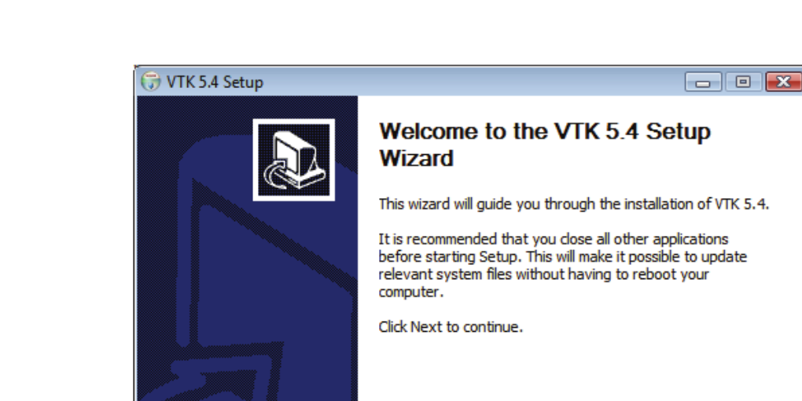
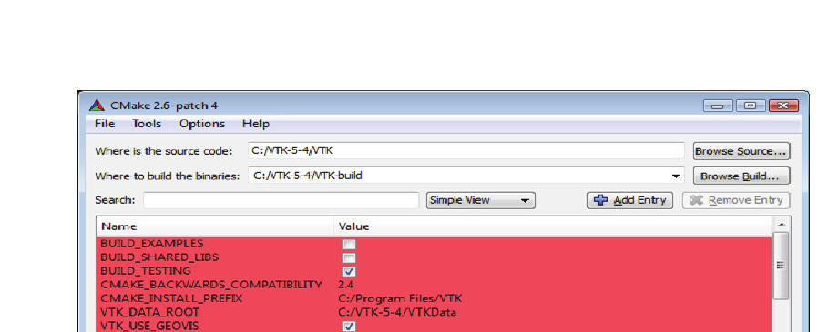

# Chapter 2: Installation

This chapter describes the steps required to install VTK on your computer system. The overall difficulty of this process depends on several factors. On Microsoft Windows, you can install the pre-built vtk.exe and run Tcl scripts using it. For Python or Java usage, to link VTK libraries into your own applications, or to use VTK on any platform other than Microsoft Windows, you must build VTK from source code. (There are too many platform variations -- keeping binary distributions up-to-date is too much work, so we focus on making VTK easy to build everywhere.) If you are compiling the VTK source code and building your own libraries, expect to spend one-half hour on faster, multi-processor systems, and several hours on slower, memory limited systems. Also, the time to build depends on how many interpreted languages you wrap around the VTK C++ core, and your system configuration.

You may wish to refer to "System Architecture" on page 19 for an overview of the VTK architecture -- this may make the compile process easier to follow. Also, if you run into trouble, you can contact the vtkusers mailing list (see "Additional Resources" on page 6).

## 2.1 Overview

VTK compiles and runs on many different computer platforms. By platform, we are referring to various combinations of operating systems, hardware configurations, and compilers. Because of the large number of combinations possible, binary distributions of VTK are generally not feasible. Therefore, to install VTK, you will have to compile and link the source code to produce libraries and executables. The exception to this process is if you are creating VTK applications using the Tcl interpreted language. In this case, pre-compiled binaries may be available for the Windows platform. Otherwise, you will have to compile the Tcl and Python VTK executables from the source code.

The chapter begins with an overview of CMake, the Cross-platform Make tool. CMake is used on all operating systems to configure the build environment. Next, the chapter is divided into two sections based on the type of operating system that you are installing on: either Windows or UNIX (for Macintosh OSX or Linux, follow the UNIX instructions). You only need to read the appropriate section for your installation. The Visualization Toolkit does not run on older versions of Windows such as Windows 3.1. It also does not run on any Macintosh OS prior to OSX 10.2 (Jaguar).

## 2.2 CMake

CMake is an open-source, cross-platform tool for configuring and managing the build process. Simple, platform independent files (`CMakeLists.txt`) are used to describe the build process and capture dependencies. When CMake is run, it produces native build files for the particular compiler/operating system that you are working on. For example, on Windows with Microsoft Visual Studio, solution files and project files are created. On Unix, makefiles are created. This way you can easily compile VTK on any computer using a single source tree and work with the development tools (editors, debuggers, profilers, compilers, etc.) that are natural to the platform that you are working on. (Learn more about CMake from cmake.org. Kitware also publishes a book *Mastering CMake* for detailed information.) Download the latest CMake from http://www.cmake.org.

Running CMake requires three basic pieces of information: which compiler to use, where the source code directory (i.e. source tree) is, and which directory (i.e., build tree) to place the object code, libraries, and binaries that the compilation process produces. CMake will read the top-level `CMakeLists.txt` file found in the source tree and produce a cache (`CMakeCache.txt`) in the build tree. Note that CMake handles complex source code directory structures just fine -- there will be one `CMakeLists.txt` file in each subdirectory of the source code tree.

Once these basic pieces of information are provided, the user invokes the configure step. This causes CMake to read the top-level `CMakeLists.txt` file, determine the system configuration, locate system resources, and descend into subdirectories in the source tree. As CMake runs, it discovers CMake variables and flags (CMake cache entries) that control the build process. These are presented to the user after the configure process ends. If the user desires to change the cache values, CMake provides a simple GUI to do so. After they are changed, another configure invocation is performed. This iterative configuration process continues until no additional changes are required. Once this point is reached, the user invokes the generate step. The generate step produces the solutions files, project files or makefiles used to control the build process for the specified compiler.

In the two sections that follow (Windows and Unix), specific instructions for running CMake for each platform are provided. Note that the general instructions described above are applicable to all systems. The CMake user interface may vary based on your platform. Although cmake-gui, the Qt-based interface available in CMake 2.6 and later, is very similar from platform to platform. Also, if at all possible, install precompiled binaries for CMake rather than building CMake from source code.

## 2.3 Installing VTK on Windows XP, Vista or later

Under Windows there are two types of VTK installations. The first is a binary/executable installation that lets you do development in Tcl by running the pre-compiled executable. The second type is a full source code installation requiring you to compile the VTK source code (to generate C++ libraries) and VTK wrapper code (to generate Java, Tcl, and Python executables). Of the two types of installations, the binary installation is much easier. The source code installation has the advantage that you can monitor, debug, and modify VTK code -- which is probably what you want if you are a class developer. Note, however, that even if you choose the binary installation, you can still extend VTK in a variety of ways -- creating your own class (see "Writing A VTK Class: An Overview" on page 305), using run-time programmable filters (see "Programmable Filters" on page 419), and replacing VTK classes at run-time with your own versions of the class (see "Object Factories" on page 307).



*Figure 2-1 The VTK installer program for Windows.*

### Binary Installation

To install vtk.exe, the VTK Tcl/Tk executable, run the installer program `vtk-X.X.X-win32.exe`, available from the download page of vtk.org which will bring up an installation GUI (see Figure 2-1). The "X.X.X" in the installer program's filename represents the version number of VTK used to build it. You may also download corresponding `*.zip` files of the VTK source tree and the VTKData directory. As we release new versions of VTK, we make them available via links on the vtk.org download page. Watch for release announcements on the vtkusers mailing list.

The VTK source tree contains many `*.tcl` scripts you may use to learn about how various VTK classes work. Download the `vtk-X.X.X.zip` and `vtkdata-X.X.X.zip` files and extract them to your hard drive. In the VTK folder, you will find an `Examples` folder. Under the Examples folder, there are folders such as `GUI`, `MangledMesa`, and `Parallel`; each of those folders will have a sub folder called `Tcl` that contains various Tcl examples. In addition to the Examples folder, there are library folders like `Graphics`, `Imaging`, and `Filtering`. Each of these folders contains a `Testing/Tcl` sub folder containing the regression tests for VTK. Try running any example by double clicking on the Tcl file. When you double-click on a Tcl file (`.tcl` extension) for the first time, a dialog box may appear asking you what to use to open the file. This means that you need to create an association between Tcl files and the vtk executable to run them. If this happens, click the "Select the program from a list" button on the dialog, and click "OK". A new dialog labeled "Open With" will appear. Click the "Browse" button on this dialog to display a file browser. In the browser, go to the directory where you installed VTK. Normally this is either `C:\Program Files\VTK 5.4` or `C:\Program Files\Documents and Settings\<username>\My Documents\VTK 5.4`. In there you should see a `bin` folder which in turn contains a program called `vtk`. Double-click on `vtk` (or `vtk.exe`). Check that the "Always use the selected program to open this kind of file" checkbutton is marked on the "Open With" dialog, and then select the OK button. Your example should then run. In the future, double-clicking on any Tcl scripts will automatically begin execution of vtk.

Alternatively, if Tcl files are already associated with the `wish` executable (from installing Tcl/Tk binaries), you will see an error message similar to the following when you double-click on a Tcl file: `can't find package vtk while executing "package require vtk"`. If you receive this error message, right-click on the Tcl file, and select "Open With..." from the pop-up menu displayed. The "Open With" dialog will appear. Follow the rest of the instructions from the previous paragraph to associate Tcl files with the vtk executable.

That completes the binary installation process for Windows. In Chapter 3 we'll go into more detail on how to write your own C++, Tcl, Java and Python applications.

### Source Code Installation

To develop C++ applications and extend VTK, you will need to do a source code installation. This is more challenging and may tie up your machine for a few hours as it compiles VTK. First you need to make sure your machine is capable of building a VTK source code release. You must be running Windows XP, Vista or later. You will need a C++ compiler installed on your machine. The instructions in this guide are oriented towards Microsoft Visual Studio 2005 or later, which works well with VTK. We also support the Borland C++ compiler, gcc under Cygwin or MinGW, NMake, Microsoft Visual C++ free editions, and Microsoft Visual C++ 2005. If you have not installed a C++ compiler, then you must do this first.

The next issue to consider is what additional tools you plan to use. If you plan to do development in Java then you must download and install the Java JDK which is available from Sun Microsystems at http://www.java.sun.com. If you plan on using Tcl/Tk and you are not using Microsoft Visual C++, then you will need to download and build the source code version of Tcl/Tk from http://www.tcl.tk or download and install a Tcl/Tk binary from http://www.activestate.com/Products/ActiveTcl. (Note: Tcl/Tk version 8.4 works with VTK version 5.4.0.)

**Installing CMake.** To compile VTK, you will first need to install CMake. An installer for CMake is available from http://www.cmake.org.

**Running CMake.** After you have setup your C++ compiler, installed CMake, and installed any additional packages such as Tcl, Java, and Python, you are ready to run CMake. To run CMake, there should be a CMake entry in the Start menu under `Programs->CMake->CMakeSetup`. The `CMakeSetup.exe` interface (Figure 2-2) is a simple program that allows you to customize the build to your particular machine and desired options for VTK. First you must tell CMakeSetup where the source tree for VTK is located and where you want to put the VTK binaries (these are generated as a result of compiling the source code). You can specify those directories with the Browse buttons or by typing in the paths manually. Once the source and binary directories have been selected, you should click on the Configure button. The first time you click the Configure button, CMake will display a dialog from which you can select the build system you will use for compiling VTK. Then the CMakeSetup GUI will be filled with a list of variables and values found in the CMake cache. When first run, all the variables will be colored red. The red indicates that the cache entry was generated or changed during the previous configure step.



*Figure 2-2 CMake is used to generate projects, makefiles, or workspaces for different compilers and operating systems. CMake is cross-platform.*

At this point, you can customize your VTK build. For example, if you want to enable the Tcl wrapping feature of VTK, scroll down in the cache values editor to the entry `VTK_WRAP_TCL`, and click on the value to toggle it from OFF to ON. After that, click the Configure button again. This will cause most of the values to change to gray, and any new values to appear in red. If you installed Tcl/Tk from a binary install, none of the new values should have `NOTFOUND` as values; if they do, you will have to specify those paths manually with the CMake interface. To set any value in the CMake interface, you click to the right of the variable where the value is displayed. Depending on the type of variable, there may be a file chooser, edit box or pull down that will allow you to edit the value.

Some important cache values for VTK are:

- **BUILD_SHARED_LIBS** -- If this Boolean value is set to yes, then DLLs or shared libraries will be built. If it is no, then static libraries will be built. The default is static libraries. The static libraries are somewhat easier to work with, since they do not need to be in your path when executables are run. The executables will be self-contained. This is preferred for distribution of VTK based applications.
- **VTK_WRAP_TCL** -- This determines if Tcl wrapping will be built.
- **VTK_WRAP_PYTHON** -- This determines if Python wrapping will be built.
- **VTK_WRAP_JAVA** -- This determines if Java wrapping will be built.

To get on-line help for any variable in CMake, simply click right over the value and select "Help for Cache Entry". Most of the defaults should be correct.

Continue to click on Configure until there are no longer any red values and you are happy with all of the values. At this point, you can click the OK button. This will cause CMake to write out the build files for the build type selected. For Microsoft, a project file will be located in the binary path you selected. Simply load this project file (`VTK.dsw` into Visual Studio 6.0, `VTK.sln` for .NET), and select the configuration you want to build in the `Build->Set Active Configuration` menu of Visual Studio. You will have the choice of Debug, Release, MinSizeRel (minimum size release), and RelWithDebInfo (release with debug information). You can select the `ALL_BUILD` project, and compile it as you would any other Visual Studio project. For Borland, makefiles are generated, and you have to use the command line make supplied with that compiler. The makefiles are located in the binary directory you specified.

Once VTK has been built all libraries and executables produced will be located in the binary directory you specified to CMake in a sub-folder called `bin` (unless you changed the `EXECUTABLE_OUTPUT_PATH`, or `LIBRARY_OUTPUT_PATH` variables in CMake).

(Note: Do not use the MSVC++ "Rebuild All" menu selection to rebuild the source code. This deletes all `CMakeLists.txt` files which are then automatically regenerated as part of the build process. MSVC will then try reloading them and an error will result. Instead, to rebuild everything, remove your VTK binary directory, rerun CMake, and then do a normal build.)

If you built VTK with `BUILD_SHARED_LIBS` on, then your client application will need to locate and load the VTK DLLs at runtime. There are many different ways that your application might find the VTK DLLs at runtime. There are pros and cons associated with each way. The easiest approach is to make sure your application and the VTK DLLs exist in the same directory. You can copy all the VTK DLLs into your application's directory, or build your application into the same directory the VTK DLLs were built in using `EXECUTABLE_OUTPUT_PATH` in your own application's CMakeLists files. If your application's executable files and the VTK DLLs exist in the same directory, everything should just work. The "pro" of these approaches is their simplicity. The cons are: if you make copies of the VTK DLLs, you'll need to make sure you copy them again if you update and rebuild VTK; if your application's build output is mixed in with VTK's build output, it may be difficult to determine which build product comes from which project if necessary.

Another alternative is to modify the `PATH` environment variable so that your application can find the VTK DLLs even though they are not in the same directory. However, within this alternative, there are a couple ways to accomplish the task. You can set up a command prompt where the PATH is modified only in that command prompt and then launch your application from there, or you can change the user's PATH environment variable or the system-wide PATH environment variable. Changing the user's or system-wide PATH environment variable is recommended unless you need to have two or more distinct builds of VTK on the same computer.

The KWWidgets project (http://www.kwwidgets.org) provides a good example of setting the PATH from a batch script (to avoid changing the PATH environment variable), see the `KWWidgetsSetupPaths.bat` script in the build tree for the KWWidgets project. To obtain source code for KWWidgets, follow the instructions found at http://www.kwwidgets.org.

To set up a command prompt that can be used to launch an executable that can find the VTK DLLs, make a shortcut to a command prompt and then set it to call a batch file when it starts up. This is the technique that Visual Studio uses to create a command prompt where you can run the command line compiler or nmake. You can right click on a shortcut in the Windows Start menu and choose Properties to see how other command prompt shortcuts work. You can also drag-and-drop one of them to your desktop while holding down the control key to make a copy of it on your desktop. Then you can modify the properties of the shortcut on your desktop to call your own batch file that sets up your PATH and any other environment settings you may need for your application. Use the `/K batchfilename.bat` argument to the command prompt to run the batch file and then leave the command prompt running. Type `cmd /?` from any Windows command prompt for more information on the `/K` option.

For further discussion of locating DLLs on Windows, see the Windows SDK documentation for the `LoadLibrary` and `LoadLibraryEx` functions.

If you've made it this far, you've successfully built VTK on a PC. It can be a challenging process because of the size and complexity of the software. Please pay careful attention to the instructions given earlier. If you do run into problems, you may wish to join the vtkusers mailing list (see "Additional Resources" on page 6) and ask for help there. Commercial support is also available from Kitware.

## 2.4 Installing VTK on Unix Systems

There are a wide variety of flavors of Unix systems. As a result you will have to compile the VTK source code to build binaries and executables.

### Source Code Installation

This section will walk you through the steps required to build VTK on a UNIX system. Unlike Windows, pre-compiled libraries and executables are not available for Unix systems, so you'll have to compile VTK yourself. (Note: check the vtkusers mailing list and other resources as described in "Additional Resources" on page 6 -- some users maintain binaries on the Web.) Typically, it is a fairly simple process, and it should take about one to four hours depending on the speed of your machine. (High-end, large-memory multi-processor machines using parallel builds can build the C++ and Tcl libraries and executables in under 10 minutes!) Most of this time is spent waiting for the computer to compile the source code. Only about 10-30 minutes of your time will be required. The first step is to make sure you have the necessary resources to build VTK. To be safe, you will need about 300 megabytes of disk space. On some systems, such as SGI, you may need more space, especially if compiling a debug version of VTK. You will also need a C++ compiler since VTK is written in C++. Typically the C++ compiler will be called `CC`, `g++`, or `acc`. If you are not sure that you have a C++ compiler, check with your support staff.

If you are planning to use VTK with Tcl/Tk, Python, or Java, then you will first need to download and install those packages. The Java JDK is available from Sun Microsystems at http://www.java.sun.com. If you plan on using Tcl/Tk and it is not already installed on your system, then you will need to download Tcl/Tk from http://www.tcl.tk. Python can be downloaded from http://www.python.org. Follow the instructions in these packages to build them.

### CMake

Similar to the Windows environment, VTK on Unix uses CMake for the build process. (See the previous section on CMake.) There are precompiled binaries of CMake available for many Unix systems; however, you may have to build CMake if binaries are not available. (Go to http://www.cmake.org to download precompiled binaries.)

**Installing CMake.** If pre-compiled binaries are available, download and then extract the tar files into your destination directory (typically `/usr/local`). Either make sure that cmake and associated executables are in your path, or run cmake and its associated executables by giving their full path.

**Building CMake.** If a precompiled CMake binary is not available, you will have to build and install CMake. To build and install CMake, simply untar the sources (found at http://www.cmake.org) into a directory, and then run (in that directory):

```bash
./configure
make
make install
```

If you do not have root privileges, you can skip the third step above (i.e., `make install`). The CMake executables will be located at `CMake/bin/`. There are two different CMake executables which can be used to configure VTK: `ccmake` that provides a terminal based interface very similar to CMakeSetup described in the Windows installation section, and `cmake` which implements a wizard that requires you to answer a list of questions in order to configure the build.

It is a good idea to tell CMake which C++ and C compilers you want to use. On most Unix systems, you can set the information this way:

```bash
setenv CXX /your/c++/compiler
setenv CC /your/c/compiler
```

or

```bash
export CXX=/your/c++/compiler
export CC=/your/c/compiler
```

Otherwise CMake will automatically detect your compiler -- however, this may not be the one that you want if you have multiple compilers on your system. Once you have done this, create an empty binary directory (e.g., `VTK-bin`) at the same level as the VTK source directory, and run CMake in it, passing it the path to the VTK source directory as shown below.

```bash
cd VTK-bin
ccmake ../VTK
```

or

```bash
cd VTK-bin
cmake -i ../VTK
```

(The instructions in the following two subsections describe the differences between `ccmake` and `cmake -i`.) UNIX developers familiar with configure scripts will notice that CMake and configure are similar in their functionality. However, configure takes command line arguments to control the generation of makefiles whereas in CMake, the build options can be set from a user interface.

**Customizing the Build Using the Terminal Based User Interface (ccmake).** `ccmake` has a simple terminal based interface that allows you to customize the VTK build to your particular machine and with the desired options. Once you run CMake using `ccmake`, you will be presented with a list of options that can be modified to customize the VTK build. CMake will be able to set most of these options to reasonable default values. To change a value, simply scroll with arrow keys and press enter when the desired option is highlighted. You will then be able to edit the option (unless the variable is a boolean, in which case, pressing enter will toggle the value). After completing the edit operation, hit enter again to resume scrolling through the options. Once you set all the options you want, press 'c'. CMake will then process the configuration files and if necessary display new options on top (for example, if you turn `VTK_WRAP_TCL` on, you will be presented with options for the location of Tcl/Tk libraries and include paths). If there are new options, you should set them, (or leave them as they are if you are satisfied with the default values) and re-configure by pressing 'c' and continue this process until there are no new options. Once this iterative process is completed, there will be new commands available: Generate and Exit. You can now press 'g' to have CMake generate new makefiles and exit. If you need to change build options in the future, simply re-run `ccmake` and follow the instructions above.

**Customizing the Build Using the Interactive Wizard Mode (cmake -i).** On some platforms the terminal based interface provided by `ccmake` may not work. In this case try cmake with the `-i` (interactive wizard) option. Once you do so, it will ask you whether you want to see the advanced options. Most users will not have to change the advanced options. Next, CMake will ask you a list of questions. For each option, there will be a line describing what it does and a default (current) value. In most cases, CMake will be able to generate acceptable default options. However, in certain cases, for example when a library such as OpenGL library is not located in the expected place, you will have to tell CMake the correct setting. Furthermore, by default, the bindings for Tcl, Python and Java are not created. If you want support for one or more of these languages, you will have to turn on the appropriate `VTK_WRAP_XXX` option on and, if necessary, tell CMake the location of necessary libraries and header files. Once you answer all questions, all your makefiles will be generated and VTK will be ready to build. If you need to change build options in the future, you can re-run CMake in wizard mode and answer all questions again.

### Compiling the Source Code

Once CMake has completed running and produced the necessary makefiles, you can type `make` and VTK should compile. Some make utilities such as GNU make (`gmake`) support parallel builds (e.g., `gmake` with the `-j` option). Use parallel make if possible, even if on a single processor system, because usually the process is IO bound and the processor can handle multiple compiles. If you do run into problems, you may wish to join the vtkusers mailing list (see "Additional Resources" on page 6) and ask for help there. Commercial support is also available from Kitware.

### Building VTK On Multiple Platforms

If you are planning to build VTK for multiple architectures then you can either make a copy of the entire VTK tree for each architecture and follow the instructions above, or you can have one copy of the VTK source tree and produce object code, libraries, and executables for each architecture in a separate directory. This approach requires creating a new build directory for each architecture such as `vtk-solaris` (make sure that you have enough disk space). Assuming that the new directory is created along side of the VTK source code directory, change directory (`cd`) into this directory and then run CMake similar to the following example:

```bash
cd /yourdisk
ls   # (output is: VTK vtk-solaris vtk-sgi)
cd vtk-solaris
cmake -i ../VTK
```

or

```bash
ccmake ../VTK
```

This will create makefiles in the `vtk-solaris` directory. You can now follow the instructions in the previous section for compiling VTK.

### Installing VTK

Now that VTK has been built, the executables and libraries will be located in the build directory, in the sub-directory `bin/`. If you plan to share the build with more than one developer on the UNIX system, and you have root privileges, it is often a good idea to run the `make install` command. This will install VTK into `/usr/local`, unless you changed the build option `CMAKE_INSTALL_PREFIX` to another location. Running `make install` will copy all the files you need to compile and run VTK into a directory that other users can share.

This concludes the build and installation section for VTK under UNIX. If you need more information about CMake, see http://www.cmake.org or purchase the *Mastering CMake* book from Kitware (http://www.kitware.com/products/cmakebook.html). Chapter 3 of this software guide provides more details on how to run examples and create your own applications.
