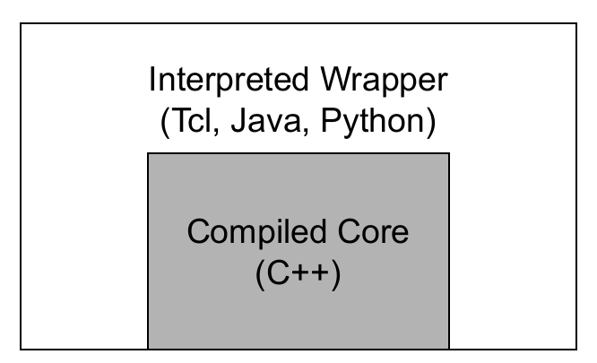
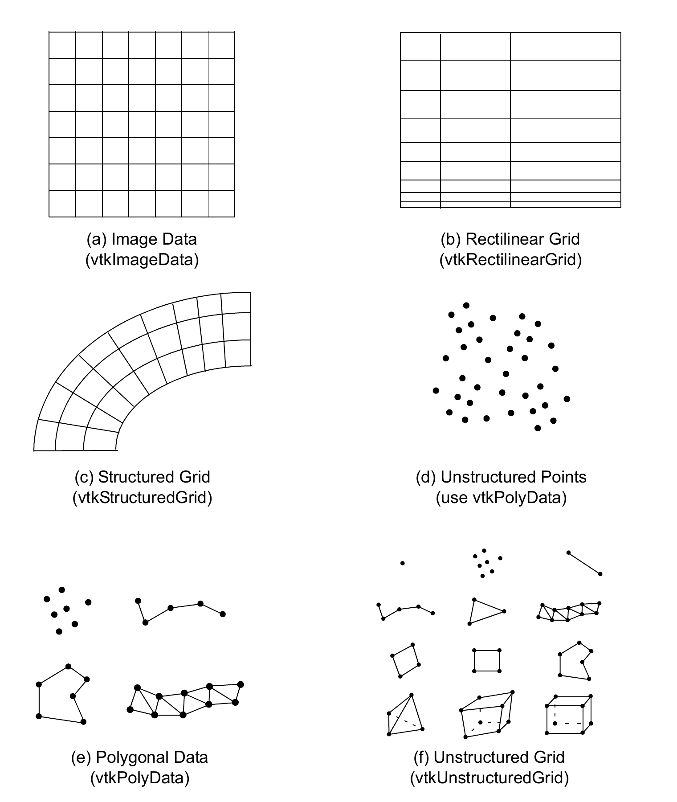
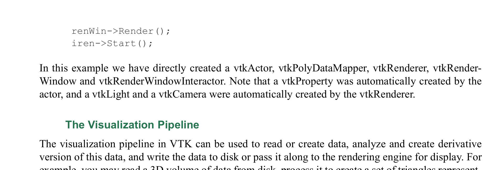
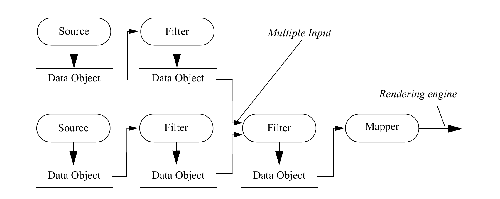
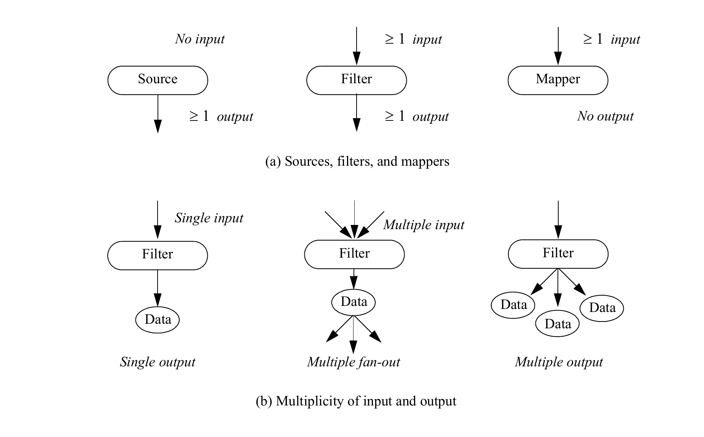
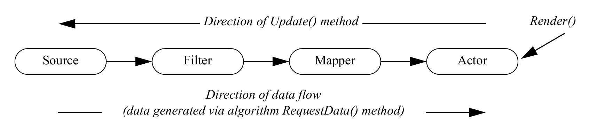

# Chapter 3: System Overview

The purpose of this chapter is to provide you with an overview of the Visualization Toolkit system, and to show you the basic information you'll need to create applications in C++, Java, and Python. We begin by introducing basic system concepts and object model abstractions. We close the chapter by demonstrating these concepts and describing what you’ll need to know to build applications.

## 3.1 System Architecture

The Visualization Toolkit consists of two basic subsystems: a compiled C++ class library and an "interpreted" wrapper layer that lets you manipulate the compiled classes using the languages Java and Python. See Figure 3–1 below:

<div align="center">


*Figure 3–1: The Visualization Toolkit consists of a compiled (C++) core with language bindings for Python, Java, .NET, and JavaScript.*
</div>

The advantage of this architecture is that you can build efficient (in both CPU and memory usage) algorithms in the compiled C++ language, and retain the rapid code development features of interpreted languages (avoidance of compile/link cycle, simple but powerful tools, and access to GUI tools). Of course, for those proficient in C++ and who have the tools to do so, applications can be built entirely in C++.

The Visualization Toolkit is an object-oriented system. The key to using VTK effectively is to develop a good understanding of the underlying object models. Doing so will remove much of the mystery surrounding the use of the hundreds of objects in the system. With this understanding in place it’s much easier to combine objects to build applications. You’ll also need to know something about the capabilities of the many objects in the system; this only comes with reviewing code examples and online documentation. In this User’s Guide, we’ve tried to provide you with useful combinations of VTK objects that you can adapt to your own applications.

In the remainder of this section, we will introduce two major components of the Visualization Toolkit: the visualization pipeline and the rendering engine. The visualization pipeline is used to acquire or create data, process that data, and either write the results to a file or pass the results to the rendering engine for display. The rendering engine is responsible for creating a visual representation of the data. Note that these are not truly rigid architectural components of VTK but are instead conceptual components. The discussion in this chapter will be fairly high-level, but when you combine that with the specific examples in both this chapter and the next, as well as the hundreds of available examples in the VTK source distribution you will gain a good understanding of these components.

### Low-Level Object Model

The VTK object model can be thought of as being rooted in the superclass vtkObject. Nearly all VTK classes are derived from this class, or in some special cases from its superclass vtkObjectBase. All VTK objects must be created using the object's `New()` method, and must be destroyed using the object's `Delete()` method. VTK objects cannot be allocated on the stack because the constructor is a protected method. Using a common superclass and a unified method of creating and destroying object, VTK is able to provide several basic object-oriented operations.

**Reference Counting**. Objects explicitly store a count of the number of pointers referencing them.

When an object is created through the static `New()` method of a class its initial reference count is 1 because a raw pointer must be used to refer to the new object:

```cpp
vtkObjectBase* obj = vtkExampleClass::New();
```

When other references to the object are created or destroyed the reference count is incremented and decremented using the Register() and UnRegister() methods. Usually this is handled automatically by the various “set” methods provided in the object’s API:

```cpp
otherObject->SetExample(obj);
```

The reference count is now 2 because both the original pointer and a pointer stored inside the other object both refer to it. When the raw pointer originally storing the object is no longer needed the reference is removed using the Delete() method:

```cpp
obj->Delete();
```

From this point forward it is no longer safe to use the original pointer to access the object because the pointer does not own a reference to it. In order to ensure proper management of object references every call to `New()` must be paired with a later call to `Delete()` to be sure no references are leaked.

The preferred modern approach is to use `vtkNew<>`, which automatically manages object lifetime. When a `vtkNew` variable goes out-of-scope, it automatically decrements the reference count. No call to `Delete()` is needed:

```cpp
vtkNew<vtkExampleClass> obj;
otherObject->SetExample(obj);
```

For cases requiring shared ownership, `vtkSmartPointer<>` can be used instead:

```cpp
vtkSmartPointer<vtkExampleClass> obj =
    vtkSmartPointer<vtkExampleClass>::New();
otherObject->SetExample(obj);
```

In both cases the smart pointer automatically manages the reference it owns. When the variable goes out-of-scope, it automatically informs the object by decrementing the reference count.

**Run-Time Type Information.** In C++ the real type of an object may be different from the type of pointer used to reference it. All classes in the public interface of VTK have simple identifiers for class names (no templates), so a string is sufficient to identify them. The type of a VTK object may be obtained at run-time with the `GetClassName()` method:

```cpp
const char* type = obj->GetClassName();
```

An object may be tested for whether it is an instance of a particular class or one of its subclasses using the IsA() method:

```cpp
if(obj->IsA("vtkExampleClass")) { ... }
```

A pointer of a superclass type may be safely converted to a more derived type using the static SafeDownCast() method provided by the class of the derived type:

```cpp
vtkExampleClass* example = vtkExampleClass::SafeDownCast(obj);
```

This will succeed at run-time only if the object is truly an instance of the more-derived type and otherwise will return a null pointer.

**Object State Display.** When debugging it is often useful to display a human-readable description of the current state of an object. This can be obtained for VTK objects using the `Print()` method:

```cpp
obj->Print(cout);
```

### The Rendering Engine

The VTK rendering engine consists of the classes in VTK that are responsible for taking the results of the visualization pipeline and displaying them into a window. This involves the following components. Note that this is not an exhaustive list, but rather a sense of the most commonly used objects in the rendering engine. The subheadings used here are the highest level superclass in VTK that represents this type of object, and in many cases where there are multiple choices these are abstract classes defining the basic API across the various concrete subclasses that implement the functionality.

**vtkProp**. Visible depictions of data that exist in the scene are represented by a subclass of vtkProp.

The most commonly used subclasses of vtkProp for displaying objects in 3D are vtkActor (used to represent geometric data in the scene) and vtkVolume (used to represent volumetric data in the scene).

There are also props that represent data in 2D such as vtkActor2D. The vtkProp subclass is generally responsible for knowing its position, size, and orientation in the scene. The parameters used to control the placement of the prop generally depend on whether the prop is for example a 3D object in the scene, or a 2D annotation.

For 3D props such as vtkActor and vtkVolume (both subclasses of vtkProp3D which is itself a subclass of vtkProp), you can either directly control parameters such as the object's 3D position, orientation and scale, or you can use a 4x4 transformation matrix. For 2D props that provide annotation such as the vtkScalarBarActor, the size and position of the annotation can be defined in a variety of ways including specifying a position, width, and height relative to the size of the entire viewport. In addition to providing placement control, props generally have a mapper object that holds the data and knows how to render it, and a property object that controls parameters such as color and opacity.

There are a large number (over 50) of specialized props such as vtkImageSlice (used to display an image) and vtkPieChartActor (used to create a pie chart visual representation of an array of data values). Some of these specialized props directly contain the parameters that control appearance, and directly have a reference to the input data to be rendered, and therefore do not require the use of a property or a mapper. The vtkFollower prop is a specialized subclass of vtkActor that will automatically update its orientation in order to continually face a specified camera. This is useful for displaying billboards or text in the 3D scene and having them remain visible as the user rotates. The vtkLODActor is also a subclass of vtkActor that automatically changes its geometric representation in order to maintain interactive frame rates, and vtkLODProp3D is a subclass of vtkProp3D that selects between a number of different mappers (perhaps even a mixture of volumetric and geometric mappers) in order to provide interactivity. vtkAssembly allows hierarchies of actors, properly managing the transformations when the hierarchy is translated, rotated or scaled.

**vtkAbstractMapper.** Some props such as vtkActor and vtkVolume use a subclass of vtkAbstractMapper to hold a reference to the input data and to provide the actual rendering functionality. The vtkPolyDataMapper is the primary mapper for rendering polygonal geometry. For volumetric objects, the recommended mapper is vtkSmartVolumeMapper, which automatically selects the best available rendering technique at runtime (typically GPU-accelerated ray casting via vtkGPUVolumeRayCastMapper). vtkSmartVolumeMapper can render vtkImageData, while vtkProjectedTetrahedraMapper can be used to render vtkUnstructuredGrid data.

**vtkProperty and vtkVolumeProperty.** Some props use a separate property object to hold the various parameters that control the appearance of the data. This allows you to more easily share appearance settings between different objects in your scene. The vtkActor object uses a vtkProperty to store parameters such as color, opacity, and the ambient, diffuse, and specular coefficient of the material. The vtkVolume object instead uses a vtkVolumeProperty to capture the parameters that are applicable to a volumetric object, such as the transfer functions that map the scalar value to color and opacity. Many mappers also provide functionality to set clipping planes that can be used to reveal interior structure.

**vtkCamera.** The vtkCamera contains the parameters that control how you view the scene. The vtkCamera has a position, a focal point, and a vector defining the direction of "up" in the scene. Other parameters control the specific viewing transformation (parallel or perspective), the scale or view angle of the image, and the near and far clipping planes of the view frustum.

**vtkLight.** When lighting is computed for a scene, one or more vtkLight objects are required. The vtkLight objects store the position and orientation of the light, as well as the color and intensity. Lights also have a type that describes how the light will move with respect to the camera. For example, a Headlight is always located at the camera's position and shines on the camera's focal point, whereas a SceneLight is located at a stationary position in the scene.

**vtkRenderer**. The objects that make up a scene including the props, the camera and the lights are collected together in a vtkRenderer. The vtkRenderer is responsible for managing the rendering process for the scene. Multiple vtkRenderer objects can be used together in a single vtkRenderWindow. These renderers may render into different rectangular regions (known as viewports) of the render window, or may be overlapping.

**vtkRenderWindow**. The vtkRenderWindow provides a connection between the operating system and the VTK rendering engine. Platform specific subclasses of vtkRenderWindow are responsible for opening a window in the native windowing system on your computer and managing the display process. When you develop with VTK, you simply use the platform-independent vtkRenderWindow which is automatically replaced with the correct platform-specific subclass at runtime. The vtkRenderWindow contains a collection of vtkRenderers, and parameters that control rendering features such as stereo, anti-aliasing, motion blur and focal depth.

**vtkRenderWindowInteractor**. The vtkRenderWindowInteractor is responsible for processing mouse, key, and timer events and routing these through VTK's implementation of the command / observer design pattern. A vtkInteractorStyle listens for these events and processes them in order to provide motion controls such as rotating, panning and zooming. The vtkRenderWindowInteractor automatically creates a default interactor style that works well for 3D scenes, but you can instead select one for 2D image viewing for example, or create your own custom interactor style.

**vtkTransform**. Many of the objects in the scene that require placement such as props, lights, and cameras have a vtkTransform parameter that can be used to easily manipulate the position and orientation of the object. The vtkTransform can be used to describe the full range of linear (also known as affine) coordinate transformation in three dimensions, which are internally represented as a 4x4 homogeneous transformation matrix. The vtkTransform object will start with a default identity matrix or you can chain transformation together in a pipeline fashion to create complex behavior. The pipeline mechanism assures that if you modify any transform in the pipeline, all subsequent transforms are updated accordingly.

**vtkLookupTable, vtkColorTransferFunction, and vtkPiecewiseFunction.** Visualizing scalar data often involves defining a mapping from a scalar value to a color and opacity. This is true both in geometric surface rendering where the opacity will define the translucency of the surface, and in volume rendering where the opacity will represent the opacity accumulated along some length of ray passing through the volume. For geometric rendering, this mapping is typically created using a vtkLookupTable, and in volume rendering both the vtkColorTransferFunction and the vtkPiecewiseFunction will be utilized.

**A minimal example.** The following example shows how some of these objects can be used to specify and render a scene.

```cpp
vtkNew<vtkCylinderSource> cylinder;

vtkNew<vtkPolyDataMapper> cylinderMapper;
cylinderMapper->SetInputConnection(cylinder->GetOutputPort());

vtkNew<vtkActor> cylinderActor;
cylinderActor->SetMapper(cylinderMapper);

vtkNew<vtkRenderer> renderer;
renderer->AddActor(cylinderActor);

vtkNew<vtkRenderWindow> renderWindow;
renderWindow->AddRenderer(renderer);

vtkNew<vtkRenderWindowInteractor> interactor;
interactor->SetRenderWindow(renderWindow);

renderWindow->Render();
interactor->Start();
```

In this example we have directly created a vtkActor, vtkPolyDataMapper, vtkRenderer, vtkRenderWindow and vtkRenderWindowInteractor using `vtkNew<>` for automatic memory management. Note that a vtkProperty was automatically created by the actor, and a vtkLight and a vtkCamera were automatically created by the vtkRenderer.

### The Visualization Pipeline

The visualization pipeline in VTK can be used to read or create data, analyze and create derivative version of this data, and write the data to disk or pass it along to the rendering engine for display. For example, you may read a 3D volume of data from disk, process it to create a set of triangles representing an isovalued surface through the volume, then write this geometric object back out to disk. Or, you may create a set of spheres and cylinders to represent atoms and bonds, then pass these off to the rendering engine for display.

The Visualization Toolkit uses a data flow approach to transform information into graphical data. There are two basic types of objects involved in this approach.
* vtkDataObject 
* vtkAlgorithm

Data objects represent data of various types. The class vtkDataObject can be viewed as a generic "blob" of data. Data that has a formal structure is referred to as a dataset (class vtkDataSet). Figure 3–2 shows the dataset objects supported in VTK.



*Figure 3–2: Dataset types found in VTK. Note that unstructured points can be represented by either polygonal data or unstructured grids.*

Datasets consist of a geometric and topological structure (points and cells) as illustrated by the figure; they also have associated attribute data such as scalars or vectors. The attribute data can be associated with the points or cells of the dataset. Cells are topological organizations of points; cells form the atoms of the dataset and are used to interpolate information between points. VTK supports over twenty cell types including vertices, lines, triangles, quadrilaterals, tetrahedra, hexahedra, and higher-order variants. Figure 3–3 shows the attribute data supported by VTK.



*Figure 3–3: Data attributes associated with the points and cells of a dataset.*

Algorithms, also referred to generally as filters, operate on data objects to produce new data objects. Algorithms and data objects are connected together to form visualization pipelines (i.e., dataflow networks). Figure 3–4 is a depiction of a visualization pipeline.



*Figure 3–4: Data objects are connected with algorithms (filters) to create the visualization pipeline.*



*Figure 3–5: Different types of algorithms. Filters ingest one or more inputs and produce one or more outputs.*

This figure together with Figure 3–5 illustrate some important visualization concepts. Source algorithms produce data by reading (reader objects) or constructing one or more data objects (procedural source objects). Filters ingest one or more data objects and generate one or more data objects on output. Mappers (or in some cases, specialized actors) take the data and convert it into a visual representation that is displayed by the rendering engine. A writer can be thought of as a type of mapper that writes data to a file or stream.

There are several important issues regarding the construction of the visualization pipeline that we will briefly introduce here. First, pipeline topology is constructed using variations of the methods

```cpp
aFilter->SetInputConnection( anotherFilter->GetOutputPort() );
```

which sets the input to the filter aFilter to the output of the filter anotherFilter. (Filters with multiple inputs and outputs have similar methods.) Second, we must have a mechanism for controlling the execution of the pipeline. We only want to execute those portions of the pipeline necessary to bring the output up to date. The Visualization Toolkit uses a lazy evaluation scheme (executes only the data is requested) based on an internal modification time of each object. Third, the assembly of the pipeline requires that only those objects compatible with one another can fit together with the `SetInputConnection()` and `GetOutputPort()` methods. VTK produces errors at run-time if the data object types are incompatible. Finally, we must decide whether to cache, or retain, the data objects once the pipeline has executed. Since visualization datasets are typically quite large, this is important to the successful application of visualization tools. VTK offers methods to turn data caching on and off, use of reference counting to avoid copying data, and methods to stream data in pieces if an entire dataset cannot be held in memory. (We recommend that you review the chapter on the Visualization Pipeline in *The Visualization Toolkit An Object-Oriented Approach to 3D Graphics* text for more information.) Please note that there are many varieties of both algorithm and data objects. Figure 3–2 shows the most common data object types supported by VTK. Algorithm objects vary in their type(s) of input data and output data and of course in the particular algorithm implemented.

**Pipeline Execution.** In the previous section we discussed the need to control the execution of the visualization pipeline. In this section we will expand our understanding of some key concepts regarding pipeline execution.

As indicated in the previous section, the VTK visualization pipeline only executes when data is required for computation (lazy evaluation). Consider this example where we create a sphere source and ask for the number of points in its output:

```python
from vtkmodules.vtkFiltersSources import vtkSphereSource

sphere = vtkSphereSource()
sphere.GetOutput().GetNumberOfPoints()  # returns 0
```

The source returns 0 because the pipeline has not yet executed and the output contains no data, despite the fact that the source is fully configured. However, if you call the `Update()` method first:

```python
sphere.Update()
sphere.GetOutput().GetNumberOfPoints()  # returns 50
```

the source returns the correct number of points. In the first example, no computation has been requested, so the output is empty. In the second example, the `Update()` method forces execution of the pipeline, causing the source to generate its geometry. Once the source has executed, its output is populated with the generated data.

Normally, you do not need to manually invoke Update() because the filters are connected into a visualization pipeline. In this case, when the actor receives a request to render itself, it forwards the method to its mapper, and the Update() method is automatically sent through the visualization pipeline. A high-level view of pipeline execution appears in Figure 3–6.



*Figure 3–6: Conceptual overview of pipeline execution.*

As this figure illustrates, the `Render()` method often initiates the request for data; this request is then passed up through the pipeline. Depending on which portions of the pipeline are out-of-date, the filters in the pipeline may reexecute, thereby bringing the data at the end of the pipeline up-to-date; the up-to-date data is then rendered by the actor.

**Image Processing.** VTK supports an extensive set of image processing and volume rendering functionality. In VTK, both 2D (image) and 3D (volume) data are referred to as vtkImageData. An image dataset in VTK is one in which the data is arranged in a regular, axis-aligned array. Images, pixmaps, and bitmaps are examples of 2D image datasets; volumes (a stack of 2D images) are 3D image datasets.

Algorithms in the imaging pipeline always input and output image data objects. Because of the regular and simple nature of the data, the imaging pipeline has other important features. Volume rendering is used to visualize 3D vtkImageData (see Chapter 7 "Volume Rendering"), and special image viewers are used to view 2D vtkImageData. Almost all algorithms in the imaging pipeline are multithreaded and are capable of streaming data in pieces to satisfy a user-specified memory limit. Filters automatically sense the number of cores and processors available on the system and create that number of threads during execution as well as automatically separating data into pieces that are streamed through the pipeline.

This concludes our brief overview of the Visualization Toolkit system architecture. We recommend *The Visualization Toolkit An Object-Oriented Approach to 3D Graphics* text for more details on many of the algorithms found in VTK. Learning by example is another helpful approach. Chapters 4 through 13 contain many annotated examples demonstrating various capabilities of VTK. Also, since source code is available, you may wish to study the examples found in the VTK/Examples directory of the VTK source tree.

With this abbreviated introduction behind us, let's look at ways to create applications in C++, Java, and Python.

## 3.2 Create An Application

This section covers the basic information you need to develop VTK applications in C++, Java, and Python. After reading this introduction, you should jump to the subsection(s) that discuss the language(s) you are interested in using. In addition to providing you with instructions on how to create and run a simple application, each section will show you how to take advantage of callbacks in that language.

### User Methods, Observers, and Commands

Callbacks (or user methods) are implemented in VTK using the Subject/Observer and Command design pattern. This means that nearly every class in VTK (every subclass of vtkObject) has an AddObserver() method that can be used to setup callbacks from VTK. The observer looks at every event invoked on an object, and if it matches one of the events that the observer is watching for, then an associated command is invoked (i.e., the callback). For example, all VTK filters invoke a StartEvent right before they start to execute. If you add an observer that watches for a StartEvent then it will get called every time that filter starts to execute. Consider the following Python script that creates an instance of vtkElevationFilter, and adds an observer for the StartEvent to call the function `print_status`.

```python
from vtkmodules.vtkFiltersCore import vtkElevationFilter

def print_status(obj, event):
    print("Starting to execute the elevation filter")

foo = vtkElevationFilter()
foo.AddObserver("StartEvent", print_status)
```

This type of functionality (i.e., callback) is available in all the languages VTK supports. Each section that follows will show a brief example of how to use it. To create your own application, we suggest starting with one of the examples that come with VTK or the many examples available at https://examples.vtk.org.

### C++

Using C++ as your development language will typically result in smaller, faster, and more easily deployed applications than most any other language. C++ development also has the advantage that you do not need to compile any additional support for Java or Python.

The first step in building your C++ program is to use CMake to generate a makefile or project file, depending on your compiler. A typical CMakeLists.txt for a VTK C++ application uses `find_package` to locate VTK and specify the required components:

```cmake
cmake_minimum_required(VERSION 3.12...3.28)
project(MyConeExample)

find_package(VTK
  COMPONENTS
    CommonCore
    FiltersSources
    InteractionStyle
    RenderingCore
    RenderingOpenGL2)

if (NOT VTK_FOUND)
  message(FATAL_ERROR "MyConeExample: Unable to find the VTK build folder.")
endif()

add_executable(Cone Cone.cxx)
target_link_libraries(Cone PRIVATE ${VTK_LIBRARIES})

vtk_module_autoinit(
  TARGETS Cone
  MODULES ${VTK_LIBRARIES})
```

**Building.** Once you have run CMake, build the application using your platform's build tool. On UNIX, run `make` (or `ninja` if using the Ninja generator). CMake creates a makefile that specifies the include paths, link lines, and dependencies. If the application does not compile, check the build errors and make sure the VTK_DIR CMake variable points to a valid VTK build or install directory.

**User Methods in C++.** VTK provides several ways to set up callbacks using the observer/command design pattern.

**Using vtkCallbackCommand.** The simplest approach for standalone callbacks is to use `vtkCallbackCommand` with a free function:

```cpp
void PrintCameraPosition(
  vtkObject* caller, unsigned long, void*, void*)
{
  vtkRenderer* renderer = static_cast<vtkRenderer*>(caller);
  double* pos = renderer->GetActiveCamera()->GetPosition();
  std::cout << pos[0] << " " << pos[1] << " " << pos[2] << "\n";
}

vtkNew<vtkCallbackCommand> callback;
callback->SetCallback(PrintCameraPosition);
renderer->AddObserver(vtkCommand::StartEvent, callback);
```

**Using member function callbacks.** If you are working within a class, you can pass a member function pointer directly to `AddObserver()` without creating a separate command object:

```cpp
renderer->AddObserver(
  vtkCommand::StartEvent, this, &MyClass::OnStartRender);
```

**Using a vtkCommand subclass.** For more complex callbacks that need to carry state, you can create a subclass of vtkCommand that overrides the `Execute()` method:

```cpp
class vtkMyCallback : public vtkCommand
{
public:
  static vtkMyCallback* New() { return new vtkMyCallback; }
  vtkTypeMacro(vtkMyCallback, vtkCommand);

  void Execute(vtkObject* caller, unsigned long, void*) override
  {
    vtkRenderer* renderer = vtkRenderer::SafeDownCast(caller);
    if (renderer)
    {
      double* pos = renderer->GetActiveCamera()->GetPosition();
      std::cout << pos[0] << " " << pos[1] << " " << pos[2] << "\n";
    }
  }
};

vtkNew<vtkMyCallback> callback;
renderer->AddObserver(vtkCommand::StartEvent, callback);
```

Note that `SafeDownCast()` is the preferred way to convert the caller to the expected type, as it returns a null pointer if the cast is not valid.

### Java

To create Java applications you must first have a working Java development environment. Once your JDK has been installed and you have built VTK with Java wrapping enabled, you need to set your CLASSPATH environment variable to include the path to your vtk.jar file and the current directory.

**User Methods in Java.** You set up a callback by passing three arguments. The first is the name of the event you are interested in, the second is an instance of a class, the third is the name of the method you want to invoke. In this example we set up the StartEvent to invoke the myCallback method on me (which is an instance of Cone2). The myCallback method must of course be a valid method of Cone2 to avoid an error.

```java
public void myCallback() {
    System.out.println("Starting a render");
}
```

```java
Cone2 me = new Cone2();
ren1.AddObserver("StartEvent",me,"myCallback");
```

### Python

VTK can be installed as a Python package using `pip install vtk`, or you can build VTK from source with Python wrapping enabled. Once installed, VTK classes are available through the `vtkmodules` package:

```python
from vtkmodules.vtkFiltersSources import vtkConeSource
from vtkmodules.vtkRenderingCore import vtkRenderer
```

Creating your own Python scripts is a simple matter of using some of the example scripts as a starting point.

**User Methods in Python.** User methods can be set up by defining a function and then passing it as the argument to the AddObserver as shown below:

```python
def myCallback(obj, event):
    print("Starting to render")

ren1.AddObserver("StartEvent", myCallback)
```

## 3.3 Building Desktop Applications with Qt

Qt is the standard toolkit for building polished desktop VTK applications with menus, toolbars, dockable panels, and multiple views. VTK provides dedicated Qt widgets that embed a VTK render window inside any Qt layout. Both C++ and Python (via PySide6) workflows are supported.

### C++ Qt + VTK

#### CMake Configuration

A Qt+VTK application requires the `GUISupportQt` VTK component and Qt's `Core` and `Widgets` modules. The `CMAKE_AUTOMOC` flag tells CMake to run Qt's meta-object compiler automatically, and `vtk_module_autoinit` ensures the correct VTK rendering backend is loaded:

```cmake
cmake_minimum_required(VERSION 3.12)
project(MyQtVTKApp)

find_package(VTK COMPONENTS CommonCore GUISupportQt)
find_package("Qt${VTK_QT_VERSION}" COMPONENTS Core Widgets)

set(CMAKE_AUTOMOC ON)

add_executable(MyQtVTKApp MyQtVTKApp.cxx)
target_link_libraries(MyQtVTKApp
  PRIVATE
    ${VTK_LIBRARIES}
    "Qt${VTK_QT_VERSION}::Core"
    "Qt${VTK_QT_VERSION}::Widgets")
vtk_module_autoinit(
  TARGETS MyQtVTKApp
  MODULES ${VTK_LIBRARIES})
```

The variable `VTK_QT_VERSION` is set by VTK's CMake configuration to match the Qt major version (5 or 6) that VTK was built against, so the same CMakeLists.txt works with either Qt version.

#### Minimal C++ Example

The following example creates a Qt main window with a VTK render widget as its central widget and renders a cone (see `examples/QtConeCxx/`):

```cpp
#include <QApplication>
#include <QMainWindow>
#include <QSurfaceFormat>
#include <QVTKOpenGLNativeWidget.h>
#include <vtkActor.h>
#include <vtkConeSource.h>
#include <vtkGenericOpenGLRenderWindow.h>
#include <vtkNew.h>
#include <vtkPolyDataMapper.h>
#include <vtkRenderer.h>

int main(int argc, char* argv[])
{
  // Set the default surface format BEFORE constructing QApplication.
  QSurfaceFormat::setDefaultFormat(QVTKOpenGLNativeWidget::defaultFormat());
  QApplication app(argc, argv);

  // Create a QMainWindow with a VTK render widget.
  QMainWindow window;
  window.resize(800, 600);

  QVTKOpenGLNativeWidget* vtkWidget = new QVTKOpenGLNativeWidget();
  window.setCentralWidget(vtkWidget);

  // Prevent the macOS trackpad from generating spurious button-press
  // events via touch input.  Normal mouse/trackpad clicks still work.
  vtkWidget->setAttribute(Qt::WA_AcceptTouchEvents, false);

  // Create a vtkGenericOpenGLRenderWindow and assign it to the widget.
  vtkNew<vtkGenericOpenGLRenderWindow> renderWindow;
  vtkWidget->setRenderWindow(renderWindow);

  // Build a VTK pipeline.
  vtkNew<vtkConeSource> cone;
  cone->SetHeight(3.0);
  cone->SetRadius(1.0);
  cone->SetResolution(30);

  vtkNew<vtkPolyDataMapper> mapper;
  mapper->SetInputConnection(cone->GetOutputPort());
  vtkNew<vtkActor> actor;
  actor->SetMapper(mapper);

  vtkNew<vtkRenderer> renderer;
  renderer->AddActor(actor);
  renderer->SetBackground(0.1, 0.2, 0.4);
  renderWindow->AddRenderer(renderer);

  window.show();

  // Qt's event loop replaces vtkRenderWindowInteractor::Start().
  return app.exec();
}
```

> **Important:** The call to `QSurfaceFormat::setDefaultFormat()` must come *before* the `QApplication` constructor. Setting it later can cause OpenGL context creation failures.
>
> **macOS note:** On macOS, the trackpad can generate spurious button-press events through touch input. Call `setAttribute(Qt::WA_AcceptTouchEvents, false)` on the VTK widget to prevent this.

#### Key Classes

- **`QVTKOpenGLNativeWidget`** -- A `QOpenGLWidget` subclass that hosts a VTK render window inside any Qt layout. This is the primary widget for embedding VTK views in Qt applications.
- **`vtkGenericOpenGLRenderWindow`** -- A render window designed to work with an externally managed OpenGL context. Qt creates and owns the OpenGL context, and this class lets VTK render into it. Must be used with `QVTKOpenGLNativeWidget`.
- **`vtkEventQtSlotConnect`** -- Bridges VTK's observer/command event system to Qt's signal/slot mechanism. Allows a Qt slot to be called in response to any VTK event (e.g., `ProgressEvent`, `PickEvent`).

### Python (PySide6) + VTK

VTK's Python package includes a Qt widget module that works with PySide6 out of the box -- no source build required.

#### Installation

```bash
pip install vtk PySide6
```

VTK detects PySide6 automatically at runtime.

#### Minimal Python Example

The following example embeds a VTK cone in a Qt window (see `examples/QtCone.py`):

```python
import sys

# Use QOpenGLWidget as the base class -- must be set before importing
# QVTKRenderWindowInteractor.
import vtkmodules.qt
vtkmodules.qt.QVTKRWIBase = "QOpenGLWidget"

from PySide6.QtWidgets import QApplication, QMainWindow
from vtkmodules.qt.QVTKRenderWindowInteractor import QVTKRenderWindowInteractor
from vtkmodules.vtkFiltersSources import vtkConeSource
from vtkmodules.vtkRenderingCore import vtkActor, vtkPolyDataMapper, vtkRenderer
import vtkmodules.vtkRenderingOpenGL2  # noqa: F401 (load OpenGL2 backend)
import vtkmodules.vtkInteractionStyle  # noqa: F401 (load interactor styles)

app = QApplication(sys.argv)
window = QMainWindow()

# Create the VTK widget and place it in the main window.
vtk_widget = QVTKRenderWindowInteractor(window)
window.setCentralWidget(vtk_widget)

# Build a VTK pipeline.
cone = vtkConeSource()
mapper = vtkPolyDataMapper()
mapper.SetInputConnection(cone.GetOutputPort())
actor = vtkActor()
actor.SetMapper(mapper)

renderer = vtkRenderer()
renderer.AddActor(actor)
renderer.SetBackground(0.1, 0.2, 0.4)
vtk_widget.GetRenderWindow().AddRenderer(renderer)

window.show()
vtk_widget.Initialize()
vtk_widget.Start()

sys.exit(app.exec())
```

The `QVTKRenderWindowInteractor` widget manages its own `vtkRenderWindow` and `vtkRenderWindowInteractor` internally. Setting `QVTKRWIBase` to `"QOpenGLWidget"` *before* importing the widget selects the `QOpenGLWidget`-backed implementation, which provides reliable rendering on all platforms. After calling `Initialize()` and `Start()` on the widget, hand control to Qt's event loop with `app.exec()`.

## 3.4 Web Applications with Trame

Trame is a Python web framework developed by Kitware that lets you build interactive VTK visualization applications served in the browser. The entire application is written in Python — no JavaScript is required. Trame supports both local rendering (client-side via vtk.js, where geometry is serialized and sent to the browser) and remote rendering (server-side, where VTK renders on the server and streams images to the client).

### Installation

Trame is distributed as a set of PyPI packages. The core packages needed for VTK applications are:

```bash
pip install trame trame-vtk trame-vuetify
```

- **trame** — The core framework that manages the server, application state, and UI layout.
- **trame-vtk** — Provides VTK rendering widgets (`VtkLocalView`, `VtkRemoteView`) for embedding VTK scenes in the browser.
- **trame-vuetify** — Provides Vuetify 3 UI components (toolbars, buttons, sliders, etc.) for building the application interface.

### A Minimal Trame Application

The following example creates a trame application that displays an interactive VTK cone in the browser. The complete source is in `examples/TrameCone.py`.

```python
from trame.app import get_server
from trame.ui.vuetify3 import SinglePageLayout
from trame.widgets import vtk as vtk_widgets, vuetify3 as vuetify

from vtkmodules.vtkFiltersSources import vtkConeSource
from vtkmodules.vtkRenderingCore import (
    vtkActor,
    vtkPolyDataMapper,
    vtkRenderer,
    vtkRenderWindow,
    vtkRenderWindowInteractor,
)
from vtkmodules.vtkInteractionStyle import vtkInteractorStyleSwitch  # noqa
import vtkmodules.vtkRenderingOpenGL2  # noqa

# --- VTK pipeline (identical to any other VTK Python script) ---
renderer = vtkRenderer()
render_window = vtkRenderWindow()
render_window.AddRenderer(renderer)
render_window_interactor = vtkRenderWindowInteractor()
render_window_interactor.SetRenderWindow(render_window)
render_window_interactor.GetInteractorStyle().SetCurrentStyleToTrackballCamera()

cone = vtkConeSource()
mapper = vtkPolyDataMapper()
mapper.SetInputConnection(cone.GetOutputPort())
actor = vtkActor()
actor.SetMapper(mapper)
renderer.AddActor(actor)
renderer.ResetCamera()

# --- Trame application ---
server = get_server(client_type="vue3")

with SinglePageLayout(server) as layout:
    layout.title.set_text("VTK Cone")
    with layout.content:
        with vuetify.VContainer(fluid=True, classes="pa-0 fill-height"):
            vtk_widgets.VtkLocalView(render_window)

if __name__ == "__main__":
    server.start()
```

Run the script with:

```bash
python TrameCone.py
```

Trame automatically opens a browser tab showing the cone. You can rotate, zoom, and pan using the mouse, just as you would in a desktop VTK window.

### Key Concepts

**`get_server(client_type="vue3")`** creates the trame server that manages shared state between the Python backend and the browser frontend. The `client_type="vue3"` argument selects Vue 3 as the frontend framework.

**`SinglePageLayout`** provides an application shell with a toolbar, an optional navigation drawer, and a content area. It is a convenience wrapper — you can also build fully custom layouts.

**`VtkLocalView`** performs client-side rendering via vtk.js. The VTK scene graph is serialized and sent to the browser, which renders it using WebGL. No GPU is required on the server. This mode provides the best interactivity for small to medium datasets because all rendering happens locally in the browser.

**`VtkRemoteView`** performs server-side rendering. VTK renders on the server using its full OpenGL pipeline and streams the resulting images to the browser. This mode is essential for very large datasets that cannot fit in browser memory, or when server-side features (e.g., volume rendering, advanced OpenGL shaders) are needed. To switch from local to remote rendering, simply replace `VtkLocalView` with `VtkRemoteView` in the code above.

### Choosing a Rendering Mode

| | VtkLocalView | VtkRemoteView |
|---|---|---|
| **Rendering location** | Browser (WebGL) | Server (OpenGL) |
| **Network traffic** | Geometry (once) | Images (every frame) |
| **Best for** | Small/medium datasets | Large datasets |
| **Interactivity** | Immediate (no round-trip) | Depends on network latency |
| **Server GPU required** | No | Yes |

For many applications, `VtkLocalView` is the right default. Switch to `VtkRemoteView` when the dataset is too large for the browser or when you need rendering features only available in server-side VTK.

## 3.5 JavaScript and WebAssembly

VTK can be compiled to WebAssembly using Emscripten, allowing the full C++ VTK library to run directly in the browser with no server required. The `@kitware/vtk-wasm` npm package provides a ready-to-use bundle that can be loaded via a single `<script>` tag. The result is a self-contained HTML file — no build tools, no bundler, no backend.

### A Self-Contained Example

The following HTML file renders an interactive VTK cone entirely in the browser. The complete source is in `examples/cone.html`.

```html
<html>
  <head>
    <script
      src="https://unpkg.com/@kitware/vtk-wasm/vtk-umd.js"
      id="vtk-wasm"
      data-url="https://gitlab.kitware.com/api/v4/projects/13/packages/generic/vtk-wasm32-emscripten/9.5.20251215/vtk-9.5.20251215-wasm32-emscripten.tar.gz"
    ></script>
  </head>
  <body>
    <canvas id="vtk-wasm-window" tabindex="-1" onclick="focus()"
      style="width: 640px; height: 480px;"></canvas>
    <script>
      vtkReady.then(async (vtk) => {
        const cone = vtk.vtkConeSource();
        await cone.setResolution(8);

        const mapper = vtk.vtkPolyDataMapper();
        await mapper.setInputConnection(await cone.getOutputPort());

        const actor = vtk.vtkActor();
        await actor.setMapper(mapper);

        const renderer = vtk.vtkRenderer();
        await renderer.addActor(actor);
        await renderer.setBackground(0.2, 0.3, 0.4);
        await renderer.resetCamera();

        const canvasSelector = "#vtk-wasm-window";
        const renderWindow = vtk.vtkRenderWindow({ canvasSelector });
        await renderWindow.addRenderer(renderer);

        const interactor = vtk.vtkRenderWindowInteractor({
          canvasSelector,
          renderWindow,
        });
        await interactor.interactorStyle.setCurrentStyleToTrackballCamera();

        await interactor.start();
      });
    </script>
  </body>
</html>
```

To try it, serve the file with any HTTP server (WebAssembly modules cannot be loaded from `file://` URLs):

```bash
python -m http.server 8000
```

Then open `http://localhost:8000/cone.html` in your browser. You can rotate, zoom, and pan the cone using the mouse.

### How It Works

**Loading the Wasm bundle.** The `<script>` tag loads the `vtk-umd.js` loader from npm (via unpkg). The `data-url` attribute tells the loader where to fetch the prebuilt WebAssembly binary — a compressed archive containing the full VTK C++ library compiled for the `wasm32-emscripten` target. On first load the binary is downloaded and cached by the browser.

**`vtkReady`.** The loader exposes a global `vtkReady` Promise that resolves with a `vtk` object once the Wasm module has been compiled and initialized. All VTK API calls go through this object.

**Async/await.** Every VTK method call is `async` because it crosses the JavaScript-to-WebAssembly boundary. This is why the pipeline code uses `await` on each call — for example `await cone.setResolution(8)` and `await mapper.setInputConnection(await cone.getOutputPort())`.

**camelCase method names.** The JavaScript bindings use camelCase (`setResolution`, `addActor`, `resetCamera`) rather than the PascalCase used by C++ and Python (`SetResolution`, `AddActor`, `ResetCamera`). This follows JavaScript naming conventions.

**Canvas and interactor.** The `<canvas>` element serves as the rendering target. The `vtkRenderWindow` and `vtkRenderWindowInteractor` both receive a `canvasSelector` string that identifies it. The interactor handles mouse and keyboard events for rotation, panning, and zooming via the trackball camera style.

### Comparison with Trame

The vtk-wasm approach and trame serve different deployment models:

| | vtk-wasm (Section 3.5) | Trame (Section 3.4) |
|---|---|---|
| **Runs where** | Entirely in the browser | Python server + browser client |
| **VTK implementation** | Full C++ VTK compiled to Wasm | Native C++ VTK on the server |
| **Server required** | No (static file hosting only) | Yes (Python process) |
| **Language** | JavaScript / HTML | Python |
| **Best for** | Standalone demos, static sites, offline apps | Multi-user apps, large data, server-side processing |

vtk-wasm is ideal when you want to ship a self-contained visualization with no backend infrastructure. Trame is the better choice when you need a Python backend for data processing, shared state management, or server-side rendering of large datasets.

## 3.6 Lightweight Desktop GUIs with Dear ImGui

[Dear ImGui](https://github.com/ocornut/imgui) is a lightweight immediate-mode GUI library popular in game engines, tools, and scientific applications. It is well suited for building VTK visualization tools that need simple controls (sliders, buttons, checkboxes) without the weight of a full widget toolkit like Qt. The Python package `imgui_bundle` provides Dear ImGui bindings along with a ready-made application runner.

The integration strategy is similar to Qt's: VTK renders offscreen into a framebuffer object (FBO), and the resulting OpenGL texture is handed directly to ImGui for display. Because both VTK and ImGui share the same OpenGL context, no pixel readback or format conversion is needed — the texture handle is passed directly to `imgui.image()`.

### Installation

Install the `imgui_bundle` package alongside VTK:

```bash
pip install imgui-bundle vtk
```

### Example: VTK Cone with ImGui Controls

The following example creates a fullscreen ImGui application with a VTK viewport and a slider that controls the cone resolution (see `examples/ImGuiCone.py`):

```python
import vtk
from imgui_bundle import imgui, immapp, hello_imgui

class VtkImGuiRenderer:
    def __init__(self):
        self.renderer = vtk.vtkRenderer()

        # Offscreen rendering into a shared OpenGL context
        self.render_window = vtk.vtkGenericOpenGLRenderWindow()
        self.render_window.AddRenderer(self.renderer)
        self.render_window.SetOwnContext(False)
        self.render_window.SetOffScreenRendering(True)

        # Generic interactor: receives events from ImGui, not a native window
        self.interactor = vtk.vtkGenericRenderWindowInteractor()
        self.interactor.SetRenderWindow(self.render_window)
        style = vtk.vtkInteractorStyleTrackballCamera()
        self.interactor.SetInteractorStyle(style)

        # VTK pipeline
        self.cone_source = vtk.vtkConeSource()
        self.cone_source.SetResolution(6)

        mapper = vtk.vtkPolyDataMapper()
        mapper.SetInputConnection(self.cone_source.GetOutputPort())
        actor = vtk.vtkActor()
        actor.SetMapper(mapper)

        self.renderer.AddActor(actor)
        self.renderer.SetBackground(0.15, 0.15, 0.2)
        self.renderer.SetUseFXAA(True)

        self.is_interacting = False

    def init_vtk_context(self):
        self.render_window.SetMapped(True)
        self.render_window.SetIsCurrent(True)
        self.render_window.OpenGLInitContext()

    def render_frame(self, phys_width, phys_height):
        if phys_width <= 0 or phys_height <= 0:
            return None

        self.render_window.SetSize(int(phys_width), int(phys_height))
        self.render_window.Render()

        # Get the texture handle directly from VTK's framebuffer
        fbo = self.render_window.GetRenderFramebuffer()
        if fbo:
            tex = fbo.GetColorAttachmentAsTextureObject(0)
            if tex:
                return tex.GetHandle()
        return None

    def handle_input(self, pos, logical_size):
        io = imgui.get_io()
        is_hovered = imgui.is_window_hovered()

        if is_hovered and (imgui.is_mouse_clicked(0)
                           or imgui.is_mouse_clicked(1)):
            self.is_interacting = True

        if not is_hovered and not self.is_interacting:
            return

        dpi_scale = io.display_framebuffer_scale
        rel_x = io.mouse_pos.x - pos.x
        rel_y = logical_size.y - (io.mouse_pos.y - pos.y)
        phys_x = int(rel_x * dpi_scale.x)
        phys_y = int(rel_y * dpi_scale.y)

        self.interactor.SetEventInformation(
            phys_x, phys_y, int(io.key_ctrl), int(io.key_shift))

        if imgui.is_mouse_clicked(0):
            self.interactor.LeftButtonPressEvent()
        elif imgui.is_mouse_released(0):
            self.interactor.LeftButtonReleaseEvent()
        if imgui.is_mouse_clicked(1):
            self.interactor.RightButtonPressEvent()
        elif imgui.is_mouse_released(1):
            self.interactor.RightButtonReleaseEvent()

        self.interactor.MouseMoveEvent()

        if imgui.is_mouse_released(0) or imgui.is_mouse_released(1):
            self.is_interacting = False


vtk_engine = VtkImGuiRenderer()

def gui():
    viewport = imgui.get_main_viewport()
    imgui.set_next_window_pos(viewport.work_pos)
    imgui.set_next_window_size(viewport.work_size)

    flags = (imgui.WindowFlags_.no_decoration
             | imgui.WindowFlags_.no_move
             | imgui.WindowFlags_.no_saved_settings)

    imgui.begin("Main Application", p_open=None, flags=flags)

    # ImGui slider controls the VTK pipeline
    current_res = vtk_engine.cone_source.GetResolution()
    changed, new_res = imgui.slider_int(
        "Cone Resolution", current_res, 3, 50)
    if changed:
        vtk_engine.cone_source.SetResolution(new_res)

    imgui.separator()

    # VTK viewport fills remaining space
    logical_size = imgui.get_content_region_avail()
    pos = imgui.get_cursor_screen_pos()

    dpi_scale = imgui.get_io().display_framebuffer_scale
    phys_w = int(logical_size.x * dpi_scale.x)
    phys_h = int(logical_size.y * dpi_scale.y)

    vtk_engine.handle_input(pos, logical_size)
    raw_tex_id = vtk_engine.render_frame(phys_w, phys_h)

    if raw_tex_id is not None:
        if hasattr(imgui, "ImTextureRef"):
            tex_obj = imgui.ImTextureRef(raw_tex_id)
        else:
            tex_obj = imgui.ImTextureID(raw_tex_id)

        imgui.image(tex_obj, logical_size,
                    uv0=imgui.ImVec2(0, 1),
                    uv1=imgui.ImVec2(1, 0))
    else:
        imgui.text("Waiting for VTK to generate texture...")

    imgui.end()


runner_params = hello_imgui.RunnerParams()
runner_params.callbacks.show_gui = gui
runner_params.callbacks.post_init = vtk_engine.init_vtk_context
runner_params.app_window_params.window_title = "VTK 9 + Dear ImGui"
runner_params.app_window_params.window_geometry.size = (1000, 800)

immapp.run(runner_params)
```

### How It Works

**Shared OpenGL context.** The key to this integration is `SetOwnContext(False)` on the `vtkGenericOpenGLRenderWindow`. This tells VTK not to create its own OpenGL context but to use the one already active — which is the context ImGui's backend created. Both libraries then share the same GPU state.

**Texture passing instead of pixel readback.** Unlike approaches that copy pixels from VTK into a CPU-side image (as required by Swing or Tkinter), this integration passes the GPU texture handle directly. After VTK renders, `GetRenderFramebuffer()` retrieves the FBO, and `GetColorAttachmentAsTextureObject(0)` returns the color texture. Its OpenGL handle is passed to `imgui.image()`, which draws it as a textured quad. This zero-copy approach is efficient even at high resolutions.

**DPI-aware coordinate handling.** On high-DPI displays (e.g., Retina), ImGui reports logical coordinates while VTK and OpenGL work in physical pixels. The `display_framebuffer_scale` factor converts between the two. The VTK render window is sized in physical pixels, while mouse coordinates are translated from ImGui's logical space.

**Event forwarding.** Mouse events are captured from ImGui's input state and forwarded to `vtkGenericRenderWindowInteractor`. The `is_interacting` flag ensures that a drag operation that starts inside the VTK viewport continues to track the mouse even if the cursor moves outside the viewport — this prevents the camera from jumping when the user drags near the edge.

**Context initialization timing.** The `init_vtk_context` callback is registered as a `post_init` callback on the ImGui runner. This ensures VTK initializes its OpenGL state only after ImGui's OpenGL context is fully created and current. Calling `OpenGLInitContext()` earlier would fail because there would be no valid context to initialize against.

## 3.7 A Tour of VTK Language Bindings

VTK's core is written in C++ and shipped with official wrappings for Java and Python. But because those wrappings exist, any language that can call into Java or Python can also use VTK. This section demonstrates the same example — creating a cone, mapping it, rendering it, and starting an interactive window — in six different languages. Comparing the examples side by side shows how uniform VTK's API is across language boundaries: the pipeline structure is always the same, and only the syntax varies.

The languages fall into three groups:

- **JVM languages** (Java, Groovy) use VTK's native Java wrappings directly.
- **.NET languages** (C#, F#) use ActiViz, a commercial .NET binding for VTK published as the `Kitware.VTK` NuGet package.
- **Python compatible languages** (Julia, Ruby) call VTK through Python interop libraries (`PyCall` for Julia, `pycall` for Ruby), using VTK's Python wrappings under the hood.

### Java

VTK's Java wrappings are generated automatically from the C++ headers. Each VTK class becomes a Java class in the `vtk` package. Objects are created with `new` and methods are called with the same names as in C++. The `vtkNativeLibrary.LoadAllNativeLibraries()` call loads all VTK shared libraries into the JVM.

```java
import vtk.vtkConeSource;
import vtk.vtkPolyDataMapper;
import vtk.vtkActor;
import vtk.vtkRenderer;
import vtk.vtkRenderWindow;
import vtk.vtkRenderWindowInteractor;
import vtk.vtkNativeLibrary;

public class cone {
    static {
        vtkNativeLibrary.LoadAllNativeLibraries();
    }

    public static void main(String[] args) {
        vtkConeSource cone = new vtkConeSource();
        cone.SetResolution(8);

        vtkPolyDataMapper mapper = new vtkPolyDataMapper();
        mapper.SetInputConnection(cone.GetOutputPort());

        vtkActor actor = new vtkActor();
        actor.SetMapper(mapper);

        vtkRenderer renderer = new vtkRenderer();
        renderer.AddActor(actor);
        renderer.SetBackground(0.2, 0.3, 0.4);

        vtkRenderWindow window = new vtkRenderWindow();
        window.AddRenderer(renderer);
        window.SetSize(640, 480);

        vtkRenderWindowInteractor interactor = new vtkRenderWindowInteractor();
        interactor.SetRenderWindow(window);

        window.Render();
        interactor.Start();
    }
}
```

Building and running requires the VTK JAR on the classpath and the native libraries on the library path. On macOS, the `-XstartOnFirstThread` flag is required because macOS requires all OpenGL operations to occur on the main thread:

```bash
javac -cp "$VTK_DIR/vtk.jar" cone.java
java -XstartOnFirstThread \
     -cp ".:$VTK_DIR/vtk.jar" \
     -Djava.library.path="$VTK_DIR/lib/java/vtk-Darwin-arm64" \
     cone
```

### Groovy

Groovy runs on the JVM and uses VTK's Java wrappings directly. The syntax is more concise — `def` replaces explicit types, and semicolons are optional — but the VTK method calls are identical to Java.

```groovy
import vtk.vtkNativeLibrary
import vtk.vtkConeSource
import vtk.vtkPolyDataMapper
import vtk.vtkActor
import vtk.vtkRenderer
import vtk.vtkRenderWindow
import vtk.vtkRenderWindowInteractor

vtkNativeLibrary.LoadAllNativeLibraries()

def cone = new vtkConeSource()
cone.SetResolution(8)

def mapper = new vtkPolyDataMapper()
mapper.SetInputConnection(cone.GetOutputPort())

def actor = new vtkActor()
actor.SetMapper(mapper)

def renderer = new vtkRenderer()
renderer.AddActor(actor)
renderer.SetBackground(0.2, 0.3, 0.4)

def window = new vtkRenderWindow()
window.AddRenderer(renderer)
window.SetSize(640, 480)

def interactor = new vtkRenderWindowInteractor()
interactor.SetRenderWindow(window)

window.Render()
interactor.Start()
```

Groovy scripts require the VTK JAR on the classpath. On macOS, JVM flags must be passed through the `JAVA_OPTS` environment variable:

```bash
JAVA_OPTS="-XstartOnFirstThread -Djava.library.path=$VTK_DIR/lib/java/vtk-Darwin-arm64" \
  groovy --classpath "$VTK_DIR/vtk.jar" cone.groovy
```

### C\#

C# accesses VTK through [ActiViz](https://www.kitware.eu/activiz/), a .NET binding distributed as the `Kitware.VTK` NuGet package. The API follows .NET conventions: objects are created with static `New()` methods, and the namespace is `Kitware.VTK`.

```csharp
using Kitware.VTK;

class Cone
{
    static void Main()
    {
        var cone = vtkConeSource.New();
        cone.SetResolution(8);

        var mapper = vtkPolyDataMapper.New();
        mapper.SetInputConnection(cone.GetOutputPort());

        var actor = vtkActor.New();
        actor.SetMapper(mapper);

        var renderer = vtkRenderer.New();
        renderer.AddActor(actor);
        renderer.SetBackground(0.2, 0.3, 0.4);

        var window = vtkRenderWindow.New();
        window.AddRenderer(renderer);
        window.SetSize(640, 480);

        var interactor = vtkRenderWindowInteractor.New();
        interactor.SetRenderWindow(window);

        window.Render();
        interactor.Start();
    }
}
```

The project file references the NuGet package:

```xml
<Project Sdk="Microsoft.NET.Sdk">
  <PropertyGroup>
    <OutputType>Exe</OutputType>
    <TargetFramework>net10.0</TargetFramework>
  </PropertyGroup>
  <ItemGroup>
    <PackageReference Include="Kitware.VTK" Version="9.5.2025.1212" />
  </ItemGroup>
</Project>
```

Build and run with the .NET CLI:

```bash
dotnet run
```

### F\#

F# uses the same ActiViz NuGet package as C#. The functional syntax is more concise — no class boilerplate, just a sequence of `let` bindings:

```fsharp
open Kitware.VTK

let cone = vtkConeSource.New()
cone.SetResolution(8)

let mapper = vtkPolyDataMapper.New()
mapper.SetInputConnection(cone.GetOutputPort())

let actor = vtkActor.New()
actor.SetMapper(mapper)

let renderer = vtkRenderer.New()
renderer.AddActor(actor)
renderer.SetBackground(0.2, 0.3, 0.4)

let window = vtkRenderWindow.New()
window.AddRenderer(renderer)
window.SetSize(640, 480)

let interactor = vtkRenderWindowInteractor.New()
interactor.SetRenderWindow(window)

window.Render()
interactor.Start()
```

The project file is similar to C# but uses an `.fsproj` file and must explicitly list the source file:

```xml
<Project Sdk="Microsoft.NET.Sdk">
  <PropertyGroup>
    <OutputType>Exe</OutputType>
    <TargetFramework>net10.0</TargetFramework>
  </PropertyGroup>
  <ItemGroup>
    <Compile Include="cone.fsx" />
  </ItemGroup>
  <ItemGroup>
    <PackageReference Include="Kitware.VTK" Version="9.5.2025.1212" />
  </ItemGroup>
</Project>
```

### Julia

Julia accesses VTK through the `PyCall` package, which embeds a Python interpreter and calls VTK's Python wrappings. The VTK method names and pipeline structure are identical to Python:

```julia
using PyCall

vtk = pyimport("vtkmodules.vtkFiltersSources")
vtkRendering = pyimport("vtkmodules.vtkRenderingCore")
pyimport("vtkmodules.vtkRenderingOpenGL2")
pyimport("vtkmodules.vtkInteractionStyle")

cone = vtk.vtkConeSource()
cone.SetResolution(8)

mapper = vtkRendering.vtkPolyDataMapper()
mapper.SetInputConnection(cone.GetOutputPort())

actor = vtkRendering.vtkActor()
actor.SetMapper(mapper)

renderer = vtkRendering.vtkRenderer()
renderer.AddActor(actor)
renderer.SetBackground(0.2, 0.3, 0.4)

window = vtkRendering.vtkRenderWindow()
window.AddRenderer(renderer)
window.SetSize(640, 480)

interactor = vtkRendering.vtkRenderWindowInteractor()
interactor.SetRenderWindow(window)

window.Render()
interactor.Start()
```

`PyCall` must be configured to use a Python environment that has VTK installed. Set the `PYTHONPATH` to include VTK's Python packages:

```bash
PYTHONPATH=/path/to/vtk/python/site-packages julia cone.jl
```

### Ruby

Ruby accesses VTK through the `pycall` gem, which bridges Ruby to Python. The `pyfrom` and `pyimport` methods load VTK's Python modules, and VTK objects are created with Ruby's `new` syntax:

```ruby
require 'pycall/import'
include PyCall::Import

pyfrom 'vtkmodules.vtkFiltersSources', import: :vtkConeSource
pyfrom 'vtkmodules.vtkRenderingCore', import: %i[
  vtkPolyDataMapper vtkActor vtkRenderer
  vtkRenderWindow vtkRenderWindowInteractor
]
pyimport 'vtkmodules.vtkRenderingOpenGL2', as: :vtkRenderingOpenGL2
pyimport 'vtkmodules.vtkInteractionStyle', as: :vtkInteractionStyle

cone = vtkConeSource.new
cone.SetResolution(8)

mapper = vtkPolyDataMapper.new
mapper.SetInputConnection(cone.GetOutputPort())

actor = vtkActor.new
actor.SetMapper(mapper)

renderer = vtkRenderer.new
renderer.AddActor(actor)
renderer.SetBackground(0.2, 0.3, 0.4)

window = vtkRenderWindow.new
window.AddRenderer(renderer)
window.SetSize(640, 480)

interactor = vtkRenderWindowInteractor.new
interactor.SetRenderWindow(window)

window.Render
interactor.Start
```

The `pycall` gem needs to know which Python interpreter to use:

```bash
gem install pycall
PYTHON=/path/to/python \
  PYTHONPATH=/path/to/vtk/python/site-packages \
  ruby cone.rb
```

### Summary

Every example above creates the same visualization pipeline: a cone source connected to a mapper, attached to an actor, added to a renderer, displayed in a window with an interactor. The table below summarizes how each language accesses VTK:

| Language | Binding mechanism | Object creation | Package/dependency |
|---|---|---|---|
| Java | Native JNI wrapping | `new vtkConeSource()` | `vtk.jar` + native libs |
| Groovy | VTK Java wrappings (JVM) | `new vtkConeSource()` | `vtk.jar` + native libs |
| C# | ActiViz (.NET binding) | `vtkConeSource.New()` | `Kitware.VTK` NuGet |
| F# | ActiViz (.NET binding) | `vtkConeSource.New()` | `Kitware.VTK` NuGet |
| Julia | PyCall → VTK Python | `vtk.vtkConeSource()` | `PyCall` + VTK Python |
| Ruby | pycall → VTK Python | `vtkConeSource.new` | `pycall` gem + VTK Python |

### Converting Between Languages

Because VTK's API is generated from the same C++ class definitions, converting code between languages is straightforward. Class names and method names stay the same — only the syntax around them changes. For example, to set an actor's color:

**C++** uses `->` for pointer access:
```cpp
anActor->GetProperty()->SetColor(red, green, blue);
```

**Python** and **Java** use `.` for member access:
```python
anActor.GetProperty().SetColor(red, green, blue)
```

**C#** and **F#** use the same dot syntax:
```csharp
anActor.GetProperty().SetColor(red, green, blue);
```

**JavaScript (WebAssembly)** is the exception. The Wasm bindings use camelCase method names instead of PascalCase, and all calls are `async`:
```javascript
await (await anActor.getProperty()).setColor(red, green, blue);
```

The table below summarizes the naming conventions:

| Language | Method style | Example |
|---|---|---|
| C++ | PascalCase, `->` | `actor->SetMapper(mapper)` |
| Python | PascalCase, `.` | `actor.SetMapper(mapper)` |
| Java / Groovy | PascalCase, `.` | `actor.SetMapper(mapper)` |
| C# / F# | PascalCase, `.` | `actor.SetMapper(mapper)` |
| JavaScript (Wasm) | camelCase, `await` | `await actor.setMapper(mapper)` |

One limitation to keep in mind: some C++ operations cannot be directly expressed in the wrapped languages because they involve raw pointer manipulation. While it is always possible to get and set individual values through the bindings, it is not always possible to obtain a raw pointer to efficiently traverse and modify a large data structure. If your application requires this level of data access, you can either develop directly in C++ or extend VTK at the C++ level with custom high-performance classes, then use those classes from your preferred language.
