# Chapter 4: The Basics

The purpose of this chapter is to introduce you to some of VTK's capabilities by way of a selected set of examples. Our focus will be on commonly used methods and objects, and combinations of objects. We will also introduce important concepts and useful applications. By no means are all of VTK's features covered; this chapter is meant to give you a broad overview of what's possible. You'll want to refer to online documentation or class .h files to learn about other options each class might have.

Most of the examples included here are implemented in the Python programming language. They could just as easily be implemented in C++ and Java — the conversion process between the languages is straightforward. (See Section 3.3.) C++ does offer some advantages, mainly access and manipulation of data structures and pointers, and some examples reflect this by being implemented in the C++ language.

Each example presented here includes sample code and often a supplemental image. We recommend that you run and understand the example and then experiment with object methods and parameters. You may also wish to try suggested alternative methods and/or classes. Often, the Visualization Toolkit offers several approaches to achieve similar results. Note also that the scripts are often modified from what's found in the source code distribution. This is done to simplify concepts or remove extraneous code.

Learning an object-oriented system like VTK first requires understanding the programming abstraction, and then becoming familiar with the library of objects and their methods. We recommend that you review Section 3.1 for information about the programming abstraction. The examples in this chapter will then provide you with a good overview of the many VTK objects.


*Figure 4–1 A simple VTK application rendering a cylinder.*

## 4.1 Creating Simple Models

The use of the Visualization Toolkit typically goes as follows: read/generate some data, filter it, render it, and interact with it. In this section, we'll start by looking at ways to read and generate data.

There are two basic ways to obtain data. The data may exist in a file (or files, streams, etc.) that is read into the system, or the data may be procedurally generated (via an algorithm or mathematical expression). Recall that objects that initiate the processing of data in the visualization pipeline are called source objects (see Figure 3–5). Objects that generate data are called procedural (source) objects, and objects that read data are called reader (source) objects.

### Procedural Source Object
We'll start off by rendering a simple cylinder. The example code shown below demonstrates many basic concepts in the visualization pipeline and rendering engine. Refer to Figure 4–1 to see the results of running the script.

We begin the script by importing the necessary VTK modules. Each VTK class is imported from its specific module.

```python
from vtkmodules.vtkFiltersSources import vtkCylinderSource
from vtkmodules.vtkRenderingCore import (
    vtkActor,
    vtkPolyDataMapper,
    vtkRenderer,
    vtkRenderWindow,
    vtkRenderWindowInteractor,
)

# Ensure an OpenGL rendering backend is loaded
import vtkmodules.vtkRenderingOpenGL2  # noqa: F401
# Ensure an interactor style is available
import vtkmodules.vtkInteractionStyle  # noqa: F401
```
We then create a procedural source object: vtkCylinderSource. This source creates a polygonal representation of a cylinder. The output of the cylinder is set as the input to the vtkPolyDataMapper via the method SetInputConnection(). We create an actor (the object that is rendered) that refers to the mapper as its defining geometry.

```python
cylinder = vtkCylinderSource()
cylinder.SetResolution(8)

cylinder_mapper = vtkPolyDataMapper()
cylinder_mapper.SetInputConnection(cylinder.GetOutputPort())

cylinder_actor = vtkActor()
cylinder_actor.SetMapper(cylinder_mapper)
cylinder_actor.GetProperty().SetColor(1.0, 0.3882, 0.2784)  # tomato
cylinder_actor.RotateX(30.0)
cylinder_actor.RotateY(-45.0)
```

As a reminder of how similar a C++ implementation is to a Python implementation, the same code implemented in C++ is shown below.

```cpp
#include <vtkNew.h>
#include <vtkCylinderSource.h>
#include <vtkPolyDataMapper.h>
#include <vtkActor.h>

vtkNew<vtkCylinderSource> cylinder;
cylinder->SetResolution(8);

vtkNew<vtkPolyDataMapper> cylinderMapper;
cylinderMapper->SetInputConnection(cylinder->GetOutputPort());

vtkNew<vtkActor> cylinderActor;
cylinderActor->SetMapper(cylinderMapper);
cylinderActor->GetProperty()->SetColor(1.0000, 0.3882, 0.2784);
cylinderActor->RotateX(30.0);
cylinderActor->RotateY(-45.0);
```
Recall that source objects initiate the visualization pipeline, and mapper objects (or prop objects that include mapping functionality) terminate the pipeline, so in this example we have a pipeline consisting of two algorithms (i.e., a source and mapper). The VTK pipeline uses a lazy evaluation scheme, so even though the pipeline is connected, no generation or processing of data has yet occurred (since we have not yet requested the data).

Next we create graphics objects which will allow us to render the actor. The vtkRenderer instance coordinates the rendering process for a viewport of the render window. The render window interactor is a 3D widget that allows us to manipulate the camera.

```python
# Create the graphics structure
renderer = vtkRenderer()

render_window = vtkRenderWindow()
render_window.AddRenderer(renderer)

interactor = vtkRenderWindowInteractor()
interactor.SetRenderWindow(render_window)
```
Notice that we've associated the renderer with the render window via the AddRenderer() method. We must also associate the actor with the renderer using the AddActor() method.

```python
# Add the actors to the renderer, set the background and size
renderer.AddActor(cylinder_actor)
renderer.SetBackground(0.1, 0.2, 0.4)
render_window.SetSize(200, 200)
```
The SetBackground() method specifies the background color of the rendering window using RGB (red, green, blue) values between (0,1), and SetSize() specifies the window size in pixels. Finally, we conclude this example by initializing the interactor and starting the event loop.

```python
interactor.Initialize()
render_window.Render()
interactor.Start()
```

When the script is run, the visualization pipeline will execute because the rendering engine will request data. (The window expose event will force the render window to render itself.) Only after the pipeline executes are the filters up-to-date with respect to the input data.

After you get this example running, you might try a couple of things. First, use the interactor by mousing in the rendering window. Next, change the resolution of the cylinder object by modifying the script and re-executing it. Remember, changes are visible only after data is requested, so follow changes with a `render_window.Render()` call, or by mousing in the rendering window.

### Reader Source Object

This example is similar to the previous example except that we read a data file rather than procedurally generating the data. A stereo-lithography file is read (suffix .stl) that represents polygonal data using the binary STL data format. Refer to Figure 4–2 for the result.

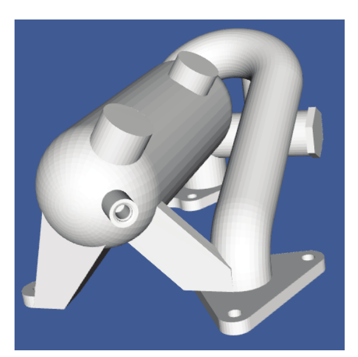

*Figure 4–2 Reader Source Object*

```python
from vtkmodules.vtkIOGeometry import vtkSTLReader
from vtkmodules.vtkRenderingCore import vtkPolyDataMapper
from vtkmodules.vtkRenderingLOD import vtkLODActor

part = vtkSTLReader()
part.SetFileName("42400-IDGH.stl")

part_mapper = vtkPolyDataMapper()
part_mapper.SetInputConnection(part.GetOutputPort())

part_actor = vtkLODActor()
part_actor.SetMapper(part_mapper)
```
Notice the use of the vtkLODActor. This actor changes its representation to maintain interactive performance. Its default behavior is to create a point cloud and wireframe, bounding-box outline to represent the intermediate and low-level representations. (See "Level-Of-Detail Actors" in Section 4.7 for more information.) The model used in this example is small enough that on most computers today you will only see the high-level representation (the full geometry of the model).

Many of the readers do not sense when the input file(s) change and re-execute. For example, if the file 42400-IDGH.stl changes, the pipeline will not re-execute. You can manually modify objects by invoking the Modified() method on them. This will cause the filter to re-execute, as well as all filters downstream of it.

The Visualization Toolkit has limited, built-in modeling capabilities. If you want to use VTK to edit and manipulate complex models (e.g., those created by a solid modeler or modeling tool), you'll typically use a reader (see Chapter 12) to interface to the data. (Another option is importers, which are used to ingest entire scenes. See Chapter 12 for more information.)

## 4.2 Filtering Data

The previous example pipelines consisted of a source and mapper object; the pipeline had no filters. In this section we show how to add filters into the pipeline. The examples here use `vtkPolyData` for simplicity, but VTK supports many other dataset types — `vtkImageData`, `vtkRectilinearGrid`, `vtkStructuredGrid`, `vtkUnstructuredGrid`, and more. Refer to Section 3.1 for the dataset hierarchy and Chapter 5 for filters that operate on these other types.

Filters are connected by using the `SetInputConnection()` and `GetOutputPort()` methods. For example, we can modify the script in "Reader Source Object" above to shrink the polygons that make up the model. The script is shown below. (Only the pipeline and other pertinent objects are shown.)

```python
from vtkmodules.vtkIOGeometry import vtkSTLReader
from vtkmodules.vtkFiltersGeneral import vtkShrinkPolyData
from vtkmodules.vtkRenderingCore import vtkPolyDataMapper
from vtkmodules.vtkRenderingLOD import vtkLODActor

part = vtkSTLReader()
part.SetFileName("42400-IDGH.stl")

shrink = vtkShrinkPolyData()
shrink.SetInputConnection(part.GetOutputPort())
shrink.SetShrinkFactor(0.85)

part_mapper = vtkPolyDataMapper()
part_mapper.SetInputConnection(shrink.GetOutputPort())

part_actor = vtkLODActor()
part_actor.SetMapper(part_mapper)
```
As you can see, creating a visualization pipeline is simple. You need to select the right classes for the task at hand, make sure that the input and output type of connected filters are compatible, and set the necessary instance variables. (Input and output types are compatible when the output dataset type of a source or filter is acceptable as input to the next filter or mapper in the pipeline. The output dataset type must either match the input dataset type exactly or be a subclass of it.)

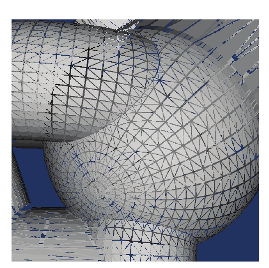

*Figure 4–3 Filtering data. Here we use a filter to shrink the polygons forming the model towards their centroid.*

### Thresholding

Thresholding extracts cells whose scalar values fall within a specified range. The filter `vtkThreshold` accepts any `vtkDataSet` and produces a `vtkUnstructuredGrid` containing only the cells that pass the test. Three threshold modes are available: `THRESHOLD_BETWEEN` (keep values in a range), `THRESHOLD_LOWER` (keep values below an upper bound), and `THRESHOLD_UPPER` (keep values above a lower bound).

The following example samples a quadric implicit function on a 3D grid, then thresholds to keep only the cells with scalar values between 0.5 and 1.0 (see `examples/threshold_data.py`).

```python
from vtkmodules.vtkCommonDataModel import vtkQuadric
from vtkmodules.vtkFiltersCore import vtkThreshold
from vtkmodules.vtkFiltersGeometry import vtkGeometryFilter
from vtkmodules.vtkImagingHybrid import vtkSampleFunction

quadric = vtkQuadric()
quadric.SetCoefficients(0.5, 1.0, 0.2, 0.0, 0.1, 0.0, 0.0, 0.2, 0.0, 0.0)

sample = vtkSampleFunction()
sample.SetSampleDimensions(30, 30, 30)
sample.SetImplicitFunction(quadric)
sample.ComputeNormalsOff()

thresh = vtkThreshold()
thresh.SetInputConnection(sample.GetOutputPort())
thresh.SetThresholdFunction(thresh.THRESHOLD_BETWEEN)
thresh.SetLowerThreshold(0.5)
thresh.SetUpperThreshold(1.0)

# Convert unstructured grid to polydata for rendering
surface = vtkGeometryFilter()
surface.SetInputConnection(thresh.GetOutputPort())
```

Because `vtkThreshold` always outputs `vtkUnstructuredGrid`, you typically follow it with `vtkGeometryFilter` (or use `vtkDataSetMapper`) to render the result. See Chapter 5 for a deeper treatment of thresholding including point-based thresholding with `vtkThresholdPoints`.

### Contouring

Contouring generates lines or surfaces of constant scalar value. In VTK, `vtkContourFilter` handles contouring for any dataset type. A brief example is shown below — see Section 5.1 for a full discussion.

```python
from vtkmodules.vtkFiltersCore import vtkContourFilter

contours = vtkContourFilter()
contours.SetInputConnection(sample.GetOutputPort())
contours.GenerateValues(5, 0.0, 1.2)
```

### Clipping

Clipping uses an implicit function (such as a plane) to separate a dataset into two halves. `vtkClipPolyData` clips polygonal meshes; for volume meshes, use `vtkTableBasedClipDataSet` (see Chapter 5). The following example clips a sphere with a plane through the origin (see `examples/clip_sphere.py`).

```python
from vtkmodules.vtkCommonDataModel import vtkPlane
from vtkmodules.vtkFiltersCore import vtkClipPolyData
from vtkmodules.vtkFiltersSources import vtkSphereSource

sphere = vtkSphereSource()
sphere.SetThetaResolution(30)
sphere.SetPhiResolution(30)

plane = vtkPlane()
plane.SetOrigin(0, 0, 0)
plane.SetNormal(1, 0, 0)

clipper = vtkClipPolyData()
clipper.SetInputConnection(sphere.GetOutputPort())
clipper.SetClipFunction(plane)
clipper.GenerateClippedOutputOn()
```

The `GenerateClippedOutputOn()` method causes the filter to produce a second output containing the clipped-away portion, accessible via `clipper.GetClippedOutputPort()`.

### Computing Derived Quantities

The `vtkArrayCalculator` filter evaluates mathematical expressions on data arrays to produce new derived arrays. It supports standard functions (`sin`, `cos`, `exp`, `sqrt`, `log`, `abs`, etc.) and operations on scalars and vectors. The following example computes the sine of an elevation field (see `examples/calculator.py`).

```python
from vtkmodules.vtkFiltersCore import vtkArrayCalculator, vtkElevationFilter
from vtkmodules.vtkFiltersSources import vtkPlaneSource

plane = vtkPlaneSource()
plane.SetResolution(40, 40)

elevation = vtkElevationFilter()
elevation.SetInputConnection(plane.GetOutputPort())
elevation.SetLowPoint(0, 0, 0)
elevation.SetHighPoint(0, 1, 0)
elevation.SetScalarRange(0, 1)

calc = vtkArrayCalculator()
calc.SetInputConnection(elevation.GetOutputPort())
calc.AddScalarArrayName("Elevation")
calc.SetFunction("sin(Elevation * 3.14159265)")
calc.SetResultArrayName("SineElevation")
```

The result array "SineElevation" is added to the output's point data. You can then color the surface by selecting it with `mapper.SelectColorArray("SineElevation")`.

For a thorough treatment of filtering — including warping, connectivity analysis, resampling, and more — refer to Chapter 5.

> **See also:** The [VTK Examples](https://examples.vtk.org/site/Python/) collection includes complete, runnable scripts for [ClipDataSetWithPolyData](https://examples.vtk.org/site/Python/Meshes/ClipDataSetWithPolyData/), [SolidClip](https://examples.vtk.org/site/Python/Meshes/SolidClip/), [ConnectivityFilter](https://examples.vtk.org/site/Python/Filtering/ConnectivityFilter/), and many other filters.

## 4.3 Writing Data

After processing data with VTK, you will often want to save the results to a file. VTK provides writers for all its native formats as well as common exchange formats like STL and PLY. Writers terminate a pipeline branch — they consume data but produce no output.

The XML-based formats (`.vtp`, `.vtu`, `.vti`, `.vtr`, `.vts`) are the preferred choice for VTK-to-VTK workflows. They support binary encoding, compression, and random-access reading of pieces. The legacy `.vtk` format is simpler and human-readable but lacks these features. For interoperability with CAD and 3D printing tools, `vtkSTLWriter` writes the widely supported STL format.

```python
from vtkmodules.vtkFiltersSources import vtkSphereSource
from vtkmodules.vtkIOGeometry import vtkSTLWriter
from vtkmodules.vtkIOLegacy import vtkPolyDataWriter
from vtkmodules.vtkIOXML import vtkXMLPolyDataWriter

sphere = vtkSphereSource()
sphere.SetThetaResolution(20)
sphere.SetPhiResolution(20)

# XML format (.vtp) — preferred for VTK workflows
xml_writer = vtkXMLPolyDataWriter()
xml_writer.SetFileName("sphere.vtp")
xml_writer.SetInputConnection(sphere.GetOutputPort())
xml_writer.Write()

# STL format — widely used for 3D printing and CAD exchange
stl_writer = vtkSTLWriter()
stl_writer.SetFileName("sphere.stl")
stl_writer.SetInputConnection(sphere.GetOutputPort())
stl_writer.Write()

# Legacy VTK format (.vtk) — simple, human-readable
legacy_writer = vtkPolyDataWriter()
legacy_writer.SetFileName("sphere.vtk")
legacy_writer.SetInputConnection(sphere.GetOutputPort())
legacy_writer.Write()
```

Other common writers include `vtkXMLUnstructuredGridWriter` (`.vtu`) for unstructured grids and `vtkXMLImageDataWriter` (`.vti`) for image data. See Chapter 12 for comprehensive coverage of VTK's I/O capabilities, including parallel writers and third-party format support.

## 4.4 Using VTK Interactors

Once you've visualized your data, you typically want to interact with it. The Visualization Toolkit offers several approaches to do this. The first approach is to use the built in class vtkRenderWindowInteractor. The second approach is to create your own interactor by specifying event bindings. And don't forget that if you are using an interpreted language you can type commands at run-time. You may also wish to refer to Section 4.9 to see how to select data from the screen.

### vtkRenderWindowInteractor
The simplest way to interact with your data is to instantiate vtkRenderWindowInteractor. This class responds to a pre-defined set of events and actions and provides a way to override the default actions. vtkRenderWindowInteractor allows you to control the camera and actors and offers two interaction styles: position sensitive (i.e., joystick mode) and motion sensitive (i.e., trackball mode). (More about interactor styles in the next section.)

vtkRenderWindowInteractor responds to the following events in the render window. (Remember that multiple renderers can draw into a rendering window and that the renderer draws into a viewport within the render window. Interactors support multiple renderers in a render window.)

- Keypress j / Keypress t — Toggle between joystick (position sensitive) and trackball (motion sensitive) styles. In joystick style, motion occurs continuously as long as a mouse button is pressed. In trackball style, motion occurs when the mouse button is pressed and the mouse pointer moves.
- Keypress c / Keypress a — Toggle between camera and actor (object) modes. In camera mode, mouse events affect the camera position and focal point. In object mode, mouse events affect the actor that is under the mouse pointer.
- Button 1 — Rotate the camera around its focal point (if camera mode) or rotate the actor around its origin (if actor mode). The rotation is in the direction defined from the center of the renderer's viewport towards the mouse position. In joystick mode, the magnitude of the rotation is determined by the distance between the mouse and the center of the render window.
- Button 2 — Pan the camera (if camera mode) or translate the actor (if object mode). In joystick mode, the direction of pan or translation is from the center of the viewport towards the mouse position. In trackball mode, the direction of motion is the direction the mouse moves. (Note: With a 2-button mouse, pan is defined as Shift-Button 1.)
- Button 3 — Zoom the camera (if camera mode), or scale the actor (if object mode). Zoom in/increase scale if the mouse position is in the top half of the viewport; zoom out/decrease scale if the mouse position is in the bottom half. In joystick mode, the amount of zoom is controlled by the distance of the mouse pointer from the horizontal centerline of the window.
- Keypress 3 — Toggle the render window into and out of stereo mode. By default, red-blue stereo pairs are created. Some systems support Crystal Eyes LCD stereo glasses; you have to invoke SetStereoTypeToCrystalEyes() on the rendering window.
- Keypress e/q — Exit or quit the application.
- Keypress f — Fly-to the point under the cursor. This sets the focal point and allows rotations around that point.
- Keypress p — Perform a pick operation. The render window interactor has an internal instance of vtkPropPicker that it uses to pick. See Section 4.9 for more information about picking.
- Keypress r — Reset the camera view along the current view direction. Centers the actors and moves the camera so that all actors are visible.
- Keypress s — Modify the representation of all actors so that they are surfaces.
- Keypress u — Invoke the user-defined method. Typically, this keypress will bring up an interactor that you can type commands into.
- Keypress w — Modify the representation of all actors so that they are wireframe.

The default interaction style is position sensitive (i.e., joystick style)—that is, it manipulates the camera or actor and renders continuously as long as a mouse button is pressed. If you don't like the default behavior, you can change it or write your own. (See Chapter 13 for information about writing your own style.)

vtkRenderWindowInteractor has other useful features. Invoking LightFollowCameraOn() (the default behavior) causes the light position and focal point to be synchronized with the camera position and focal point (i.e., a "headlight" is created). Of course, this can be turned off with LightFollowCameraOff(). A callback that responds to the "u" keypress can be added with the AddObserver() method for the UserEvent. It is also possible to set several pick-related methods. AddObserver("StartPickEvent", ...) defines a method to be called prior to picking, and AddObserver("EndPickEvent", ...) defines a method after the pick has been performed. (Please see Section 3.2 for more information on defining user methods.) You can also specify an instance of a subclass of vtkAbstractPicker to use via the SetPicker() method. (See Section 4.9.)

If you are using a prop that adjusts rendering quality based on desired interactivity, you may wish to set the desired frame rate via SetDesiredUpdateRate() in the interactor. Normally, this is handled automatically. (When the mouse buttons are activated, the desired update rate is increased; when the mouse button is released, the desired update rate is set back down.) Refer to "Level-Of-Detail Actors" in Section 4.7, "vtkLODProp3D" in Section 4.7, and Chapter 7 for further information on how props and their associated mappers may adjust render style to achieve a desired frame rate.

We've seen how to use vtkRenderWindowInteractor previously, here's a recapitulation.
```python
interactor = vtkRenderWindowInteractor()
interactor.SetRenderWindow(render_window)
```

### Interactor Styles
There are two distinctly different ways to control interaction style in VTK. The first is to use a subclass of vtkInteractorStyle, either one supplied with the system or one that you write. The second method is to add observers that watch for events on the vtkRenderWindowInteractor and define your own set of callbacks (or commands) to implement the style. (Note: 3D widgets are another, more complex way to interact with data in the scene. See "3D Widgets" in Section 4.14 for more information.)

### vtkInteractorStyle
The class vtkRenderWindowInteractor can support different interaction styles. When you type "t" or "j" in the interactor (see the previous section) you are changing between trackball and joystick interaction styles. The way this works is that vtkRenderWindowInteractor translates window-system-specific events it receives (e.g., mouse button press, mouse motion, keyboard events) to VTK events such as MouseMoveEvent, StartEvent, and so on. (See Section 3.2 for related information.) Different styles then observe particular events and perform the action(s) appropriate to the event. To set the style, use the `vtkRenderWindowInteractor::SetInteractorStyle()` method. For example:

```python
from vtkmodules.vtkInteractionStyle import vtkInteractorStyleFlight

flight_style = vtkInteractorStyleFlight()
interactor = vtkRenderWindowInteractor()
interactor.SetInteractorStyle(flight_style)
```
(Note: When vtkRenderWindowInteractor is instantiated, a window-system specific render window interactor is actually instantiated. For example, on Unix systems the class vtkXRenderWindowInteractor is actually created and returned as an instance of vtkRenderWindowInteractor. On Windows, the class vtkWin32RenderWindowInteractor is instantiated.)

### Adding vtkRenderWindowInteractor Observers
While a variety of interactor styles are available in VTK, you may prefer to create your own custom style to meet the needs of a particular application. In C++ the natural approach is to subclass vtkInteractorStyle. (See Chapter 13.) However, in an interpreted language (e.g., Python or Java), this is difficult to do. For interpreted languages the simplest approach is to use observers to define particular interaction bindings. (See Section 3.2.) The bindings can be managed in any language that VTK supports, including C++, Python, and Java. Here's an example that defines bindings for a simple Python application.

```python
from vtkmodules.vtkRenderingCore import vtkRenderWindowInteractor

rotating = False
panning = False
zooming = False

def on_left_button_press(obj, event):
    global rotating
    rotating = True

def on_left_button_release(obj, event):
    global rotating
    rotating = False

def on_middle_button_press(obj, event):
    global panning
    panning = True

def on_middle_button_release(obj, event):
    global panning
    panning = False

def on_right_button_press(obj, event):
    global zooming
    zooming = True

def on_right_button_release(obj, event):
    global zooming
    zooming = False

def on_mouse_move(obj, event):
    x, y = obj.GetEventPosition()
    # Implement custom rotation/pan/zoom logic here
    # based on the rotating/panning/zooming flags
    ...

def on_keypress(obj, event):
    key = obj.GetKeySym()
    if key == "e":
        obj.GetRenderWindow().Finalize()
        obj.TerminateApp()
    ...

interactor = vtkRenderWindowInteractor()
interactor.SetInteractorStyle(None)  # Disable default style
interactor.SetRenderWindow(render_window)

# Add observers for particular events
interactor.AddObserver("LeftButtonPressEvent", on_left_button_press)
interactor.AddObserver("LeftButtonReleaseEvent", on_left_button_release)
interactor.AddObserver("MiddleButtonPressEvent", on_middle_button_press)
interactor.AddObserver("MiddleButtonReleaseEvent", on_middle_button_release)
interactor.AddObserver("RightButtonPressEvent", on_right_button_press)
interactor.AddObserver("RightButtonReleaseEvent", on_right_button_release)
interactor.AddObserver("MouseMoveEvent", on_mouse_move)
interactor.AddObserver("KeyPressEvent", on_keypress)
```
Note that a key step in this example is disabling the default interaction style by passing `None` to SetInteractorStyle(). Observers are then added to watch for particular events which are tied to the appropriate Python callback functions.

## 4.5 Controlling The Camera

You may have noticed that in the proceeding scripts no cameras or lights were instantiated. If you're familiar with 3D graphics, you know that lights and cameras are necessary to render objects. In VTK, if lights and cameras are not directly created, the renderer automatically instantiates them.

### Instantiating The Camera
The following script shows how to instantiate and associate a camera with a renderer.

```python
from vtkmodules.vtkRenderingCore import vtkCamera

camera = vtkCamera()
camera.SetClippingRange(0.0475572, 2.37786)
camera.SetFocalPoint(0.052665, -0.129454, -0.0573973)
camera.SetPosition(0.327637, -0.116299, -0.256418)
camera.ComputeViewPlaneNormal()
camera.SetViewUp(-0.0225386, 0.999137, 0.034901)

renderer.SetActiveCamera(camera)
```
Alternatively, if you wish to access a camera that already exists (for example, a camera that the renderer has automatically instantiated), you would use

```python
camera = renderer.GetActiveCamera()
camera.Zoom(1.4)
```

Let's review some of the camera methods that we've just introduced. SetClippingRange() takes two arguments, the distance to the near and far clipping planes along the view plane normal. Recall that all graphics primitives not between these planes are eliminated during rendering, so you need to make sure the objects you want to see lie between the clipping planes. The FocalPoint and Position (in world coordinates) instance variables control the direction and position of the camera. ComputeViewPlaneNormal() resets the normal to the view plane based on the current position and focal point. (If the view plane normal is not perpendicular to the view plane you can get some interesting shearing effects.) Setting the ViewUp controls the "up" direction for the camera. Finally, the Zoom() method magnifies objects by changing the view angle (i.e., SetViewAngle()). You can also use the Dolly() method to move the camera in and out along the view plane normal to either enlarge or shrink the visible actors.

### Simple Manipulation Methods
The methods described above are not always the most convenient ones for controlling the camera. If the camera is "looking at" the point you want (i.e., the focal point is set), you can use the Azimuth() and Elevation() methods to move the camera about the focal point.

```python
camera.Azimuth(150)
camera.Elevation(60)
```

These methods move the camera in a spherical coordinate system centered at the focal point by moving in the longitude direction (azimuth) and the latitude direction (elevation) by the angle (in degrees) given. These methods do not modify the view-up vector and depend on the view-up vector remaining constant. Note that there are singularities at the north and south poles — the view-up vector becomes parallel with the view plane normal. To avoid this, you can force the view-up vector to be orthogonal to the view vector by using OrthogonalizeViewUp(). However, this changes the camera coordinate system, so if you're flying around an object with a natural horizon or view-up vector (such as terrain), camera manipulation is no longer natural with respect to the data.

### Controlling The View Direction
A common function of the camera is to generate a view from a particular direction. You can do this by invoking SetFocalPoint(), SetPosition(), and ComputeViewPlaneNormal() followed by invoking ResetCamera() on the renderer associated with the camera.

```python
camera = vtkCamera()
camera.SetFocalPoint(0, 0, 0)
camera.SetPosition(1, 1, 1)
camera.ComputeViewPlaneNormal()
camera.SetViewUp(1, 0, 0)
camera.OrthogonalizeViewUp()

renderer.SetActiveCamera(camera)
renderer.ResetCamera()
```
The initial direction (view vector or view plane normal) is computed from the focal point and position of the camera, which, together with ComputeViewPlaneNormal(), defines the initial view vector. Optionally, you can specify an initial view-up vector and orthogonalize it with respect to the view vector. The ResetCamera() method then moves the camera along the view vector so that the renderer's actors are all visible to the camera.

### Perspective Versus Orthogonal Views
In the previous examples, we have assumed that the camera is a perspective camera where a view angle controls the projection of the actors onto the view plane during the rendering process. Perspective projection, while generating more natural looking images, introduces distortion that can be undesirable in some applications. Orthogonal (or parallel) projection is an alternative projection method. In orthogonal projection, view rays are parallel, and objects are rendered without distance effects.

To set the camera to use orthogonal projection, use the `vtkCamera::ParallelProjectionOn()` method. In parallel projection mode, the camera view angle no longer controls zoom. Instead, use the SetParallelScale() method to control the magnification of the actors.

### Saving/Restoring Camera State

Another common requirement of applications is the capability to save and restore camera state (i.e., recover a view). To save camera state, you'll need to save (at a minimum) the clipping range, the focal point and position, and the view-up vector. You'll also want to compute the view plane normal (as shown in the example in "Instantiating The Camera" above). Then, to recover camera state, simply instantiate a camera with the saved information, and assign it to the appropriate renderer (i.e., SetActiveCamera()).

In some cases you may need to store additional information. For example, if the camera view angle (or parallel scale) is set, you'll need to save this. Or, if you are using the camera for stereo viewing, the EyeAngle and Stereo flags are required.

## 4.6 Controlling Lights

Lights are easier to control than cameras. The most frequently used methods are SetPosition(), SetFocalPoint(), and SetColor(). The position and focal point of the light control the direction in which the light points. The color of the light is expressed as an RGB vector. Also, lights can be turned on and off via the SwitchOn() and SwitchOff() methods, and the brightness of the light can be set with the SetIntensity() method.

By default, instances of vtkLight are directional lights. That is, the position and focal point define a vector parallel to which light rays travel, and the light source is assumed to be located at the infinity point. This means that the lighting on an object does not change if the focal point and position are translated identically.

Lights are associated with renderers as follows.

```python
from vtkmodules.vtkRenderingCore import vtkLight

light = vtkLight()
light.SetColor(1, 0, 0)
light.SetFocalPoint(camera.GetFocalPoint())
light.SetPosition(camera.GetPosition())
renderer.AddLight(light)
```
Here we've created a red headlight: a light located at the camera's position and pointing towards the camera's focal point. This is a useful trick, and is used by the interactive renderer to position the light as the camera moves. (See Section 4.4.)


### Positional Lights
It is possible to create positional (i.e., spot lights) by using the PositionalOn() method. This method is used in conjunction with the SetConeAngle() method to control the spread of the spot. A cone angle of 180 degrees indicates that no spot light effects will be applied (i.e., no truncated light cone), only the effects of position.

## 4.7 Controlling 3D Props

Objects in VTK that are to be drawn in the render window are generically known as "props." (The word prop comes from the vocabulary of theater — a prop is something that appears on stage.) There are several different types of props including vtkProp3D and vtkActor. vtkProp3D is an abstract superclass for those types of props existing in 3D space. The class vtkActor is a type of vtkProp3D whose geometry is defined by analytic primitives such as polygons and lines.

### Specifying the Position of a vtkProp3D
We have already seen how to use cameras to move around an object; alternatively, we can also hold the camera steady and transform the props. The following methods can be used to define the position of a vtkProp3D (and its subclasses).

- SetPosition(x,y,z) — Specify the position of the vtkProp3D in world coordinates.
- AddPosition(deltaX,deltaY,deltaZ) — Translate the prop by the specified amount along each of the x, y, and z axes.
- RotateX(theta), RotateY(theta), RotateZ(theta) — Rotate the prop by theta degrees around the x, y, z coordinate axes, respectively.
- SetOrientation(x,y,z) — Set the orientation of the prop by rotating about the z axis, then about the x axis, and then about the y axis.
- AddOrientation(a1,a2,a3) — Add to the current orientation of the prop.
- RotateWXYZ(theta,x,y,z) — Rotate the prop by theta degrees around the x-y-z vector defined.
- SetScale(sx,sy,sz) — Scale the prop in the x, y, z axes coordinate directions.
- SetOrigin(x,y,z) — Specify the origin of the prop. The origin is the point around which rotations and scaling occur.

These methods work together in complex ways to control the resulting transformation matrix. The most important thing to remember is that the operations listed above are applied in a particular order, and the order of application dramatically affects the resulting actor position. The order used in VTK to apply these transformations is as follows:
1. Shift to Origin
2. Scale
3. Rotate Y
4. Rotate X
5. Rotate Z
6. Shift from Origin
7. Translate

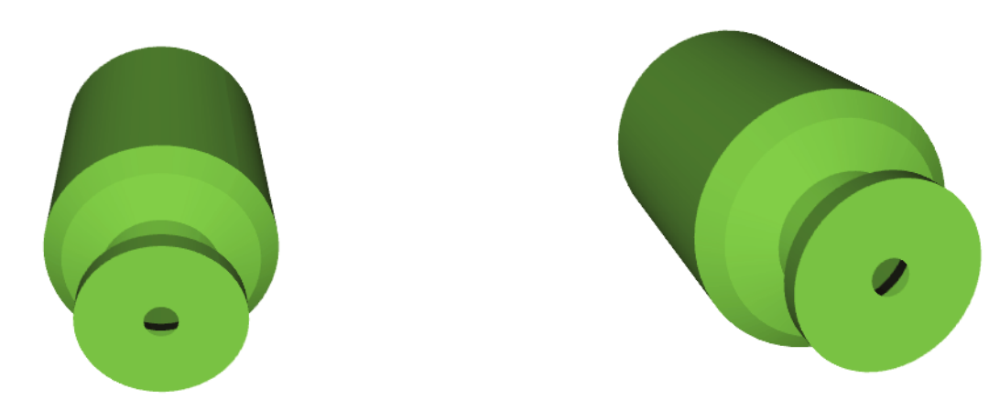

*Figure 4–4 The effects of applying rotation in different order. On the left, first an x rotation followed by a y rotation; on the right, first a y rotation followed by an x rotation.*

The shift to and from the origin is a negative and positive translation of the Origin value, respectively. The net translation is given by the Position value of the vtkProp3D. The most confusing part of these transformations are the rotations. For example, performing an x rotation followed by a y rotation gives very different results than the operations applied in reverse order (see Figure 4–4). For more information about actor transformation, please refer to the Visualization Toolkit text.

In the next section we describe a variety of vtkProp3D's — of which the most widely used class in VTK is called vtkActor. Later on (see Section 4.10) we will examine 2D props (i.e., vtkActor2D) which tend to be used for annotation and other 2D operations.

### Actors

An actor is the most common type of vtkProp3D. Like other concrete subclasses of vtkProp3D, vtkActor serves to group rendering attributes such as surface properties (e.g., ambient, diffuse, and specular color), representation (e.g., surface or wireframe), texture maps, and/or a geometric definition (a mapper).

**Defining Geometry.** As we have seen in previous examples, the geometry of an actor is specified with the SetMapper() method:

```python
mapper = vtkPolyDataMapper()
mapper.SetInputConnection(a_filter.GetOutputPort())

an_actor = vtkActor()
an_actor.SetMapper(mapper)
```
In this case mapper is of type vtkPolyDataMapper, which renders geometry using analytic primitives such as points, lines, polygons, and triangle strips. The mapper terminates the visualization pipeline and serves as the bridge between the visualization subsystem and the graphics subsystem.

**Actor Properties.** Actors refer to an instance of vtkProperty, which in turn controls the appearance of the actor. Probably the most used property is actor color, which we will describe in the next section. Other important features of the property are its representation (points, wireframe, or surface), its shading method (either flat or Gouraud shaded), the actor's opacity (relative transparency), and the ambient, diffuse, and specular color and related coefficients. The following script shows how to set some of these instance variables.

```python
an_actor = vtkActor()
an_actor.SetMapper(mapper)
an_actor.GetProperty().SetOpacity(0.25)
an_actor.GetProperty().SetAmbient(0.5)
an_actor.GetProperty().SetDiffuse(0.6)
an_actor.GetProperty().SetSpecular(1.0)
an_actor.GetProperty().SetSpecularPower(10.0)
```
Notice how we dereference the actor's property via the GetProperty() method. Alternatively, we can create a property and assign it to the actor.

```python
from vtkmodules.vtkRenderingCore import vtkProperty

prop = vtkProperty()
prop.SetOpacity(0.25)
prop.SetAmbient(0.5)
prop.SetDiffuse(0.6)
prop.SetSpecular(1.0)
prop.SetSpecularPower(10.0)

an_actor = vtkActor()
an_actor.SetMapper(mapper)
an_actor.SetProperty(prop)
```
The advantage of the latter method is that we can control the properties of several actors by assigning each the same property.

**Actor Color.** Color is perhaps the most important property applied to an actor. The simplest procedure for controlling this property is the SetColor() method, used to set the red, green, and blue (RGB) values of the actor. Each value ranges from zero to one.

```python
an_actor.GetProperty().SetColor(0.1, 0.2, 0.4)
```
Alternatively, you can set the ambient, diffuse, and specular colors separately.

```python
an_actor = vtkActor()
an_actor.SetMapper(mapper)
an_actor.GetProperty().SetAmbientColor(0.1, 0.1, 0.1)
an_actor.GetProperty().SetDiffuseColor(0.1, 0.2, 0.4)
an_actor.GetProperty().SetSpecularColor(1, 1, 1)
```
In this example we've set the ambient color to a dark gray, the diffuse color to a shade of blue, and the specular color to white. (Note: The SetColor() method sets the ambient, diffuse, and specular colors to the color specified.)

**Important:** The color set in the actor's property only takes effect if there is no scalar data available to the actor's mapper. By default, the mapper's input scalar data colors the actor, and the actor's color is ignored. To ignore the scalar data, use the method ScalarVisibilityOff() as shown in the script below.

```python
plane_mapper = vtkPolyDataMapper()
plane_mapper.SetInputConnection(comp_plane.GetOutputPort())
plane_mapper.ScalarVisibilityOff()

plane_actor = vtkActor()
plane_actor.SetMapper(plane_mapper)
plane_actor.GetProperty().SetRepresentationToWireframe()
plane_actor.GetProperty().SetColor(0, 0, 0)
```
**Actor Transparency.** Many times it is useful to adjust transparency (or opacity) of an actor. For example, if you wish to show internal organs surrounded by the skin of a patient, adjusting the transparency of the skin allows the user to see the organs in relation to the skin. Use the `vtkProperty::SetOpacity()` method as follows.
```python
pop_actor = vtkActor()
pop_actor.SetMapper(pop_mapper)
pop_actor.GetProperty().SetOpacity(0.3)
pop_actor.GetProperty().SetColor(0.9, 0.9, 0.9)
```
Please note that transparency is implemented in the rendering library using an alpha-blending process. This process requires that polygons are rendered in the correct order. In practice, this is very difficult to achieve, especially if you have multiple transparent actors. To order polygons, you should add transparent actors to the end of renderer's list of actors (i.e., add them last). Also, you can use the filter vtkDepthSortPolyData to sort polygons along the view vector. For more information on this topic see Section 4.16.

**Miscellaneous Features.** Actors have several other important features. You can control whether an actor is visible with the VisibilityOn() and VisibilityOff() methods. If you don't want to pick an actor during a picking operation, use the PickableOff() method. (See Section 4.9 for more information about picking.) Actors also have a pick event that can be invoked when they are picked. Additionally you can get the axis-aligned bounding box of actor with the GetBounds() method.

### Level-Of-Detail Actors
One major problem with graphics systems is that they often become too slow for interactive use. To handle this problem, VTK uses level-of-detail actors to achieve acceptable rendering performance at the cost of lower-resolution representations.

In "Reader Source Object" earlier in this section we saw how to use a vtkLODActor. Basically, the simplest way to use vtkLODActor is to replace instances of vtkActor with instances of vtkLODActor. In addition, you can control the representation of the levels of detail. The default behavior of vtkLODActor is to create two additional, lower-resolution models from the original mapper. The first is a point cloud, sampled from the points defining the mapper's input. You can control the number of points in the cloud as follows. (The default is 150 points.)

```python
from vtkmodules.vtkRenderingLOD import vtkLODActor

dot_actor = vtkLODActor()
dot_actor.SetMapper(dot_mapper)
dot_actor.SetNumberOfCloudPoints(1000)
```
The lowest resolution model is a bounding box of the actor. Additional levels of detail can be added using the AddLODMapper() method. They do not have to be added in order of complexity.

To control the level-of-detail selected by the actor during rendering, you can set the desired frame rate in the rendering window:

```python
render_window = vtkRenderWindow()
render_window.SetDesiredUpdateRate(5.0)
```
which translates into five frames per second. The vtkLODActor will automatically select the appropriate level-of-detail to yield the requested rate. (Note: The interactor widgets such as vtkRenderWindowInteractor automatically control the desired update rate. They typically set the frame rate very low when a mouse button is released, and increase the rate when a mouse button is pressed. This gives the pleasing effect of low-resolution/high frame rate models with camera motion, and high-resolution/low frame rate when the camera stops. If you would like more control over the levels-of-detail, see "vtkLODProp3D" below. vtkLODProp3D allows you to specifically set each level.)

### Assemblies

Actors are often grouped in hierarchical assemblies so that the motion of one actor affects the position of other actors. For example, a robot arm might consist of an upper arm, forearm, wrist, and end effector, all connected via joints. When the upper arm rotates around the shoulder joint, we expect the rest of the arm to move with it. This behavior is implemented using assemblies, which are a type of (subclass of) vtkActor. The following script shows how it's done.

```python
from vtkmodules.vtkFiltersSources import (
    vtkSphereSource,
    vtkCubeSource,
    vtkConeSource,
    vtkCylinderSource,
)
from vtkmodules.vtkRenderingCore import (
    vtkActor,
    vtkAssembly,
    vtkPolyDataMapper,
)

# Create four parts: a top level assembly and three primitives
sphere = vtkSphereSource()
sphere_mapper = vtkPolyDataMapper()
sphere_mapper.SetInputConnection(sphere.GetOutputPort())
sphere_actor = vtkActor()
sphere_actor.SetMapper(sphere_mapper)
sphere_actor.SetOrigin(2, 1, 3)
sphere_actor.RotateY(6)
sphere_actor.SetPosition(2.25, 0, 0)
sphere_actor.GetProperty().SetColor(1, 0, 1)

cube = vtkCubeSource()
cube_mapper = vtkPolyDataMapper()
cube_mapper.SetInputConnection(cube.GetOutputPort())
cube_actor = vtkActor()
cube_actor.SetMapper(cube_mapper)
cube_actor.SetPosition(0.0, 0.25, 0)
cube_actor.GetProperty().SetColor(0, 0, 1)

cone = vtkConeSource()
cone_mapper = vtkPolyDataMapper()
cone_mapper.SetInputConnection(cone.GetOutputPort())
cone_actor = vtkActor()
cone_actor.SetMapper(cone_mapper)
cone_actor.SetPosition(0, 0, 0.25)
cone_actor.GetProperty().SetColor(0, 1, 0)

cylinder = vtkCylinderSource()
cylinder_mapper = vtkPolyDataMapper()
cylinder_mapper.SetInputConnection(cylinder.GetOutputPort())
cylinder_actor = vtkActor()
cylinder_actor.SetMapper(cylinder_mapper)
cylinder_actor.GetProperty().SetColor(1, 0, 0)

assembly = vtkAssembly()
assembly.AddPart(cylinder_actor)
assembly.AddPart(sphere_actor)
assembly.AddPart(cube_actor)
assembly.AddPart(cone_actor)
assembly.SetOrigin(5, 10, 15)
assembly.AddPosition(5, 0, 0)
assembly.RotateX(15)

# Add the actors to the renderer
renderer.AddActor(assembly)
renderer.AddActor(cone_actor)
```
Notice how we use vtkAssembly's AddPart() method to build the hierarchies. Assemblies can be nested arbitrarily deeply as long as there are not any self-referencing cycles. Note that vtkAssembly is a subclass of vtkProp3D, so it has no notion of properties or of an associated mapper. Therefore, the leaf nodes of the vtkAssembly hierarchy must carry information about material properties (color, etc.) and any associated geometry. Actors may also be used by more than one assembly (notice how cone_actor is used in the assembly and as an actor). Also, the renderer's AddActor() method is used to associate the top level of the assembly with the renderer; those actors at lower levels in the assembly hierarchy do not need to be added to the renderer since they are recursively rendered.

You may be wondering how to distinguish the use of an actor relative to its context if an actor is used in more than one assembly, or is mixed with an assembly as in the example above. (This is particularly important in activities like picking, where the user may need to know which vtkProp was picked as well as the context in which it was picked.) We address this issue along with the introduction of the class vtkAssemblyPath, which is an ordered list of vtkProps with associated transformation matrices (if any), in detail in Section 4.9.

### Volumes

The class vtkVolume is used for volume rendering. It is analogous to the class vtkActor. Like vtkActor, vtkVolume inherits methods from vtkProp3D to position and orient the volume. vtkVolume has an associated property object, in this case a vtkVolumeProperty. Please see Chapter 7 for a thorough description of the use of vtkVolume and a description of volume rendering.

### vtkLODProp3D
The vtkLODProp3D class is similar to vtkLODActor (see "Level-Of-Detail Actors" above) in that it uses different representations of itself in order to achieve interactive frame rates. Unlike vtkLODActor, vtkLODProp3D supports both volume rendering and surface rendering. This means that you can use vtkLODProp3D in volume rendering applications to achieve interactive frame rates. The following example shows how to use the class.

```python
from vtkmodules.vtkRenderingCore import vtkLODProp3D

lod = vtkLODProp3D()
level1 = lod.AddLOD(volume_mapper, volume_property2, 0.0)
level2 = lod.AddLOD(volume_mapper, volume_property, 0.0)
level3 = lod.AddLOD(probe_mapper_hres, probe_property, 0.0)
level4 = lod.AddLOD(probe_mapper_lres, probe_property, 0.0)
level5 = lod.AddLOD(outline_mapper, outline_property, 0.0)
```
Basically, you create different mappers each corresponding to a different rendering complexity, and add the mappers to the vtkLODProp3D. The AddLOD() method accepts either volume or geometric mappers and optionally a texture map and/or property object. (There are different signatures for this method depending on what information you wish to provide.) The last value in the field is an estimated time to render. Typically you set it to zero to indicate that there is no initial estimate. The method returns an integer id that can be used to access the appropriate LOD (i.e., to select a level or delete it).

vtkLODProp3D measures the time it takes to render each LOD and sorts them appropriately. Then, depending on the render window's desired update rate, vtkLODProp3D selects the appropriate level to render. See Chapter 7 for more information.

## 4.8 Using Texture

Texture mapping is a powerful graphics tool for creating realistic and compelling visualizations. The basic idea behind 2D texture mapping is that images can be "pasted" onto a surface during the rendering process, thereby creating richer and more detailed images. Texture mapping requires three pieces of information: a surface to apply the texture to; a texture map, which in VTK is a vtkImageData dataset (i.e., a 2D image); and texture coordinates, which control the positioning of the texture on the surface.

The following example (Figure 4–5) demonstrates the use of texture mapping. Notice that the texture map (of class vtkTexture) is associated with the actor, and the texture coordinates come from the plane (the texture coordinates are generated by vtkPlaneSource when the plane is created).

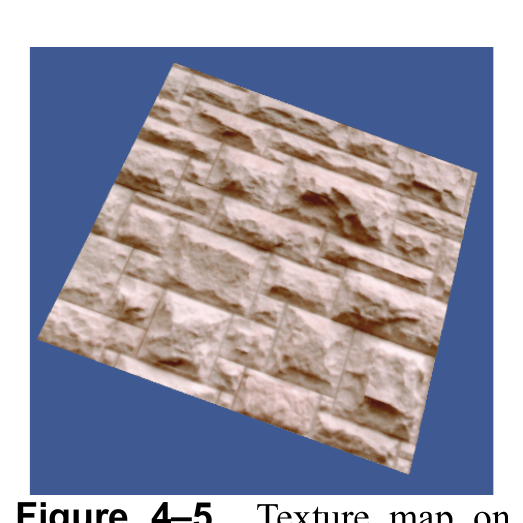

*Figure 4–5 Texture map on a plane.*

```python
from vtkmodules.vtkIOImage import vtkBMPReader
from vtkmodules.vtkRenderingCore import vtkTexture, vtkPolyDataMapper, vtkActor
from vtkmodules.vtkFiltersSources import vtkPlaneSource

# Load the texture map
bmp_reader = vtkBMPReader()
bmp_reader.SetFileName("masonry.bmp")

a_texture = vtkTexture()
a_texture.SetInputConnection(bmp_reader.GetOutputPort())
a_texture.InterpolateOn()

# Create a plane source and actor
plane = vtkPlaneSource()
plane_mapper = vtkPolyDataMapper()
plane_mapper.SetInputConnection(plane.GetOutputPort())

plane_actor = vtkActor()
plane_actor.SetMapper(plane_mapper)
plane_actor.SetTexture(a_texture)
```

Often times texture coordinates are not available, usually because they are not generated in the pipeline. If you need to generate texture coordinates, refer to Chapter 5. Although some older graphics cards have limitations on the dimensions of textures (e.g. they must be a power of two and less than 1024 on a side), VTK allows arbitrarily sized textures. At run time, VTK will query the graphics system to determine its capabilities, and will automatically resample your texture to meet the card's requirements.

## 4.9 Picking

Picking is a common visualization task. Picking is used to select data and actors or to query underlying data values. A pick is made when a display position (i.e., pixel coordinate) is selected and used to invoke vtkAbstractPicker's Pick() method. Depending on the type of picking class, the information returned from the pick may be as simple as an x-y-z global coordinate, or it may include cell ids, point ids, cell parametric coordinates, the instance of vtkProp that was picked, and/or assembly paths. The syntax of the pick method is as follows.

```
Pick(selectionX, selectionY, selectionZ, Renderer)
```
Notice that the pick method requires a renderer. The actors associated with the renderer are the candidates for pick selection. Also, selectionZ is typically set to 0.0 — it relates to depth in the z-buffer. (In typical usage, this method is not invoked directly. Rather the user interacts with the class vtkRenderWindowInteractor which manages the pick. In this case, the user would control the picking process by assigning an instance of a picking class to the vtkRenderWindowInteractor, as we will see in a later example.)

The Visualization Toolkit supports several types of pickers of varying functionality and performance. The class vtkAbstractPicker serves as the base class for all pickers. It defines a minimal API which allows the user to retrieve the pick position (in global coordinates) using the GetPickPosition() method.

Two direct subclasses of vtkAbstractPicker exist. The first, vtkWorldPointPicker, is a fast (usually in hardware) picking class that uses the z-buffer to return the x-y-z global pick position. However, no other information (about the vtkProp that was picked, etc.) is returned. The class vtkAbstractPropPicker is another direct subclass of vtkAbstractPicker. It defines an API for pickers that can pick an instance of vtkProp. There are several convenience methods in this class to allow querying for the return type of a pick.

- GetProp() — Return the instance of vtkProp that was picked. If anything at all was picked, then this method will return a pointer to the instance of vtkProp, otherwise NULL is returned.
- GetProp3D() — If an instance of vtkProp3D was picked, return a pointer to the instance of vtkProp3D.
- GetActor2D() — If an instance of vtkActor2D was picked, return a pointer to the instance of vtkActor2D.
- GetActor() — If an instance of vtkActor was picked, return a pointer to the instance of vtkActor.
- GetVolume() — If an instance of vtkVolume was picked, return a pointer to the instance of vtkVolume.
- GetAssembly() — If an instance of vtkAssembly was picked, return a pointer to the instance of vtkAssembly.
- GetPropAssembly() — If an instance of vtkPropAssembly was picked, return a pointer to the instance of vtkPropAssembly.

A word of caution about these methods. The class (and its subclass) return information about the top level of the assembly path that was picked. So if you have an assembly whose top level is of type vtkAssembly, and whose leaf node is of type vtkActor, the method GetAssembly() will return a pointer to the instance of vtkAssembly, while the GetActor() method will return a NULL pointer (i.e., no vtkActor). If you have a complex scene that includes assemblies, actors, and other types of props, the safest course to take is to use the GetProp() method to determine whether anything at all was picked, and then use GetPath().

There are three direct subclasses of vtkAbstractPropPicker. These are vtkPropPicker, vtkAreaPicker, and vtkPicker. vtkPropPicker uses hardware picking to determine the instance of vtkProp that was picked, as well as the pick position (in global coordinates). vtkPropPicker is generally faster than all other descendants of vtkAbstractPropPicker but it cannot return detailed information about what was picked.

vtkAreaPicker and its hardware picking based descendant vtkRenderedAreaPicker are similarly incapable of determining detailed information, as all three exist for the purpose of identifying entire objects that are shown on screen. The AreaPicker classes differ from all other pickers in that they can determine what lies behind an entire rectangular region of pixels on the screen instead of only what lies behind a single pixel. These classes have an AreaPick(x_min, y_min, x_max, y_max, Renderer) method that can be called in addition to the standard Pick(x,y,z, Renderer) method. If you need detailed information, for example specific cells and points or information about what lies behind an area, review the following picker explanations below.

vtkPicker is a software-based picker that selects vtkProp's based on their bounding box. Its pick method fires a ray from the camera position through the selection point and intersects the bounding box of each prop 3D; of course, more than one prop 3D may be picked. The "closest" prop 3D in terms of its bounding box intersection point along the ray is returned. (The GetProp3Ds() method can be used to get all prop 3D's whose bounding box was intersected.) vtkPicker is fairly fast but cannot generate a single unique pick.

vtkPicker has two subclasses that can be used to retrieve more detailed information about what was picked (e.g., point ids, cell ids, etc.) vtkPointPicker selects a point and returns the point id and coordinates. It operates by firing a ray from the camera position through the selection point, and projecting those points that lie within Tolerance onto the ray. The projected point closest to the camera position is selected, along with its associated actor. (Note: The instance variable Tolerance is expressed as a fraction of the renderer window's diagonal length.) vtkPointPicker is slower than vtkPicker but faster than vtkCellPicker. It cannot always return a unique pick because of the tolerances involved.

vtkCellPicker selects a cell and returns information about the intersection point (cell id, global coordinates, and parametric cell coordinates). It operates by firing a ray and intersecting all cells in each actor's underlying geometry, determining if each intersects this ray, within a certain specified tolerance. The cell closest to the camera position along the specified ray is selected, along with its associated actor. (Note: The instance variable Tolerance is used during intersection calculation, and you may need to experiment with its value to get satisfactory behavior.) vtkCellPicker is the slowest of all the pickers, but provides the most information. It will generate a unique pick within the tolerance specified.

Several events are defined to interact with the pick operation. The picker invokes StartPickEvent prior to executing the pick operation. EndPickEvent is invoked after the pick operation is complete. The picker's PickEvent and the actor's PickEvent are invoked each time an actor is picked. (Note that no PickEvent is invoked when using vtkWorldPointPicker.)

### vtkAssemblyPath
An understanding of the class vtkAssemblyPath is essential if you are to perform picking in a scene with different types of vtkProp's, especially if the scene contains instances of vtkAssembly. vtkAssemblyPath is simply an ordered list of vtkAssemblyNode's, where each node contains a pointer to a vtkProp, as well as an optional vtkMatrix4x4. The order of the list is important: the start of the list represents the root, or top level node in an assembly hierarchy, while the end of the list represents a leaf node in an assembly hierarchy. The ordering of the nodes also affects the associated matrix. Each matrix is a concatenation of the node's vtkProp's matrix with the previous matrix in the list. Thus, for a given vtkAssemblyNode, the associated vtkMatrix4x4 represents the position and orientation of the vtkProp (assuming that the vtkProp is initially untransformed).

### Example
Typically, picking is automatically managed by vtkRenderWindowInteractor (see Section 4.4 for more information about interactors). For example, when pressing the p key, vtkRenderWindowInteractor invokes a pick with its internal instance of vtkPropPicker. You can then ask the vtkRenderWindowInteractor for its picker, and gather the information you need. You can also specify a particular vtkAbstractPicker instance for vtkRenderWindowInteractor to use, as the following script illustrates. The results on a sample data set are shown in Figure 4–6.

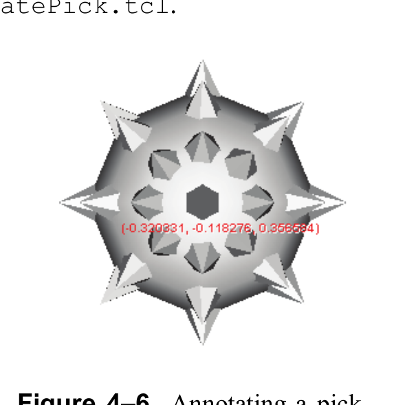

*Figure 4–6 Annotating a pick operation.*

```python
from vtkmodules.vtkRenderingCore import (
    vtkActor2D,
    vtkCellPicker,
    vtkTextMapper,
    vtkRenderWindowInteractor,
)

picker = vtkCellPicker()
text_mapper = vtkTextMapper()
tprop = text_mapper.GetTextProperty()
tprop.SetFontFamilyToArial()
tprop.SetFontSize(10)
tprop.BoldOn()
tprop.ShadowOn()
tprop.SetColor(1, 0, 0)

text_actor = vtkActor2D()
text_actor.VisibilityOff()
text_actor.SetMapper(text_mapper)

def annotate_pick(obj, event):
    if picker.GetCellId() < 0:
        text_actor.VisibilityOff()
    else:
        sel_pt = picker.GetSelectionPoint()
        pick_pos = picker.GetPickPosition()
        text_mapper.SetInput(
            f"({pick_pos[0]:.4f}, {pick_pos[1]:.4f}, {pick_pos[2]:.4f})"
        )
        text_actor.SetPosition(sel_pt[0], sel_pt[1])
        text_actor.VisibilityOn()
    render_window.Render()

picker.AddObserver("EndPickEvent", annotate_pick)

interactor = vtkRenderWindowInteractor()
interactor.SetRenderWindow(render_window)
interactor.SetPicker(picker)
```
This example uses a vtkTextMapper to draw the world coordinate of the pick on the screen. (See Section 4.12 for more information.) Notice that we register the EndPickEvent to perform setup after the pick occurs. The callback is configured to invoke the annotate_pick() function when picking is complete.

## 4.10 vtkCoordinate and Coordinate Systems

The Visualization Toolkit supports several different coordinate systems, and the class vtkCoordinate manages transformations between them. The supported coordinate systems are as follows.

- DISPLAY — x-y pixel values in the (rendering) window. (Note that vtkRenderWindow is a subclass of vtkWindow). The origin is the lower-left corner (which is true for all 2D coordinate systems described below).
- NORMALIZED DISPLAY — x-y (0,1) normalized values in the window.
- VIEWPORT — x-y pixel values in the viewport (or renderer — a subclass of vtkViewport)
- NORMALIZED VIEWPORT — x-y (0,1) normalized values in viewport
- VIEW — x-y-z (-1,1) values in camera coordinates (z is depth)
- WORLD — x-y-z global coordinate value
- USERDEFINED — x-y-z in user-defined space. The user must provide a transformation method for user defined coordinate systems. See vtkCoordinate for more information.

The class vtkCoordinate can be used to transform between coordinate systems and can be linked together to form "relative" or "offset" coordinate values. Refer to the next section for an example of using vtkCoordinate in an application.

## 4.11 Controlling vtkActor2D

vtkActor2D is analogous to vtkActor except that it draws on the overlay plane and does not have a 4x4 transformation matrix associated with it. Like vtkActor, vtkActor2D refers to a mapper (vtkMapper2D) and a property object (vtkProperty2D). The most difficult part when working with vtkActor2D is positioning it. To do that, the class vtkCoordinate is used. (See Section 4.10.) The following script shows how to use the vtkCoordinate object.

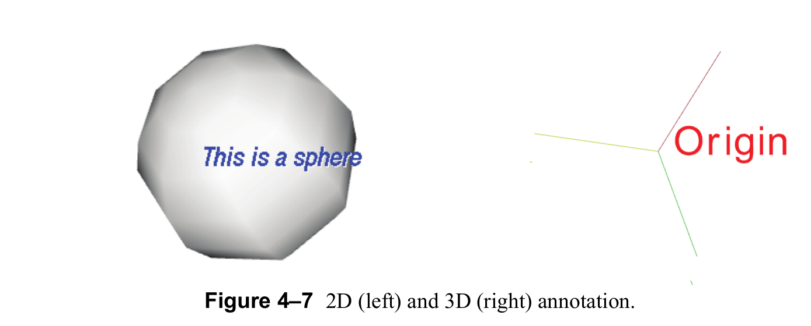

*Figure 4–7 2D (left) and 3D (right) annotation.*

```python
banner_actor = vtkActor2D()
banner_actor.SetMapper(banner)
banner_actor.GetProperty().SetColor(0, 1, 0)
banner_actor.GetPositionCoordinate().SetCoordinateSystemToNormalizedDisplay()
banner_actor.GetPositionCoordinate().SetValue(0.5, 0.5)
```
What's done in this script is to access the coordinate object and define its coordinate system. Then the appropriate value is set for that coordinate system. In this script a normalized display coordinate system is used, so display coordinates range from zero to one, and the values (0.5, 0.5) are set to position the vtkActor2D in the middle of the rendering window. vtkActor2D also provides a convenience method, SetDisplayPosition(), that sets the coordinate system to DISPLAY and uses the input parameters to set the vtkActor2D's position using pixel offsets in the render window. The example in the following section shows how the method is used.

## 4.12 Text Annotation

The Visualization Toolkit offers two ways to annotate images. First, text (and graphics) can be rendered on top of the underlying 3D graphics window (often referred to as rendering in the overlay plane). Second, text can be created as 3D polygonal data and transformed and displayed as any other 3D graphics object. We refer to this as 2D and 3D annotation, respectively. See Figure 4–7 to see the difference.

### 2D Text Annotation

To use 2D text annotation, we employ 2D actors (vtkActor2D and its subclasses such as vtkTextActor) and mappers (vtkMapper2D and subclasses such as vtkTextMapper). 2D actors and mappers are similar to their 3D counterparts except that they render in the overlay plane on top of underlying graphics or images. Here's an example; the results are shown on the left side of Figure 4–7.

```python
from vtkmodules.vtkFiltersSources import vtkSphereSource
from vtkmodules.vtkRenderingCore import (
    vtkActor2D,
    vtkPolyDataMapper,
    vtkRenderer,
    vtkRenderWindow,
    vtkRenderWindowInteractor,
    vtkTextActor,
)
from vtkmodules.vtkRenderingLOD import vtkLODActor

sphere = vtkSphereSource()
sphere_mapper = vtkPolyDataMapper()
sphere_mapper.SetInputConnection(sphere.GetOutputPort())

sphere_actor = vtkLODActor()
sphere_actor.SetMapper(sphere_mapper)

text_actor = vtkTextActor()
text_actor.SetTextScaleModeToProp()
text_actor.SetDisplayPosition(90, 50)
text_actor.SetInput("This is a sphere")

# Specify an initial size
text_actor.GetPosition2Coordinate().SetCoordinateSystemToNormalizedViewport()
text_actor.GetPosition2Coordinate().SetValue(0.6, 0.1)

tprop = text_actor.GetTextProperty()
tprop.SetFontSize(18)
tprop.SetFontFamilyToArial()
tprop.SetJustificationToCentered()
tprop.BoldOn()
tprop.ItalicOn()
tprop.ShadowOn()
tprop.SetColor(0, 0, 1)

# Create the RenderWindow, Renderer and both Actors
renderer = vtkRenderer()
render_window = vtkRenderWindow()
render_window.AddRenderer(renderer)
interactor = vtkRenderWindowInteractor()
interactor.SetRenderWindow(render_window)

# Add the actors to the renderer
renderer.AddViewProp(text_actor)
renderer.AddActor(sphere_actor)
```
Instances of the class vtkTextProperty allow you to control font family (Arial, Courier, or Times), set text color, turn bolding and italics on and off, and apply font shadowing. (Shadowing is used to make the font more readable when placed on top of complex background images.) The position and color of the text is controlled by the associated vtkActor2D. (In this example, the position is set using display or pixel coordinates.) vtkTextProperty also supports justification (vertical and horizontal) and multi-line text. Use the methods SetJustificationToLeft(), SetJustificationToCentered(), and SetJustificationToRight() to control the horizontal justification. Use the methods SetVerticalJustificationToBottom(), SetVerticalJustificationToCentered(), and SetVerticalJustificationToTop() to control vertical justification. By default, text is left-bottom justified. To insert multi-line text, use the `\n` character embedded in the text. The example in Figure 4–8 demonstrates justification and multi-line text.


*Figure 4–8 Justification and use of multi-line text. Use the `\n` character embedded in the text string to generate line breaks. Both vertical and horizontal justification is supported.*

```python
text_mapper_l = vtkTextMapper()
text_mapper_l.SetInput("This is\nmulti-line\ntext output\n(left-top)")
tprop = text_mapper_l.GetTextProperty()
tprop.SetJustificationToLeft()
tprop.SetVerticalJustificationToTop()
tprop.SetColor(1, 0, 0)

text_actor_l = vtkActor2D()
text_actor_l.SetMapper(text_mapper_l)
text_actor_l.GetPositionCoordinate().SetCoordinateSystemToNormalizedDisplay()
text_actor_l.GetPositionCoordinate().SetValue(0.05, 0.5)
```
Note the use of the vtkCoordinate object (obtained by invoking the GetPositionCoordinate() method) to control the position of the actor in the normalized display coordinate system. See Section 4.10 for more information about placing annotation.

### 3D Text Annotation and vtkFollower
3D text annotation is implemented using vtkVectorText to create a polygonal representation of a text string, which is then appropriately positioned in the scene. One useful class for positioning 3D text is vtkFollower. This class is a type of actor that always faces the renderer's active camera, thereby insuring that the text is readable. The following example shows how to do this (Figure 4–7). The example creates axes and labels the origin using an instance of vtkVectorText in combination with a vtkFollower.

```python
from vtkmodules.vtkRenderingFreeType import vtkVectorText
from vtkmodules.vtkRenderingCore import vtkFollower, vtkPolyDataMapper

a_text = vtkVectorText()
a_text.SetText("Origin")

text_mapper = vtkPolyDataMapper()
text_mapper.SetInputConnection(a_text.GetOutputPort())

text_actor = vtkFollower()
text_actor.SetMapper(text_mapper)
text_actor.SetScale(0.2, 0.2, 0.2)
text_actor.AddPosition(0, -0.1, 0)

# ... after rendering ...
text_actor.SetCamera(renderer.GetActiveCamera())
```
As the camera moves around the axes, the follower will orient itself to face the camera. (Try this by mousing in the rendering window to move the camera.)

## 4.13 Special Plotting Classes

The Visualization Toolkit provides several composite classes that perform supplemental plotting operations. These include the ability to plot scalar bars, perform simple x-y plotting, and place flying axes for 3D spatial context.

### Scalar Bar
The class vtkScalarBarActor is used to create a color-coded key that relates color values to numerical data values as shown in Figure 4–9. There are three parts to the scalar bar: a rectangular bar with colored segments, labels, and a title.

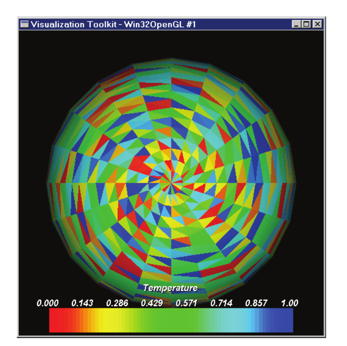

*Figure 4–9 vtkScalarBarActor used to create color legends.*

To use vtkScalarBarActor, you must reference an instance of vtkLookupTable (defines colors and the range of data values), position and orient the scalar bar on the overlay plane, and optionally specify attributes such as color (of the labels and the title), number of labels, and text string for the title. The following example shows typical usage.

```python
from vtkmodules.vtkRenderingAnnotation import vtkScalarBarActor

scalar_bar = vtkScalarBarActor()
scalar_bar.SetLookupTable(mapper.GetLookupTable())
scalar_bar.SetTitle("Temperature")
scalar_bar.GetPositionCoordinate().SetCoordinateSystemToNormalizedViewport()
scalar_bar.GetPositionCoordinate().SetValue(0.1, 0.01)
scalar_bar.SetOrientationToHorizontal()
scalar_bar.SetWidth(0.8)
scalar_bar.SetHeight(0.17)
```
The orientation of the scalar bar is controlled by the methods SetOrientationToVertical() and SetOrientationToHorizontal(). To control the position of the scalar bar (i.e., its lower-left corner), set the position coordinate (in whatever coordinate system you desire — see Section 4.10), and then specify the width and height using normalized viewport values (or alternatively, specify the Position2 instance variable to set the upper-right corner).

### X-Y Plots
The class vtkXYPlotActor generates x-y plots from one or more input datasets, as shown in Figure 4–10. This class is particularly useful for showing the variation of data across a sequence of points such as a line probe or a boundary edge.

To use vtkXYPlotActor, you must specify one or more input datasets, axes, and the plot title, and position the composite actor on the overlay plane. The PositionCoordinate instance variable defines the location of the lower-left corner of the x-y plot (specified in normalized viewport coordinates), and the Position2Coordinate instance variable defines the upper-right corner. (Note: The Position2Coordinate is relative to PositionCoordinate, so you can move the vtkXYPlotActor around the viewport by setting just the PositionCoordinate.) The combination of the two position coordinates specifies a rectangle in which the plot will lie. The following example shows how the class is used.

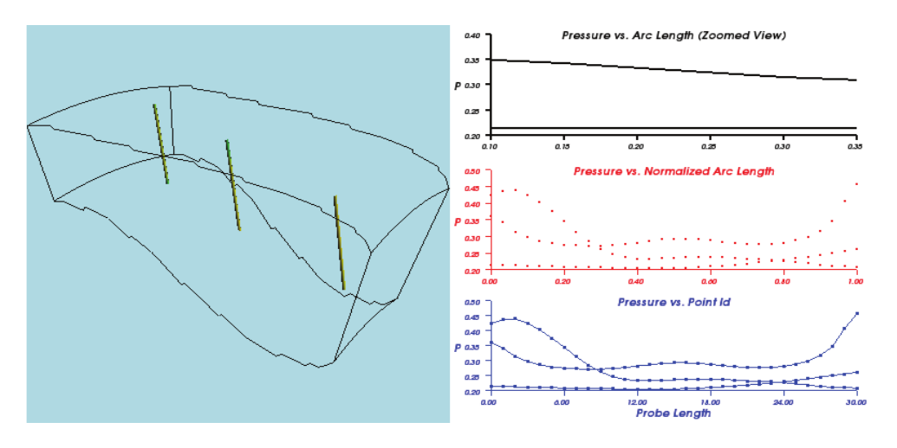

*Figure 4–10 Example of using the vtkXYPlotActor class to display three probe lines using three different techniques.*

```python
from vtkmodules.vtkRenderingAnnotation import vtkXYPlotActor

xyplot = vtkXYPlotActor()
xyplot.AddDataSetInputConnection(probe.GetOutputPort())
xyplot.AddDataSetInputConnection(probe2.GetOutputPort())
xyplot.AddDataSetInputConnection(probe3.GetOutputPort())
xyplot.GetPositionCoordinate().SetValue(0.0, 0.67, 0)
xyplot.GetPosition2Coordinate().SetValue(1.0, 0.33, 0)
xyplot.SetXValuesToArcLength()
xyplot.SetNumberOfXLabels(6)
xyplot.SetTitle("Pressure vs. Arc Length (Zoomed View)")
xyplot.SetXTitle("")
xyplot.SetYTitle("P")
xyplot.SetXRange(0.1, 0.35)
xyplot.SetYRange(0.2, 0.4)
xyplot.GetProperty().SetColor(0, 0, 0)
```
Note the x axis definition. By default, the x coordinate is set as the point index in the input datasets. Alternatively, you can use arc length and normalized arc length of lines used as input to vtkXYPlotActor to generate the x values.

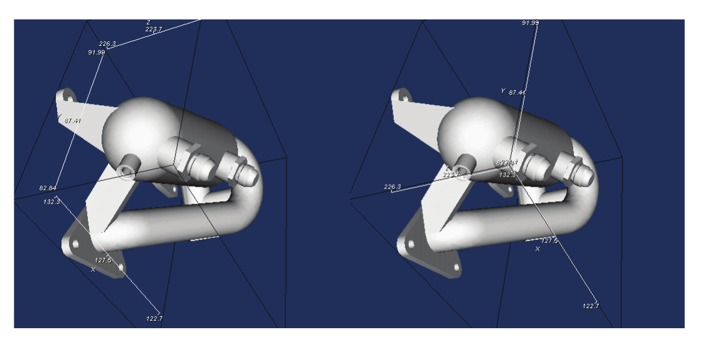

*Figure 4–11 Use of vtkCubeAxesActor2D. On the left, outer edges of the cube are used to draw the axes. On the right, the closest vertex to the camera is used.*

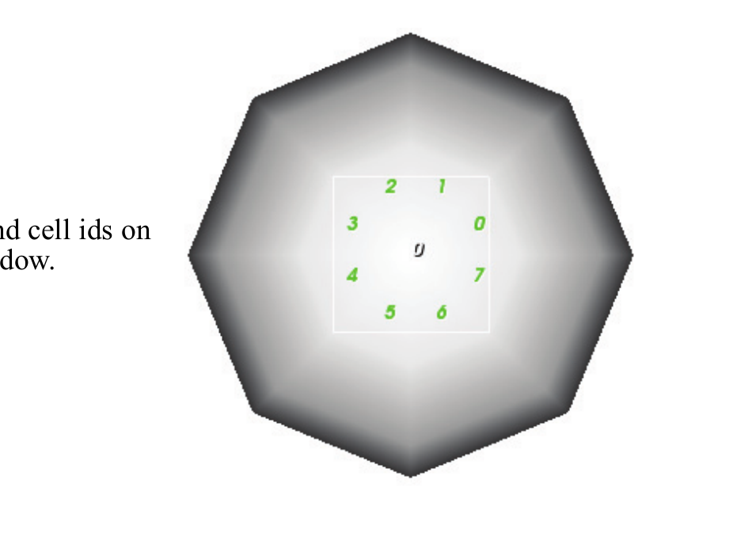

*Figure 4–12 Labelling point and cell ids on a sphere within a rectangular window.*

### Bounding Box Axes (vtkCubeAxesActor2D)

Another composite actor class is vtkCubeAxesActor2D. This class can be used to indicate the position in space that the camera is viewing, as shown in Figure 4–11. The class draws axes around the bounding box of the input dataset labeled with x-y-z coordinate values. As the camera zooms in, the axes are scaled to fit within the camera's viewport, and the label values are updated. The user can control various font attributes as well as the relative font size. (The font size is selected automatically — the method SetFontFactor() can be used to affect the size of the selected font.) The following script demonstrates how to use the class.

```python
from vtkmodules.vtkRenderingCore import vtkTextProperty
from vtkmodules.vtkRenderingAnnotation import vtkCubeAxesActor2D

tprop = vtkTextProperty()
tprop.SetColor(1, 1, 1)
tprop.ShadowOn()

axes = vtkCubeAxesActor2D()
axes.SetInputConnection(normals.GetOutputPort())
axes.SetCamera(renderer.GetActiveCamera())
axes.SetLabelFormat("%6.4g")
axes.SetFlyModeToOuterEdges()
axes.SetFontFactor(0.8)
axes.SetAxisTitleTextProperty(tprop)
axes.SetAxisLabelTextProperty(tprop)
```
Note that there are two ways that the axes can be drawn. By default, the outer edges of the bounding box are used (SetFlyModeToOuterEdges()). You can also place the axes at the vertex closest to the camera position (SetFlyModeToClosestTriad()).

### Labeling Data
In some applications, you may wish to display numerical values from an underlying data set. The class vtkLabeledDataMapper allows you to label the data associated with the points of a dataset. This includes scalars, vectors, tensors, normals, texture coordinates, and field data, as well as the point ids of the dataset. The text labels are placed on the overlay plane of the rendered image as shown in Figure 4–12. The following script uses three new classes, vtkCellCenters (to generate points at the parametric centers of cells), vtkGenerateIds (to generate ids as scalar or field data from dataset ids), and vtkSelectVisiblePoints (to select those points currently visible), to label the cell and point ids of the sphere. In addition, vtkSelectVisiblePoints has the ability to define a "window" in display (pixel) coordinates in which it operates — all points outside of the window are discarded.

```python
from vtkmodules.vtkFiltersSources import vtkSphereSource
from vtkmodules.vtkFiltersCore import vtkGenerateIds, vtkCellCenters
from vtkmodules.vtkRenderingCore import (
    vtkActor,
    vtkActor2D,
    vtkPolyDataMapper,
    vtkRenderer,
    vtkSelectVisiblePoints,
)
from vtkmodules.vtkRenderingLabel import vtkLabeledDataMapper

# Create a sphere
sphere = vtkSphereSource()
sphere_mapper = vtkPolyDataMapper()
sphere_mapper.SetInputConnection(sphere.GetOutputPort())
sphere_actor = vtkActor()
sphere_actor.SetMapper(sphere_mapper)

# Generate ids for labeling
ids = vtkGenerateIds()
ids.SetInputConnection(sphere.GetOutputPort())
ids.PointIdsOn()
ids.CellIdsOn()
ids.FieldDataOn()

renderer = vtkRenderer()

# Create labels for points
vis_pts = vtkSelectVisiblePoints()
vis_pts.SetInputConnection(ids.GetOutputPort())
vis_pts.SetRenderer(renderer)
vis_pts.SelectionWindowOn()
vis_pts.SetSelection(xmin, xmin + x_length, ymin, ymin + y_length)

ldm = vtkLabeledDataMapper()
ldm.SetInputConnection(vis_pts.GetOutputPort())
ldm.SetLabelFormat("{}")
ldm.SetLabelModeToLabelFieldData()

point_labels = vtkActor2D()
point_labels.SetMapper(ldm)

# Create labels for cells
cc = vtkCellCenters()
cc.SetInputConnection(ids.GetOutputPort())

vis_cells = vtkSelectVisiblePoints()
vis_cells.SetInputConnection(cc.GetOutputPort())
vis_cells.SetRenderer(renderer)
vis_cells.SelectionWindowOn()
vis_cells.SetSelection(xmin, xmin + x_length, ymin, ymin + y_length)

cell_mapper = vtkLabeledDataMapper()
cell_mapper.SetInputConnection(vis_cells.GetOutputPort())
cell_mapper.SetLabelFormat("{}")
cell_mapper.SetLabelModeToLabelFieldData()
cell_mapper.GetLabelTextProperty().SetColor(0, 1, 0)

cell_labels = vtkActor2D()
cell_labels.SetMapper(cell_mapper)

# Add the actors to the renderer
renderer.AddActor(sphere_actor)
renderer.AddActor2D(point_labels)
renderer.AddActor2D(cell_labels)
```

## 4.14 Transforming Data

As we saw in Section 4.7, it is possible to position and orient vtkProp3D's in world space. However, in many applications we wish to transform the data prior to using it in the visualization pipeline. For example, to use a plane to cut (see Chapter 5) or clip an object, the plane must be positioned within the pipeline, not via the actor transformation matrix. Some objects (especially procedural source objects) can be created at a specific position and orientation in space. For example, vtkSphereSource has Center and Radius instance variables, and vtkPlaneSource has Origin, Point1, and Point2 instance variables that allow you to position the plane using three points. However, many classes do not provide this capability without moving data into a new position. In this case, you must transform the data using vtkTransformFilter or vtkTransformPolyDataFilter.

vtkTransformFilter is a filter that takes vtkPointSet dataset objects as input. Datasets that are subclasses of the abstract class vtkPointSet represent points explicitly, that is, an instance of vtkPoints is used to store coordinate information. vtkTransformFilter applies a transformation matrix to the points and creates a transformed points array; the rest of the dataset structure (i.e., cell topology) and attribute data (e.g., scalars, vectors, etc.) remains unchanged. vtkTransformPolyDataFilter does the same thing as vtkTransformFilter except that it is more convenient to use in a visualization pipeline containing polygonal data.

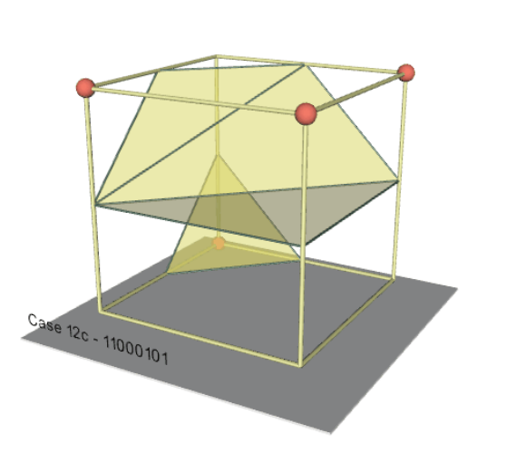

*Figure 4–13 Transforming data within the pipeline.*

The following example (with results shown in Figure 4–13) uses a vtkTransformPolyDataFilter to reposition a 3D text string. (See "3D Text Annotation and vtkFollower" in Section 4.12 for more information about 3D text.)

```python
from vtkmodules.vtkRenderingFreeType import vtkVectorText
from vtkmodules.vtkCommonTransforms import vtkTransform
from vtkmodules.vtkFiltersGeneral import vtkTransformPolyDataFilter
from vtkmodules.vtkRenderingCore import vtkActor, vtkPolyDataMapper

# Define the text for the labels
case_label = vtkVectorText()
case_label.SetText("Case 12c - 11000101")

a_label_transform = vtkTransform()
a_label_transform.Identity()
a_label_transform.Translate(-0.2, 0, 1.25)
a_label_transform.Scale(0.05, 0.05, 0.05)

label_transform = vtkTransformPolyDataFilter()
label_transform.SetTransform(a_label_transform)
label_transform.SetInputConnection(case_label.GetOutputPort())

label_mapper = vtkPolyDataMapper()
label_mapper.SetInputConnection(label_transform.GetOutputPort())

label_actor = vtkActor()
label_actor.SetMapper(label_mapper)
```
Notice that vtkTransformPolyDataFilter requires that you supply it with an instance of vtkTransform. Recall that vtkTransform is used by actors to control their position and orientation in space. Instances of vtkTransform support many methods, some of the most commonly used are shown here.

- RotateX(angle) — apply rotation (angle in degrees) around the x axis
- RotateY(angle) — apply rotation around the y axis
- RotateZ(angle) — apply rotation around the z axis
- RotateWXYZ(angle,x,y,z) — apply rotation around a vector defined by x-y-z components
- Scale(x,y,z) — apply scale in the x, y, and z directions
- Translate(x,y,z) — apply translation
- Inverse() — invert the transformation matrix
- SetMatrix(m) — specify the 4x4 transformation matrix directly
- GetMatrix(m) — get the 4x4 transformation matrix
- PostMultiply() — control the order of multiplication of transformation matrices. If PostMultiply() is invoked, matrix operations are applied on the left hand side of the current matrix.
- PreMultiply() — matrix multiplications are applied on the right hand side of the current transformation matrix

The last two methods described above remind us that the order in which transformations are applied dramatically affects the resulting transformation matrix. (See Section 4.7.) We recommend that you spend some time experimenting with these methods and the order of application to fully understand vtkTransform.

### Advanced Transformation
Advanced users may wish to use VTK's extensive transformation hierarchy. The hierarchy supports a variety of linear and non-linear transformations.

A wonderful feature of the VTK transformation hierarchy is that different types of transformation can be used in a filter to give very different results. For example, the vtkTransformPolyDataFilter accepts any transform of type vtkAbstractTransform (or a subclass). This includes transformation types ranging from the linear, affine vtkTransform (represented by a 4x4 matrix) to the non-linear, warping vtkThinPlateSplineTransform, which is a complex function representing a correlation between a set of source and target landmarks.

### 3D Widgets
Interactor styles (see Section 4.4) are generally used to control the camera and provide simple keypress and mouse-oriented interaction techniques. Interactor styles have no representation in the scene; that is, they cannot be "seen" or interacted with, the user must know what the mouse and key bindings are in order to use them. Certain operations, however, are greatly facilitated by the ability to operate directly on objects in the scene. For example, starting a rake of streamlines along a line is easily performed if the endpoints of the line can be interactively positioned.

3D widgets have been designed to provide this functionality. Like the class vtkInteractorStyle, 3D widgets are subclasses of vtkInteractorObserver. That is, they watch for events invoked by vtkRenderWindowInteractor. (Recall that vtkRenderWindowInteractor translates windowing-system specific events into VTK event invocations.) Unlike vtkInteractorStyle, however, 3D widgets represent themselves in the scene in various ways. Figure 4–14 illustrates some of the many 3D widgets found in VTK.

The following is a list of the most important widgets currently found in VTK and a brief description of their features. Note that some of the concepts mentioned here have not yet been covered in this text. Please refer to Chapter 13 to learn more about a particular concept and the various widgets available in VTK.

- vtkScalarBarWidget — Manage a vtkScalarBar including positioning, scaling, and orienting it. (See "Scalar Bar" in Section 4.13 for more information about scalar bars.)
- vtkPointWidget — Position a point x-y-z location in 3D space. The widget produces a polygonal output. Point widgets are typically used for probing. (See Chapter 5.)
- vtkLineWidget — Place a straight line with a specified subdivision resolution. The widget produces a polygonal output. A common use of the line widget is to probe and plot data (see Section 4.13) or produce streamlines or stream surfaces (see Chapter 5).
- vtkPlaneWidget — Orient and position a finite plane. The plane resolution is variable, and the widget produces an implicit function and a polygonal output. The plane widget is used for probing and seeding streamlines (see Chapter 5).
- vtkImplicitPlaneWidget — Orient and position an unbounded plane. The widget produces an implicit function and a polygonal output. The polygonal output is created by clipping the plane with a bounding box. The implicit plane widget is typically used for probing, cutting, and clipping data (see Chapter 5).
- vtkBoxWidget — Orient and position a bounding box. The widget produces an implicit function and a transformation matrix. The box widget is used to transform vtkProp3D's and subclasses (see Section 4.14) or to cut or clip data (see Chapter 5).
- vtkImagePlaneWidget — Manipulate three orthogonal planes within a 3D volumetric data set. Probing of the planes to obtain data position, pixel value, and window-level is possible. The image plane widget is used to visualize volume data (see Chapter 6).
- vtkSphereWidget — Manipulate a sphere of variable resolution. The widget produces an implicit function and a transformation matrix and enables the control of focal point and position to support such classes as vtkCamera and vtkLight. The sphere widget can be used for controlling lights and cameras (see Sections 4.4 and 4.5), for clipping, and for cutting (see Chapter 5).
- vtkSplineWidget — Manipulate an interpolating 3D spline. The widget produces polygonal data represented by a series of line segments of specified resolution. The widget also directly manages underlying splines for each of the x-y-z coordinate values.

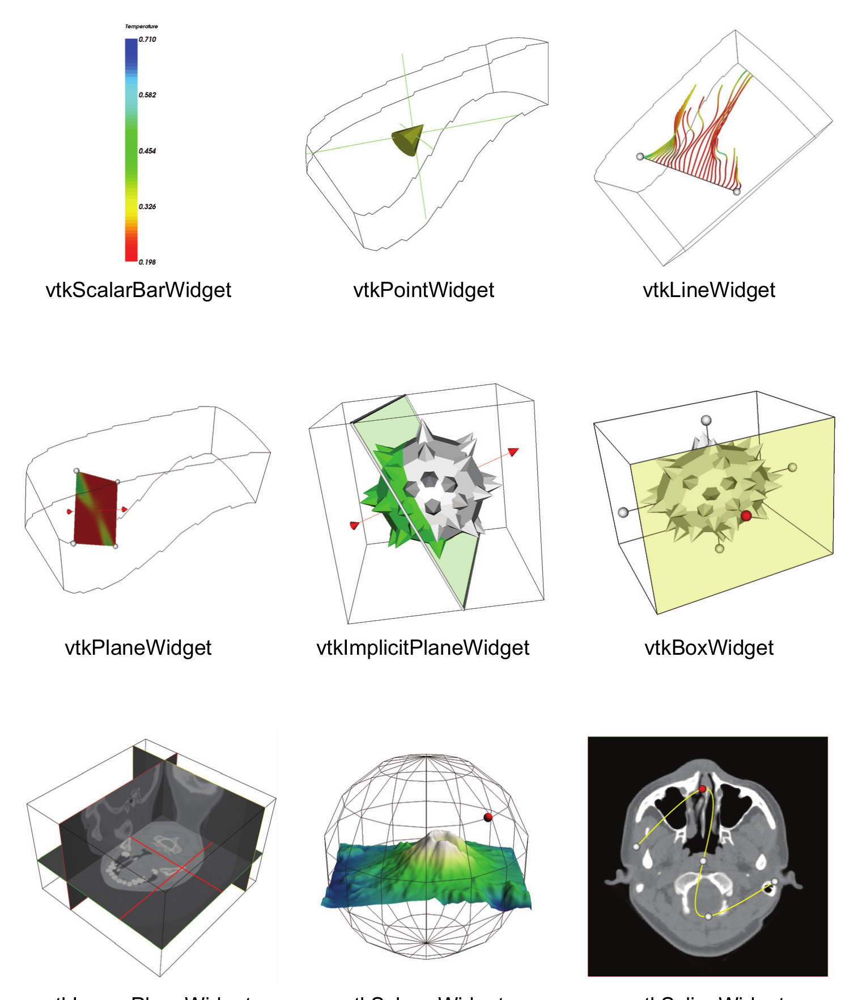

*Figure 4–14 Some of the 3D widgets found in VTK.*

While each widget provides different functionality and offers a different API, 3D widgets are similar in how they are set up and used. The general procedure is as follows.
1. Instantiate the widget.
2. Specify the vtkRenderWindowInteractor to observe. The vtkRenderWindowInteractor invokes events that the widget may process.
3. Create callbacks (i.e., commands) as necessary using the Command/Observer mechanism — see Section 3.2. The widgets invoke the events StartInteractionEvent, InteractionEvent, and EndInteractionEvent.
4. Most widgets require "placing" — positioning in the scene. This typically entails specifying an instance of vtkProp3D, a dataset, or explicitly specifying a bounding box, and then invoking the PlaceWidget() method.
5. Finally, the widget must be enabled. By default, a keypress i will enable the widget and it will appear in the scene.

Note that more than one widget can be enabled at any given time, and the widgets function fine in combination with an instance of vtkInteractorStyle. Thus mousing in the scene not on any particular widget will engage the vtkInteractorStyle, but mousing on a particular widget will engage just that widget — typically no other widget or interactor style will see the events. (One notable exception is the class vtkInteractorEventRecorder that records events and then passes them along. It can also playback events. This is a very useful class for recording sessions and testing.)

The following example demonstrates how to use a 3D widget. The vtkImplicitPlaneWidget will be used to clip an object. (See Chapter 5 for more information on clipping.) In this example the vtkProp3D to be clipped is a mace formed from a sphere and cone glyphs located at the sphere points and oriented in the direction of the sphere normals. (See Chapter 5 for more information about glyphing.) The mace is clipped with a plane that separates it into two parts, one of which is colored green. The vtkImplicitPlaneWidget is used to control the position and orientation of the clip plane by mousing on the widget normal vector, moving the point defining the origin of the plane, or translating the plane by grabbing the widget bounding box.

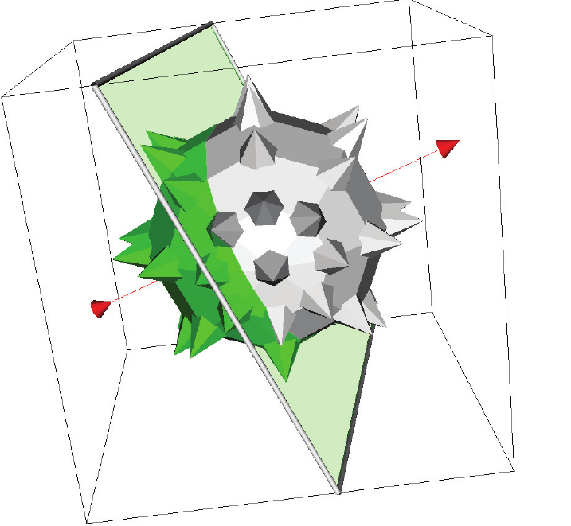

*Figure 4–15 Using the implicit plane widget (vtkImplicitPlaneWidget).*

```python
from vtkmodules.vtkFiltersSources import vtkSphereSource, vtkConeSource
from vtkmodules.vtkFiltersCore import vtkGlyph3D, vtkAppendPolyData, vtkClipPolyData
from vtkmodules.vtkCommonDataModel import vtkPlane
from vtkmodules.vtkRenderingCore import (
    vtkActor,
    vtkPolyDataMapper,
    vtkRenderer,
    vtkRenderWindow,
    vtkRenderWindowInteractor,
)
from vtkmodules.vtkRenderingLOD import vtkLODActor
from vtkmodules.vtkInteractionWidgets import vtkImplicitPlaneWidget

sphere = vtkSphereSource()
cone = vtkConeSource()

glyph = vtkGlyph3D()
glyph.SetInputConnection(sphere.GetOutputPort())
glyph.SetSourceConnection(cone.GetOutputPort())
glyph.SetVectorModeToUseNormal()
glyph.SetScaleModeToScaleByVector()
glyph.SetScaleFactor(0.25)

# The sphere and spikes are appended into a single polydata.
# This makes things simpler to manage.
apd = vtkAppendPolyData()
apd.AddInputConnection(glyph.GetOutputPort())
apd.AddInputConnection(sphere.GetOutputPort())

mace_mapper = vtkPolyDataMapper()
mace_mapper.SetInputConnection(apd.GetOutputPort())

mace_actor = vtkLODActor()
mace_actor.SetMapper(mace_mapper)
mace_actor.VisibilityOn()

# This portion of the code clips the mace with the vtkPlane
# implicit function. The clipped region is colored green.
plane = vtkPlane()

clipper = vtkClipPolyData()
clipper.SetInputConnection(apd.GetOutputPort())
clipper.SetClipFunction(plane)
clipper.InsideOutOn()

select_mapper = vtkPolyDataMapper()
select_mapper.SetInputConnection(clipper.GetOutputPort())

select_actor = vtkLODActor()
select_actor.SetMapper(select_mapper)
select_actor.GetProperty().SetColor(0, 1, 0)
select_actor.VisibilityOff()
select_actor.SetScale(1.01, 1.01, 1.01)

renderer = vtkRenderer()
render_window = vtkRenderWindow()
render_window.AddRenderer(renderer)
interactor = vtkRenderWindowInteractor()
interactor.SetRenderWindow(render_window)

# Associate the plane widget with the interactor
plane_widget = vtkImplicitPlaneWidget()
plane_widget.SetInteractor(interactor)
plane_widget.SetPlaceFactor(1.25)
plane_widget.SetInputConnection(glyph.GetOutputPort())
plane_widget.PlaceWidget()

def my_callback(obj, event):
    obj.GetPlane(plane)
    select_actor.VisibilityOn()

plane_widget.AddObserver("InteractionEvent", my_callback)

renderer.AddActor(mace_actor)
renderer.AddActor(select_actor)

render_window.Render()
interactor.Start()
```
As shown above, the implicit plane widget is instantiated and placed. The placing of the widget is with respect to a dataset. The PlaceFactor adjusts the relative size of the widget. In this example the widget is grown 25% larger than the bounding box of the input dataset. The key to the behavior of the widget is the addition of an observer that responds to the InteractionEvent. StartInteractionEvent and EndInteractionEvent are typically invoked by the widget on mouse down and mouse up respectively; the InteractionEvent is invoked on mouse move. The InteractionEvent is tied to the my_callback function that copies the plane maintained by the widget to an instance of vtkPlane — an implicit function used to do the clipping. (See Chapter 10.)

The 3D widgets are a powerful feature in VTK that can quickly add complex interaction to any application. We encourage you to explore the VTK examples to see the breadth and power of their capabilities.

## 4.15 Antialiasing

There are two ways to enable antialiasing with VTK: per primitive type or through multisampling. Multisampling usually gives more pleasant results.

Both antialiasing methods are controlled with the vtkRenderWindow API. When multisampling is enabled and supported by the graphics card, the per-primitive-type antialiasing flags are ignored. In both cases, the setting has to be done after the creation of a vtkRenderWindow object but before its initialization on the screen.

Note that in general, the antialiasing result differs among actual OpenGL implementations.

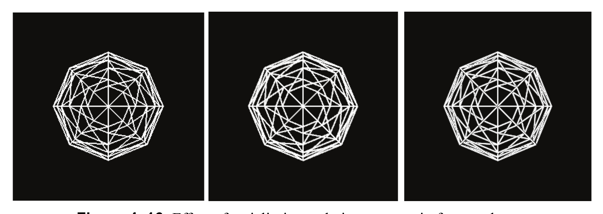

*Figure 4–16 Effect of antialiasing techniques on a wireframe sphere.*

### Per-primitive type antialiasing
Three flags, one for each type of primitive, control antialiasing:
- PointSmoothing,
- LineSmoothing, and
- PolygonSmoothing.

Initially, they are all disabled. Here are the steps in required order to enable antialiasing on point primitives:

```cpp
vtkNew<vtkRenderWindow> renderWindow;
renderWindow->SetMultiSamples(0);
renderWindow->SetPointSmoothing(1);
renderWindow->Render();
```

Here is a complete example to display the vertices of a mesh representing a sphere with point antialiasing:

```cpp
#include <vtkNew.h>
#include <vtkRenderWindowInteractor.h>
#include <vtkRenderWindow.h>
#include <vtkRenderer.h>
#include <vtkSphereSource.h>
#include <vtkPolyDataMapper.h>
#include <vtkActor.h>
#include <vtkProperty.h>

int main()
{
  vtkNew<vtkRenderWindowInteractor> interactor;
  vtkNew<vtkRenderWindow> renderWindow;
  interactor->SetRenderWindow(renderWindow);
  renderWindow->SetMultiSamples(0);     // no multisampling
  renderWindow->SetPointSmoothing(1);   // point antialiasing

  vtkNew<vtkRenderer> renderer;
  renderWindow->AddRenderer(renderer);

  vtkNew<vtkSphereSource> sphere;
  vtkNew<vtkPolyDataMapper> mapper;
  mapper->SetInputConnection(sphere->GetOutputPort());

  vtkNew<vtkActor> actor;
  actor->SetMapper(mapper);

  vtkProperty* prop = actor->GetProperty();
  prop->SetRepresentationToPoints();   // we want to see points
  prop->SetPointSize(2.0);            // big enough to notice antialiasing
  prop->SetLighting(false);           // don't be disturbed by shading

  renderer->AddActor(actor);
  interactor->Start();
  return 0;
}
```
The following lines are specific to point antialiasing:

```cpp
renderWindow->SetPointSmoothing(1);
prop->SetRepresentationToPoints();
prop->SetPointSize(2.0);
```
You can visualize line antialiasing by changing them to:

```cpp
renderWindow->SetLineSmoothing(1);
prop->SetRepresentationToWireframe();
prop->SetLineWidth(2.0);
```
You can visualize polygon antialiasing with simply:

```cpp
renderWindow->SetPolygonSmoothing(1);
prop->SetRepresentationToSurface();
```

### Multisampling
Multisampling gives better results than the previous method. Initially, multisampling is enabled. But it is only effective if the graphics card supports it. To disable multisampling, set the MultiSamples value (initially set to 8) to 0:

```cpp
vtkNew<vtkRenderWindow> renderWindow;
renderWindow->SetMultiSamples(0); // disable multisampling
renderWindow->Render();
```

Going back to the previous example, just remove the line disabling multisampling and you will see the effect of multisampling on points, lines, or polygons.

## 4.16 Translucent polygonal geometry

Rendering the geometry as translucent is a powerful tool for visualization. It allows you to "see through" the data. It can be used also to focus on a region of interest; the region of interest is rendered as opaque and the context is rendered as translucent.

Rendering translucent geometry is not trivial: the final color of a pixel on the screen is the contribution of all the geometry primitives visible through the pixel. The color of the pixel is the result of blending operations between the colors of all visible primitives. Blending operations themselves are usually order-dependent (i.e., not commutative). Therefore, for a correct rendering, depth sorting is required. However, depth sorting has a computational cost.

VTK offers several ways to render translucent polygonal geometry. Each of them is a tradeoff between correctness (quality) and cost (of depth sorting).

**Fast and Incorrect.** Ignore depth sorting entirely. There is then no extra computational cost but the result on the screen is incorrect. However, depending on the application context, the result might be good enough.

**Depth Sorting.** This method consists in using two filters. First, append all the polygonal geometry with vtkAppendPolyData. Then connect the output port of vtkAppendPolyData to the input port of vtkDepthSortPolyData. Depth sorting is performed per centroid of geometry primitives, not per pixel. For this reason it is not correct but it solves most of the ordering issues and gives a result usually good enough.

**Depth Peeling.** Use "depth peeling" for correct per-pixel sorting. Before the first Render, request alpha bits on the vtkRenderWindow:

```cpp
vtkNew<vtkRenderWindow> renderWindow;
renderWindow->SetAlphaBitPlanes(1);

// Make sure multisampling is disabled:
renderWindow->SetMultiSamples(0);
```
On the renderer, enable depth peeling:

```cpp
vtkNew<vtkRenderer> renderer;
renderer->SetUseDepthPeeling(1);
```
Set the depth peeling parameters (the maximum number of rendering passes and the occlusion ratio):

```cpp
renderer->SetMaximumNumberOfPeels(100);
renderer->SetOcclusionRatio(0.1);

// Render the scene:
renderWindow->Render();

// You can check that depth peeling was used:
if (renderer->GetLastRenderingUsedDepthPeeling())
{
  std::cout << "depth peeling was used" << std::endl;
}
```

**Depth Peeling Parameters.** In order to play with the depth peeling parameters, it is necessary to understand the algorithm itself. The algorithm peels the translucent geometry from front to back until there is no more geometry to render. The iteration loop stops either if it reaches the maximum number of iterations set by the user or if the number of pixels modified by the last peel is less than some ratio of the area of the window (this ratio is set by the user; if the ratio is set to 0.0, it means the user wants the exact result. A ratio of 0.2 will render faster than a ratio of 0.1).

Here is a complete example that uses depth peeling:

```cpp
#include <vtkNew.h>
#include <vtkRenderWindowInteractor.h>
#include <vtkRenderWindow.h>
#include <vtkRenderer.h>
#include <vtkActor.h>
#include <vtkImageSinusoidSource.h>
#include <vtkImageData.h>
#include <vtkDataSetSurfaceFilter.h>
#include <vtkPolyDataMapper.h>
#include <vtkLookupTable.h>
#include <vtkCamera.h>

#include <iostream>

int main()
{
  vtkNew<vtkRenderWindowInteractor> interactor;
  vtkNew<vtkRenderWindow> renderWindow;
  renderWindow->SetMultiSamples(0);
  renderWindow->SetAlphaBitPlanes(1);
  interactor->SetRenderWindow(renderWindow);

  vtkNew<vtkRenderer> renderer;
  renderWindow->AddRenderer(renderer);
  renderer->SetUseDepthPeeling(1);
  renderer->SetMaximumNumberOfPeels(200);
  renderer->SetOcclusionRatio(0.1);

  vtkNew<vtkImageSinusoidSource> imageSource;
  imageSource->SetWholeExtent(0, 9, 0, 9, 0, 9);
  imageSource->SetPeriod(5);
  imageSource->Update();

  vtkImageData* image = imageSource->GetOutput();
  double range[2];
  image->GetScalarRange(range);

  vtkNew<vtkDataSetSurfaceFilter> surface;
  surface->SetInputConnection(imageSource->GetOutputPort());

  vtkNew<vtkPolyDataMapper> mapper;
  mapper->SetInputConnection(surface->GetOutputPort());

  vtkNew<vtkLookupTable> lut;
  lut->SetTableRange(range);
  lut->SetAlphaRange(0.5, 0.5);
  lut->SetHueRange(0.2, 0.7);
  lut->SetNumberOfTableValues(256);
  lut->Build();

  mapper->SetScalarVisibility(1);
  mapper->SetLookupTable(lut);

  vtkNew<vtkActor> actor;
  renderer->AddActor(actor);
  actor->SetMapper(mapper);

  renderer->SetBackground(0.1, 0.3, 0.0);
  renderWindow->SetSize(400, 400);
  renderWindow->Render();

  if (renderer->GetLastRenderingUsedDepthPeeling())
  {
    std::cout << "depth peeling was used" << std::endl;
  }
  else
  {
    std::cout << "depth peeling was not used (alpha blending instead)" << std::endl;
  }

  vtkCamera* camera = renderer->GetActiveCamera();
  camera->Azimuth(-40.0);
  camera->Elevation(20.0);
  renderWindow->Render();
  interactor->Start();
  return 0;
}
```

## 4.17 Animation

Animation is an important component of a visualization system. It is possible to create simple animations by writing loops that continuously change some parameter on a filter and render. However such implementations can become complicated when multiple parameter changes are involved.

VTK provides a framework comprising of vtkAnimationCue and vtkAnimationScene to manage animation setup and playback. vtkAnimationCue corresponds to an entity that changes with time (e.g., position of an actor), while vtkAnimationScene represents a scene or a setup for the animation comprising of instances of vtkAnimationCue.

### Animation Scene (vtkAnimationScene)

vtkAnimationScene represents a scene or a setup for the animation. An animation is generated by rendering frames in a sequence while changing some visualization parameter(s) before rendering each frame. Every frame has an animation time associated with it, which can be used to determine the frame's place in the animation. Animation time is simply a counter that continuously increases over the duration of the animation based on the play-mode.

Following are important methods on a vtkAnimationScene:

`SetStartTime()/SetEndTime()` These represent the start and end times of the animation scene. This is the range that the animation time covers during playback.

`SetPlayMode()` This is used to control the playback mode i.e. how the animation time is changed. There are two modes available:

`Sequence Mode (PLAYMODE_SEQUENCE)` In this mode, the animation time is increased by (1/frame-rate) for every frame until the EndTime is reached. Hence the number of frames rendered in a single run is fixed irrespective of how long each frame takes to render.

`RealTime Mode (PLAYMODE_REALTIME)` In this mode, the animation runs for approximately (EndTime-StartTime) seconds, where the animation time at the nth frame is given by (animation time at (n-1)th frame + time to render (n-1)th frame). Thus the number of frames rendered changes depending on how long each frame takes to render.

`SetFrameRate()` Frame rate is the number of frames per unit time. This is used only in sequence play mode.

`AddCue(), RemoveCue(), RemoveAllCues()` Methods to add/remove animation cues from the scene.

`SetAnimationTime()` Can be used to explicitly advance to a particular frame.

`GetAnimationTime()` Can be called during playback to query the animation clock time.

`Play()` Starts playing the animation.

`SetLoop()` When set to True, Play() results in playing the animation in a loop.

### Animation Cue (vtkAnimationCue)

vtkAnimationCue corresponds to an entity that changes in an animation. vtkAnimationCue does not know how to bring about the changes to the parameters. So the user has to either subclass vtkAnimationCue or use event observers to perform the changes as the animation progresses.

A cue has a start-time and an end-time in an animation scene. During playback, a cue is active when the scene's animation time is within the range specified by the start and end times for the cue. When the cue is activated, it fires the vtkCommand::StartAnimationCueEvent. For every subsequent frame, it fires the vtkCommand::AnimationCueTickEvent until the end-time is reached when the vtkCommand::EndAnimationCueEvent is fired. Following are the important methods of vtkAnimationCue:

`SetTimeMode()` TimeMode defines how the start and end times are specified. There are two modes available.

`Relative (TIMEMODE_RELATIVE)` In this mode the animation cue times are specified relative to the start of the animation scene.

`Normalized (TIMEMODE_NORMALIZED)` In this mode, the cue start and end times are always in the range [0, 1] where 0 corresponds to the start and 1 corresponds to the end of the animation scene.

`SetStartTime()/SetEndTime()` These are used to indicate the range of animation time when this cue is active. When the TimeMode is TIMEMODE_RELATIVE, these are specified in the same unit as the animation scene start and end times and are relative to the start of the animation scene. If TimeMode is TIMEMODE_NORMALIZED, these are in the range [0, 1] where 0 corresponds to the start of the animation scene while 1 corresponds to the end of the animation scene.

`GetAnimationTime()` This is provided for the event handler for vtkCommand::AnimationCueTickEvent. It can be used by the handler to determine how far along in the animation the current frame is. Its value depends on the TimeMode. If TimeMode is Relative, then the value will be the number of time units since the cue was activated. If TimeMode is Normalized then it will be a value in the range [0, 1] where 0 is the start of the cue, while 1 is the end of the cue.

`GetClockTime()` This is same as the animation clock time returned by vtkAnimationScene::GetAnimationTime(). It is valid only in the event handler for vtkCommand::AnimationCueTickEvent.

`GetDeltaTime()` This can be used to obtain the change in animation clock time from when the previous frame was rendered, if any. Again, this is valid only in the event handler for vtkCommand::AnimationCueTickEvent.

`TickInternal(currenttime, deltatime, clocktime)` As mentioned earlier, one can subclass vtkAnimationCue, instead of writing event handlers to do the animation, in which case you can override this method. The arguments correspond to the values returned by GetAnimationTime(), GetDeltaTime() and GetClockTime() respectively.

`StartCueInternal(), EndCueInternal()` These methods can be overridden in subclasses to do setup and cleanup at start and end of the cue during playback. Alternatively, one can add event observers for the vtkCommand::StartAnimationCueEvent and vtkCommand::EndAnimationCueEvent to do the same.

In the following example, we create a simple animation where the StartTheta of a vtkSphereSource is varied over the length of the animation. We use normalized time mode for the animation cue in this example, so that we can change the scene times or the cue times and the code to change the StartTheta value can still remain unchanged.

```cpp
#include <vtkNew.h>
#include <vtkAnimationCue.h>
#include <vtkAnimationScene.h>
#include <vtkRenderer.h>
#include <vtkRenderWindow.h>
#include <vtkSphereSource.h>
#include <vtkPolyDataMapper.h>
#include <vtkActor.h>

class vtkCustomAnimationCue : public vtkAnimationCue
{
public:
  static vtkCustomAnimationCue* New();
  vtkTypeMacro(vtkCustomAnimationCue, vtkAnimationCue);

  vtkRenderWindow* RenWin = nullptr;
  vtkSphereSource* Sphere = nullptr;

protected:
  // Overridden to adjust the sphere's StartTheta depending on
  // the animation time. We want to change the StartTheta from
  // 0 to 180 over the length of the cue.
  void TickInternal(
    double currenttime, double deltatime, double clocktime) override
  {
    double new_st = currenttime * 180;
    // Since the cue is in normalized mode, currenttime will be in the
    // range [0,1], where 0 is start of the cue and 1 is end of the cue.
    this->Sphere->SetStartTheta(new_st);
    this->RenWin->Render();
  }
};

vtkStandardNewMacro(vtkCustomAnimationCue);

int main(int argc, char* argv[])
{
  // Create the graphics structure.
  vtkNew<vtkRenderer> renderer;
  vtkNew<vtkRenderWindow> renderWindow;
  renderWindow->SetMultiSamples(0);
  renderWindow->AddRenderer(renderer);

  vtkNew<vtkSphereSource> sphere;
  vtkNew<vtkPolyDataMapper> mapper;
  mapper->SetInputConnection(sphere->GetOutputPort());

  vtkNew<vtkActor> actor;
  actor->SetMapper(mapper);
  renderer->AddActor(actor);
  renderer->ResetCamera();
  renderWindow->Render();

  // Create an Animation Scene
  vtkNew<vtkAnimationScene> scene;
  scene->SetModeToSequence();
  scene->SetFrameRate(30);
  scene->SetStartTime(0);
  scene->SetEndTime(60);

  // Create an Animation Cue
  vtkNew<vtkCustomAnimationCue> cue;
  cue->Sphere = sphere;
  cue->RenWin = renderWindow;
  cue->SetTimeModeToNormalized();
  cue->SetStartTime(0);
  cue->SetEndTime(1.0);
  scene->AddCue(cue);

  scene->Play();
  scene->Stop();

  return 0;
}
```
