# Chapter 5: Visualization Techniques

Some basic tools to render and interact with data were presented in the previous chapter. In this chapter we'll show you a variety of visualization techniques. These techniques (implemented as filters) are organized according to the type of data they operate on. Some filters are general and can be applied to any type of data—those filters that accept input of class vtkDataSet (or any subclass). Many filters are more specialized to the type of input they accept (e.g., vtkPolyData). There is one class of filters—those that accept input of type vtkImageData (or its obsolete subclass vtkStructuredPoints)—that are not addressed in this chapter. Instead, filters of this type are described in the next chapter (Chapter 6, "Image Processing and Visualization").

Please keep two things to keep in mind while you read this chapter. First, filters generate a variety of output types, and the output type is not necessarily the same as the input type. Second, filters are used in combination to create complex data processing pipelines. Often there are patterns of usage, or common combinations of filters, that are used. In the following examples you may wish to note these combinations.

## 5.1 Visualizing vtkDataSet (and Subclasses)

In this section, we'll show you how to perform some common visualization operations on data objects of type vtkDataSet. Recall that vtkDataSet is the superclass for all concrete types of visualization data (see Figure 3–2). Therefore, the methods described here are applicable to all of the various data types. (In other words, all filters taking vtkDataSet as input will also accept vtkPolyData, vtkImageData, vtkStructuredGrid, vtkRectilinearGrid, and vtkUnstructuredGrid.)

### Working With Data Attributes

Data attributes are information associated with the structure of the dataset (as described in Section 3.3, "The Visualization Pipeline"). In VTK, attribute data is associated with points (point attribute data) and cells (cell attribute data). Attribute data, along with the dataset structure, are processed by the many VTK filters to generate new structures and attributes. A general introduction to attribute data is beyond the scope of this section, but a simple example will demonstrate the basic ideas.

Data attributes are simply vtkDataArrays which may be labeled as being one of scalars, vectors, tensors, normals, texture coordinates, global ids (for identifying redundant elements), or pedigree ids (for tracing element history up the pipeline). The points and the cells of a vtkDataSet may have their own independent data attributes. The data attributes may be associated with the points or cells of a vtkDataSet. Every vtkDataArray associated with a vtkDataSet is a concrete subclass of vtkDataArray, such as vtkFloatArray or vtkIntArray. These data arrays can be thought of as contiguous, linear blocks of memory of the named native type. Within this linear block, the data array is thought to consist of subarrays or "tuples." Creating attribute data means instantiating a data array of desired type, specifying the tuple size, inserting data, and associating it with a dataset, as shown in the following Python script. The association may have the side effect of labeling the data as scalars, vectors, tensors, texture coordinates, or normals. For example:

```python
from vtkmodules.vtkCommonCore import vtkFloatArray, vtkDoubleArray, vtkIntArray
from vtkmodules.vtkCommonDataModel import vtkPolyData

scalars = vtkFloatArray()
scalars.InsertTuple1(0, 1.0)
scalars.InsertTuple1(1, 1.2)
# ...etc...

vectors = vtkDoubleArray()
vectors.SetNumberOfComponents(3)
vectors.InsertTuple3(0, 0.0, 0.0, 1.0)
vectors.InsertTuple3(1, 1.2, 0.3, 1.1)
# ...etc...

just_an_array = vtkIntArray()
just_an_array.SetNumberOfComponents(2)
just_an_array.SetNumberOfTuples(number_of_points)
just_an_array.SetName("Solution Attributes")
just_an_array.SetTuple2(0, 1, 2)
just_an_array.SetTuple2(1, 3, 4)
# ...etc...

poly_data = vtkPolyData()  # A concrete type of vtkDataSet
poly_data.GetPointData().SetScalars(scalars)
poly_data.GetCellData().SetVectors(vectors)
poly_data.GetPointData().AddArray(just_an_array)
```
Here we create three arrays of types float, double, and int. The first array (scalars) is instantiated and by default has a tuple size of one.
The method InsertTuple1() is used to place data into the array (all methods named Insert___() allocate memory as necessary to hold data). The next data array (vectors) is created with a tuple size of three, because vectors are defined as having three components, and InsertTuple3 is used to add data to the array. Finally, we create a general array of tuple size two, and allocate memory using SetNumberOfTuples(). We then use SetTuple2() to add data; this method assumes that memory has been allocated and is therefore faster than the similar Insert__() methods. Notice that the labelling of what is a scalar, vector, etc. occurs when we associate the data arrays with the point data or cell data of the dataset (using the methods SetScalars() and SetVectors()).

Please remember that the number of point attributes (e.g., number of scalars in this example) must equal the number of points in the dataset, and the number of cell attributes (e.g., number of vectors) must match the number of cells in the dataset. Similarly, to access attribute data, use these methods

```python
scalars = poly_data.GetPointData().GetScalars()
vectors = poly_data.GetCellData().GetVectors()
```

You'll find that many of the filters work with attribute data specifically. For example, vtkElevationFilter generates scalar values based on their elevation in a specified direction. Other filters work with the structure of the dataset, and generally ignore or pass the attribute data through the filter (e.g., vtkDecimatePro). And finally, some filters work with (portions of) the attribute data and the structure to generate their output. vtkMarchingCubes is one example. It uses the input scalars in combination with the dataset structure to generate contour primitives (i.e., triangles, lines or points). Other types of attribute data, such as vectors, are interpolated during the contouring process and sent to the output of the filter.

Another important issue regarding attribute data is that some filters will process only one type of attribute (point data versus cell data), ignoring or passing to their output the other attribute data type. You may find that your input data is of one attribute type and you want to process it with a filter that will not handle that type, or you simply want to convert from one attribute type to another. There are two filters that can help you with this: vtkPointDataToCellData and vtkCellDataToPointData, which convert to and from point and cell data attributes. Here's an example of their use (see `examples/point_to_cell_data.py`).

```python
from vtkmodules.vtkFiltersCore import vtkPointDataToCellData, vtkThreshold
from vtkmodules.vtkFiltersGeneral import vtkWarpVector
from vtkmodules.vtkIOLegacy import vtkUnstructuredGridReader

reader = vtkUnstructuredGridReader()
reader.SetFileName("data/blow.vtk")
reader.SetScalarsName("thickness9")
reader.SetVectorsName("displacement9")

p2c = vtkPointDataToCellData()
p2c.SetInputConnection(reader.GetOutputPort())
p2c.PassPointDataOn()

warp = vtkWarpVector()
warp.SetInputConnection(p2c.GetOutputPort())

thresh = vtkThreshold()
thresh.SetInputConnection(warp.GetOutputPort())
thresh.SetThresholdFunction(thresh.THRESHOLD_BETWEEN)
thresh.SetLowerThreshold(0.25)
thresh.SetUpperThreshold(0.75)
thresh.SetInputArrayToProcess(0, 0, 0, 1, "thickness9")  # 1 = CELL
```

This example is interesting because it demonstrates the conversion between attribute data types (vtkPointDataToCellData), and the use of a filter that can process either cell data or point data (vtkThreshold). The method PassPointDataOn() indicates to vtkPointDataToCellData to create cell data and also pass to its output the input point data. The SetInputArrayToProcess() method configures the vtkThreshold filter to use the cell data to perform the thresholding operation. In modern VTK, ThresholdBetween() has been replaced by SetThresholdFunction(), SetLowerThreshold(), and SetUpperThreshold().

The conversion between point and cell data and vice versa is performed using an averaging algorithm. Point data is converted to cell data by averaging the values of the point data associated with the points used by a given cell. Cell data is converted to point data by averaging the cell data associated with the cells that use a given point.

### Color Mapping

Probably the single most used visualization technique is coloring objects via scalar value, or color mapping. The ideas behind this technique is simple: scalar values are mapped through a lookup table to obtain a color, and the color is applied during rendering to modify the appearance of points or cells. Before proceeding with this section, make sure that you understand how to control the color of an actor (see Section 4.1, "Actor Color").

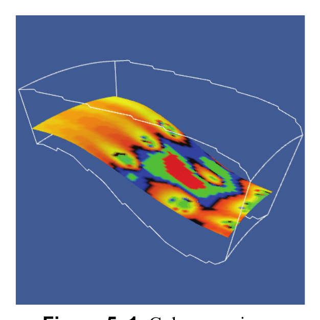

*Figure 5–1 Color mapping.*

In VTK, color mapping is typically controlled by scalars, which we assume you've created or read from a data file, and the lookup table, which is used by instances of vtkMapper to perform color mapping. It is also possible to use any data array to perform the coloring by using the method ColorByArrayComponent(). If not specified, a default lookup table is created by the mapper, but you can create your own (see `examples/color_mapping.py` and Figure 5–1).

```python
from vtkmodules.vtkCommonCore import vtkLookupTable
from vtkmodules.vtkRenderingCore import vtkActor, vtkPolyDataMapper

lut = vtkLookupTable()
lut.SetNumberOfColors(64)
lut.SetHueRange(0.0, 0.667)
lut.Build()

# Replace every group of four colors with red, green, blue, black
red = [1.0, 0.0, 0.0, 1.0]
green = [0.0, 1.0, 0.0, 1.0]
blue = [0.0, 0.0, 1.0, 1.0]
black = [0.0, 0.0, 0.0, 1.0]
for i in range(16):
    lut.SetTableValue(i * 4, *red)
    lut.SetTableValue(i * 4 + 1, *green)
    lut.SetTableValue(i * 4 + 2, *blue)
    lut.SetTableValue(i * 4 + 3, *black)

plane_mapper = vtkPolyDataMapper()
plane_mapper.SetLookupTable(lut)
plane_mapper.SetInputConnection(plane.GetOutputPort())
plane_mapper.SetScalarRange(0.197813, 0.710419)

plane_actor = vtkActor()
plane_actor.SetMapper(plane_mapper)
```

Lookup tables can be manipulated in two different ways, as this example illustrates. First, you can specify a HSVA (Hue-Saturation-Value-Alpha transparency) ramp that is used to generate the colors in the table using linear interpolation in HSVA space (the Build() method actually generates the table). Second, you can manually insert colors at specific locations in the table. Note that the number of colors in the table can be set. In this example we generate the table with the HSVA ramp, and then replace colors in the table with the SetTableValue() method. The mapper's SetScalarRange() method controls how scalars are mapped into the table. Scalar values greater than the maximum value are clamped to the maximum value. Scalar values less than the minimum value are clamped to the minimum value. Using the scalar range let's you "expand" a region of the scalar data by mapping more colors to it. Sometimes the scalar data is actually color, and does not need to be mapped through a lookup table. The mapper provides several methods to control the mapping behavior.

- SetColorModeToDefault() invokes the default mapper behavior. The default behavior treats 3 component scalars of data type unsigned char as colors and performs no mapping; all other types of scalars are mapped through the lookup table.
- SetColorModeToMapScalars() maps all scalars through the lookup table, regardless of type. If the scalar has more than one component per tuple, then the scalar's zero'th component is used perform the mapping.

Another important feature of vtkMapper is controlling which attribute data (i.e., point or cell scalars, or a general data array) is used to color objects. The following methods let you control this behavior. Note that these methods give strikingly different results: point attribute data is interpolated across rendering primitives during the rendering process, whereas cell attribute data colors the cell a constant value.
- SetScalarModeToDefault() invokes the default mapper behavior. The default behavior uses point scalars to color objects unless they are not available, in which case cell scalars are used, if they are available.
- SetScalarModeToUsePointData() always uses point data to color objects. If no point scalar data is available, then the object color is not affected by scalar data.
- SetScalarModeToUseCellData() always uses cell data to color objects. If no cell scalar data is available, then the object color is not affected by scalar data.
- SetScalarModeToUsePointFieldData() indicates that neither the point or cell scalars are to be used, but rather a data array found in the point attribute data. This method should be used in conjunction with ColorByArrayComponent() to specify the data array and component to use as the scalar.
- SetScalarModeToUseCellFieldData() indicates that neither the point or cell scalars are to be used, but rather a data array found in the cell field data. This method should be used in conjunction with ColorByArrayComponent() to specify the data array and component to use as the scalar. Normally the default behavior works well, unless both cell and point scalar data is available. In this case, you will probably want to explicitly indicate whether to use point scalars or cell scalars to color your object.

### Contouring

Another common visualization technique is generating contours. Contours are lines or surfaces of constant scalar value. In VTK, the filter vtkContourFilter is used to perform contouring as shown in the following Python example (see `examples/vis_quad.py` and Figure 5–2).


*Figure 5–2 Generating contours.*

```python
from vtkmodules.vtkFiltersCore import vtkContourFilter
from vtkmodules.vtkRenderingCore import vtkActor, vtkPolyDataMapper

contours = vtkContourFilter()
contours.SetInputConnection(sample.GetOutputPort())
contours.GenerateValues(5, 0.0, 1.2)

cont_mapper = vtkPolyDataMapper()
cont_mapper.SetInputConnection(contours.GetOutputPort())
cont_mapper.SetScalarRange(0.0, 1.2)

cont_actor = vtkActor()
cont_actor.SetMapper(cont_mapper)
```

You can specify contour values in two ways. The simplest way is to use the SetValue() method to specify the contour number and its value (multiple values can be specified)

```python
contours.SetValue(0, 0.5)
```

The above example demonstrated the second way: via the GenerateValues() method. With this method, you specify the scalar range and the number of contours to be generated in the range (end values inclusive).

Note that there are several objects in VTK that perform contouring specialized to a particular dataset type (and are faster). Examples include vtkSynchronizedTemplates2D and vtkSynchronizedTemplates3D. You do not need to instantiate these directly if you use vtkContourFilter; the filter will select the best contouring function for your dataset type automatically.

### Glyphing

Glyphing is a visualization technique that represents data by using symbols, or glyphs (Figure 5–3). The symbols can be simple or complex, ranging from oriented cones to show vector data, to complex, multi-variate glyphs such as Chernoff faces (symbolic representations of the human face whose expression is controlled by data values).

In VTK, the vtkGlyph3D class allows you to create glyphs that can be scaled, colored, and oriented along a direction. The glyphs are copied to each point of the input dataset. The glyph itself is defined using the second input connection to the filter. (It accepts datasets of type vtkPolyData). The following script demonstrates the use of vtkGlyph3D (see `examples/spike_fran.py`).

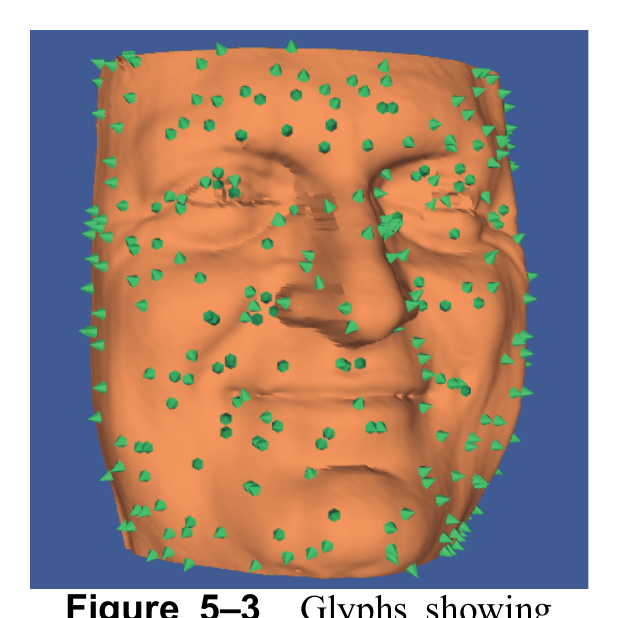

*Figure 5–3 Glyphs showing  surface normals.*

```python
from vtkmodules.vtkCommonTransforms import vtkTransform
from vtkmodules.vtkFiltersCore import vtkGlyph3D, vtkMaskPoints, vtkPolyDataNormals
from vtkmodules.vtkFiltersGeneral import vtkTransformPolyDataFilter
from vtkmodules.vtkFiltersSources import vtkConeSource
from vtkmodules.vtkIOLegacy import vtkPolyDataReader
from vtkmodules.vtkRenderingCore import vtkActor, vtkPolyDataMapper

fran = vtkPolyDataReader()
fran.SetFileName("data/fran_cut.vtk")

normals = vtkPolyDataNormals()
normals.SetInputConnection(fran.GetOutputPort())
normals.FlipNormalsOn()

fran_mapper = vtkPolyDataMapper()
fran_mapper.SetInputConnection(normals.GetOutputPort())

fran_actor = vtkActor()
fran_actor.SetMapper(fran_mapper)
fran_actor.GetProperty().SetColor(1.0, 0.49, 0.25)

pt_mask = vtkMaskPoints()
pt_mask.SetInputConnection(normals.GetOutputPort())
pt_mask.SetOnRatio(10)
pt_mask.RandomModeOn()

# Cone glyph, translated so its base is at the origin.
cone = vtkConeSource()
cone.SetResolution(6)

transform = vtkTransform()
transform.Translate(0.5, 0.0, 0.0)

transform_f = vtkTransformPolyDataFilter()
transform_f.SetInputConnection(cone.GetOutputPort())
transform_f.SetTransform(transform)

glyph = vtkGlyph3D()
glyph.SetInputConnection(pt_mask.GetOutputPort())
glyph.SetSourceConnection(transform_f.GetOutputPort())
glyph.SetVectorModeToUseNormal()
glyph.SetScaleModeToScaleByVector()
glyph.SetScaleFactor(0.004)

spike_mapper = vtkPolyDataMapper()
spike_mapper.SetInputConnection(glyph.GetOutputPort())

spike_actor = vtkActor()
spike_actor.SetMapper(spike_mapper)
spike_actor.GetProperty().SetColor(0.0, 0.79, 0.34)
```

The purpose of the script is to indicate the direction of surface normals using small, oriented cones. An input dataset (from a Cyberware laser digitizing system) is read and displayed. Next, the filter vtkMaskPoints is used to subsample the points (and associated point attribute data) from the Cyberware data. This serves as the input to the vtkGlyph3D instance. A vtkConeSource is used as the Source for the glyph instance. Notice that the cone is translated (with vtkTransformPolyDataFilter) so that its base is on the origin (0,0,0) (since vtkGlyph3D rotates the source object around the origin).

The vtkGlyph3D object glyph is configured to use the point attribute normals as the orientation vector. (Alternatively, use SetVectorModeToUseVector() to use the vector data instead of the normals.) It also scales the cones by the magnitude of the vector value there, with the given scale factor. (You can scale the glyphs by scalar data or turn data scaling off with the methods SetScaleModeToScaleByScalar() and SetScaleModeToDataScalingOff().)

It is also possible to color the glyphs with scalar or vector data, or by the scale factor. You can also create a table of glyphs, and use scalar or vector data to index into the table. Refer to the online documentation for more information.

### Streamlines

A streamline can be thought of as the path that a massless particle takes in a vector field (e.g., velocity field). Streamlines are used to convey the structure of a vector field. Usually multiple streamlines are created to explore interesting features in the field (Figure 5–4). Streamlines are computed via numerical integration (integrating the product of velocity times Δt), and are therefore only approximations to the actual streamlines.

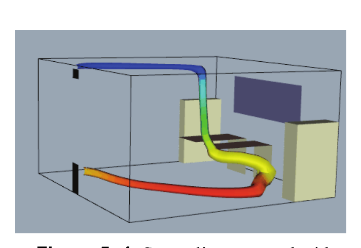

*Figure 5–4 Streamline wrapped with a tube.*

Creating a streamline requires specifying a starting point (or points, if multiple streamlines), an integration direction (along the flow, or opposite the flow direction, or in both directions), and other parameters to control its propagation. The following script shows how to create a single streamline. The streamline is wrapped with a tube whose radius is proportional to the inverse of velocity magnitude. This indicates where the flow is slow (fat tube) and where it is fast (thin tube). This Python script is adapted from `examples/office_tube.py`.

```python
from vtkmodules.vtkFiltersCore import vtkTubeFilter
from vtkmodules.vtkFiltersFlowPaths import vtkStreamTracer
from vtkmodules.vtkIOLegacy import vtkStructuredGridReader
from vtkmodules.vtkRenderingCore import vtkActor, vtkPolyDataMapper

# Read structured grid data
reader = vtkStructuredGridReader()
reader.SetFileName("data/office.binary.vtk")
reader.Update()  # force a read to occur

# Create a streamtube using vtkStreamTracer
streamer = vtkStreamTracer()
streamer.SetInputConnection(reader.GetOutputPort())
streamer.SetStartPosition(0.1, 2.1, 0.5)
streamer.SetMaximumPropagation(500)
streamer.SetInitialIntegrationStep(0.05)
streamer.SetIntegrationStepUnit(streamer.CELL_LENGTH_UNIT)
streamer.SetIntegrationDirectionToBoth()
streamer.SetIntegratorTypeToRungeKutta4()

stream_tube = vtkTubeFilter()
stream_tube.SetInputConnection(streamer.GetOutputPort())
stream_tube.SetInputArrayToProcess(1, 0, 0, 0, "vectors")
stream_tube.SetRadius(0.02)
stream_tube.SetNumberOfSides(12)
stream_tube.SetVaryRadiusToVaryRadiusByVector()

map_stream_tube = vtkPolyDataMapper()
map_stream_tube.SetInputConnection(stream_tube.GetOutputPort())
map_stream_tube.SetScalarRange(
    reader.GetOutput().GetPointData().GetScalars().GetRange()
)

stream_tube_actor = vtkActor()
stream_tube_actor.SetMapper(map_stream_tube)
stream_tube_actor.GetProperty().BackfaceCullingOn()
```

In this example we have selected a starting point by specifying the world coordinate (0.1,2.1,0.5). It is also possible to specify a starting location by using cellId, cell subId, and parametric coordinates. The MaximumPropagation instance variable controls the maximum length of the streamline. If you want greater accuracy (at the cost of more computation time), set the InitialIntegrationStep instance variable to a smaller value. The integration step unit can be set to CELL_LENGTH_UNIT or LENGTH_UNIT. Accuracy can also be controlled by choosing a different integrator type such as SetIntegratorTypeToRungeKutta2() or SetIntegratorTypeToRungeKutta45() (which allows for adaptive control of the step size). By default, the stream tracer class uses Runge-Kutta order 2 to perform the numerical integration.

You can also control the direction of integration with the following methods.
- SetIntegrationDirectionToForward()
- SetIntegrationDirectionToBackward()
- SetIntegrationDirectionToBoth()

Lines are often difficult to see and create useful images from. In this example we wrap the lines with a tube filter. The tube filter is configured to vary the radius of the tube inversely proportional to the velocity magnitude (i.e., a flux-preserving relationship if the flow field is incompressible). The SetVaryRadiusToVaryRadiusByVector() enables this.You can also vary the radius by scalar value (SetVaryRadiusToVaryRadiusByScalar()) or turn off the variable radius (SetVaryRadiusToVaryRadiusOff()). Note that the tube filter has to be told which array to use when scaling its radius. In this case, the array with the name "vectors" was selected using SetInputArrayToProcess().

As suggested earlier, we often wish to generate many streamlines simultaneously. One way to do this is to use the SetSourceConnection() method to specify an instance of vtkDataSet whose points are used to seed streamlines. Here is an example of its use (see `examples/office_tubes.py`).

```python
from vtkmodules.vtkFiltersFlowPaths import vtkStreamTracer
from vtkmodules.vtkFiltersSources import vtkPointSource

seeds = vtkPointSource()
seeds.SetRadius(0.15)
seeds.SetCenter(0.1, 2.1, 0.5)
seeds.SetNumberOfPoints(6)

streamer = vtkStreamTracer()
streamer.SetInputConnection(reader.GetOutputPort())
streamer.SetSourceConnection(seeds.GetOutputPort())
streamer.SetMaximumPropagation(500)
streamer.SetInitialIntegrationStep(0.05)
streamer.SetIntegrationStepUnit(streamer.CELL_LENGTH_UNIT)
streamer.SetIntegrationDirectionToBoth()
streamer.SetIntegratorTypeToRungeKutta4()
```

Notice that the example uses the source object vtkPointSource to create a spherical cloud of points, which are then set as the source to streamer. For every point (inside the input dataset) a streamline will be computed.

### Evenly-Spaced Streamlines

Choosing good seed positions for streamlines can be difficult. `vtkEvenlySpacedStreamlines2D` automates this process for 2D flows: given a single starting point, it generates a set of streamlines that are approximately uniformly spaced across the flow field. This produces coverage of the entire domain without manual seed placement.

The following example creates a vortex vector field and uses evenly-spaced streamlines to visualize it (see `examples/evenly_spaced_streamlines.py`).

```python
from vtkmodules.vtkCommonCore import vtkDoubleArray
from vtkmodules.vtkCommonDataModel import vtkImageData
from vtkmodules.vtkFiltersFlowPaths import vtkEvenlySpacedStreamlines2D

# Create a 2D vortex vector field on a 64x64 grid.
dims = [64, 64, 1]
image = vtkImageData()
image.SetDimensions(dims)
image.SetSpacing(1.0 / 63, 1.0 / 63, 1.0)

vectors = vtkDoubleArray()
vectors.SetNumberOfComponents(3)
vectors.SetNumberOfTuples(dims[0] * dims[1])
vectors.SetName("Velocity")

cx, cy = 0.5, 0.5
for j in range(dims[1]):
    for i in range(dims[0]):
        x = i * image.GetSpacing()[0]
        y = j * image.GetSpacing()[1]
        vectors.SetTuple3(j * dims[0] + i, -(y - cy), x - cx, 0.0)

image.GetPointData().SetVectors(vectors)

streamer = vtkEvenlySpacedStreamlines2D()
streamer.SetInputData(image)
streamer.SetStartPosition(0.5, 0.1, 0.0)
streamer.SetSeparatingDistance(0.1)
streamer.SetInitialIntegrationStep(0.5)
streamer.SetIntegrationStepUnit(1)  # 1 = CELL_LENGTH_UNIT
streamer.SetMaximumNumberOfSteps(500)
```

The `SeparatingDistance` controls the minimum spacing between adjacent streamlines — smaller values produce denser coverage. For time-varying vector fields, `vtkParticleTracer` traces particle paths through a sequence of time steps, which is useful for transient flow visualization.

> **See also:** [StreamLines](https://examples.vtk.org/site/Python/VisualizationAlgorithms/StreamLines/) and [BluntStreamlines](https://examples.vtk.org/site/Python/VisualizationAlgorithms/BluntStreamlines/) on the VTK Examples site.

### Stream Surfaces

Advanced users may want to use VTK's stream surface capability. Stream surfaces are generated in two parts. First, a rake or series of ordered points are used to generate a series of streamlines. Then, vtkRuledSurfaceFilter is used to create a surface from the streamlines. It is very important that the points (and hence streamlines) are ordered carefully because the vtkRuledSurfaceFilter assumes that the lines lie next to one another, and are within a specified distance (DistanceFactor) of the neighbor to the left and right. Otherwise, the surface tears or you can obtain poor results. The following script demonstrates how to create a stream surface (see `examples/stream_surface.py` and Figure 5–5).


*Figure 5–5 Stream surface.*

```python
from vtkmodules.vtkFiltersFlowPaths import vtkStreamTracer
from vtkmodules.vtkFiltersModeling import vtkRuledSurfaceFilter
from vtkmodules.vtkFiltersSources import vtkLineSource
from vtkmodules.vtkRenderingCore import vtkActor, vtkPolyDataMapper

rake = vtkLineSource()
rake.SetPoint1(15, -5, 32)
rake.SetPoint2(15, 5, 32)
rake.SetResolution(21)

rake_mapper = vtkPolyDataMapper()
rake_mapper.SetInputConnection(rake.GetOutputPort())
rake_actor = vtkActor()
rake_actor.SetMapper(rake_mapper)

sl = vtkStreamTracer()
sl.SetInputData(block)
sl.SetSourceConnection(rake.GetOutputPort())
sl.SetIntegratorTypeToRungeKutta4()
sl.SetMaximumPropagation(100)
sl.SetInitialIntegrationStep(0.1)
sl.SetIntegrationStepUnit(sl.CELL_LENGTH_UNIT)
sl.SetIntegrationDirectionToBackward()

scalar_surface = vtkRuledSurfaceFilter()
scalar_surface.SetInputConnection(sl.GetOutputPort())
scalar_surface.SetOffset(0)
scalar_surface.SetOnRatio(2)
scalar_surface.PassLinesOn()
scalar_surface.SetRuledModeToPointWalk()
scalar_surface.SetDistanceFactor(30)

mapper = vtkPolyDataMapper()
mapper.SetInputConnection(scalar_surface.GetOutputPort())
mapper.SetScalarRange(block.GetScalarRange())

actor = vtkActor()
actor.SetMapper(mapper)
```

A nice feature of the vtkRuledSurfaceFilter is the ability to turn off strips if multiple lines are provided as input to the filter (the method SetOnRatio()). This helps understand the structure of the surface.

Modern VTK also provides `vtkStreamSurface`, which directly generates a stream surface from a line seed without requiring the separate `vtkRuledSurfaceFilter` step. It uses a line source as the seed and produces a triangulated surface in a single filter.

### Cutting

Cutting, or slicing, a dataset in VTK entails creating a "cross-section" through the dataset using any type of implicit function. For example, we can slice through a dataset with a plane to create a planar cut. The cutting surface interpolates the data as it cuts, which can then be visualized using any standard visualization technique. The result of cutting is always of type vtkPolyData. (Cutting a n-dimensional cell results in a (n-1)-dimensional output primitive. For example, cutting a tetrahedron creates either a triangle or quadrilateral.) In the following example, a combustor (structured grid) is cut with a plane as shown in Figure 5–6 (see `examples/cut_combustor.py`).

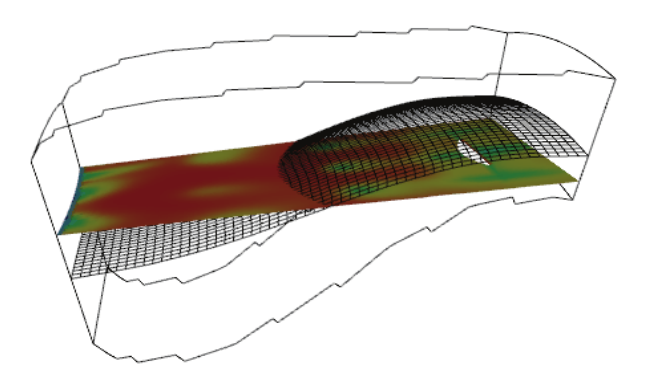

*Figure 5–6 Cutting a combustor.*

```python
from vtkmodules.vtkCommonDataModel import vtkPlane
from vtkmodules.vtkFiltersCore import vtkCutter
from vtkmodules.vtkRenderingCore import vtkActor, vtkPolyDataMapper

plane = vtkPlane()
plane.SetOrigin(block.GetCenter())
plane.SetNormal(-0.287, 0, 0.9579)

plane_cut = vtkCutter()
plane_cut.SetInputData(block)
plane_cut.SetCutFunction(plane)

cut_mapper = vtkPolyDataMapper()
cut_mapper.SetInputConnection(plane_cut.GetOutputPort())
cut_mapper.SetScalarRange(
    block.GetPointData().GetScalars().GetRange()
)

cut_actor = vtkActor()
cut_actor.SetMapper(cut_mapper)
```

vtkCutter requires that you specify an implicit function with which to cut. Also, you may wish to specify one or more cut values using the SetValue() or GenerateValues() methods. These values specify the value of the implicit function used to perform the cutting. (Typically the cutting value is zero, meaning that the cut surface is precisely on the implicit function. Values less than or greater than zero are implicit surfaces below and above the implicit surface. The cut value can also be thought of as a "distance" to the implicit surface, which is only strictly true for vtkPlane.)

You can also cut with multiple planes simultaneously. The following example creates three orthogonal cutting planes through the center of a sampled dataset (see `examples/cut_unstructured.py`).

```python
from vtkmodules.vtkCommonDataModel import vtkPlane
from vtkmodules.vtkFiltersCore import vtkCutter, vtkAppendPolyData

# Assume 'sample' is a vtkSampleFunction producing a 3D scalar field.
center = sample.GetOutput().GetCenter()
append = vtkAppendPolyData()

for normal in [(1, 0, 0), (0, 1, 0), (0, 0, 1)]:
    plane = vtkPlane()
    plane.SetOrigin(center)
    plane.SetNormal(normal)

    cutter = vtkCutter()
    cutter.SetInputConnection(sample.GetOutputPort())
    cutter.SetCutFunction(plane)
    append.AddInputConnection(cutter.GetOutputPort())
```

For large datasets, consider `vtkPlaneCutter` as a modern, high-performance alternative to `vtkCutter` when cutting with a plane. `vtkPlaneCutter` is optimized for plane cuts specifically and can take advantage of SMP (multithreading) acceleration. It accepts any `vtkDataSet` as input and produces `vtkPolyData` on output.

> **See also:** [Cutter](https://examples.vtk.org/site/Python/VisualizationAlgorithms/Cutter/) and [CutStructuredGrid](https://examples.vtk.org/site/Python/VisualizationAlgorithms/CutStructuredGrid/) on the VTK Examples site.

### Clipping Volume Meshes

While `vtkClipPolyData` (described in Section 5.2) only accepts polygonal data, `vtkTableBasedClipDataSet` clips any `vtkDataSet` — `vtkImageData`, `vtkStructuredGrid`, `vtkUnstructuredGrid`, and others. It is the modern, high-performance replacement for `vtkClipDataSet`, using pre-computed triangulation tables for fast clipping of all standard cell types.

The following example clips a sampled quadric function (on a regular 3D grid) with a plane (see `examples/clip_volume.py`).

```python
from vtkmodules.vtkCommonDataModel import vtkPlane, vtkQuadric
from vtkmodules.vtkFiltersGeneral import vtkTableBasedClipDataSet
from vtkmodules.vtkFiltersGeometry import vtkGeometryFilter
from vtkmodules.vtkImagingHybrid import vtkSampleFunction

quadric = vtkQuadric()
quadric.SetCoefficients(0.5, 1.0, 0.2, 0.0, 0.1, 0.0, 0.0, 0.2, 0.0, 0.0)

sample = vtkSampleFunction()
sample.SetSampleDimensions(30, 30, 30)
sample.SetImplicitFunction(quadric)
sample.ComputeNormalsOff()
sample.Update()

plane = vtkPlane()
plane.SetOrigin(sample.GetOutput().GetCenter())
plane.SetNormal(1, 0, 0)

clipper = vtkTableBasedClipDataSet()
clipper.SetInputConnection(sample.GetOutputPort())
clipper.SetClipFunction(plane)
clipper.SetValue(0.0)

# Convert to polydata for rendering
surface = vtkGeometryFilter()
surface.SetInputConnection(clipper.GetOutputPort())
```

The output is always a `vtkUnstructuredGrid`, so follow with `vtkGeometryFilter` or use `vtkDataSetMapper` to render it. `vtkTableBasedClipDataSet` also supports `GenerateClippedOutputOn()` to retrieve the clipped-away portion, just like `vtkClipPolyData`.

> **See also:** [ClipVolume](https://examples.vtk.org/site/Python/Meshes/ClipDataSetWithPolyData/) and [SolidClip](https://examples.vtk.org/site/Python/Meshes/SolidClip/) on the VTK Examples site.

### Merging Data

Up to this point we have seen simple, linear visualization pipelines. However, it is possible for pipelines to branch, merge and even have loops. It is also possible for pieces of data to move from one leg of the pipeline to another. In this section and the following, we introduce two filters that allow you to build datasets from other datasets. We'll start with vtkMergeFilter. vtkMergeFilter merges pieces of data from several datasets into a new dataset. For example, you can take the structure (topology and geometry) from one dataset, the scalars from a second, and the vectors from a third dataset, and combine them into a single dataset. Here's an example of its use (see `examples/image_warp.py`). (Please ignore those filters that you don't recognize, focus on the use of vtkMergeFilter. We'll describe more fully the details of the script in Section 6.2.)

```python
from vtkmodules.vtkFiltersCore import vtkMergeFilter
from vtkmodules.vtkFiltersGeneral import vtkWarpScalar
from vtkmodules.vtkFiltersGeometry import vtkImageDataGeometryFilter
from vtkmodules.vtkIOImage import vtkBMPReader
from vtkmodules.vtkImagingColor import vtkImageLuminance
from vtkmodules.vtkRenderingCore import vtkActor, vtkDataSetMapper

reader = vtkBMPReader()
reader.SetFileName("data/masonry.bmp")

luminance = vtkImageLuminance()
luminance.SetInputConnection(reader.GetOutputPort())

geometry = vtkImageDataGeometryFilter()
geometry.SetInputConnection(luminance.GetOutputPort())

warp = vtkWarpScalar()
warp.SetInputConnection(geometry.GetOutputPort())
warp.SetScaleFactor(-0.1)

# Use merge to put back scalars from image file
merge = vtkMergeFilter()
merge.SetGeometryConnection(warp.GetOutputPort())
merge.SetScalarsConnection(reader.GetOutputPort())

mapper = vtkDataSetMapper()
mapper.SetInputConnection(merge.GetOutputPort())
mapper.SetScalarRange(0, 255)

actor = vtkActor()
actor.SetMapper(mapper)
```

What's happening here is that the dataset (or geometry) from vtkWarpScalar (which happens to be of type vtkPolyData) is combined with the scalar data from the vtkBMPReader. The pipeline has split and rejoined because the geometry had to be processed separately (in the imaging pipeline) from the scalar data.

When merging data, the number of tuples found in the data arrays that make up the point attribute data must equal the number of points. This is also true for the cell data.

### Appending Data

Like vtkMergeFilter, vtkAppendFilter (and its specialized cousin vtkAppendPolyData) builds a new dataset by appending datasets. The append filters take a list of inputs, each of which must be the same type. During the append operation, only those data attributes that are common to all input datasets are appended together. A great example of its application is shown in the example in the following section.

### Probing

Probing is a process of sampling one dataset with another dataset. In VTK, you can use any dataset as a probe geometry onto which point data attributes are mapped from another dataset. For example, the following Python script (see `examples/probe_comb.py`) creates three planes (which serve as the probe geometry) used to sample a structured grid dataset. The planes are then processed with vtkContourFilter to generate contour lines.

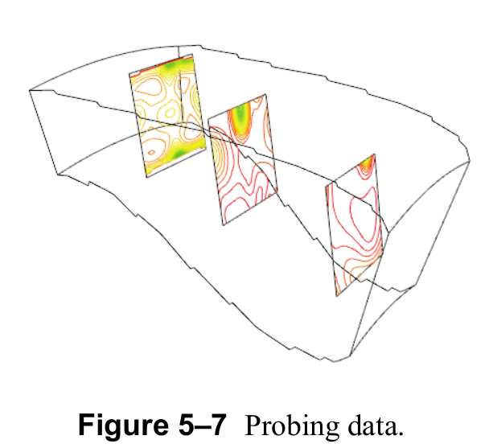

*Figure 5–7 Probing data.*

```python
from vtkmodules.vtkCommonTransforms import vtkTransform
from vtkmodules.vtkFiltersCore import vtkAppendPolyData, vtkContourFilter, vtkProbeFilter
from vtkmodules.vtkFiltersGeneral import vtkTransformPolyDataFilter
from vtkmodules.vtkFiltersModeling import vtkOutlineFilter
from vtkmodules.vtkFiltersSources import vtkPlaneSource
from vtkmodules.vtkIOParallel import vtkMultiBlockPLOT3DReader
from vtkmodules.vtkRenderingCore import vtkActor, vtkPolyDataMapper

# Read PLOT3D combustor data
pl3d = vtkMultiBlockPLOT3DReader()
pl3d.SetXYZFileName("data/combxyz.bin")
pl3d.SetQFileName("data/combq.bin")
pl3d.SetScalarFunctionNumber(100)
pl3d.SetVectorFunctionNumber(202)
pl3d.Update()
block = pl3d.GetOutput().GetBlock(0)

# Create the probes. Transform them into right place.
plane = vtkPlaneSource()
plane.SetResolution(50, 50)

transP1 = vtkTransform()
transP1.Translate(3.7, 0.0, 28.37)
transP1.Scale(5, 5, 5)
transP1.RotateY(90)
tpd1 = vtkTransformPolyDataFilter()
tpd1.SetInputConnection(plane.GetOutputPort())
tpd1.SetTransform(transP1)

# ... similar for tpd2 and tpd3 ...

append_f = vtkAppendPolyData()
append_f.AddInputConnection(tpd1.GetOutputPort())
append_f.AddInputConnection(tpd2.GetOutputPort())
append_f.AddInputConnection(tpd3.GetOutputPort())

probe = vtkProbeFilter()
probe.SetInputConnection(append_f.GetOutputPort())
probe.SetSourceData(block)

contour = vtkContourFilter()
contour.SetInputConnection(probe.GetOutputPort())
contour.GenerateValues(50, block.GetScalarRange())

contour_mapper = vtkPolyDataMapper()
contour_mapper.SetInputConnection(contour.GetOutputPort())
contour_mapper.SetScalarRange(block.GetScalarRange())

plane_actor = vtkActor()
plane_actor.SetMapper(contour_mapper)
```

Notice that the probe is set using the SetInputConnection() method of vtkProbeFilter, and the dataset to probe is set using the SetSourceData() method.

Another useful application of probing is resampling data. For example, if you have an unstructured grid and wish to visualize it with tools specific to vtkImageData (such as volume rendering— see Chapter 7, "Volume Rendering"), you can use vtkProbeFilter to sample the unstructured grid with a volume, and then visualize the volume. It is also possible to probe data with lines (or curves) and use the output to perform x-y plotting.

One final note: cutting and probing can give similar results, although there is a difference in resolution. Similar to the example described in "Cutting" above, vtkProbeFilter could be used with a vtkPlaneSource to generate a plane with data attributes from the structured grid. However, cutting creates surfaces with a resolution dependent on the resolution of the input data. Probing creates surfaces (and other geometries) with a resolution independent of the input data. Care must be taken when probing data to avoid under- or oversampling. Undersampling can result in errors in visualization, and oversampling can consume excessive computation time.

### Color An Isosurface With Another Scalar

A common visualization task is to generate an isosurface and then color it with another scalar. While you might do this with a probe, there is a much more efficient way when the dataset that you isosurface contains the data you wish to color the isosurface with. This is because the vtkContourFilter (which generates the isosurface) interpolates all data to the isosurface during the generation process. The interpolated data can then be used during the mapping process to color the isosurface. Here's an example (see `examples/color_isosurface.py`).

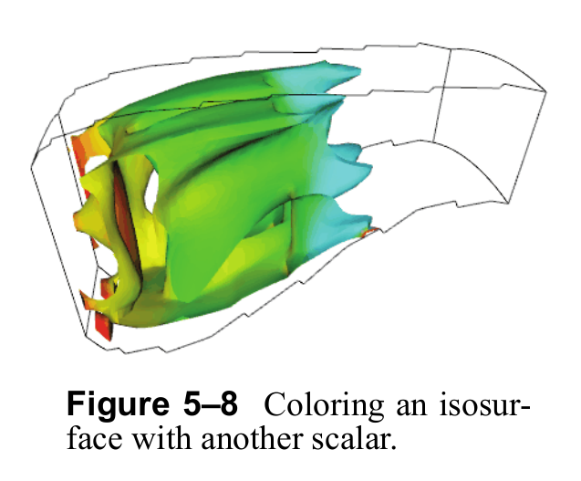

*Figure 5–8 Coloring an isosurface with another scalar.*

```python
from vtkmodules.vtkFiltersCore import vtkContourFilter, vtkPolyDataNormals
from vtkmodules.vtkIOParallel import vtkMultiBlockPLOT3DReader
from vtkmodules.vtkRenderingCore import vtkPolyDataMapper
from vtkmodules.vtkRenderingLOD import vtkLODActor

pl3d = vtkMultiBlockPLOT3DReader()
pl3d.SetXYZFileName("data/combxyz.bin")
pl3d.SetQFileName("data/combq.bin")
pl3d.SetScalarFunctionNumber(100)
pl3d.SetVectorFunctionNumber(202)
pl3d.AddFunction(153)
pl3d.Update()
block = pl3d.GetOutput().GetBlock(0)

iso = vtkContourFilter()
iso.SetInputData(block)
iso.SetValue(0, 0.24)

normals = vtkPolyDataNormals()
normals.SetInputConnection(iso.GetOutputPort())
normals.SetFeatureAngle(45)

iso_mapper = vtkPolyDataMapper()
iso_mapper.SetInputConnection(normals.GetOutputPort())
iso_mapper.ScalarVisibilityOn()
iso_mapper.SetScalarRange(0, 1500)
iso_mapper.SetScalarModeToUsePointFieldData()
iso_mapper.ColorByArrayComponent("VelocityMagnitude", 0)

iso_actor = vtkLODActor()
iso_actor.SetMapper(iso_mapper)
iso_actor.SetNumberOfCloudPoints(1000)
```

First, the dataset is read with a vtkMultiBlockPLOT3DReader. Here we add a function to be read (function number 153) which we know to be named "Velocity Magnitude." An isosurface is generated which also interpolates all its input data arrays including the velocity magnitude data. We then use the velocity magnitude to color the contour by invoking the method SetScalarModeToUsePointFieldData() and specifying the data array to use to color with the ColorByArrayComponent() method.

### Extract Subset of Cells

Visualization data is often large and processing such data can be quite costly in execution time and memory requirements. As a result, the ability to extract pieces of data is important. Many times only a subset of the data contains meaningful information, or the resolution of the data can be reduced without significant loss of accuracy.

The Visualization Toolkit offers several tools to extract portions of, or subsample data. We've already seen how vtkProbeFilter can be used to subsample data (see "Probing" above). Other tools include classes to subsample data, and tools to extract cells within a region in space. (Subsampling tools are specific to a type of dataset. See Section 6.2 for information about subsampling image datasets, and "Subsampling Structured Grids" below for information about subsampling structured grids.) In this section, we describe how to extract pieces of a dataset contained within a region in space.

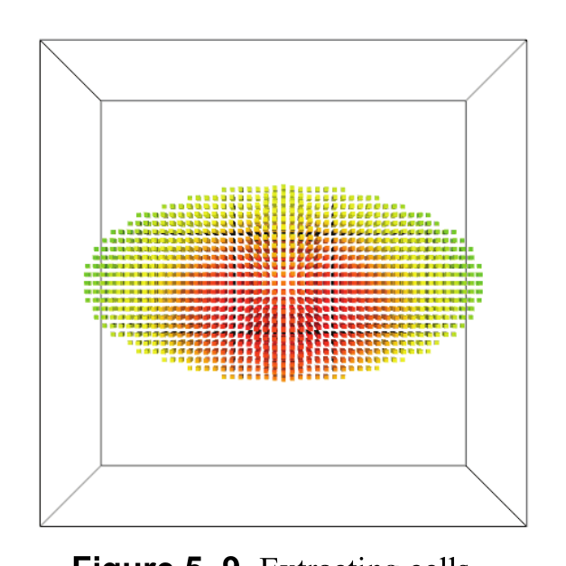

*Figure 5–9 Extracting cells.*

The class vtkExtractGeometry extracts all cells in a dataset that lie either inside or outside of a vtkImplicitFunction (remember, implicit functions can consist of boolean combinations of other implicit functions). The following script creates a boolean combination of two ellipsoids that is used as the extraction region. A vtkShrinkFilter is also used to shrink the cells so you can see what's been extracted. (See `examples/extract_geometry.py`.)

```python
from vtkmodules.vtkCommonDataModel import vtkQuadric, vtkSphere, vtkImplicitBoolean
from vtkmodules.vtkCommonTransforms import vtkTransform
from vtkmodules.vtkFiltersExtraction import vtkExtractGeometry
from vtkmodules.vtkFiltersGeneral import vtkShrinkFilter
from vtkmodules.vtkImagingHybrid import vtkSampleFunction
from vtkmodules.vtkRenderingCore import vtkActor, vtkDataSetMapper

quadric = vtkQuadric()
quadric.SetCoefficients(0.5, 1, 0.2, 0, 0.1, 0, 0, 0.2, 0, 0)

sample = vtkSampleFunction()
sample.SetSampleDimensions(50, 50, 50)
sample.SetImplicitFunction(quadric)
sample.ComputeNormalsOff()

trans = vtkTransform()
trans.Scale(1, 0.5, 0.333)
sphere = vtkSphere()
sphere.SetRadius(0.25)
sphere.SetTransform(trans)

trans2 = vtkTransform()
trans2.Scale(0.25, 0.5, 1.0)
sphere2 = vtkSphere()
sphere2.SetRadius(0.25)
sphere2.SetTransform(trans2)

union = vtkImplicitBoolean()
union.AddFunction(sphere)
union.AddFunction(sphere2)
union.SetOperationTypeToUnion()

extract = vtkExtractGeometry()
extract.SetInputConnection(sample.GetOutputPort())
extract.SetImplicitFunction(union)

shrink = vtkShrinkFilter()
shrink.SetInputConnection(extract.GetOutputPort())
shrink.SetShrinkFactor(0.5)

data_mapper = vtkDataSetMapper()
data_mapper.SetInputConnection(shrink.GetOutputPort())

data_actor = vtkActor()
data_actor.SetMapper(data_mapper)
```

The output of vtkExtractGeometry is always a vtkUnstructuredGrid. This is because the extraction process generally disrupts the topological structure of the dataset, and the most general dataset form (i.e., vtkUnstructuredGrid) must be used to represent the output. As a side note: implicit functions can be transformed by assigning them a vtkTransform. If specified, the vtkTransform is used to modify the evaluation of the implicit function. You may wish to experiment with this capability.

### Extract Cells as Polygonal Data

Most dataset types cannot be directly rendered by graphics hardware or libraries. Only polygonal data (vtkPolyData) is commonly supported by rendering systems. Structured datasets, especially images and sometimes volumes, are also supported by graphics systems. All other datasets require special processing if they are to be rendered. In VTK, one approach to rendering non-polygonal datasets is to convert them to polygonal data. This is the function of vtkGeometryFilter.

vtkGeometryFilter accepts as input any type of vtkDataSet, and generates vtkPolyData on output. It performs the conversion using the following rules. All input cells of topological dimension 2 or less (e.g., polygons, lines, vertices) are passed to the output. The faces of cells of dimension 3 are sent to the output if they are on the boundary of the dataset. (A face is on the boundary if it is used by only one cell.)

The principal use of vtkGeometryFilter is as a conversion filter. The following example uses vtkGeometryFilter to convert a 2D unstructured grid into polygonal data for later processing by filters that accept vtkPolyData as input. Here, the vtkConnectivityFilter extracts data as vtkUnstructuredGrid which is then converted into polygons using vtkGeometryFilter.

```python
from vtkmodules.vtkCommonCore import vtkLookupTable
from vtkmodules.vtkFiltersCore import vtkConnectivityFilter, vtkPolyDataNormals
from vtkmodules.vtkFiltersGeometry import vtkGeometryFilter
from vtkmodules.vtkRenderingCore import vtkActor, vtkPolyDataMapper

connect2 = vtkConnectivityFilter()
connect2.SetInputConnection(thresh.GetOutputPort())

parison = vtkGeometryFilter()
parison.SetInputConnection(connect2.GetOutputPort())

normals2 = vtkPolyDataNormals()
normals2.SetInputConnection(parison.GetOutputPort())
normals2.SetFeatureAngle(60)

lut = vtkLookupTable()
lut.SetHueRange(0.0, 0.66667)

parison_mapper = vtkPolyDataMapper()
parison_mapper.SetInputConnection(normals2.GetOutputPort())
parison_mapper.SetLookupTable(lut)
parison_mapper.SetScalarRange(0.12, 1.0)

parison_actor = vtkActor()
parison_actor.SetMapper(parison_mapper)
```

In fact, the vtkDataSetMapper mapper uses vtkGeometryFilter internally to convert datasets of any type into polygonal data. (The filter is smart enough to pass input vtkPolyData straight to its output without processing.)

In addition, vtkGeometryFilter has methods that allows you to extract cells based on a range of point ids, cell ids, or whether the cells lie in a particular rectangular region in space. vtkGeometryFilter extracts pieces of datasets based on point and cell ids using the methods PointClippingOn(), SetPointMinimum(), SetPointMaximum() and CellClippingOn(), SetCellMinimum(), SetCellMaximum(). The minimum and maximum values specify a range of ids which are extracted. Also, you can use a rectangular region in space to limit what's extracted. Use the ExtentClippingOn() and SetExtent() methods to enable extent clipping and specify the extent. The extent consists of six values defining a bounding box in space—(x<sub>min</sub>, x<sub>max</sub>, y<sub>min</sub>, y<sub>max</sub>, z<sub>min</sub>, z<sub>max</sub>). You can use point, cell, and extent clipping in any combination. This is a useful feature when debugging data, or when you only want to look at a portion of it.

### Extract Portions of an Unstructured Grid

`vtkExtractUnstructuredGrid` extracts portions of an unstructured grid using a range of point ids, cell ids, or geometric bounds (the Extent instance variable which defines a bounding box). Although it accepts only `vtkUnstructuredGrid` as input, we include it here alongside the other extraction filters since the pattern is general. See `examples/extract_ugrid.py` for the complete example.

```python
from vtkmodules.vtkCommonCore import vtkLookupTable
from vtkmodules.vtkFiltersCore import vtkConnectivityFilter, vtkPolyDataNormals
from vtkmodules.vtkFiltersExtraction import vtkExtractUnstructuredGrid
from vtkmodules.vtkFiltersGeneral import vtkWarpVector
from vtkmodules.vtkFiltersGeometry import vtkGeometryFilter
from vtkmodules.vtkIOLegacy import vtkDataSetReader
from vtkmodules.vtkRenderingCore import vtkActor, vtkDataSetMapper, vtkPolyDataMapper

reader = vtkDataSetReader()
reader.SetFileName("data/blow.vtk")
reader.SetScalarsName("thickness9")
reader.SetVectorsName("displacement9")

warp = vtkWarpVector()
warp.SetInputConnection(reader.GetOutputPort())

connect = vtkConnectivityFilter()
connect.SetInputConnection(warp.GetOutputPort())
connect.SetExtractionModeToSpecifiedRegions()
connect.AddSpecifiedRegion(0)
connect.AddSpecifiedRegion(1)

mold_mapper = vtkDataSetMapper()
mold_mapper.SetInputConnection(reader.GetOutputPort())
mold_mapper.ScalarVisibilityOff()

mold_actor = vtkActor()
mold_actor.SetMapper(mold_mapper)
mold_actor.GetProperty().SetColor(0.2, 0.2, 0.2)
mold_actor.GetProperty().SetRepresentationToWireframe()

connect2 = vtkConnectivityFilter()
connect2.SetInputConnection(warp.GetOutputPort())
connect2.SetExtractionModeToSpecifiedRegions()
connect2.AddSpecifiedRegion(2)

extract_grid = vtkExtractUnstructuredGrid()
extract_grid.SetInputConnection(connect2.GetOutputPort())
extract_grid.CellClippingOn()
extract_grid.SetCellMinimum(0)
extract_grid.SetCellMaximum(23)

parison = vtkGeometryFilter()
parison.SetInputConnection(extract_grid.GetOutputPort())

normals2 = vtkPolyDataNormals()
normals2.SetInputConnection(parison.GetOutputPort())
normals2.SetFeatureAngle(60)

lut = vtkLookupTable()
lut.SetHueRange(0.0, 0.66667)

parison_mapper = vtkPolyDataMapper()
parison_mapper.SetInputConnection(normals2.GetOutputPort())
parison_mapper.SetLookupTable(lut)
parison_mapper.SetScalarRange(0.12, 1.0)

parison_actor = vtkActor()
parison_actor.SetMapper(parison_mapper)
```

In this example, we use cell clipping (i.e., using cell ids) in combination with a connectivity filter to extract portions of the mesh. Similarly, we could use point ids and a geometric extent to extract portions of the mesh. The `vtkConnectivityFilter` (and a related class `vtkPolyDataConnectivityFilter`) are used to extract connected portions of a dataset. (Cells are connected when they share points.) The `SetExtractionModeToSpecifiedRegions()` method indicates to the filter which connected region to extract. By default, the connectivity filters extract the largest connected regions encountered. However, it is also possible to specify a particular region as this example does, which of course requires some experimentation to determine which region is which.

### Thresholding

Thresholding is one of the most fundamental filtering operations: it extracts the subset of cells (or points) from a dataset whose scalar values satisfy a criterion. VTK provides two complementary filters: `vtkThreshold`, which operates on cells and produces a `vtkUnstructuredGrid`, and `vtkThresholdPoints`, which operates on points and produces `vtkPolyData`.

`vtkThreshold` supports three threshold modes, configured via `SetThresholdFunction()`:

| Mode | Method | Keeps cells where scalar… |
|------|--------|---------------------------|
| `THRESHOLD_BETWEEN` | `SetLowerThreshold()` + `SetUpperThreshold()` | falls within [lower, upper] |
| `THRESHOLD_LOWER` | `SetUpperThreshold()` | is ≤ upper |
| `THRESHOLD_UPPER` | `SetLowerThreshold()` | is ≥ lower |

By default, `vtkThreshold` uses point scalars to decide whether a cell passes. A cell passes when **all** its points satisfy the criterion (the `AllScalars` mode). Set `SetAllScalars(False)` to pass a cell when **any** point satisfies the criterion. You can also threshold on cell data instead of point data by using `SetInputArrayToProcess()`.

The following example thresholds a sampled quadric to keep cells with scalars in [0.5, 1.0] (see `examples/threshold.py`).

```python
from vtkmodules.vtkCommonDataModel import vtkQuadric
from vtkmodules.vtkFiltersCore import vtkThreshold
from vtkmodules.vtkFiltersGeometry import vtkGeometryFilter
from vtkmodules.vtkImagingHybrid import vtkSampleFunction

quadric = vtkQuadric()
quadric.SetCoefficients(0.5, 1.0, 0.2, 0.0, 0.1, 0.0, 0.0, 0.2, 0.0, 0.0)

sample = vtkSampleFunction()
sample.SetSampleDimensions(30, 30, 30)
sample.SetImplicitFunction(quadric)
sample.ComputeNormalsOff()

thresh = vtkThreshold()
thresh.SetInputConnection(sample.GetOutputPort())
thresh.SetThresholdFunction(thresh.THRESHOLD_BETWEEN)
thresh.SetLowerThreshold(0.5)
thresh.SetUpperThreshold(1.0)

# vtkThreshold always produces vtkUnstructuredGrid — convert for rendering
surface = vtkGeometryFilter()
surface.SetInputConnection(thresh.GetOutputPort())
```

For point-based thresholding, `vtkThresholdPoints` extracts only the points (as vertices) that pass. This is useful for scatter-plot-style visualizations. In modern VTK (9.6+), use `SetThresholdFunction()` and `SetUpperThreshold()`/`SetLowerThreshold()` rather than the deprecated `ThresholdByUpper()`/`ThresholdByLower()` methods.

```python
from vtkmodules.vtkFiltersCore import vtkThresholdPoints

thresh_pts = vtkThresholdPoints()
thresh_pts.SetInputConnection(sample.GetOutputPort())
thresh_pts.SetThresholdFunction(thresh_pts.THRESHOLD_UPPER)
thresh_pts.SetUpperThreshold(0.8)
```

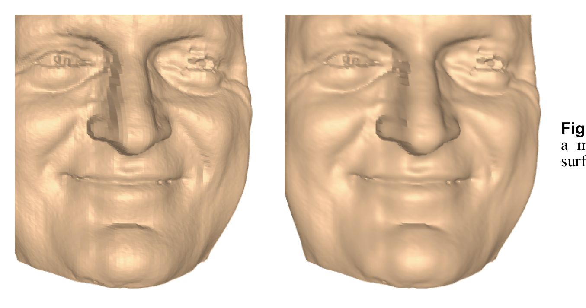

*Figure 5–10 Thresholding a sampled quadric function. Left: `vtkThreshold` extracts cells with scalars in [0.5, 1.0]. Right: `vtkThresholdPoints` extracts points with scalars > 0.8.*

> **See also:** [ThresholdCells](https://examples.vtk.org/site/Python/Meshes/ThresholdCells/) and [ThresholdPoints](https://examples.vtk.org/site/Python/Meshes/ThresholdPoints/) on the VTK Examples site.

### Warping

Warping displaces points in a dataset by scalar or vector values, turning abstract data into 3D surface deformations. Two filters are commonly used: `vtkWarpScalar` displaces points along a normal direction proportional to a scalar value, and `vtkWarpVector` displaces points by a vector field.

**vtkWarpScalar.** This filter is especially useful for creating elevation maps from image data — each point is moved along its normal (or a specified direction) by an amount proportional to its scalar value. The `ScaleFactor` controls the magnitude of the displacement. If the input does not have normals, the displacement defaults to the Z direction.

The following example creates a plane with elevation scalars and warps it into a 3D surface (see `examples/warp_scalar.py`).

```python
from vtkmodules.vtkFiltersCore import vtkElevationFilter
from vtkmodules.vtkFiltersGeneral import vtkWarpScalar
from vtkmodules.vtkFiltersSources import vtkPlaneSource

plane = vtkPlaneSource()
plane.SetResolution(40, 40)

elevation = vtkElevationFilter()
elevation.SetInputConnection(plane.GetOutputPort())
elevation.SetLowPoint(0, 0, 0)
elevation.SetHighPoint(0, 1, 0)
elevation.SetScalarRange(0, 1)

warp = vtkWarpScalar()
warp.SetInputConnection(elevation.GetOutputPort())
warp.SetScaleFactor(0.3)
```

**vtkWarpVector.** This filter displaces each point by its associated vector value. It is commonly used to visualize displacement fields from finite element analysis — the vectors represent how much each node moved under load.

```python
from vtkmodules.vtkFiltersGeneral import vtkWarpVector

warp = vtkWarpVector()
warp.SetInputConnection(reader.GetOutputPort())
warp.SetScaleFactor(1.0)
```

The `ScaleFactor` scales the displacement vectors uniformly. Setting it to a larger value exaggerates the deformation for visualization purposes, while a value of 1.0 shows the actual displacement magnitude.

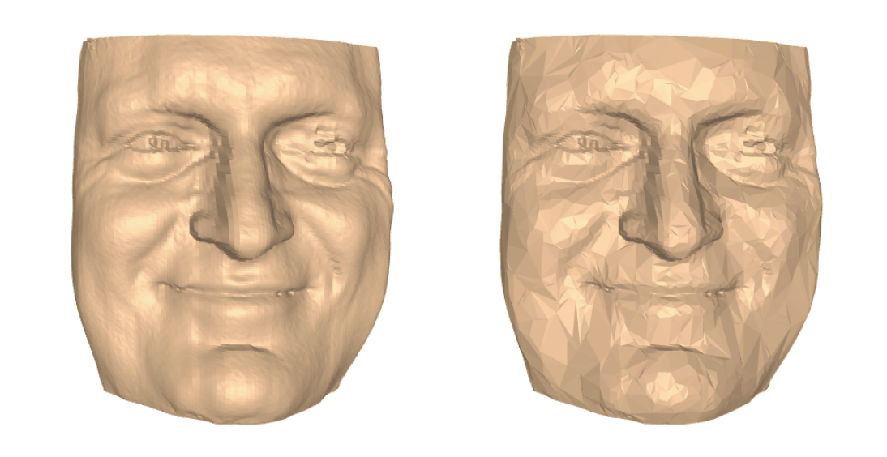

*Figure 5–11 Warping geometry by data values. Left: `vtkWarpScalar` displaces a plane along Z by its elevation scalar. Right: `vtkWarpVector` deforms a sphere by a radial displacement field, creating a star-like shape.*

> **See also:** [WarpScalar](https://examples.vtk.org/site/Python/VisualizationAlgorithms/WarpScalar/), [WarpVector](https://examples.vtk.org/site/Python/VisualizationAlgorithms/WarpVector/), and [WarpSurface](https://examples.vtk.org/site/Python/VisualizationAlgorithms/WarpSurface/) on the VTK Examples site.

### Computing Derived Quantities

`vtkArrayCalculator` evaluates mathematical expressions on data arrays to produce new arrays. This is useful for computing derived quantities — strain from displacement, speed from velocity components, or any custom formula — without writing a custom filter. The calculator operates on either point data or cell data, and supports standard functions (`sin`, `cos`, `exp`, `log`, `sqrt`, `abs`, etc.) along with arithmetic operators, `min`, `max`, and the cross/dot products `cross(v1,v2)` and `dot(v1,v2)` for vector arrays.

The following example computes `sin(Elevation * pi)` on a plane with elevation scalars (see `examples/array_calculator.py`).

```python
from vtkmodules.vtkFiltersCore import vtkArrayCalculator, vtkElevationFilter
from vtkmodules.vtkFiltersSources import vtkPlaneSource

plane = vtkPlaneSource()
plane.SetResolution(40, 40)

elevation = vtkElevationFilter()
elevation.SetInputConnection(plane.GetOutputPort())
elevation.SetLowPoint(0, 0, 0)
elevation.SetHighPoint(0, 1, 0)
elevation.SetScalarRange(0, 1)

calc = vtkArrayCalculator()
calc.SetInputConnection(elevation.GetOutputPort())
calc.SetAttributeTypeToPointData()
calc.AddScalarArrayName("Elevation")
calc.SetFunction("sin(Elevation * 3.14159265)")
calc.SetResultArrayName("SineElevation")
```

Call `AddScalarArrayName()` or `AddVectorArrayName()` for each input array your expression references. The expression string uses these array names as variables. The result is stored as a new array with the name given by `SetResultArrayName()`. By default the calculator processes point data; use `SetAttributeTypeToCellData()` to operate on cell data instead.

> **See also:** [ArrayCalculator](https://examples.vtk.org/site/Python/Filters/ArrayCalculator/) on the VTK Examples site.

### Connectivity Analysis

When a dataset contains multiple disconnected components — for example, after thresholding or clipping — `vtkConnectivityFilter` identifies the connected regions. It accepts any `vtkDataSet` as input and produces a `vtkUnstructuredGrid` with region labels.

The filter supports several extraction modes:

| Mode | Method | Effect |
|------|--------|--------|
| All regions | `SetExtractionModeToAllRegions()` | Labels every region; use with `ColorRegionsOn()` |
| Largest region | `SetExtractionModeToLargestRegion()` | Keeps only the largest connected component |
| Specified regions | `SetExtractionModeToSpecifiedRegions()` | Keeps regions added via `AddSpecifiedRegion(id)` |
| Closest point | `SetExtractionModeToClosestPointRegion()` | Keeps the region closest to a given point |

The following example thresholds a sampled quadric to produce disconnected pieces, then colors them by region ID (see `examples/connectivity.py`).

```python
from vtkmodules.vtkFiltersCore import vtkConnectivityFilter, vtkThreshold

thresh = vtkThreshold()
thresh.SetInputConnection(sample.GetOutputPort())
thresh.SetThresholdFunction(thresh.THRESHOLD_BETWEEN)
thresh.SetLowerThreshold(0.8)
thresh.SetUpperThreshold(1.5)

conn = vtkConnectivityFilter()
conn.SetInputConnection(thresh.GetOutputPort())
conn.SetExtractionModeToAllRegions()
conn.ColorRegionsOn()
```

When `ColorRegionsOn()` is set, the filter adds a `RegionId` array to the point data, which can be used to color-map each region distinctly. For polygonal data specifically, `vtkPolyDataConnectivityFilter` offers the same functionality with better performance since it avoids the overhead of unstructured grid output.

> **See also:** [ConnectivityFilter](https://examples.vtk.org/site/Python/Filtering/ConnectivityFilter/) on the VTK Examples site.

### Data Resampling

Resampling transfers data values from one mesh onto a different mesh topology. This is common when comparing simulations run on different grids, or when converting irregular meshes to regular grids for image-based processing.

**vtkResampleToImage** converts any `vtkDataSet` into a `vtkImageData` by sampling on a uniform grid. You specify the output resolution with `SetSamplingDimensions()`. Points outside the input dataset are marked with a `vtkValidPointMask` array (0 = outside, 1 = valid), which you can use to threshold away invalid regions.

```python
from vtkmodules.vtkFiltersCore import vtkResampleToImage

resample = vtkResampleToImage()
resample.SetInputConnection(source.GetOutputPort())
resample.SetSamplingDimensions(40, 40, 40)
```

**vtkResampleWithDataSet** is the more general form: it resamples one dataset onto the point locations of another dataset (of any type). This is useful for transferring data between meshes of different topology.

```python
from vtkmodules.vtkFiltersCore import vtkResampleWithDataSet

resample = vtkResampleWithDataSet()
resample.SetInputConnection(target_mesh.GetOutputPort())  # geometry to sample onto
resample.SetSourceConnection(source_data.GetOutputPort())  # data to sample from
```

Both filters use `vtkProbeFilter` internally. If you need more control over the probing process — such as handling tolerance, using a specific locator, or probing at explicit point locations — use `vtkProbeFilter` directly. See `examples/resample_to_image.py` for a complete working example.


*Figure 5–12 Computing derived quantities, connectivity analysis, and data resampling. Left: `vtkArrayCalculator` computes sin(Elevation * pi). Middle: `vtkConnectivityFilter` colors disconnected regions. Right: `vtkResampleToImage` resamples an unstructured grid onto a regular image grid.*

> **See also:** [ResampleWithDataset](https://examples.vtk.org/site/Python/Filters/ResampleWithDataset/) on the VTK Examples site.

## 5.2 Visualizing Polygonal Data

Polygonal data (vtkPolyData) is an important form of visualization data. Its importance is due to its use as the geometry interface into the graphics hardware/rendering engine. Other data types must be converted into polygonal data in order to be rendered (with the exception of vtkImageData which uses special imaging or volume rendering techniques). You may wish to refer to "Extract Cells as Polygonal Data" above to see how this conversion is performed. Polygonal data (vtkPolyData) consists of combinations of vertices and polyvertices; lines and polylines; triangles, quadrilaterals, and polygons; and triangle strips. Most filters (that input vtkPolyData) will process any combination of this data; however, some filters (like vtkDecimatePro and vtkTubeFilter) will only process portions of the data (triangle meshes and lines).

### Manually Create vtkPolyData

Polygonal data can be constructed several different ways. Typically, you'll create a vtkPoints to represent the points, and then one to four vtkCellArrays to represent vertex, line, polygon, and triangle strip connectivity. Here's an example (see `examples/create_strip.py`). It creates a vtkPolyData with a single triangle strip.

```python
from vtkmodules.vtkCommonCore import vtkPoints
from vtkmodules.vtkCommonDataModel import vtkCellArray, vtkPolyData
from vtkmodules.vtkRenderingCore import vtkActor, vtkPolyDataMapper

points = vtkPoints()
points.InsertPoint(0, 0.0, 0.0, 0.0)
points.InsertPoint(1, 0.0, 1.0, 0.0)
points.InsertPoint(2, 1.0, 0.0, 0.0)
points.InsertPoint(3, 1.0, 1.0, 0.0)
points.InsertPoint(4, 2.0, 0.0, 0.0)
points.InsertPoint(5, 2.0, 1.0, 0.0)
points.InsertPoint(6, 3.0, 0.0, 0.0)
points.InsertPoint(7, 3.0, 1.0, 0.0)

strips = vtkCellArray()
strips.InsertNextCell(8)  # number of points
for i in range(8):
    strips.InsertCellPoint(i)

profile = vtkPolyData()
profile.SetPoints(points)
profile.SetStrips(strips)

mapper = vtkPolyDataMapper()
mapper.SetInputData(profile)

strip_actor = vtkActor()
strip_actor.SetMapper(mapper)
strip_actor.GetProperty().SetColor(0.3800, 0.7000, 0.1600)
```

In C++, here's another example showing how to create a cube. This time we create six quadrilateral polygons, as well as scalar values at the vertices of the cube.

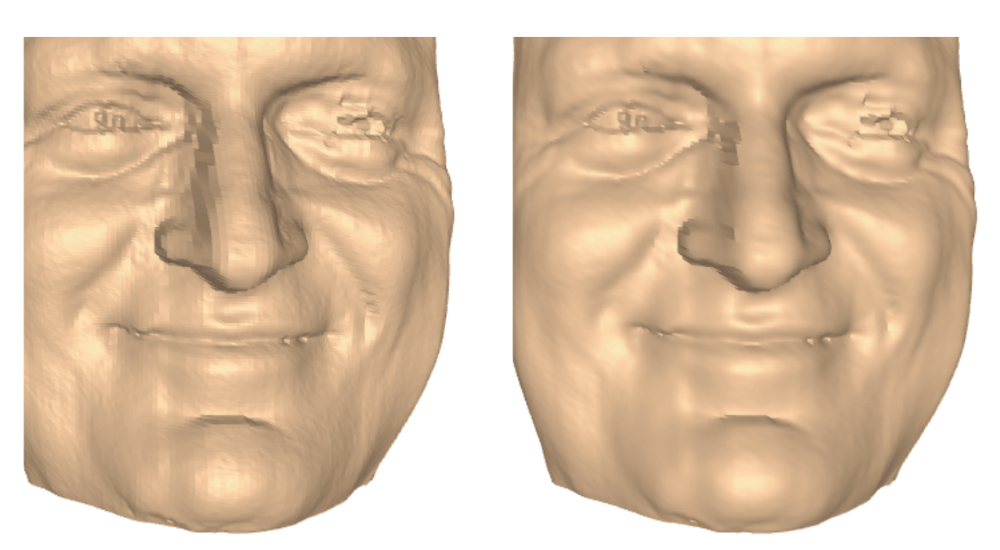

*Figure 5–13 Comparing a mesh with and without surface normals.*

```cpp
static double x[8][3]={{0,0,0}, {1,0,0}, {1,1,0}, {0,1,0},
                       {0,0,1}, {1,0,1}, {1,1,1}, {0,1,1}};

static vtkIdType pts[6][4]={{0,1,2,3}, {4,5,6,7}, {0,1,5,4},
                            {1,2,6,5}, {2,3,7,6}, {3,0,4,7}};

vtkNew<vtkPolyData> cube;
vtkNew<vtkPoints> points;
vtkNew<vtkCellArray> polys;
vtkNew<vtkFloatArray> scalars;

// Load the point, cell, and data attributes.
for (int i = 0; i < 8; i++) points->InsertPoint(i, x[i]);
for (int i = 0; i < 6; i++) polys->InsertNextCell(4, pts[i]);
for (int i = 0; i < 8; i++) scalars->InsertTuple1(i, i);

// We now assign the pieces to the vtkPolyData.
cube->SetPoints(points);
cube->SetPolys(polys);
cube->GetPointData()->SetScalars(scalars);
```

vtkPolyData can be constructed with any combination of vertices, lines, polygons, and triangle strips. Also, vtkPolyData supports an extensive set of operators that allows you to edit and modify the underlying structure.

### Generate Surface Normals

When you render a polygonal mesh, you may find that the image clearly shows the faceted nature of the mesh (Figure 5–13). The image can be improved by using Gouraud shading (see Section 4.1, "Actor Properties"). However, Gouraud shading depends on the existence of normals at each point in the mesh. The vtkPolyDataNormals filter can be used to generate normals on the mesh. Two important instance variables are Splitting and FeatureAngle. If splitting is on, feature edges (defined as edges where the polygonal normals on either side of the edge make an angle greater than or equal to the feature angle) are "split," that is, points are duplicated along the edge, and the mesh is separated on either side of the feature edge (see The Visualization Toolkit text). This creates new points, but allows sharp corners to be rendered crisply.

Another important instance variable is FlipNormals. Invoking FlipNormalsOn() causes the filter to reverse the direction of the normals (and the ordering of the polygon connectivity list).

### Decimation


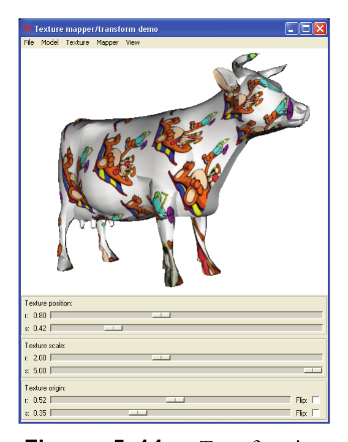

*Figure 5–14 Triangle mesh before (left) and after (right) 90% decimation.*

Polygonal data, especially triangle meshes, are a common form of graphics data. Filters such as vtkContourFilter generate triangle meshes. Often, these meshes are quite large and cannot be rendered or processed quickly enough for interactive application. Decimation techniques have been developed to address this problem. Decimation, also referred to as polygonal reduction, mesh simplification, or multiresolution modeling, is a process to reduce the number of triangles in a triangle mesh, while maintaining a faithful approximation to the original mesh. VTK supports three decimation methods: vtkDecimatePro, vtkQuadricClustering, and vtkQuadricDecimation. All are similar in usage and application, although they each offer advantages and disadvantages as follows:
- vtkDecimatePro is relatively fast and has the ability to modify topology during the reduction process. It uses an edge collapse process to eliminate vertices and triangles. Its error metric is based on distance to plane/distance to edge. A nice feature of vtkDecimatePro is that you can achieve any level of reduction requested, since the algorithm will begin tearing the mesh into pieces to achieve this (if topology modification is allowed).
- vtkQuadricDecimation uses the quadric error measure proposed by Garland and Heckbert in Siggraph '97 Surface Simplification Using Quadric Error Metrics. It uses an edge collapse to eliminate vertices and triangles. The quadric error metric is generally accepted as one of the better error metrics.
- vtkQuadricClustering is the fastest algorithm. It is based on the algorithm presented by Peter Lindstrom in his Siggraph 2000 paper Out-of-Core Simplification of Large Polygonal Models. It is capable of quickly reducing huge meshes, and the class supports the ability to process pieces of a mesh (using the StartAppend(), Append(), and EndAppend() methods). This enables the user to avoid reading an entire mesh into memory. This algorithm works well with large meshes; the triangulation process does not work well as meshes become smaller. (Combining this algorithm with one of the other algorithms is a good approach.) Here's an example using vtkDecimatePro (see `examples/deci_fran.py` and Figure 5–14).

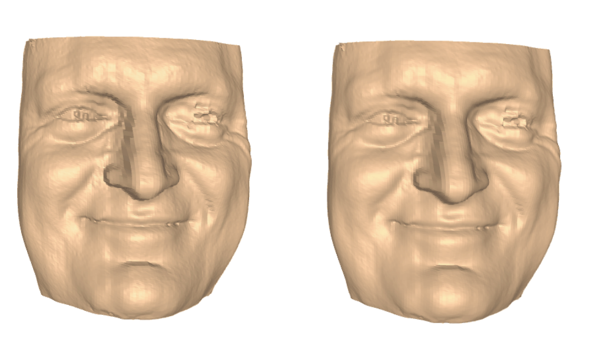

*Figure 5–15 Smoothing a polygonal mesh. Right image shows the effect of smoothing.*

```python
from vtkmodules.vtkFiltersCore import vtkDecimatePro, vtkPolyDataNormals
from vtkmodules.vtkRenderingCore import vtkActor, vtkPolyDataMapper

deci = vtkDecimatePro()
deci.SetInputConnection(fran.GetOutputPort())
deci.SetTargetReduction(0.9)
deci.PreserveTopologyOn()

normals = vtkPolyDataNormals()
normals.SetInputConnection(fran.GetOutputPort())
normals.FlipNormalsOn()

fran_mapper = vtkPolyDataMapper()
fran_mapper.SetInputConnection(normals.GetOutputPort())

fran_actor = vtkActor()
fran_actor.SetMapper(fran_mapper)
fran_actor.GetProperty().SetColor(1.0, 0.49, 0.25)
```

Two important instance variables of vtkDecimatePro are TargetReduction and PreserveTopology. The TargetReduction is the requested amount of reduction (e.g., a value of 0.9 means that we wish to reduce the number of triangles in the mesh by 90%). Depending on whether you allow topology to change or not (PreserveTopologyOn/Off()), you may or may not achieve the requested reduction. If PreserveTopology is off, then vtkDecimatePro will give you the requested reduction.

A final note: the decimation filters take triangle data as input. If you have a polygonal mesh you can convert the polygons to triangles with vtkTriangleFilter.

### Smooth Mesh

Polygonal meshes often contain noise or excessive roughness that affect the quality of the rendered image. For example, isosurfacing low resolution data can show aliasing, or stepping effects. One way to treat this problem is to use smoothing. Smoothing is a process that adjusts the positions of points to reduce the noise content in the surface.

VTK offers two smoothing objects: vtkSmoothPolyDataFilter and vtkWindowedSincPolyDataFilter. Of the two, the vtkWindowedSincPolyDataFilter gives the best results and is slightly faster. The following example (see `examples/smooth_fran.py`) shows how to use the smoothing filter. The example is the same as the one in the previous section, except that a smoothing filter has been added. Figure 5–15 shows the effects of smoothing on the decimated mesh.

```python
from vtkmodules.vtkFiltersCore import (
    vtkDecimatePro, vtkPolyDataNormals, vtkSmoothPolyDataFilter,
)
from vtkmodules.vtkRenderingCore import vtkActor, vtkPolyDataMapper

# Decimate and smooth data
deci = vtkDecimatePro()
deci.SetInputConnection(fran.GetOutputPort())
deci.SetTargetReduction(0.9)
deci.PreserveTopologyOn()

smoother = vtkSmoothPolyDataFilter()
smoother.SetInputConnection(deci.GetOutputPort())
smoother.SetNumberOfIterations(50)

normals = vtkPolyDataNormals()
normals.SetInputConnection(smoother.GetOutputPort())
normals.FlipNormalsOn()

fran_mapper = vtkPolyDataMapper()
fran_mapper.SetInputConnection(normals.GetOutputPort())

fran_actor = vtkActor()
fran_actor.SetMapper(fran_mapper)
fran_actor.GetProperty().SetColor(1.0, 0.49, 0.25)
```

Both smoothing filters are used similarly. There are optional methods for controlling the effects of smoothing along feature edges and on boundaries. Check the online documentation for more information.

### Clip Data

Clipping, like cutting (see "Cutting" above), uses an implicit function to define a surface with which to clip. Clipping separates a polygonal mesh into pieces, as shown in Figure 5–16. Clipping will break polygonal primitives into separate parts on either side of the clipping surface. Like cutting, clipping allows you to set a clip value defining the value of the implicit clipping function. The following example uses a plane to clip a polygonal model of a cow. The clip value is used to move the plane along its normal so that the model can be clipped at different locations (see `examples/clip_cow.py`).

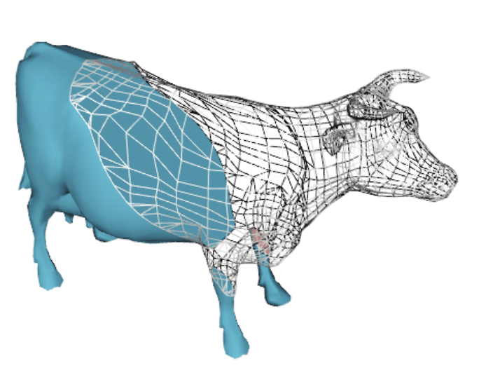

*Figure 5–16 Clipping a model.*

```python
from vtkmodules.vtkCommonDataModel import vtkPlane
from vtkmodules.vtkFiltersCore import vtkClipPolyData, vtkPolyDataNormals
from vtkmodules.vtkIOGeometry import vtkBYUReader
from vtkmodules.vtkRenderingCore import vtkActor, vtkPolyDataMapper

# Read the polygonal data and generate vertex normals.
cow = vtkBYUReader()
cow.SetGeometryFileName("data/cow.g")

cow_normals = vtkPolyDataNormals()
cow_normals.SetInputConnection(cow.GetOutputPort())

# Define a clip plane to clip the cow in half
plane = vtkPlane()
plane.SetOrigin(0.25, 0, 0)
plane.SetNormal(-1, -1, 0)

clipper = vtkClipPolyData()
clipper.SetInputConnection(cow_normals.GetOutputPort())
clipper.SetClipFunction(plane)
clipper.GenerateClippedOutputOn()
clipper.SetValue(0.5)

clip_mapper = vtkPolyDataMapper()
clip_mapper.SetInputConnection(clipper.GetOutputPort())

clip_actor = vtkActor()
clip_actor.SetMapper(clip_mapper)
clip_actor.GetProperty().SetColor(0.26, 0.44, 0.56)

# Create the rest of the cow in wireframe
rest_mapper = vtkPolyDataMapper()
rest_mapper.SetInputConnection(clipper.GetClippedOutputPort())

rest_actor = vtkActor()
rest_actor.SetMapper(rest_mapper)
rest_actor.GetProperty().SetRepresentationToWireframe()
```

The GenerateClippedOutputOn() method causes the filter to create a second output: the data that was clipped away. This output is shown in wireframe in the figure. If the SetValue() method is used to change the clip value, the implicit function will cut at a point parallel to the original plane, but above or below it. (You could also change the definition of vtkPlane to achieve the same result.)

### Generate Texture Coordinates

Several filters are available to generate texture coordinates: vtkTextureMapToPlane, vtkTextureMapToCylinder, and vtkTextureMapToSphere. These objects generate texture coordinates based on a planar, cylindrical, and spherical coordinate system, respectively. Also, the class vtkTransformTextureCoordinates allows you to position the texture map on the surface by translating and scaling the texture coordinates. The following example shows using vtkTextureMapToCylinder to create texture coordinates for an unstructured grid generated from the vtkDelaunay3D object (see `examples/texture_coords.py`).

```python
from vtkmodules.vtkFiltersCore import vtkDelaunay3D
from vtkmodules.vtkFiltersTexture import (
    vtkTextureMapToCylinder, vtkTransformTextureCoords,
)
from vtkmodules.vtkFiltersSources import vtkPointSource
from vtkmodules.vtkIOImage import vtkBMPReader
from vtkmodules.vtkRenderingCore import (
    vtkActor, vtkDataSetMapper, vtkTexture,
)

sphere = vtkPointSource()
sphere.SetNumberOfPoints(25)

delny = vtkDelaunay3D()
delny.SetInputConnection(sphere.GetOutputPort())
delny.SetTolerance(0.01)

tmapper = vtkTextureMapToCylinder()
tmapper.SetInputConnection(delny.GetOutputPort())
tmapper.PreventSeamOn()

xform = vtkTransformTextureCoords()
xform.SetInputConnection(tmapper.GetOutputPort())
xform.SetScale(4, 4, 1)

mapper = vtkDataSetMapper()
mapper.SetInputConnection(xform.GetOutputPort())

bmp_reader = vtkBMPReader()
bmp_reader.SetFileName("data/masonry.bmp")

atext = vtkTexture()
atext.SetInputConnection(bmp_reader.GetOutputPort())
atext.InterpolateOn()

triangulation = vtkActor()
triangulation.SetMapper(mapper)
triangulation.SetTexture(atext)
```

In this example a random set of points in the unit sphere is triangulated. The triangulation then has texture coordinates generated over it. These texture coordinates are then scaled in the i-j texture coordinate directions in order to cause texture repeats. Finally, a texture map is read in and assigned to the actor.

(As a side note: instances of vtkDataSetMapper are mappers that accept any type of data as input. They use an internal instance of vtkGeometryFilter followed by vtkPolyDataMapper to convert the data into polygonal primitives that can then be passed to the rendering engine. See "Extract Cells as Polygonal Data" above for further information.)

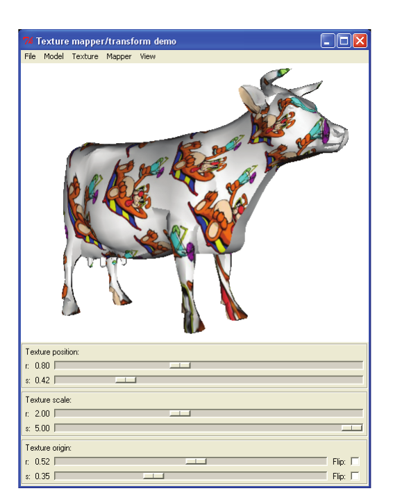

*Figure 5–17 Transforming texture coordinates.*

## 5.3 Visualizing Structured Grids

Structured grids are regular in topology, and irregular in geometry (see Figure 3–2(c)). Structured grids are often used in numerical analysis (e.g., computational fluid dynamics). The vtkStructuredGrid dataset is composed of hexahedral (vtkHexahedron) or quadrilateral (vtkQuad) cells.

### Manually Create vtkStructuredGrid
Structured grids are created by specifying grid dimensions (to define topology) along with a vtkPoints object defining the x-y-z point coordinates (to define geometry).

```python
from vtkmodules.vtkCommonCore import vtkPoints
from vtkmodules.vtkCommonDataModel import vtkStructuredGrid

points = vtkPoints()
points.InsertPoint(0, 0.0, 0.0, 0.0)
# ... insert remaining points ...

sgrid = vtkStructuredGrid()
sgrid.SetDimensions(13, 11, 11)
sgrid.SetPoints(points)
```
Make sure that the number of points in the vtkPoints object is consistent with the number of points defined by the product of the three dimension values in the i, j, and k topological directions.

### Extract Computational Plane

In most cases, structured grids are processed by filters that accept vtkDataSet as input (see Section 5.1). One filter that directly accepts vtkStructuredGrid as input is the vtkStructuredGridGeometryFilter. This filter is used to extract pieces of the grid as points, lines, or polygonal "planes", depending on the specification of the Extent instance variable. (Extent is a 6-vector that describes a (i<sub>min</sub>, i<sub>max</sub>, j<sub>min</sub>, j<sub>max</sub>, k<sub>min</sub>, k<sub>max</sub>) topological region.)

In the following example, we read a structured grid, extract three planes, and warp the planes with the associated vector data (see `examples/warp_comb.py`).

```python
from vtkmodules.vtkFiltersCore import vtkAppendPolyData, vtkPolyDataNormals
from vtkmodules.vtkFiltersGeneral import vtkWarpScalar
from vtkmodules.vtkFiltersGeometry import vtkStructuredGridGeometryFilter
from vtkmodules.vtkIOParallel import vtkMultiBlockPLOT3DReader
from vtkmodules.vtkRenderingCore import vtkActor, vtkPolyDataMapper

pl3d = vtkMultiBlockPLOT3DReader()
pl3d.SetXYZFileName("data/combxyz.bin")
pl3d.SetQFileName("data/combq.bin")
pl3d.SetScalarFunctionNumber(100)
pl3d.SetVectorFunctionNumber(202)
pl3d.Update()
block = pl3d.GetOutput().GetBlock(0)

plane = vtkStructuredGridGeometryFilter()
plane.SetInputData(block)
plane.SetExtent(10, 10, 1, 100, 1, 100)

plane2 = vtkStructuredGridGeometryFilter()
plane2.SetInputData(block)
plane2.SetExtent(30, 30, 1, 100, 1, 100)

plane3 = vtkStructuredGridGeometryFilter()
plane3.SetInputData(block)
plane3.SetExtent(45, 45, 1, 100, 1, 100)

append_f = vtkAppendPolyData()
append_f.AddInputConnection(plane.GetOutputPort())
append_f.AddInputConnection(plane2.GetOutputPort())
append_f.AddInputConnection(plane3.GetOutputPort())

warp = vtkWarpScalar()
warp.SetInputConnection(append_f.GetOutputPort())
warp.UseNormalOn()
warp.SetNormal(1.0, 0.0, 0.0)
warp.SetScaleFactor(2.5)

normals = vtkPolyDataNormals()
normals.SetInputConnection(warp.GetOutputPort())
normals.SetFeatureAngle(60)

plane_mapper = vtkPolyDataMapper()
plane_mapper.SetInputConnection(normals.GetOutputPort())
plane_mapper.SetScalarRange(block.GetScalarRange())

plane_actor = vtkActor()
plane_actor.SetMapper(plane_mapper)
```

### Subsampling Structured Grids

Structured grids can be subsampled like image data can be (see Chapter 6). The vtkExtractGrid performs the subsampling and data extraction.

```python
from vtkmodules.vtkFiltersExtraction import vtkExtractGrid

extract = vtkExtractGrid()
extract.SetInputData(block)
extract.SetVOI(30, 30, -1000, 1000, -1000, 1000)
extract.SetSampleRate(1, 2, 3)
extract.IncludeBoundaryOn()
```

In this example, a subset of the original structured grid (which has dimensions 57x33x25) is extracted with a sampling rate of (1,2,3) resulting in a structured grid with dimensions (1,17,9). The IncludeBoundaryOn method makes sure that the boundary is extracted even if the sampling rate does not pick up the boundary.

## 5.4 Visualizing Rectilinear Grids

Rectilinear grids are regular in topology, and semi-regular in geometry (see Figure 3–2(b)). Rectilinear grids are often used in numerical analysis. The vtkRectilinearGrid dataset is composed of voxel (vtkVoxel) or pixel (vtkPixel) cells.

### Manually Create vtkRectilinearGrid
Rectilinear grids are created by specifying grid dimensions (to define topology) along with three scalar arrays to define point coordinates along the x-y-z axes (to define geometry).

```cpp
vtkNew<vtkFloatArray> xCoords;
for (int i = 0; i < 47; i++) xCoords->InsertNextValue(x[i]);

vtkNew<vtkFloatArray> yCoords;
for (int i = 0; i < 33; i++) yCoords->InsertNextValue(y[i]);

vtkNew<vtkFloatArray> zCoords;
for (int i = 0; i < 44; i++) zCoords->InsertNextValue(z[i]);

vtkNew<vtkRectilinearGrid> rgrid;
rgrid->SetDimensions(47, 33, 44);
rgrid->SetXCoordinates(xCoords);
rgrid->SetYCoordinates(yCoords);
rgrid->SetZCoordinates(zCoords);
```

Make sure that the number of scalars in the x, y, and z directions equals the three dimension values in the i, j, and k topological directions.

### Extract Computational Plane

In most cases, rectilinear grids are processed by filters that accept vtkDataSet as input (see Section 5.1). One filter that directly accepts vtkRectilinearGrid as input is the vtkRectilinearGridGeometryFilter. This filter is used to extract pieces of the grid as points, lines, or polygonal "planes", depending on the specification of the Extent instance variable. (Extent is a 6-vector that describes a (i<sub>min</sub>, i<sub>max</sub>, j<sub>min</sub>, j<sub>max</sub>, k<sub>min</sub>, k<sub>max</sub>) topological region.) We extract a plane as follows:

```cpp
vtkNew<vtkRectilinearGridGeometryFilter> plane;
plane->SetInputData(rgrid);
plane->SetExtent(0, 46, 16, 16, 0, 43);
```

## 5.5 Visualizing Unstructured Grids

Unstructured grids are irregular in both topology and geometry (see Figure 3–2(f)). Unstructured grids are often used in numerical analysis (e.g., finite element analysis). Any and all cell types can be represented in an unstructured grid.

### Manually Create vtkUnstructuredGrid

Unstructured grids are created by defining geometry via a vtkPoints instance, and defining topology by inserting cells.

```python
from vtkmodules.vtkCommonCore import vtkPoints
from vtkmodules.vtkCommonDataModel import vtkTetra, vtkUnstructuredGrid

tetra_points = vtkPoints()
tetra_points.SetNumberOfPoints(4)
tetra_points.InsertPoint(0, 0, 0, 0)
tetra_points.InsertPoint(1, 1, 0, 0)
tetra_points.InsertPoint(2, 0.5, 1, 0)
tetra_points.InsertPoint(3, 0.5, 0.5, 1)

a_tetra = vtkTetra()
a_tetra.GetPointIds().SetId(0, 0)
a_tetra.GetPointIds().SetId(1, 1)
a_tetra.GetPointIds().SetId(2, 2)
a_tetra.GetPointIds().SetId(3, 3)

a_tetra_grid = vtkUnstructuredGrid()
a_tetra_grid.Allocate(1, 1)
a_tetra_grid.InsertNextCell(a_tetra.GetCellType(), a_tetra.GetPointIds())
a_tetra_grid.SetPoints(tetra_points)
# ... insert other cells if any ...
```

It is mandatory that you invoke the Allocate() method prior to inserting cells into an instance of vtkUnstructuredGrid. The values supplied to this method are the initial size of the data, and the size to extend the allocation by when additional memory is required. Larger values generally give better performance (since fewer memory reallocations are required).

### Contour Unstructured Grids

A special contouring class is available to generate isocontours for unstructured grids.

The class vtkContourGrid is a higher-performing version than the generic vtkContourFilter isocontouring filter. Normally you do not need to instantiate this class directly since vtkContourFilter will automatically create an internal instance of vtkContourGrid if it senses that its input is of type vtkUnstructuredGrid.

This concludes our overview of visualization techniques. You may also wish to refer to the next chapter which describes image processing and volume rendering.
