# Chapter 6: Image Processing & Visualization

Image datasets, represented by the class vtkImageData, are regular in topology and geometry as shown in Figure 6–1.

This data type is structured, meaning that the locations of the data points are implicitly defined using just the few parameters origin, spacing and dimensions. Medical and scientific scanning devices such as CT, MRI, ultrasound scanners, and confocal microscopes often produce data of this type. Conceptually, the vtkImageData dataset is composed of voxel (vtkVoxel) or pixel (vtkPixel) cells. However, the structured nature of this dataset allows us to store the data values in a simple array rather than explicitly creating the vtkVoxel or vtkPixel cells.

In VTK, image data is a special data type that can be processed and rendered in several ways. Although not an exhaustive classification, most of the operations performed on image data in VTK fall into one of the three categories—image processing, geometry extraction, or direct rendering. Dozens of image processing filters exist that can operate on image datasets. These filters take vtkImageData as input and produce vtkImageData as output. Geometry extraction filters exist that convert vtkImageData into vtkPolyData. For example, the vtkContourFilter can extract iso-valued contours in triangular patches from the image dataset. Finally, there are various mappers and specialized actors to render vtkImageData, including techniques ranging from simple 2D image display to volume rendering.

In this chapter we examine some important image processing techniques. We will discuss basic image display, image processing, and geometry extraction as elevation maps. Other geometry extraction techniques such as contouring are covered in Chapter 5. Volume rendering of both vtkImageData and vtkUnstructuredGrid is covered in Chapter 7.

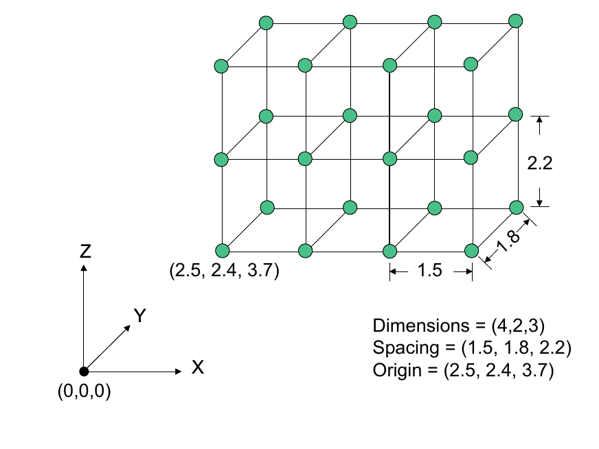

*Figure 6–1 The vtkImageData structure is defined by dimensions, spacing, and origin. The dimensions are the number of voxels or pixels along each of the major axes. The origin is the world coordinate position of the lower left corner of the first slice of the data. The spacing is the distance between pixels along each of the three major axes.*

## 6.1 Manually Creating vtkImageData

Creating image data is straightforward: you need only define the dimensions, origin, and spacing of the dataset. The origin is the world coordinate position of the lower left hand corner of the dataset. The dimensions are the number of voxels or pixels along each of the three major axes. The spacing is the height, length, and width of a voxel or the distance between neighboring pixels, depending on whether you view your data as homogeneous boxes or sample points in a continuous function.

In this first example we will assume that we have an array of unsigned character values pointed to by the variable data, and containing size[0] by size[1] by size[2] samples. We generated this data outside of VTK, and now we want to get this data into a vtkImageData so that we can use the VTK filtering and rendering operations. We will give VTK a pointer into the memory, but we will manage the deletion of the memory ourselves.

The first thing we need to do is create an array of unsigned chars to store the data. We use the SetArray() method to specify the pointer to the data and its size, with the final argument indicating that VTK should not free this memory.

```cpp
vtkNew<vtkUnsignedCharArray> array;
array->SetArray(data, size[0] * size[1] * size[2], 1);
```

The second step is to create the image data. We must take care that all values match—the scalar type of the image data must be unsigned char, and the dimensions of the image data must match the size of the data.

```cpp
vtkNew<vtkImageData> imageData;
imageData->GetPointData()->SetScalars(array);
imageData->SetDimensions(size);
imageData->AllocateScalars(VTK_UNSIGNED_CHAR, 1);
imageData->SetSpacing(1.0, 1.0, 1.0);
imageData->SetOrigin(0.0, 0.0, 0.0);
```

What's important about image datasets is that because the geometry and topology are implicitly defined by the dimensions, origin, and spacing, the storage required to represent the dataset structure is tiny. Also, computation on the structure is fast because of its regular arrangement. What does require storage is the attribute data that goes along with the dataset.

In this next example, we will use C++ to create the image data. Instead of manually creating the data array and associating it with the image data, we will have the vtkImageData object create the scalar data for us. This eliminates the possibility of mismatching the size of the scalars with the dimensions of the image data.

```cpp
// Create the image data
vtkNew<vtkImageData> id;
id->SetDimensions(10, 25, 100);
id->AllocateScalars(VTK_UNSIGNED_SHORT, 1);
// Fill in scalar values
unsigned short *ptr = (unsigned short *)id->GetScalarPointer();
for (int i = 0; i < 10 * 25 * 100; i++)
{
    *ptr++ = i;
}
```

In this example, the convenience method AllocateScalars() is used to allocate storage for the image data. Notice that the scalar type and number of scalar components are passed directly to AllocateScalars(). Then the method GetScalarPointer(), which returns a void*, is invoked and the result is cast to unsigned short. We can do this knowing that the type is unsigned short because we specified this earlier. Imaging filters in VTK work on images of any scalar type. Their RequestData() methods query the scalar type and then switch on the type to a templated function in their implementation. VTK has by design chosen to avoid exposing the scalar type as a template parameter, in its public interface. This makes it easy to provide an interface to wrapped languages, such as Java and Python which lack templates.

## 6.2 Subsampling Image Data

As we saw in Section 5.1 ("Extract Subset of Cells"), extracting parts of a dataset is often desirable. The filter vtkExtractVOI extracts pieces of the input image dataset. The filter can also subsample the data, although vtkImageReslice (covered later) provides more flexibility with resampling data. The output of the filter is also of type vtkImageData.

There are actually two similar filters that perform this clipping functionality in VTK: vtkExtractVOI and vtkImageClip. The reason for two separate versions is historical—the imaging pipeline used to be separate from the graphics pipeline, with vtkImageClip working only on vtkImageData in the imaging pipeline and vtkExtractVOI working only on vtkStructuredPoints in the graphics pipeline. These distinctions are gone now, but there are still some differences between these filters. vtkExtractVOI will extract a subregion of the volume and produce a vtkImageData that contains exactly this information. In addition, vtkExtractVOI can be used to resample the volume within the VOI. On the other hand, vtkImageClip by default will pass the input data through to the output unchanged except for the extent information. A flag may be set on this filter to force it to produce the exact amount of data only, in which case the region will be copied into the output vtkImageData. The vtkImageClip filter cannot resample the volume.

The following Python example demonstrates how to use vtkExtractVOI. It extracts a piece of the input volume, and then subsamples it. The output is passed to a vtkContourFilter. (You may want to try removing vtkExtractVOI and compare the results.)

```python
# Quadric definition
quadric = vtkQuadric()
quadric.SetCoefficients(0.5, 1, 0.2, 0, 0.1, 0, 0, 0.2, 0, 0)

sample = vtkSampleFunction()
sample.SetSampleDimensions(30, 30, 30)
sample.SetImplicitFunction(quadric)
sample.ComputeNormalsOff()

extract = vtkExtractVOI()
extract.SetInputConnection(sample.GetOutputPort())
extract.SetVOI(0, 29, 0, 29, 15, 15)
extract.SetSampleRate(1, 2, 3)

contours = vtkContourFilter()
contours.SetInputConnection(extract.GetOutputPort())
contours.GenerateValues(13, 0.0, 1.2)

contour_mapper = vtkPolyDataMapper()
contour_mapper.SetInputConnection(contours.GetOutputPort())
contour_mapper.SetScalarRange(0.0, 1.2)

contour_actor = vtkActor()
contour_actor.SetMapper(contour_mapper)
```

Note that this script extracts a plane from the original data by specifying the volume of interest (VOI) as (0,29,0,29,15,15) (i<sub>min</sub> ,i<sub>max</sub> , j<sub>min</sub> ,j<sub>max</sub> , k<sub>min</sub> ,k<sub>max</sub> ) and that the sample rate is set differently along each of the i-j-k topological axes. You could also extract a subvolume or even a line or point by modifying the VOI specification. (The volume of interest is specified using 0-offset values.)

## 6.3 Warp Based On Scalar Values

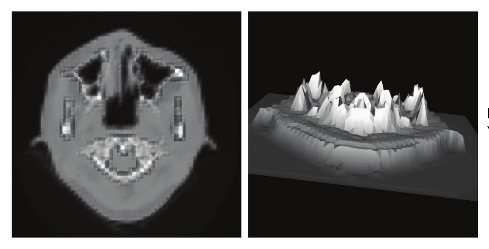

*Figure 6–2 Image warped by scalar values.*

One common use of image data is to store elevation values as an image. These images are frequently called range maps or elevation maps. The scalar value for each pixel in the image represents an elevation, or range value. A common task in visualization is to take such an image and warp it to produce an accurate 3D representation of the elevation or range data. Consider Figure 6–2 which shows an image that has been warped based on its scalar value. The left image shows the original image while the right view shows the image after warping to produce a 3D surface.

The pipeline to perform this visualization is fairly simple, but there is an important concept to understand. The original data is an image which has implicit geometry and topology. Warping the image will result in a 3D surface where geometry is no longer implicit. To support this we first convert the image to a vtkPolyData representation using vtkImageDataGeometryFilter. Then we perform the warp and connect to a mapper. In the script below you'll note that we also make use of vtkWindowLevelLookupTable to provide a greyscale lookup-table instead of the default red to blue lookup table.

```python
reader = vtkVolume16Reader()
reader.SetDataDimensions(64, 64)
reader.SetDataByteOrderToLittleEndian()
reader.SetImageRange(40, 40)
reader.SetFilePrefix(os.path.join(data_dir, "headsq", "quarter"))
reader.SetDataMask(0x7FFF)

geometry = vtkImageDataGeometryFilter()
geometry.SetInputConnection(reader.GetOutputPort())

warp = vtkWarpScalar()
warp.SetInputConnection(geometry.GetOutputPort())
warp.SetScaleFactor(0.005)

wl_lut = vtkWindowLevelLookupTable()

mapper = vtkPolyDataMapper()
mapper.SetInputConnection(warp.GetOutputPort())
mapper.SetScalarRange(0, 2000)
mapper.SetLookupTable(wl_lut)

actor = vtkActor()
actor.SetMapper(mapper)
```

This example is often combined with other techniques. If you want to warp the image with its scalar value and then color it with a different scalar field you would use the vtkMergeFilter. Another common operation is to reduce the number of polygons in the warped surface. Because these surfaces were generated from images they tend to have a large number of polygons. You can use vtkDecimatePro to reduce the number. You should also consider using vtkTriangleFilter followed by vtkStripper to convert the polygons (squares) into triangle strips which tend to render faster and consume less memory.

## 6.4 Image Display

There are several ways to directly display image data. Two methods that are generally applicable for displaying 2D images are described in this section. Volume rendering is the method for directly displaying 3D images (volumes) and is described in detail in Chapter 7.

### Image Viewer

vtkImageViewer2 is a convenient class for displaying images. It replaces an earlier version of the class vtkImageViewer. vtkImageViewer2 internally encapsulates several objects - vtkRenderWindow, vtkRenderer, vtkImageActor and vtkImageMapToWindowLevelColors providing an easy to use class that can be dropped into your application. This class also creates an interactor style (vtkInteractorStyleImage) customized for images, that allows zooming and panning of images, and supports interactive window/level operations on the image. (See Chapter 10 for more information about interactor styles.) vtkImageViewer2 (unlike vtkImageViewer) uses the 3D rendering and texture mapping engine to draw an image on a plane. This allows for rapid rendering, zooming, and panning. The image is placed in the 3D scene at a depth based on the depth-coordinate of the particular image slice. Each call to SetSlice() changes the image data (slice) displayed and changes the depth of the displayed slice in the 3D scene. This can be controlled by the AutoAdjustCameraClippingRange option on the InteractorStyle. You may also set the orientation to display an XY, YZ or an XZ slice.

An example of using an image viewer to browse through the slices in a volume can be found in Widgets/Testing/Cxx/TestImageActorContourWidget.cxx. The following excerpt illustrates a typical usage of this class.

```cpp
vtkNew<vtkImageViewer2> imageViewer;
imageViewer->SetInputConnection(shifter->GetOutputPort());
imageViewer->SetColorLevel(127);
imageViewer->SetColorWindow(255);
imageViewer->SetupInteractor(interactor);
imageViewer->SetSlice(40);
imageViewer->SetOrientationToXY();
imageViewer->Render();
```

It is possible to mix images and geometry, for instance :

```cpp
viewer->SetInputConnection(myImage->GetOutputPort());
viewer->GetRenderer()->AddActor(myActor);
```

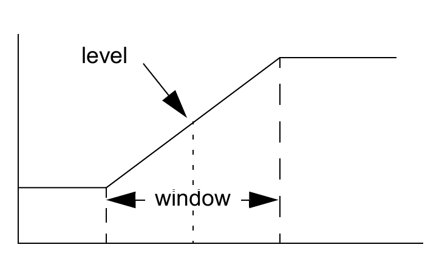

*Figure 6–3 Window-level transfer function.*


This can be used to annotate an image with a PolyData of "edges" or highlight sections of an image or display a 3D isosurface with a slice from the volume, etc. Any portions of your geometry that are in front of the displayed slice will be visible; any portions of your geometry that are behind the displayed slice will be obscured.

The window-level transfer function is defined as shown in Figure 6–3. The level is the data value level that centers the window. The width (i.e., window) defines the range of data values that are mapped to the display. The slope of the resulting transfer function determines the amount of contrast in the final image. All data values outside of the window are clamped to the data values at the boundaries of the window.

### Image Actor

Using a vtkImageViewer is convenient when you would simply like to display the image in a window by itself or accompanied by some simple 2D annotation. The vtkImageActor actor class is useful when you want to display your image in a 3D rendering window. The image is displayed by creating a polygon representing the bounds of the image and using hardware texture mapping to paste the image onto the polygon. On most platforms this enables you to rotate, pan, and zoom your image with bilinear interpolation in real-time. By changing the interactor to a vtkInteractorStyleImage you can limit rotations so that the 3D render window operates as a 2D image viewer. The advantage to using the 3D render window for image display is that you can easily embed multiple images and complex 3D annotation into one window.

The vtkImageActor object is a composite class that encapsulates both an actor and a mapper into one class. It is simple to use, as can be seen in this example.

```python
bmp_reader = vtkBMPReader()
bmp_reader.SetFileName("masonry.bmp")

image_actor = vtkImageActor()
image_actor.SetInputData(bmp_reader.GetOutput())
```

This image actor can then be added to the renderer using the AddProp() method. The vtkImageActor class expects that its input will have a length of 1 along one of the three dimensions, with the image extending along the other two dimensions. This allows the vtkImageActor to be connected to a volume through the use of a clipping filter without the need to reorganize the data if the clip is performed along the X or Y axis. (Note: the input image to vtkImageActor must be of type unsigned char. If your image type is different, you can use vtkImageCast or vtkImageShiftScale to convert to unsigned char.)

### vtkImagePlaneWidget
Widgets are covered in Chapter 12 ("Interaction, Widgets and Selections"). Suffice it to mention that this widget defines a plane that can be interactively placed in an image volume, with the plane displaying resliced data through the volume. Interpolation options to reslice the data include nearest neighbor, linear and cubic. The plane position and orientation can be interactively manipulated. One can also window level interactively on the resliced plane and optionally display window level and position annotations.

```cpp
vtkNew<vtkImagePlaneWidget> planeWidgetX;
planeWidgetX->SetInteractor(interactor);
planeWidgetX->RestrictPlaneToVolumeOn();
planeWidgetX->SetResliceInterpolateToNearestNeighbour();
planeWidgetX->SetInputConnection(v16->GetOutputPort());
planeWidgetX->SetPlaneOrientationToXAxes();
planeWidgetX->SetSliceIndex(32);
planeWidgetX->DisplayTextOn();
planeWidgetX->On();
```

## 6.5 Image Sources

There are some image processing objects that produce output but do not take any data objects as input. These are known as image sources, and some of the VTK image sources are described here. Refer to Chapter 12 ("Source Objects") or to the Doxygen documentation for a more complete list of available image sources.

### ImageCanvasSource2D

The vtkImageCanvasSource2D class creates a blank two-dimensional image of a specified size and type and provides methods for drawing various primitives into this blank image. Primitives include boxes, lines, and circles; a flood fill operation is also provided. The following example illustrates the use of this source by creating a 512x512 pixel image and drawing several primitives into it. The resulting image is shown in Figure 6–4.

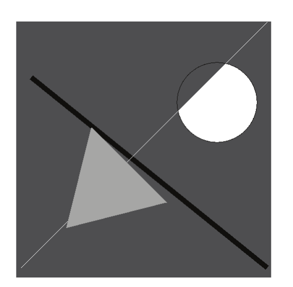

*Figure 6–4 The results from a vtkImageCanvasSource2D source after drawing various primitives.*

```python
# Set up the size and type of the image canvas
canvas = vtkImageCanvasSource2D()
canvas.SetScalarTypeToUnsignedChar()
canvas.SetExtent(0, 511, 0, 511, 0, 0)

# Draw various primitives
canvas.SetDrawColor(86)
canvas.FillBox(0, 511, 0, 511)
canvas.SetDrawColor(0)
canvas.FillTube(500, 20, 30, 400, 5)
canvas.SetDrawColor(255)
canvas.DrawSegment(10, 20, 500, 510)
canvas.SetDrawColor(0)
canvas.DrawCircle(400, 350, 80.0)
canvas.SetDrawColor(255)
canvas.FillPixel(450, 350)
canvas.SetDrawColor(170)
canvas.FillTriangle(100, 100, 300, 150, 150, 300)

# Show the resulting image
viewer = vtkImageViewer2()
viewer.SetInputConnection(canvas.GetOutputPort())
viewer.SetColorWindow(256)
viewer.SetColorLevel(127.5)
```

### ImageEllipsoidSource
If you would like to write your own image source using a templated execute function, vtkImageEllipsoidSource is a good starting point. This object produces a binary image of an ellipsoid as output based on a center position, a radius along each axis, and the inside and outside values. The output scalar type can also be specified, and this is why the execute function is templated. This source is used internally by some of the imaging filters such as vtkImageDilateErode3D.

If you want to create a vtkImageBoxSource, for example, to produce a binary image of a box, you could start by copying the vtkImageEllipsoidSource source and header files and doing a global search and replace. You would probably change the instance variable Radius to be Length since this is a more appropriate description for a box source. Finally, you would replace the code within the templated function vtkImageBoxSourceExecute to create the box image rather than the ellipsoid image. (For more information on creating image processing filters see Chapter 12, "A Threaded Imaging Filter".)

### ImageGaussianSource
The vtkImageGaussianSource object produces an image with pixel values determined according to a Gaussian distribution using a center location, a maximum value, and a standard deviation. The data type of the output of this image source is always floating point (i.e., double).

If you would like to write your own source that produces just one type of output image, for example float, then this might be a good class to use as a starting point. Comparing the source code for vtkImageGaussianSource with that for vtkImageEllipsoidSource, you will notice that the filter implementation is in the RequestData() method for vtkImageGaussianSource, whereas in vtkImageEllipsoidSource the RequestData() method calls a templated function that contains the implementation.

### ImageGridSource
If you would like to annotate your image with a 2D grid, vtkImageGridSource can be used to create an image with the grid pattern (Figure 6–5). The following example illustrates this use by blending a grid pattern with a slice from a CT dataset. The reader is a vtkVolume16Reader that produces a 64 by 64 image.

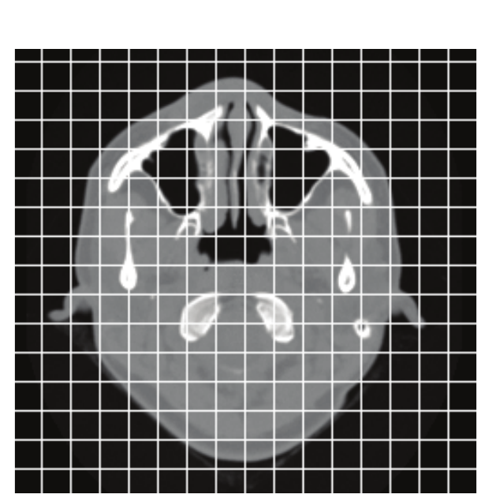

*Figure 6–5 A grid pattern created by a vtkImageGridSource is overlaid on a slice of a CT dataset.*

```python
image_grid = vtkImageGridSource()
image_grid.SetGridSpacing(16, 16, 0)
image_grid.SetGridOrigin(0, 0, 0)
image_grid.SetDataExtent(0, 63, 0, 63, 0, 0)
image_grid.SetLineValue(4095)
image_grid.SetFillValue(0)
image_grid.SetDataScalarTypeToUnsignedShort()

blend = vtkImageBlend()
blend.SetOpacity(0, 0.5)
blend.SetOpacity(1, 0.5)
blend.AddInputConnection(reader.GetOutputPort())
blend.AddInputConnection(image_grid.GetOutputPort())

viewer = vtkImageViewer2()
viewer.SetInputConnection(blend.GetOutputPort())
viewer.SetColorWindow(1000)
viewer.SetColorLevel(500)
viewer.Render()
```

### ImageNoiseSource
The vtkImageNoiseSource image source can be used to generate an image filled with random numbers between some specified minimum and maximum values. The type of the output image is floating point.

One thing to note about vtkImageNoiseSource is that it will produce a different image every time it executes. Normally, this is the desired behavior of a noise source, but this has negative implications in a streaming pipeline with overlap in that the overlapping region will not have the same values across the two requests. For example, assume you set up a pipeline with a vtkImageNoiseSource connected to an ImageMedianFilter which is in turn connected to a vtkImageDataStreamer. If you specify a memory limit in the streamer such that the image will be computed in two halves, the first request the streamer makes would be for half the image. The median filter would need slightly more than half of the input image (based on the extent of the kernel) to produce the requested output image. When the median filter executes the second time to produce the second half of the output image, it will again request the overlap region, but this region will contain different values, causing any values computed using the overlap region to be inconsistent.

### ImageSinusoidSource

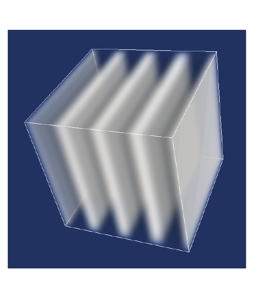

*Figure 6–6 The output of the sinusoid source shown on the left has been converted to unsigned char and volume rendered.*

The vtkImageSinusoidSource object can be used to create an image of a specified size where the pixel values are determined by a sinusoid function given direction, period, phase, and amplitude values. The output of the sinusoid source is floating point. In the image shown in Figure 6–6, the output of the sinusoid source has been converted to unsigned char values and volume rendered. This same output was passed through an outline filter to create the bounding box seen in the image.

```python
sinusoid = vtkImageSinusoidSource()
sinusoid.SetWholeExtent(0, 99, 0, 99, 0, 99)
sinusoid.SetAmplitude(63)
sinusoid.SetDirection(1, 0, 0)
sinusoid.SetPeriod(25)
```

## 6.6 Image Processing

Now we will consider a few examples that process image data. This is not an exhaustive description of all filters, but it will get you started using VTK's image processing filters. You may wish to refer to the Doxygen documentation for more information. In addition, a more complete description can be found in Chapter 12 ("Imaging Filters").

### Convert Scalar Type

It is sometimes necessary to convert an input image of one scalar type to an output image of another scalar type. For example, certain filters only operate on input of a specific scalar type such as float or integer. Alternatively, you may wish to use an image directly as color values without using a lookup table to map the scalars into color. To do this the image scalar type must be unsigned char.

There are two classes in VTK that can be used to convert the scalar type of an image. The vtkImageCast filter allows you to specify the output scalar type. This filter works well when, for example, you know that your image contains only values between 0 and 255, but is currently stored as unsigned integers. You can then use vtkImageCast to convert the image to unsigned char. If you set the ClampOverflow instance variable to on, then values outside the range of the output scalar type will be clamped before assignment. For example, if your input image contained a 257, it would be stored in the output image as 255 if ClampOverflow is on; it will be stored as 1 if ClampOverflow is not on.

If you need to convert a floating point image containing intensities in the [-1,1] range to an unsigned char image, vtkImageCast would not work. In this situation, vtkImageShiftScale would be the correct filter to perform the conversion. This filter allows you to specify a shift and scale operation to be performed on the input image pixel values before they are stored in the output image. To perform this conversion, the shift would be set to +1 and the scale would be set to 127.5. This would map the value -1 to (-1+1)*127.5 = 0, and it would map the value +1 to (+1+1)*127.5 = 255.

### Change Spacing, Origin, or Extent

A frequent source of confusion in VTK occurs when users needs to change the origin, spacing, or extent of their data. It is tempting to get the output of some filter, and adjust these parameters to the desired values. However, as users quickly note this is only a temporary solution – the next time the pipeline updates, these changes are lost and the data will revert back to its previous shape and location. To change these parameters, it is necessary to introduce a filter into the pipeline to make the change. The vtkImageChangeInformation filter can be used to adjust the origin, spacing, and extent of a vtkImageData. The origin and spacing values can be set explicitly, as can the start of the output whole extent. Since the dimensions of the data do not change, the start of the whole extent fully defines the output whole extent. The vtkImageChangeInformation filter also contains several convenience methods to center the image, translate the extent, or translate and scale the origin and spacing values.

In the following example we use a vtkVolume16Reader to read in the raw medical data for a CT scan. We then pass this data through a 3D vtkImageGradient and display the result as a color image.

```python
reader = vtkVolume16Reader()
reader.SetDataDimensions(64, 64)
reader.SetDataByteOrderToLittleEndian()
reader.SetImageRange(1, 93)
reader.SetFilePrefix(os.path.join(data_dir, "headsq", "quarter"))
reader.SetDataMask(0x7FFF)

gradient = vtkImageGradient()
gradient.SetInputConnection(reader.GetOutputPort())
gradient.SetDimensionality(3)

viewer = vtkImageViewer2()
viewer.SetInputConnection(gradient.GetOutputPort())
viewer.SetSlice(22)
viewer.SetColorWindow(400)
viewer.SetColorLevel(0)
```

### Append Images

There are two different classes for appending images in VTK allowing images to be combined either spatially or by concatenating the components. Images may be combined spatially to form a larger image using vtkImageAppend, while vtkImageAppendComponents can be used, for example, to combine independent red, green, and blue images to form a single RGB image.

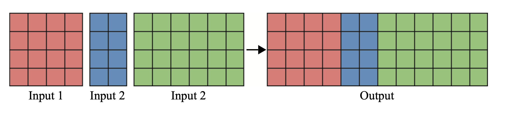

*Figure 6–7 Appending three 2D images along the X axis with PreserveExtents off.*

 Recall that an image may be 1-, 2-, or 3-dimensional. When combined spatially, the output image may increase dimensionality. For example, you can combine multiple independent one-dimensional rows to form a two-dimensional image, or you may combine a stack of 2D images to form a volume. The vtkImageAppend filter combines a set of images spatially using one of two methods. If the PreserveExtents instance variable is turned off, then the images are appended along the axis defined by the AppendAxis instance variable. Except along the AppendAxis, the input images must all have the same dimensions, and they must all have the same scalar type and number of scalar components. The origin and spacing of the output image will be the same as the origin and spacing of the first input image. An example of combining three 2D images along AppendAxis 0 (the X axis) to form a wider 2D image is shown in Figure 6–7. In Figure 6–8 we see an example where a set of 2D XY images are combined along AppendAxis 2 (the Z axis) to form a volume.

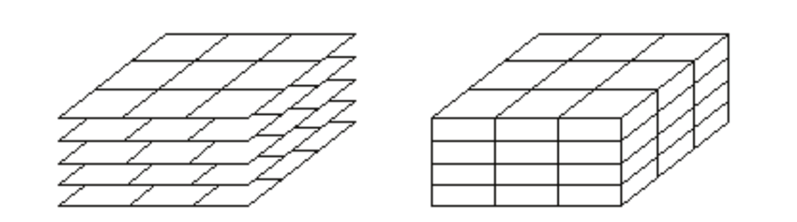

*Figure 6–8 Appending 2D (XY) images along the Z axis to form a 3D volume.*

 If the PreserveExtents instance variable is on, the vtkImageAppend filter will create an output that contains the set of input images based on the union of their whole extents. The origin and spacing are copied from the first input image, and the output image is initialized to 0. Each input image is then copied into the output image. No blending is performed when two input images both define the same pixel in the output image. Instead, the order of the input images determines the value in the output image, with the highest numbered (last added) input image value stored in the output pixel. An example of appending images with PreserveExtents on with three co-planar non-overlapping 2D input images is shown in Figure 6–9.

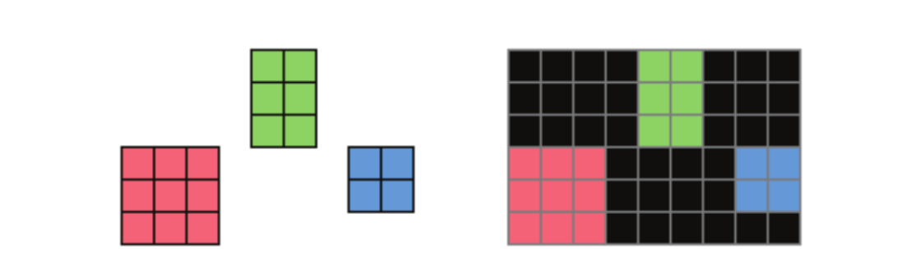

*Figure 6–9 Appending 2D images with PreserveExtents on.*

Note that vtkImageAppend considers the pixel or voxel extents of the data rather than world coordinates. This filter functions as if all input images have the same origin and spacing, and therefore the location of each image relative to the other input images is defined solely by the extent of that image.

The vtkImageAppendComponents filter can be used to combine the components of multiple inputs that all have the same scalar type and dimensions. The origin and spacing of the output image will be obtained from the first input image. The output image will have a number of components equal to the sum of the number of components of all the input images. Frequently this filter is used to combine independent red, green, and blue images into a single color image. An example of this can be seen in Figure 6–10.

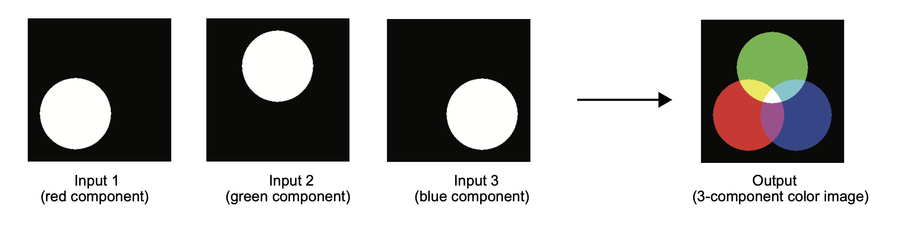

*Figure 6–10. Using vtkImageAppendComponents to combine three single-component images into a single color image. *

### Map Image to Color

vtkImageMapToColors is used for transforming a grayscale image into a color one. (See Figure 6– 11.) The input's scalar values may be of any data type. A user-selected component (chosen using the SetActiveComponent() method of vtkImageMapToColors) of the input's scalar values is mapped through an instance of vtkScalarsToColors, and the color values from the lookup table are stored in the output image. vtkImageMapToWindowLevelColors, a subclass of vtkImageMapToColors, additionally modulates the color values with a window-level function (see Figure 6–3) before storing them in the output image. The scalar type of the output image of either filter is unsigned char.

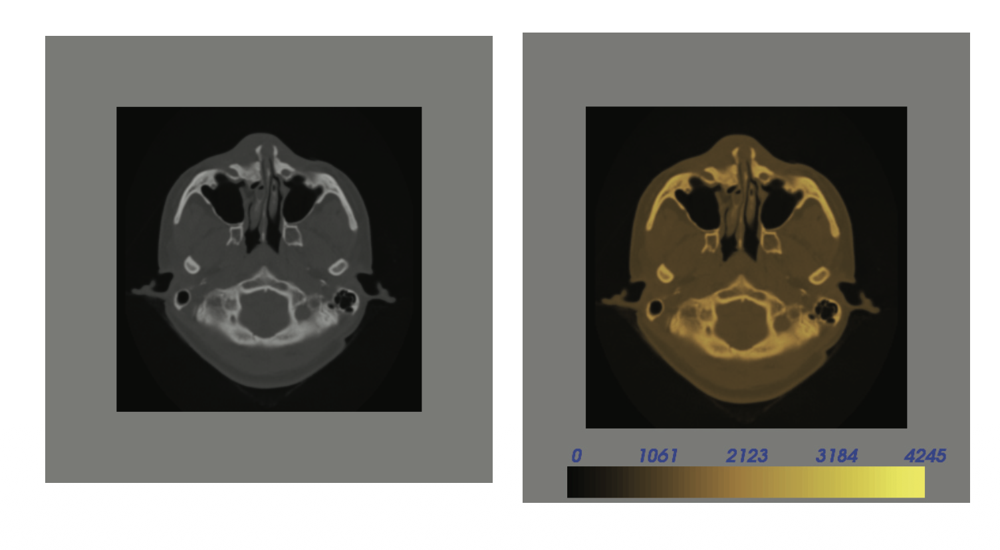

*Figure 6–11 The image on the right is the result of passing the image on the left through a vtkImageMapToColors filter. The color map used is shown in the scalar bar at the bottom of the right-hand image.*

### Image Luminance

The vtkImageLuminance filter is basically the opposite of vtkImageMapToColors. (See Figure 6– 12.) It converts an RGB image (red, green, and blue color components) to a single-component grayscale image using the following formula.

```text
luminance = 0.3*R + 0.59*G + 0.11*B
```

In this formula, R is the first component (red) of the input image, G is the second component (green), and B is the third component (blue). This calculation computes how bright a given color specified using RGB components appears.


*Figure 6–12 The image on the right is the result of passing the image on the left (the output of vtkImageMapToColors in the previous section) through a vtkImageLuminance filter. Note the similarity of the output image from this filter (the right-hand image) and the input image passed to vtkImageMapToColors.*

### Histogram
vtkImageAccumulate is an image filter that produces generalized histograms of up to four dimensions. This is done by dividing the component space into discrete bins, then counting the number of pixels corresponding to each bin. The input image may be of any scalar type, but the output image will always be of integer type. If the input image has only one scalar component, then the output image will be one-dimensional, as shown in Figure 6–13.

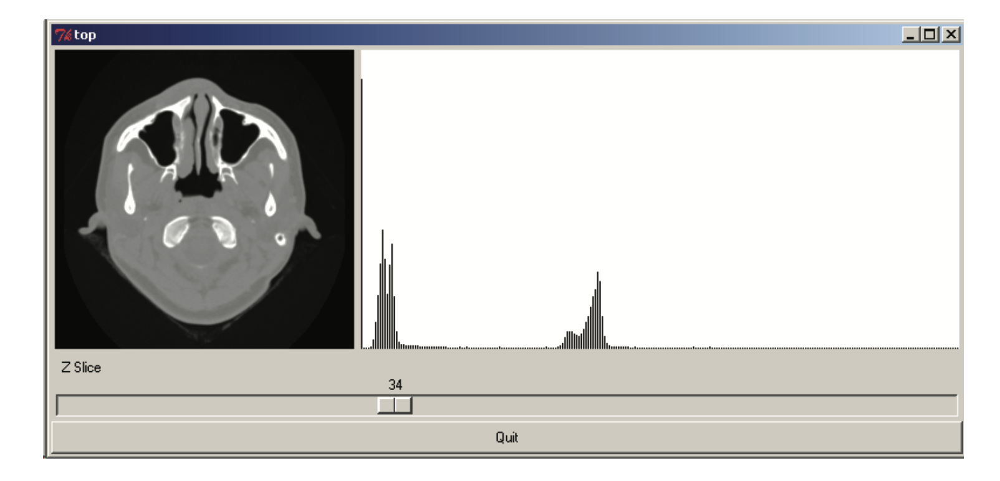

*Figure 6–13 The vtkImageAccumulate class is used to generate a one dimensional histogram from a one-component input image.*

### Image Logic

vtkImageLogic is an image processing filter that takes one or two inputs and performs a boolean logic operation on them (Figure 6–14). Most standard operations are supported including AND, OR, XOR, NAND, NOR, and NOT. This filter has two inputs, although for unary operations such as NOT only the first input is required. In the example provided below you will notice we use vtkImageEllipsoidSource to generate the two input images.

```python
sphere1 = vtkImageEllipsoidSource()
sphere1.SetCenter(95, 100, 0)
sphere1.SetRadius(70, 70, 70)

sphere2 = vtkImageEllipsoidSource()
sphere2.SetCenter(161, 100, 0)
sphere2.SetRadius(70, 70, 70)

xor = vtkImageLogic()
xor.SetInputConnection(0, sphere1.GetOutputPort())
xor.SetInputConnection(1, sphere2.GetOutputPort())
xor.SetOutputTrueValue(150)
xor.SetOperationToXor()

viewer = vtkImageViewer2()
viewer.SetInputConnection(xor.GetOutputPort())
viewer.SetColorWindow(255)
viewer.SetColorLevel(127.5)
```


*Figure 6–14 Result of image logic.*

### Gradient

vtkImageGradient is a filter that computes the gradient of an image or volume. You can control whether it computes a two- or three-dimensional gradient using the SetDimensionality() method. It will produce an output with either two or three scalar components per pixel depending on the dimensionality you specify. The scalar components correspond to the x, y, and optionally z components of the gradient vector. If you only want the gradient magnitude you can use the vtkImageGradientMagnitude filter or vtkImageGradient followed by vtkImageMagnitude.

vtkImageGradient computes the gradient by using central differences. This means that to compute the gradient for a pixel we must look at its left and right neighbors. This creates a problem for the pixels on the outside edges of the image since they will be missing one of their two neighbors. There are two solutions to this problem and they are controlled by the HandleBoundaries instance variable. If HandleBoundaries is on, then vtkImageGradient will use a modified gradient calculation for all of the edge pixels. If HandleBoundaries is off, vtkImageGradient will ignore those edge pixels and produce a resulting image that is smaller than the original input image.

### Gaussian Smoothing

Smoothing an image with a Gaussian kernel is similar to the gradient calculation done above. It has a dimensionality that controls what dimension Gaussian kernel to convolve against.

The class vtkImageGaussianSmooth also has SetStandardDeviations() and SetRadiusFactors() methods that control the shape of the Gaussian kernel and when to truncate it. The example provided below is very similar to the gradient calculation. We start with a vtkVolume16Reader connected to the vtkImageGaussianSmooth which finally connects to the vtkImageViewer2.

```python
reader = vtkVolume16Reader()
reader.SetDataDimensions(64, 64)
reader.SetDataByteOrderToLittleEndian()
reader.SetImageRange(1, 93)
reader.SetFilePrefix(os.path.join(data_dir, "headsq", "quarter"))
reader.SetDataMask(0x7FFF)

smooth = vtkImageGaussianSmooth()
smooth.SetInputConnection(reader.GetOutputPort())
smooth.SetDimensionality(2)
smooth.SetStandardDeviations(2, 10)

viewer = vtkImageViewer2()
viewer.SetInputConnection(smooth.GetOutputPort())
viewer.SetSlice(22)
viewer.SetColorWindow(2000)
viewer.SetColorLevel(1000)
```

### Image Flip

The vtkImageFlip filter can be used to reflect the input image data along an axis specified by the FilteredAxis instance variable. By default, the FlipAboutOrigin instance variable is set to 0, and the image will be flipped about its center along the axis specified by the FilteredAxis instance variable (defaults to 0 – the X axis), and the origin, spacing, and extent of the output will be identical to the input. However, if you have a coordinate system associated with the image and you want to use the flip to convert positive coordinate values along one axis to negative coordinate values (and vice versa), then you actually want to flip the image about the coordinate (0,0,0) instead of about the center of the image. If the FlipAboutOrigin instance variable is set to 1, the origin of the output will be adjusted such that the flip occurs about (0,0,0) instead of the center of the image. In Figure 6–15 we see an input image on the left; the center image shows the results of flipping this image along the Y axis with FlipAboutOrigin off; in the right image, FlipAboutOrigin is on, and all other variables are unchanged from those used to generate the center image.

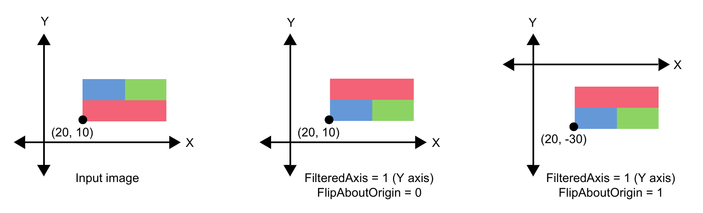

*Figure 6–15 Using vtkImageFlip to flip the Y axis of the input image with dimensions (40, 20, 1). The origin of each image (the input and the two outputs) is labeled.*

### Image Permute

vtkImagePermute allows you to reorder the axes of the input image or volume. (See Figure 6– 16.) The FilteredAxes instance variable indicates how the axes should be reordered – which of the input axes will be labelled X, which Y, and which Z in the output.

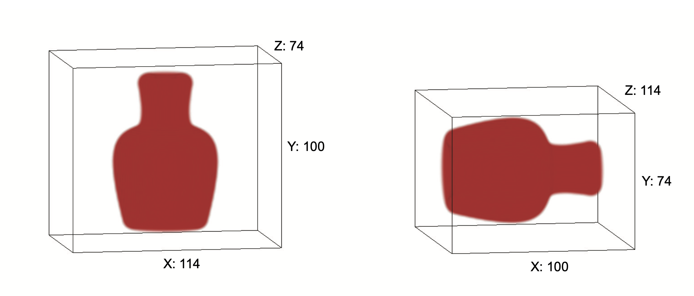

*Figure 6–16 Using vtkImagePermute to reorder the axes of a volume dataset. The dimensions of the input volume, shown on the left, are (114, 100, 74). The FilteredAxes instance variable was set to (1, 2, 0), indicating that the Y axis be relabelled as X, Z be relabelled as Y, and X be relabelled as Z. As shown on the right, the dimensions of the output volume are (100, 74, 114).*

### Image Mathematics

The vtkImageMathematics filter provides basic unary and binary mathematical operations. Depending on the operation set, this filter expects either one or two input images. When two input images are required, they must have the same scalar type and the same number of components, but do not need to have the same dimensions. The output image will have an extent that is the union of the extents of the input images. Origin and spacing of the output image will match the origin and spacing of the first input image. The unary operations are described below. Note that IP is the input pixel value for component n n, OP is the output pixel value for component n, and C and K are constant values that can be speci- n fied as instance variables. DivideByZeroToC is an instance variable that specifies what happens when a divide by zero is encountered. When DivideByZeroToC is on, then the C constant value is the result of a divide by zero; otherwise the maximum value in the range of the output scalar type is used when a divide by zero occurs.

**VTK_INVERT:** Invert the input.e Use C or the maximum output scalar value when a divide by zero is encountered, depending on the value of the DivideByZeroToC instance variable.<br/>
&nbsp; &nbsp; if IP<sub>n</sub> != 0; OP<sub>n</sub> = 1.0 / IP<sub>n</sub><br/>
&nbsp; &nbsp; if IP<sub>n</sub> == 0 and DivideByZeroToC; then OP<sub>n</sub> = C<br/>
&nbsp; &nbsp; if IP<sub>n</sub> == 0 and !DivideByZeroToC; then OP<sub>n</sub> = *maximum scalar value*<br/>
**VTK_SIN:** Take the sine of the input image.<br/>
&nbsp; &nbsp; OP<sub>n</sub> = sin( IP<sub>n</sub> )<br/>
**VTK_COS:** Calculate the cosine of the input image.<br/>
&nbsp; &nbsp; OP<sub>n</sub> = cos( IP<sub>n</sub> )<br/>
**VTK_EXP:** Calculate the exponential of the input image. This is e raised to the power of the input image, where e is the base of a natural log, approximately 2.71828.<br/>
&nbsp; &nbsp; OP<sub>n</sub> = exp( IP<sub>n</sub> )<br/>
**VTK_LOG:** Calculate the natural log of the input image (the logarithm base e).<br/>
&nbsp; &nbsp; OP<sub>n</sub> = log( IP<sub>n</sub> )<br/>
**VTK_ABS:** Compute the absolute value of the input image.<br/>
&nbsp; &nbsp; OP<sub>n</sub> = fabs( IP<sub>n</sub> )<br/>
**VTK_SQR:** Square the input image values.<br/>
&nbsp; &nbsp; OP<sub>n</sub> = IP<sub>n</sub> * IP<sub>n</sub><br/>
**VTK_SQRT:** Take the square root of the input image values.</br>
&nbsp; &nbsp; OP<sub>n</sub> = sqrt( IP<sub>n</sub> )<br/>
**VTK_ATAN:** Compute the arctangent of the input image values.<br/>
&nbsp; &nbsp; OP<sub>n</sub> = atan( IP<sub>n</sub> )<br/>
**VTK_MULTIPLYBYK:** Multiple each input image value by the constant K.<br/>
&nbsp; &nbsp; OP<sub>n</sub> = IP<sub>n</sub> * K<br/>
**VTK_ADDC:** Add the constant C to each input image value.<br/>
&nbsp; &nbsp; OP<sub>n</sub> = IP<sub>n</sub> + C<br/>
**VTK_REPLACECBYK:** Replace all input image values that are exactly equal to the constant C, with the constant K.<br/>
&nbsp; &nbsp; if IP<sub>n</sub> == C; OP<sub>n</sub> = K<br/>
&nbsp; &nbsp; if IP<sub>n</sub> != C; OP<sub>n</sub> = IP<sub>n</sub><br/> **VTK_CONJUGATE:** To use this operation, the input image must have two-component scalars. Convert the two-component scalars into a complex conjugate pair.<br/>
&nbsp; &nbsp; OP<sub>0</sub> = IP<sub>0</sub><br/>
&nbsp; &nbsp; OP<sub>1</sub> = -IP<sub>1</sub><br/>

The binary operations follow. The notation used is similar to that for the unary operations, except that IP1 is the first input's pixel value for component n, and IP2 is the second input's pixel value for n n component n.

**VTK_ADD:** Add the second input image to the first one.<br/>
&nbsp; &nbsp; OP<sub>n</sub> = IP1<sub>n</sub> + IP2<sub>n</sub><br/>
**VTK_SUBTRACT:** Subtract the second input image's values from those of the first input.<br/>
&nbsp; &nbsp; OP<sub>n</sub> = IP1<sub>n</sub> - IP2<sub>n</sub><br/>
**VTK_MULTIPLY:** Multiply the first input image's values by those of the second input.<br/>
&nbsp; &nbsp; OP<sub>n</sub> = IP1<sub>n</sub> * IP2<sub>n</sub><br/>
**VTK_DIVIDE:** Divide the first input image's values by those of the second input. Use C or the maximum output scalar value when a divide by zero is encountered, depending on the value of the DivideByZeroToC instance variable.<br/>
&nbsp; &nbsp; if IP2<sub>n</sub> != 0; OP<sub>n</sub> = IP1<sub>n</sub> / IP2<sub>n</sub><br/>
&nbsp; &nbsp; if IP2<sub>n</sub> == 0 and DivideByZeroToC; then OP<sub>n</sub> = C<br/>
&nbsp; &nbsp; if IP2<sub>n</sub> == 0 and !DivideByZeroToC; then OP<sub>n</sub> = maximum scalar value<br/>
**VTK_COMPLEX_MULTIPLY:** This operation requires that both input images have twocomponent scalars. The first component is real-valued, and the second component is imaginary. Multiply the first input image's values by those of the second input using complex multiplication.<br/>
&nbsp; &nbsp; OP<sub>0</sub> = IP1<sub>0</sub> * IP2<sub>0</sub> - IP1<sub>1</sub> * IP2<sub>1</sub><br/>
&nbsp; &nbsp; OP<sub>1</sub> = IP1<sub>1</sub> * IP2<sub>0</sub> + IP1<sub>0</sub> * IP2<sub>1</sub><br/>
**VTK_MIN:** Compare corresponding values in the two images, and return the smaller value. <br/>
&nbsp; &nbsp; if IP1<sub>n</sub> < IP2<sub>n</sub> ; OP<sub>n</sub> = IP1<sub>n</sub><br/>
&nbsp; &nbsp; if IP2<sub>n</sub> < IP1<sub>n</sub> ; OP<sub>n</sub> = IP2<sub>n</sub><br/>
**VTK_MAX:** Compare corresponding values in the two images, and return the larger value.<br/>
&nbsp; &nbsp; if IP1<sub>n</sub> > IP2<sub>n</sub> ; OP<sub>n</sub> = IP1<sub>n</sub><br/>
&nbsp; &nbsp; if IP2<sub>n</sub> > IP1<sub>n</sub> ; OP<sub>n</sub> = IP2<sub>n</sub><br/>
**VTK_ATAN2:** For each pair of values from the two inputs, divide the first value by the second value, and compute the arctangent of the result. If the second input's value is zero, or both inputs' values are zero, the output value is set to 0.<br/>
&nbsp; &nbsp; if IP2<sub>n</sub> = 0; OP<sub>n</sub> = 0<br/>
&nbsp; &nbsp; if IP1<sub>n</sub> = 0 and IP2<sub>n</sub> = 0; OP = 0<br/>
&nbsp; &nbsp; IP2<sub>n</sub> != 0; OP<sub>n</sub> = atan( IP1<sub>n</sub> / IP2<sub>n</sub> )<br/>

### Image Reslice

vtkImageReslice is a contributed class that offers high-performance image resampling along an arbitrarily-oriented volume (or image). The extent, origin, and sampling density of the output data can also be set. This class provides several other imaging filters: it can permute, flip, rotate, scale, resample, and pad image data in any combination. It can also extract oblique slices from image volumes, which no other VTK imaging filter can do. The following script demonstrates how to use vtkImageReslice.

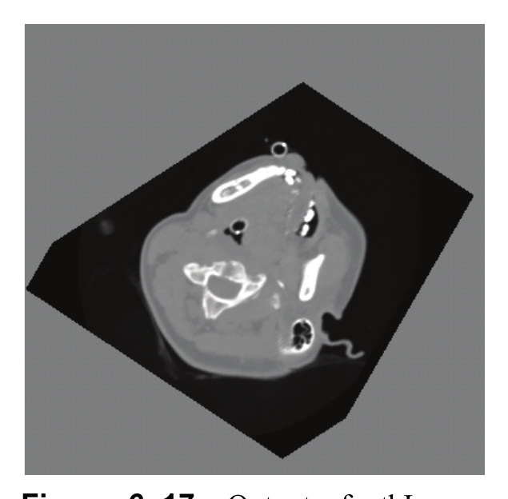

*Figure 6–17 Output of vtkImageReslice with a gray background level set.*

```python
reader = vtkBMPReader()
reader.SetFileName(os.path.join(data_dir, "masonry.bmp"))

transform = vtkTransform()
transform.RotateZ(45)
transform.Scale(1.414, 1.414, 1.414)

reslice = vtkImageReslice()
reslice.SetInputConnection(reader.GetOutputPort())
reslice.SetResliceTransform(transform)
reslice.SetInterpolationModeToCubic()
reslice.WrapOn()
reslice.AutoCropOutputOn()

viewer = vtkImageViewer2()
viewer.SetInputConnection(reslice.GetOutputPort())
viewer.SetSlice(0)
viewer.SetColorWindow(256.0)
viewer.SetColorLevel(127.5)
viewer.Render()
```

In this example (Figure 6–17) a BMP image is read and resliced. A transform is used to rotate the image 45 degrees and scale it, and cubic interpolation between pixels is used. The wrap-pad feature is turned on, and (by setting the variable AutoCropOutput) the output extent will be resized large enough that none of the resliced data will be cropped. By default, the spacing of the output volume is set at 1.0, and the output origin and extent are adjusted to enclose the input volume.

### Iterating through an image

VTK also provides STL like iterators to make it convenient to iterate and retrieve / set pixel values in an image. The class vtkImageIterator can be used to accomplish this. It is templated over the datatype of the image. Its constructor takes as argument the subregion over which to iterate over.

```cpp
int subRegion[6] = {10, 20, 10, 20, 10, 20};
vtkImageIterator<unsigned char> it(image, subRegion);

while (!it.IsAtEnd())
{
    unsigned char *inSI = it.BeginSpan();
    unsigned char *inSIEnd = it.EndSpan();
    while (inSI != inSIEnd)
    {
        *inSI = (255 - *inSI);
        ++inSI;
    }
    it.NextSpan();
}
```

### Edge Detection

Edge detection highlights regions of rapid intensity change in an image. VTK provides several filters for this purpose, all operating on `vtkImageData`.

**vtkImageGradientMagnitude** computes the magnitude of the image gradient at each pixel — large values indicate edges. It works on 2D or 3D images and supports boundary handling. This is the most general-purpose edge detector.

```python
from vtkmodules.vtkImagingGeneral import vtkImageGradientMagnitude

grad_mag = vtkImageGradientMagnitude()
grad_mag.SetInputConnection(image_source.GetOutputPort())
grad_mag.SetDimensionality(2)
grad_mag.HandleBoundariesOn()
```

**vtkImageSobel2D** applies the Sobel operator, which computes directional gradients using a 3x3 convolution kernel. The output has two components (X and Y gradient), so you may want to compute the magnitude separately or use `vtkImageGradientMagnitude` for a single-component result.

```python
from vtkmodules.vtkImagingGeneral import vtkImageSobel2D

sobel = vtkImageSobel2D()
sobel.SetInputConnection(image_source.GetOutputPort())
```

**vtkImageLaplacian** computes the discrete Laplacian (second-order derivative), which detects edges as zero crossings. It is more sensitive to noise than gradient-based methods but responds to edges in all directions equally.

```python
from vtkmodules.vtkImagingGeneral import vtkImageLaplacian

laplacian = vtkImageLaplacian()
laplacian.SetInputConnection(image_source.GetOutputPort())
laplacian.SetDimensionality(2)
```

See `examples/edge_detection.py` for a complete example comparing these filters.

> **See also:** [ImageGradient](https://examples.vtk.org/site/Python/VisualizationAlgorithms/ImageGradient/) on the VTK Examples site.

### Median Filtering

Median filtering is a nonlinear smoothing technique that replaces each pixel with the median value in its neighborhood. It is especially effective at removing salt-and-pepper noise while preserving edges — unlike Gaussian smoothing, which blurs edges.

**vtkImageMedian3D** applies a median filter with a configurable kernel size. For 2D images, set the Z dimension of the kernel to 1.

```python
from vtkmodules.vtkImagingGeneral import vtkImageMedian3D

median = vtkImageMedian3D()
median.SetInputConnection(noisy_image.GetOutputPort())
median.SetKernelSize(3, 3, 1)  # 3x3 neighborhood for 2D images
```

**vtkImageHybridMedian2D** implements the hybrid median filter, which applies median filtering in horizontal/vertical and diagonal directions separately, then takes the median of those results. This preserves corners and thin features better than the standard median.

```python
from vtkmodules.vtkImagingGeneral import vtkImageHybridMedian2D

hybrid = vtkImageHybridMedian2D()
hybrid.SetInputConnection(noisy_image.GetOutputPort())
```

See `examples/median_filter.py` for a complete example.

### Convolution

`vtkImageConvolve` applies a general convolution kernel to an image. You supply a 3x3, 5x5, or 7x7 kernel as a flat list of values. This is useful for implementing custom sharpening, blurring, embossing, or other linear filters.

```python
from vtkmodules.vtkImagingGeneral import vtkImageConvolve

convolve = vtkImageConvolve()
convolve.SetInputConnection(image_source.GetOutputPort())

# 3x3 sharpening kernel
convolve.SetKernel3x3([
     0, -1,  0,
    -1,  5, -1,
     0, -1,  0,
])
```

Other common kernels include:

| Kernel | Values (3x3) | Effect |
|--------|-------------|--------|
| Box blur | All 1/9 | Uniform smoothing |
| Sharpen | Center 5, cross -1 | Edge enhancement |
| Emboss | [-2,-1,0, -1,1,1, 0,1,2] | Relief effect |

For 5x5 kernels use `SetKernel5x5()`, and for 7x7 use `SetKernel7x7()`. See `examples/image_convolve.py` for a complete example.

### Anisotropic Diffusion

Anisotropic diffusion smooths an image while preserving edges. Unlike Gaussian smoothing (which blurs everything uniformly), anisotropic diffusion reduces the diffusion rate near edges, keeping them sharp while smoothing flat regions. This makes it useful for denoising images where edge preservation is important.

VTK provides `vtkImageAnisotropicDiffusion2D` for 2D images and `vtkImageAnisotropicDiffusion3D` for volumes. The key parameters are:

- **NumberOfIterations** — More iterations produce stronger smoothing.
- **DiffusionThreshold** — Gradient magnitude above which diffusion is reduced. Lower values preserve more edges; higher values smooth more aggressively.
- **DiffusionFactor** — Controls the diffusion rate per iteration (typically 1.0).

```python
from vtkmodules.vtkImagingGeneral import vtkImageAnisotropicDiffusion2D

diffusion = vtkImageAnisotropicDiffusion2D()
diffusion.SetInputConnection(noisy_image.GetOutputPort())
diffusion.SetNumberOfIterations(10)
diffusion.SetDiffusionThreshold(20.0)
diffusion.SetDiffusionFactor(1.0)
```

For 3D volumes, use `vtkImageAnisotropicDiffusion3D` with the same interface. See `examples/anisotropic_diffusion.py` for a complete example.

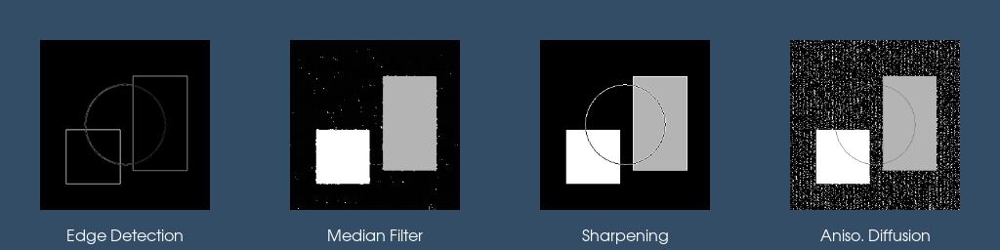

*Figure 6–18 Image processing filters. From left: edge detection (`vtkImageGradientMagnitude`), median filtering of a noisy image, convolution with a sharpening kernel, and anisotropic diffusion for edge-preserving smoothing.*

> **See also:** [MedianComparison](https://examples.vtk.org/site/Python/ImageProcessing/MedianComparison/) and [HybridMedianComparison](https://examples.vtk.org/site/Python/ImageProcessing/HybridMedianComparison/) on the VTK Examples site.

### Morphological Operations

Morphological operations process binary or grayscale images based on the shape and size of a structuring element (kernel). They are fundamental to tasks like noise removal, shape analysis, and feature extraction.

**Dilation and Erosion.** `vtkImageDilateErode3D` performs either dilation (expanding bright regions) or erosion (shrinking bright regions) depending on which value is set as the dilate vs. erode value. The kernel size controls the extent of the operation.

```python
from vtkmodules.vtkImagingMorphological import vtkImageDilateErode3D

# Dilation: expand bright regions
dilate = vtkImageDilateErode3D()
dilate.SetInputConnection(binary_image.GetOutputPort())
dilate.SetKernelSize(5, 5, 1)  # 5x5 for 2D images
dilate.SetDilateValue(255)
dilate.SetErodeValue(0)

# Erosion: swap the values
erode = vtkImageDilateErode3D()
erode.SetInputConnection(binary_image.GetOutputPort())
erode.SetKernelSize(5, 5, 1)
erode.SetDilateValue(0)
erode.SetErodeValue(255)
```

**Opening and Closing.** `vtkImageOpenClose3D` combines erosion and dilation in sequence. **Opening** (erosion then dilation) removes small bright features and thin protrusions. **Closing** (dilation then erosion) fills small dark gaps and holes.

```python
from vtkmodules.vtkImagingMorphological import vtkImageOpenClose3D

# Opening: removes small bright features
opening = vtkImageOpenClose3D()
opening.SetInputConnection(binary_image.GetOutputPort())
opening.SetKernelSize(5, 5, 1)
opening.SetOpenValue(255)
opening.SetCloseValue(0)

# Closing: swap Open/Close values
closing = vtkImageOpenClose3D()
closing.SetInputConnection(binary_image.GetOutputPort())
closing.SetKernelSize(5, 5, 1)
closing.SetOpenValue(0)
closing.SetCloseValue(255)
```

**Island Removal.** `vtkImageIslandRemoval2D` removes small connected components (islands) below a specified area threshold. `vtkImageSeedConnectivity` performs flood-fill-style connected component extraction starting from seed points.

See `examples/morphology.py` for a complete example.

> **See also:** [MorphologyComparison](https://examples.vtk.org/site/Python/ImageProcessing/MorphologyComparison/) on the VTK Examples site.

### FFT and Frequency Domain Filtering

The Fast Fourier Transform (FFT) converts an image from the spatial domain to the frequency domain, where low frequencies represent smooth regions and high frequencies represent edges and fine detail. Filtering in the frequency domain can be more efficient than spatial convolution for large kernels.

**Computing the FFT.** `vtkImageFFT` performs the forward transform, producing a complex-valued image (two components: real and imaginary). Use `vtkImageFourierCenter` to shift the zero-frequency component to the center for visualization.

```python
from vtkmodules.vtkImagingFourier import vtkImageFFT, vtkImageFourierCenter
from vtkmodules.vtkImagingMath import vtkImageMagnitude, vtkImageLogarithmicScale

fft = vtkImageFFT()
fft.SetInputConnection(image_source.GetOutputPort())
fft.SetDimensionality(2)

center = vtkImageFourierCenter()
center.SetInputConnection(fft.GetOutputPort())
center.SetDimensionality(2)

# Compute magnitude and log-scale for display
mag = vtkImageMagnitude()
mag.SetInputConnection(center.GetOutputPort())

log_scale = vtkImageLogarithmicScale()
log_scale.SetInputConnection(mag.GetOutputPort())
log_scale.SetConstant(15)
```

See `examples/fft_spectrum.py` for a complete example.

**Frequency Domain Filters.** VTK provides several filters that operate directly on FFT data:

| Filter | Effect |
|--------|--------|
| `vtkImageButterworthLowPass` | Smooth roll-off low-pass (removes high frequencies) |
| `vtkImageButterworthHighPass` | Smooth roll-off high-pass (removes low frequencies) |
| `vtkImageIdealLowPass` | Sharp cutoff low-pass |
| `vtkImageIdealHighPass` | Sharp cutoff high-pass |

The typical workflow is: forward FFT, apply frequency filter, inverse FFT (`vtkImageRFFT`), extract the real component.

```python
from vtkmodules.vtkImagingFourier import (
    vtkImageButterworthLowPass, vtkImageFFT, vtkImageRFFT,
)
from vtkmodules.vtkImagingCore import vtkImageExtractComponents

fft = vtkImageFFT()
fft.SetInputConnection(image_source.GetOutputPort())
fft.SetDimensionality(2)

butterworth = vtkImageButterworthLowPass()
butterworth.SetInputConnection(fft.GetOutputPort())
butterworth.SetCutOff(0.1)   # normalized frequency
butterworth.SetOrder(2)      # roll-off steepness

rfft = vtkImageRFFT()
rfft.SetInputConnection(butterworth.GetOutputPort())
rfft.SetDimensionality(2)

# Extract real component (discard imaginary rounding errors)
extract = vtkImageExtractComponents()
extract.SetInputConnection(rfft.GetOutputPort())
extract.SetComponents(0)
```

The `CutOff` parameter is in normalized frequency units (cycles per pixel). Lower values produce stronger smoothing. The `Order` parameter controls the steepness of the transition — higher orders approach an ideal (sharp) cutoff. See `examples/butterworth_filter.py` for a complete example.

### Distance Transforms

Distance transforms compute, for each pixel, the distance to the nearest pixel of a specified value (typically the nearest boundary or foreground pixel). They are useful for shape analysis, skeletonization, and level-set methods.

**vtkImageEuclideanDistance** computes the exact Euclidean distance transform. It is accurate but slower than the city-block alternative.

```python
from vtkmodules.vtkImagingGeneral import vtkImageEuclideanDistance

dist = vtkImageEuclideanDistance()
dist.SetInputConnection(binary_image.GetOutputPort())
dist.ConsiderAnisotropyOn()  # account for non-uniform spacing
```

**vtkImageCityBlockDistance** computes the Manhattan (L1) distance, which uses only horizontal and vertical steps. It is faster but less accurate than Euclidean distance.

```python
from vtkmodules.vtkImagingGeneral import vtkImageCityBlockDistance

dist = vtkImageCityBlockDistance()
dist.SetInputConnection(binary_image.GetOutputPort())
dist.SetDimensionality(2)
```

Both filters produce floating-point output where each pixel's value represents the distance to the nearest foreground pixel.

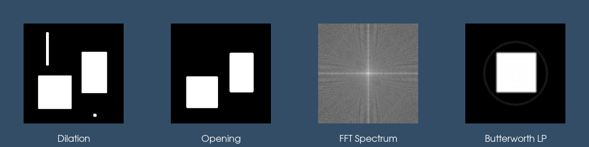

*Figure 6–19 Morphological operations and frequency domain processing. From left: dilation of a binary image, opening (small features removed), FFT magnitude spectrum (log-scaled, centered), and Butterworth low-pass filtering (edges smoothed).*

> **See also:** [IdealHighPass](https://examples.vtk.org/site/Python/ImageProcessing/IdealHighPass/) on the VTK Examples site.
