# Chapter 7: Volume Rendering

Volume rendering is a term used to describe a rendering process applied to 3D data where information exists throughout a 3D space instead of simply on 2D surfaces defined in 3D space. There is not a clear dividing line between volume rendering and geometric rendering techniques. Often two different approaches can produce similar results, and in some cases one approach may be considered both a volume rendering and a geometric rendering technique. For example, you can use a contouring technique to extract triangles representing an isosurface in an image dataset (see Section 5.1) and then use geometric rendering techniques to display these triangles, or you can use a volumetric ray casting technique on the image dataset and terminate the ray traversal at a particular isovalue. These two different approaches produce similar (although not necessarily identical) results. Another example is the technique of employing texture mapping hardware in order to perform composite volume rendering. This one method may be considered a volume rendering technique since it works on image data, or a geometric technique since it uses geometric primitives and standard graphics hardware.

In VTK a distinction is made between volume rendering techniques and geometric rendering techniques in order to customize the properties of the data being rendered. As you have seen throughout the many examples shown thus far, rendering data typically involves creating a vtkActor, a vtkProperty, and some subclass of a vtkMapper. The vtkActor is used to hold position, orientation and scaling information about the data, as well as a pointer to both the property and the mapper. The vtkProperty object captures various parameters that control the appearance of the data such as the ambient lighting coefficient and whether the object is flat, Gouraud, or Phong shaded. Finally, the vtkMapper subclass is responsible for actually rendering the data. For volume rendering, a different set of classes with very similar functionality are utilized. A vtkVolume is used in place of a vtkActor to represent the data in the scene. Just like the vtkActor, the vtkVolume represents the position, orientation and scaling of the data within the scene. However, a vtkVolume contains references to a vtkVolumeProperty and a vtkAbstractVolumeMapper. The vtkVolumeProperty represents those parameters that affect the appearance of the data in a volume rendering process, which is a different set of parameters than those used during geometric rendering. A vtkAbstractVolumeMapper subclass is responsible for the volume rendering process and ensures that the input data is of the correct type for the mapper's specific algorithm.

In VTK, volume rendering techniques have been implemented for both regular rectilinear grids (vtkImageData) and unstructured data (vtkUnstructuredGrid). The SetInputConnection() method of the specific subclass of vtkAbstractVolumeMapper that you utilize will accept a pipeline connection producing only the correct type of data (vtkImageData or vtkUnstructuredGrid) as appropriate for that mapper. Note that you can resample irregular data into a regular image data format in order to take advantage of the vtkImageData rendering techniques described in this chapter (see Section 5.6). Alternatively, you can tetrahedralize your data to produce an unstructured mesh to use the vtkUnstructuredGrid rendering techniques described in this chapter.

There are several different volume rendering techniques available for each supported data type. We will begin this chapter with some simple examples written using several different rendering techniques. Then we will cover the objects/parameters common to all of these techniques. Next, each of the volume rendering techniques will be discussed in more detail, including information on parameters specific to that rendering method. This will be followed by a discussion on achieving interactive rendering rates that is applicable to all volume rendering methods.

## 7.1 Historical Note on Supported Data Types

The first volume rendering methods incorporated into VTK were designed solely for vtkImageData. The superclass vtkVolumeMapper was developed to define the API for all vtkImageData volume rendering methods. Later, volume rendering of vtkUnstructuredGrid datasets was added to VTK. In order to preserve backwards compatibility, a new abstract superclass was introduced as the superclass for all types of volume rendering. Hence vtkAbstractVolumeMapper is the superclass of both vtkVolumeMapper (whose subclasses render only vtkImageData datasets) and vtkUnstructuredGridVolumeMapper (whose subclasses render only vtkUnstructuredGrid datasets).

## 7.2 A Simple Example

Consider the simple volume rendering example shown below and illustrated in Figure 7–1.

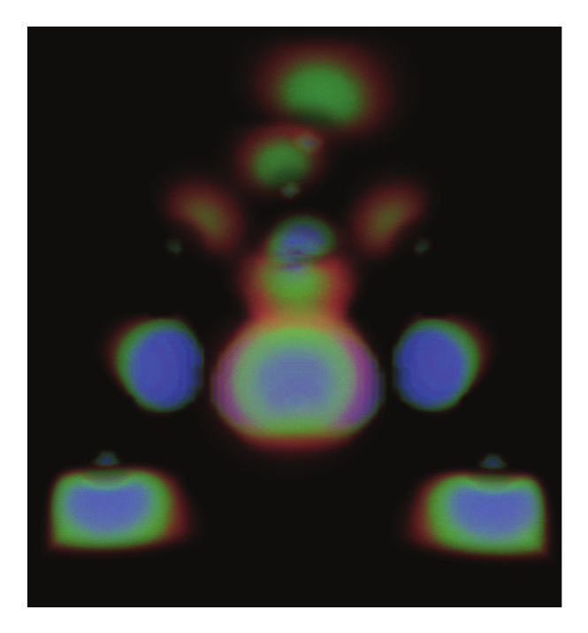

*Figure 7–1 Volume rendering.*

This example uses GPU-accelerated ray casting of vtkImageData. The highlighted portion of the script is specific to this rendering technique. Following this example you will find alternate versions that would instead perform the volume rendering task with other mappers, including a software ray casting approach for vtkImageData and a projection-based method for volume rendering vtkUnstructuredGrid datasets. You will notice that switching volume rendering techniques, at least in this simple case, requires only a few minor changes to the script, since most of the functionality is defined in the superclass API and is therefore common to all volume mappers.

```python
from vtkmodules.vtkCommonDataModel import vtkPiecewiseFunction
from vtkmodules.vtkIOLegacy import vtkStructuredPointsReader
from vtkmodules.vtkRenderingCore import (
    vtkColorTransferFunction, vtkRenderer, vtkRenderWindow,
    vtkVolume, vtkVolumeProperty,
)
from vtkmodules.vtkRenderingVolume import vtkGPUVolumeRayCastMapper
import vtkmodules.vtkRenderingVolumeOpenGL2  # noqa: F401

# Create the reader for the data
reader = vtkStructuredPointsReader()
reader.SetFileName("ironProt.vtk")
# Create transfer mapping scalar value to opacity
opacity_transfer_function = vtkPiecewiseFunction()
opacity_transfer_function.AddPoint(20, 0.0)
opacity_transfer_function.AddPoint(255, 0.2)
# Create transfer mapping scalar value to color
color_transfer_function = vtkColorTransferFunction()
color_transfer_function.AddRGBPoint(0.0, 0.0, 0.0, 0.0)
color_transfer_function.AddRGBPoint(64.0, 1.0, 0.0, 0.0)
color_transfer_function.AddRGBPoint(128.0, 0.0, 0.0, 1.0)
color_transfer_function.AddRGBPoint(192.0, 0.0, 1.0, 0.0)
color_transfer_function.AddRGBPoint(255.0, 0.0, 0.2, 0.0)
# The property describes how the data will look
volume_property = vtkVolumeProperty()
volume_property.SetColor(color_transfer_function)
volume_property.SetScalarOpacity(opacity_transfer_function)
# The mapper knows how to render the data
volume_mapper = vtkGPUVolumeRayCastMapper()
volume_mapper.SetInputConnection(reader.GetOutputPort())
# The volume holds the mapper and the property and
# can be used to position/orient the volume
volume = vtkVolume()
volume.SetMapper(volume_mapper)
volume.SetProperty(volume_property)
renderer.AddVolume(volume)
render_window.Render()
```

In this example we start by reading in a data file from disk. We then define the functions that map scalar value into opacity and color which are used in the vtkVolumeProperty. Next we create a vtkGPUVolumeRayCastMapper that performs GPU-accelerated ray casting with composite blending (the default). We set the input of the mapper to the data we read off the disk, and we create a vtkVolume (a subclass of vtkProp3D similar to vtkActor) to hold the mapper and property. Finally, we add the volume to the renderer and render the scene.

> **Note:** Earlier versions of VTK provided `vtkVolumeRayCastMapper` with separate ray cast function objects (`vtkVolumeRayCastCompositeFunction`, `vtkVolumeRayCastMIPFunction`, `vtkVolumeRayCastIsosurfaceFunction`) as well as texture mapping mappers (`vtkVolumeTextureMapper2D`, `vtkVolumeTextureMapper3D`). These classes have been removed from modern VTK. The `vtkGPUVolumeRayCastMapper` replaces all of them as the primary volume mapper for vtkImageData. Blend modes (composite, maximum intensity projection, etc.) are set directly on the mapper using methods such as `SetBlendModeToComposite()` or `SetBlendModeToMaximumIntensity()`.

The vtkFixedPointVolumeRayCastMapper is a software alternative to the GPU mapper. It handles all data types as well as multicomponent data, and uses fixed point computations and space leaping for high performance. To use it instead of the GPU mapper:

```python
from vtkmodules.vtkRenderingVolume import vtkFixedPointVolumeRayCastMapper

# Create the fixed point ray cast mapper (software fallback)
volume_mapper = vtkFixedPointVolumeRayCastMapper()
volume_mapper.SetInputConnection(reader.GetOutputPort())
```

If you would like to use an unstructured grid volume rendering technique instead, the replacement code becomes slightly more complex in order to perform the conversion from vtkImageData to vtkUnstructuredGrid before passing the data as input to the mapper. In this case we will use the unstructured grid rendering method that projects a tetrahedral representation of the grid using the graphics hardware. The replacement code would be:

```python
from vtkmodules.vtkFiltersGeneral import vtkDataSetTriangleFilter
from vtkmodules.vtkRenderingVolume import vtkProjectedTetrahedraMapper

# Convert data to unstructured grid
tetra_filter = vtkDataSetTriangleFilter()
tetra_filter.SetInputConnection(reader.GetOutputPort())
# Create the objects specific to the Projected Tetrahedra method
volume_mapper = vtkProjectedTetrahedraMapper()
volume_mapper.SetInputConnection(tetra_filter.GetOutputPort())
```

Note that it is not recommended to convert from vtkImageData to vtkUnstructuredGrid for rendering since the mappers that work directly on vtkImageData are typically more efficient, both in memory consumption and rendering performance, than the mappers for vtkUnstructuredGrid data.

## 7.3 Why Multiple Volume Rendering Techniques?

As you can see, in this simple example the main thing that changes between rendering strategies is the type of volume mapper that is instantiated. This may lead you to the following questions: why are there different volume rendering strategies in VTK? Why can't VTK simply pick the "best" strategy? First, it is not always easy to predict which strategy will work best—software ray casting may out-perform GPU ray casting if the GPU is already heavily loaded, or vice versa. These are parameters that differ from platform to platform, and in fact may change continuously at run time. Second, due to its computational complexity, most volume rendering techniques only produce an approximation of the desired rendering equation. For example, techniques that take samples through the volume and composite them with an alpha blending function are only approximating the true integral through the volume. Under different circumstances, different techniques perform better or worse than others in terms of both quality and speed. In addition, some techniques work only under certain special conditions. For example, some techniques support data with only a single scalar component of unsigned char or unsigned short type, while other techniques support any scalar type and multi-component data. The "best" technique will depend on your specific data, your performance and image quality requirements, and the hardware configuration of the system on which the code is run. In fact, the "best" technique may actually be a combination of techniques. A section of this chapter is dedicated to describing the multi-technique level-of-detail strategies that may be employed to achieve interactive volume rendering in a cross-platform manner.

## 7.4 Creating a vtkVolume

A vtkVolume is a subclass of vtkProp3D intended for use in volume rendering. Similar to a vtkActor (that is intended for geometric rendering), a vtkVolume holds the transformation information such as position, orientation, and scale, and pointers to a mapper and property. Additional information on how to control the transformation of a vtkVolume is covered in Chapter 3.

The vtkVolume class accepts objects that are subclasses of vtkAbstractVolumeMapper as input to SetMapper(), and accepts a vtkVolumeProperty object as input to SetProperty(). vtkActor and vtkVolume are two separate objects in order to enforce the different types of the mappers and properties. These different types are necessary due to the fact that some parameters of geometric rendering do not make sense in volume rendering and vice versa. For example, the SetRepresentationToWireframe() method of vtkProperty is meaningless in volume rendering, while the SetInterpolationTypeToNearest() method of vtkVolumeProperty has no value in geometric rendering.

## 7.5 Using vtkPiecewiseFunction

In order to control the appearance of a 3D volume of scalar values, several mappings or transfer functions must be defined. Generally, two transfer functions are required for all volume rendering techniques. The first required transfer function, known as the scalar opacity transfer function, maps the scalar value into an opacity or an opacity per unit length value. The second transfer function, referred to simply as the color transfer function, maps the scalar value into a color. An optional transfer function employed in some of the structured volume rendering methods is known as the gradient opacity transfer function, which maps the magnitude of the gradient of the scalar value into an opacity multiplier. Any of these mappings can be defined as a single value to single value mapping, which can be represented with a vtkPiecewiseFunction. For the scalar value to color mapping, a vtkColorTransferFunction can also be used to define RGB rather than grayscale colors.

From a user's point of view, vtkPiecewiseFunction has two types of methods—those that add information to the mapping, and those that clear out information from the mapping. When information is added to a mapping, it is considered to be a point sample of the mapping with interpolation used to determine values between the specified ones. For example, consider the following section of a script on the left that produces the transfer function drawn on the right:

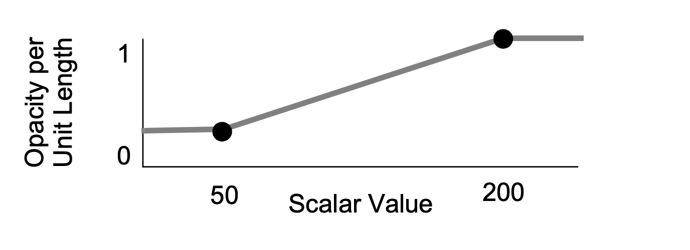

```python
from vtkmodules.vtkCommonDataModel import vtkPiecewiseFunction

tfun = vtkPiecewiseFunction()
tfun.AddPoint(50, 0.2)
tfun.AddPoint(200, 1.0)
```

The value of the mapping for the scalar values of 50 and 200 are given as 0.2 and 1.0 respectively, and all other mapping values can be obtained by linearly interpolating between these two values. If Clamping is on (it is by default) then the mapping of any value below 50 will be 0.2, and the mapping of any value above 200 will be 1.0. If Clamping is turned off, then out-of-range values map to 0.0.

Points can be added to the mapping at any time. If a mapping is redefined it replaces the existing mapping. In addition to adding a single point, a segment can be added which will define two mapping points and clear any existing points between the two. As an example, consider the following two modification steps and the corresponding pictorial representations of the transfer functions:

<table>
  <tr>
    <td>
      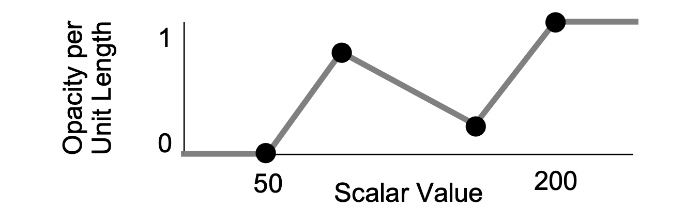
    </td>
    <td>

```python
tfun.RemovePoint(50)
tfun.AddPoint(50, 0.0)
tfun.AddSegment(100, 0.8, 150, 0.2)
```

  </tr>

  <tr>
    <td>
      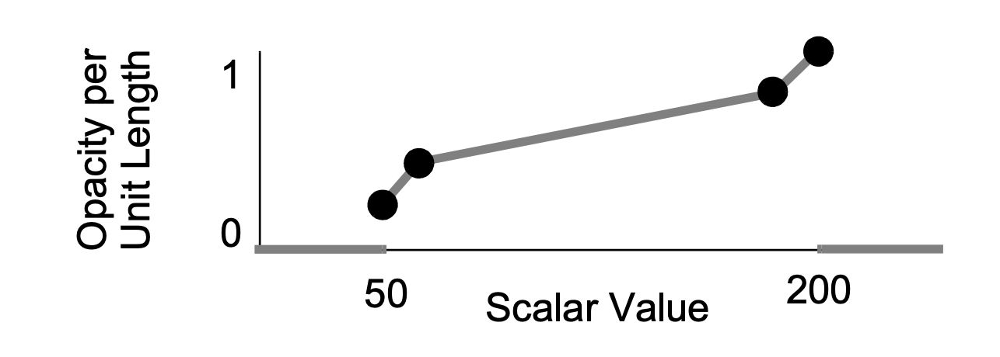
    </td>
    <td>

```python
tfun.AddPoint(50, 0.2)
tfun.AddSegment(60, 0.4, 190, 0.8)
tfun.ClampingOff()
```

  </tr>
</table>

In the first step, we change the mapping of scalar value 50 by removing the point and then adding it again, and we add a segment. In the second step, we change the mapping of scalar value 50 by simply adding a new mapping without first removing the old one. We also add a new segment which eliminates the mappings for 100 and 150 since they lie within the new segment, and we turn clamping off.

## 7.6 Using vtkColorTransferFunction

A vtkColorTransferFunction can be used to specify a mapping of scalar value to color using either an RGB or HSV color space. The methods available are similar to those provided by vtkPiecewiseFunction, but tend to come in two flavors. For example, AddRGBPoint() and AddHSVPoint() both add a point into the transfer function with one accepting an RGB value as input and the other accepting an HSV value as input. The following example shows how to specify a transfer function from red to green to blue with RGB interpolation performed for values in between those specified:

```python
from vtkmodules.vtkRenderingCore import vtkColorTransferFunction

ctfun = vtkColorTransferFunction()
ctfun.SetColorSpaceToRGB()
ctfun.AddRGBPoint(0, 1, 0, 0)
ctfun.AddRGBPoint(127, 0, 1, 0)
ctfun.AddRGBPoint(255, 0, 0, 1)
```

## 7.7 Controlling Color / Opacity with a vtkVolumeProperty

In the previous two sections we have discussed the basics of creating transfer functions, but we have not yet discussed how these control the appearance of the volume. Typically, defining the transfer functions is the hardest part of achieving an effective volume visualization since you are essentially performing a classification operation that requires you to understand the meaning of the underlying data values.

For rendering techniques that map a pixel to a single location in the volume (such as an isosurface rendering or a maximum intensity projection) the ScalarOpacity transfer function maps the scalar value to an opacity. When a compositing technique is used, the ScalarOpacity function maps scalar value to an opacity that is accumulated per unit length for a homogenous region of that value. The specific mapper then utilizes a form of compositing to accumulate the continuously changing color and opacity values through the volume to form a final color and opacity that is stored in the corresponding pixel.

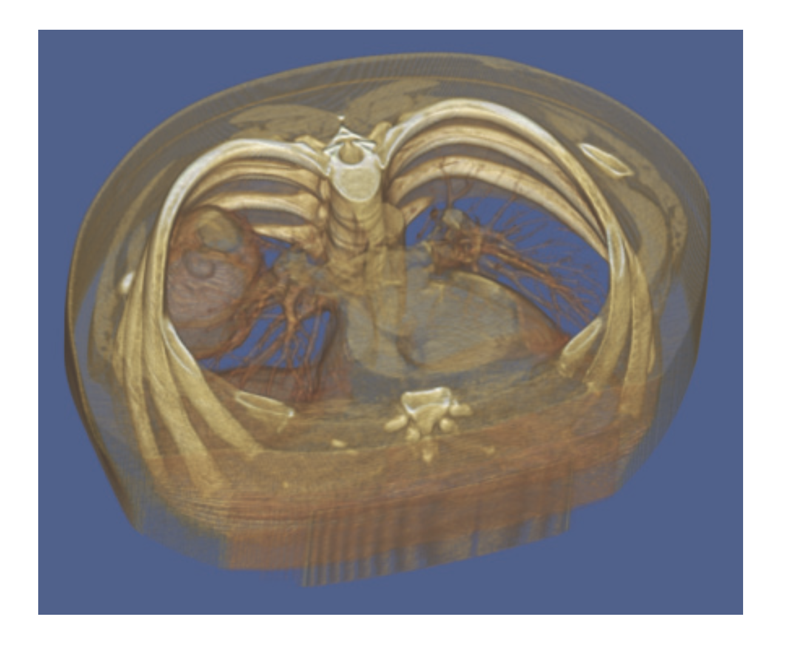

*Figure 7–2 CT torso data classified using the ScalarOpacity, Color, and GradientOpacity transfer functions.*

The ScalarOpacity and Color transfer functions are typically used to perform a simple classification of the data. Scalar values that are part of the background, or that are considered noise, are mapped to an opacity of 0.0, eliminating them from contributing to the image. The remaining scalar values can be divided into different "materials" which have different opacities and colors. For example, data acquired from a CT scanner can often be categorized as air, soft tissue, or bone based on the density value contained in the data (Figure 7–2). The scalar values defined as air would be given an opacity of 0.0, the soft tissue scalar values might be given a light red-brown color and the bone values might be given a white color. By varying the opacity of these last two materials, you can visualize the skin surface or the bone surface, or potentially see the bone through the translucent skin. This process of determining the dividing line between materials in the data can be tedious, and in some cases not possible based on the raw input data values. For example, liver and kidney sample locations may have overlapping CT density values. In this case, a segmentation filter may need to be applied to the volume to either alter the data values so that materials can be classified solely on the basis of the scalar value, or to extract out one specific material type. These segmentation operations can be based on additional information such as location or a comparison to a reference volume.

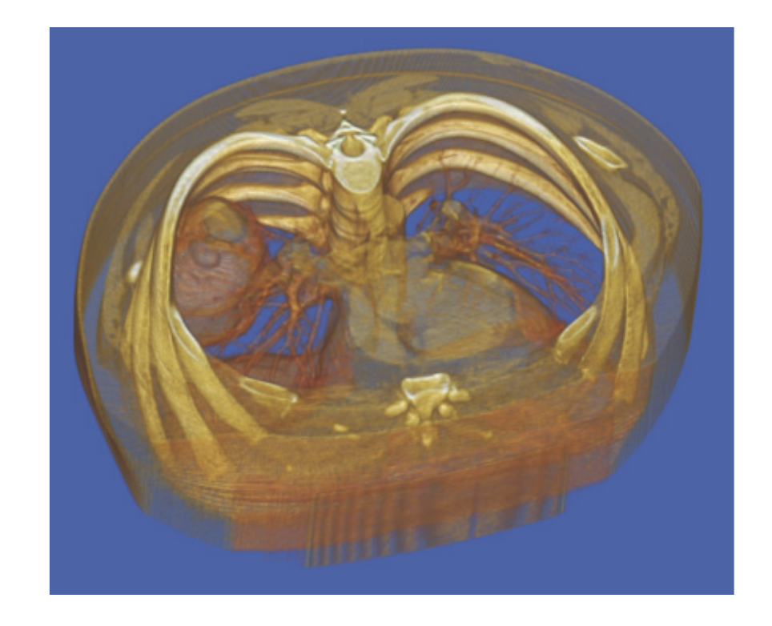

*Figure 7–3 CT head data classified using the ScalarOpacity, Color, and GradientOpacity transfer functions.*

Two examples of segmenting CT data using only the transfer functions defined in the vtkVolumeProperty are shown here, one for a torso (Figure 7–2) and the other for a head study (Figure 7–3). In both of these examples, the third transfer function maps the magnitude of the gradient of the scalar value to an opacity multiplier, and is used to enhance the contribution of transition regions of the volume. For example, a large gradient magnitude can be found where the scalar value transitions from air to soft tissue, or soft tissue to bone, while within the soft tissue and bone regions the magnitude remains relatively small. Below is a code fragment that defines a typical gradient opacity transfer function for 8-bit unsigned data.

```python
from vtkmodules.vtkCommonDataModel import vtkPiecewiseFunction

gtfun = vtkPiecewiseFunction()
gtfun.AddPoint(0, 0.0)
gtfun.AddPoint(3, 0.0)
gtfun.AddPoint(6, 1.0)
gtfun.AddPoint(255, 1.0)
```

This function eliminates nearly homogeneous regions by defining an opacity multiplier of 0.0 for any gradient magnitude less than 3. This multiplier follows a linear ramp from 0.0 to 1.0 on gradient magnitudes between 3 and 6, and no change in the opacity value is performed on samples with magnitudes above 6. Noisier data may require a more aggressive edge detection (so the 3 and the 6 would be higher values). Note that the gradient magnitude transfer function is currently only supported in volume mappers that render vtkImageData. For volume mappers that render vtkUnstructuredGrid datasets, gradients are not computed and therefore neither the gradient magnitude transfer function nor shading are available in these mappers.

There are a few methods in vtkVolumeProperty that relate to the color and opacity transfer functions. The SetColor() method accepts either a vtkPiecewiseFunction (if your color function defines only grayscale values) or a vtkColorTransferFunction. You can query the number of color channels with GetColorChannels() which will return 1 if a vtkPiecewiseFunction was set as the color, or 3 if a vtkColorTransferFunction was used to specify color. Once you know how many color channels are in use, you can call either GetGrayTransferFunction() or GetRGBTransferFunction() to get the appropriate function.

The SetScalarOpacity() method accepts a vtkPiecewiseFunction to define the scalar opacity transfer function, and there is a corresponding GetScalarOpacity() method that returns this function. Similarly, there are two methods for the gradient opacity transfer function: SetGradientOpacity() and GetGradientOpacity().

The discussion thus far has considered only single component scalar data where one set of transfer functions define the appearance of the data. Alternatively, multi-component data may be rendered in one of two ways. If the components are independent, then one set of transfer functions can be defined per component. An example of independent data may be an unstructured grid produced through a simulation process that produces both temperature and density values on the grid. Another example of independent components is the data produced by confocal microscopy where the specimen is scanned multiple times with different fluorescent dyes used to highlight different structures within the specimen. When rendering multi-component data where the components are independent, you must define the appearance parameters per component. The SetColor(), SetScalarOpacity(), and SetGradientOpacity() methods accept an optional index value as the first argument to set the transfer function for a specific component.

Multi-component data may also represent not independent properties, but instead a set of values that define one property. For example, when utilizing a physical sectioning technique, you may have three or four component data representing RGB or RGBA. Or perhaps you have two components representing luminance and alpha. Volume mappers that support multiple components support two forms of non-independent components. The first is two component data where the first component is passed through the color transfer function in order to determine the sample color, and the second component is passed through the scalar opacity function to define the sample alpha. The second type of non-independent multi-component data is four component data where the first three components are taken directly as RGB, and the fourth is passed through the scalar opacity transfer function in order to define alpha. In both of these non-independent cases, the last component is used to compute gradients, and therefore controls the gradient magnitude opacity transfer function as well.

Note that not all mappers support multi-component data, please consult the mapper-specific documentation provided in the remainder of this chapter for further information on supported functionality. For mappers that do support multiple components, the limit is typically four components.

## 7.8 Controlling Shading with a vtkVolumeProperty

Controlling shading of a volume with a volume property is similar to controlling the shading of a geometric actor with a property. There is a flag for shading, and four basic parameters: the ambient coefficient, the diffuse coefficient, the specular coefficient and the specular power. Generally, the first three coefficients will sum to 1.0 but exceeding this value is often desirable in volume rendering to increase the brightness of a rendered volume. The exact interpretation of these parameters will depend on the illumination equation used by the specific volume rendering technique that is being used. In general, if the ambient term dominates then the volume will appear unshaded, if the diffuse term dominates then the volume will appear rough (like concrete) and if the specular term dominates then the volume will appear smooth (like glass). The specular power can be used to control how smooth the appearance is (such as brushed metal versus polished metal).

By default, shading is off. You must explicitly call ShadeOn() for the shading coefficients to affect the scene. Setting the shading flag off is generally the same as setting the ambient coefficient to 1.0, the diffuse coefficient to 0.0 and the specular coefficient to 0.0. Note that currently volume mappers that render vtkUnstructuredGrid datasets do not support shading. In addition, some volume rendering techniques for vtkImageData, such as maximum intensity projection blending, do not consider the shading coefficients regardless of the value of the shading flag.

The shaded appearance of a volume (when the shading flag is on) depends not only on the values of the shading coefficients in the vtkVolumeProperty, but also on the collection of light sources contained in the renderer, and their properties. The appearance of a rendered volume will depend on the number, position, and color of the light sources in the scene.

If possible, the volume rendering technique attempts to reproduce the lighting equations defined by OpenGL. Consider the following example.

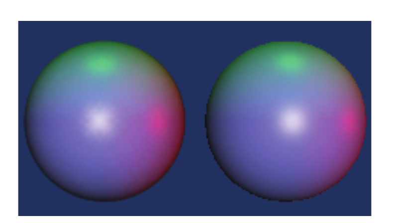

*Figure 7–4 A geometric sphere (right) and a volumetric sphere (left) rendered with the same lighting coefficients.*

```python
from vtkmodules.vtkCommonDataModel import vtkPiecewiseFunction
from vtkmodules.vtkFiltersSources import vtkSphereSource
from vtkmodules.vtkIOImage import vtkSLCReader
from vtkmodules.vtkRenderingCore import (
    vtkActor, vtkLight, vtkPolyDataMapper,
    vtkVolume, vtkVolumeProperty,
)
from vtkmodules.vtkRenderingVolume import vtkFixedPointVolumeRayCastMapper

# Create a geometric sphere
sphere = vtkSphereSource()
sphere.SetRadius(20)
sphere.SetCenter(70, 25, 25)
sphere.SetThetaResolution(50)
sphere.SetPhiResolution(50)
mapper = vtkPolyDataMapper()
mapper.SetInputConnection(sphere.GetOutputPort())
actor = vtkActor()
actor.SetMapper(mapper)
actor.GetProperty().SetColor(1, 1, 1)
actor.GetProperty().SetAmbient(0.1)
actor.GetProperty().SetDiffuse(0.7)
actor.GetProperty().SetSpecular(0.7)
actor.GetProperty().SetSpecularPower(70.0)

# Read in a volumetric sphere
reader = vtkSLCReader()
reader.SetFileName("sphere.slc")
# Constant white color transfer function
color_transfer_function = vtkPiecewiseFunction()
color_transfer_function.AddSegment(0, 1.0, 255, 1.0)
# Smooth opacity ramp: background transparent, sphere opaque
opacity_transfer_function = vtkPiecewiseFunction()
opacity_transfer_function.AddPoint(0, 0.0)
opacity_transfer_function.AddPoint(40, 0.0)
opacity_transfer_function.AddPoint(80, 1.0)
opacity_transfer_function.AddPoint(255, 1.0)
# Make the volume property match the geometric one
volume_property = vtkVolumeProperty()
volume_property.SetColor(color_transfer_function)
volume_property.SetScalarOpacity(opacity_transfer_function)
volume_property.ShadeOn()
volume_property.SetInterpolationTypeToLinear()
volume_property.SetDiffuse(0.7)
volume_property.SetAmbient(0.1)
volume_property.SetSpecular(0.7)
volume_property.SetSpecularPower(70.0)

volume_mapper = vtkFixedPointVolumeRayCastMapper()
volume_mapper.SetInputConnection(reader.GetOutputPort())
volume = vtkVolume()
volume.SetMapper(volume_mapper)
volume.SetProperty(volume_property)

# Add both the geometric and volumetric spheres to the renderer
renderer.AddVolume(volume)
renderer.AddActor(actor)

# Create a red, green, and blue light
red_light = vtkLight()
red_light.SetColor(1, 0, 0)
red_light.SetPosition(1000, 25, 25)
red_light.SetFocalPoint(25, 25, 25)
red_light.SetIntensity(1.5)
green_light = vtkLight()
green_light.SetColor(0, 1, 0)
green_light.SetPosition(25, 1000, 25)
green_light.SetFocalPoint(25, 25, 25)
green_light.SetIntensity(1.5)
blue_light = vtkLight()
blue_light.SetColor(0, 0, 1)
blue_light.SetPosition(25, 25, 1000)
blue_light.SetFocalPoint(25, 25, 25)
blue_light.SetIntensity(1.5)

# Add the lights to the renderer
renderer.AddLight(red_light)
renderer.AddLight(green_light)
renderer.AddLight(blue_light)
render_window.Render()
```

In the image shown for this example (Figure 7–4), the left sphere is rendered with volumetric ray casting, and the right sphere is rendered with OpenGL using surface rendering. Since the vtkProperty used for the vtkActor, and the vtkVolumeProperty used for the vtkVolume were set up with the same ambient, diffuse, specular, and specular power values, and the color of both spheres is white, they have similar appearances.

When rendering data with multiple independent components, you must set the shading parameters per component. Each of the SetAmbient(), SetDiffuse(), SetSpecular(), and SetSpecularPower() methods takes an optional first parameter indicating the component index. Although the vtkVolumeProperty API allows shading to be enable / disabled independently per component, currently no volume mapper in VTK supports this. Therefore all Shade instance variables should be set On or Off.

## 7.9 Creating a Volume Mapper

vtkAbstractVolumeMapper is an abstract superclass and is never created directly. Instead, you would create a mapper subclass of the specific type desired. For vtkImageData, the available mappers are vtkGPUVolumeRayCastMapper (the recommended GPU-accelerated mapper) and vtkFixedPointVolumeRayCastMapper (a software fallback). For vtkUnstructuredGrid datasets, the available mappers are vtkUnstructuredGridVolumeRayCastMapper, vtkUnstructuredGridVolumeZSweepMapper, and vtkProjectedTetrahedraMapper.

All volume mappers support the SetInputConnection() method with a pipeline connection producing a vtkImageData object or a vtkUnstructuredGrid object as appropriate. The vtkGPUVolumeRayCastMapper supports all scalar types and up to four independent components. The vtkFixedPointVolumeRayCastMapper is similarly flexible, supporting all data types and up to four components.

## 7.10 Cropping a Volume

Since volume rendered images of large, complex volumes can produce images that are difficult to interpret, it is often useful to view only a portion of the volume. The two techniques that can be used to limit the amount of data rendered are known as cropping and clipping.

Cropping is a method of defining visible regions of the structured volume using six planes—two along each of the major axes. Cropping is applicable only to volume mappers that operate on vtkImageData. Clipping is applicable to both vtkImageData and vtkUnstructuredGrid volume mappers. The six axis-aligned cropping planes are defined in data coordinates and are therefore dependent on the origin and spacing of the data, but are independent of any transformation applied to the volume. The most common way to use these six planes is to define a subvolume of interest.

To crop a subvolume, you must turn cropping on, set the cropping region flags, and set the cropping region planes in the volume mapper as shown below.

```python
from vtkmodules.vtkRenderingVolume import vtkGPUVolumeRayCastMapper

xmin, xmax = 10.0, 50.0
ymin, ymax = 0.0, 33.0
zmin, zmax = 21.0, 47.0
volume_mapper = vtkGPUVolumeRayCastMapper()
volume_mapper.CroppingOn()
volume_mapper.SetCroppingRegionPlanes(xmin, xmax, ymin, ymax, zmin, zmax)
volume_mapper.SetCroppingRegionFlagsToSubVolume()
```

Note that the above example uses a vtkGPUVolumeRayCastMapper, but it could have instead used any concrete subclass of vtkVolumeMapper since the cropping methods are all defined in the superclass.

The six planes that are defined by the x<sub>min</sub>, x<sub>max</sub>, y<sub>min</sub>, y<sub>max</sub>, z<sub>min</sub>, and z<sub>max</sub> values break the volume into 27 regions (a 3x3 grid). The CroppingRegionFlags is a 27 bit number with one bit representing each of these regions, where a value of 1 indicates that data within that region is visible, and a value of 0 indicating that data within that region will be cropped. The region of the volume that is less than x<sub>min</sub>, y<sub>min</sub>, and z<sub>min</sub> is represented by the first bit, with regions ordered along the x axis first, then the y axis and finally the z axis.

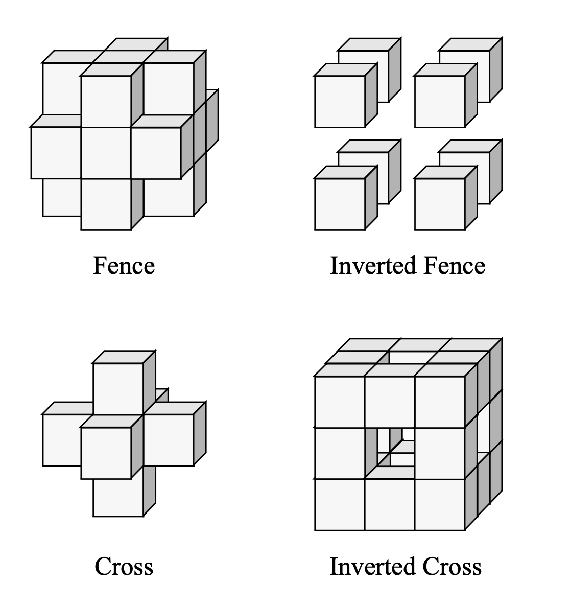

*Figure 7–5 Cropping operations.*

The SetCroppingRegionFlagsToSubVolume() method is a convenience method that sets the flags to 0x0002000—just the center region is visible. Although any 27 bit number can be used to define the cropping operation, in practice there are only a few that are used. Four additional convenience methods are provided for setting these flags: SetCroppingRegionFlagsToFence(), SetCroppingRegionFlagsToInvertedFence(), SetCroppingRegionFlagsToCross(), and SetCroppingRegionFlagsToInvertedCross(), as depicted in Figure 7–5.

## 7.11 Clipping a Volume

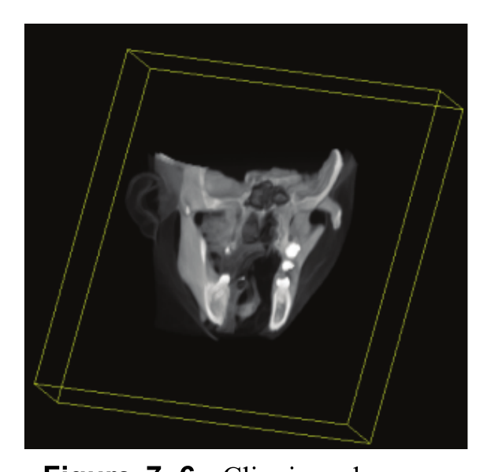

*Figure 7–6 Clipping planes are used to define a thick slab.*

In addition to the cropping functionality supplied by the vtkVolumeMapper, arbitrary clipping planes are provided in the vtkAbstractMapper3D. For subclasses of vtkAbstractMapper3D that use OpenGL to perform the clipping in hardware such as vtkPolyDataMapper and vtkProjectedTetrahedraMapper, an error message may be displayed if you attempt to use more than the maximum number of clipping planes supported by OpenGL, which is typically 6. Software rendering techniques such as vtkFixedPointVolumeRayCastMapper can support an arbitrary number of clipping planes.

The clipping planes are specified by creating a vtkPlane, defining the plane parameters, then adding this plane to the mapper using the AddClippingPlane() method. One common use of these arbitrary clipping planes in volume rendering is to specify two planes parallel to each other in order to perform a thick reformatting operation. An example of this applied to CT data is shown in Figure 7–6. For unstructured data, clipping planes can be used essentially as cropping planes to view only a subregion of the data, which is often necessary when trying to visualize internal details in a complex structure.

## 7.12 Controlling the Normal Encoding

The standard illumination equation relies on a surface normal in order to calculate the diffuse and specular components of shading. In volume rendering of vtkImageData, the gradient at a location in the volumetric data is considered to point in the opposite direction of the "surface normal" at that location. A finite differences technique is typically used to estimate the gradient, but this tends to be an expensive calculation, and would make shaded volume rendering prohibitively slow if it had to be performed at every sample along every ray.

One way to avoid these expensive computations is to precompute the normals at the grid locations, and to use some form of interpolation in between. If done naively, this would require three floating point numbers per location, and we would still need to take a square root to determine the magnitude. Alternatively, we could store the magnitude so that each normal would require four floating point values. Since volumes tend to be quite large, this technique requires too much memory, so we must somehow quantize the normals into a smaller number of bytes.

In the vtkFixedPointVolumeRayCastMapper, the normal direction is quantized into two bytes and the magnitude into one. The calculation of the normal is performed by a subclass of vtkEncodedGradientEstimator (currently only vtkFiniteDifferenceGradientEstimator) and the encoding of the direction into two bytes is performed by a subclass of vtkDirectionEncoder (currently vtkRecursiveSphereDirectionEncoder and vtkSphericalDirectionEncoder). These objects are created automatically so the typical user need not be concerned with them. In the case where one volume dataset is to be rendered by multiple mappers into the same image, it is often useful to create one gradient estimator for use by all the mappers. This will conserve space and computational time since otherwise there would be one copy of the normal volume per mapper. An example fragment of code is shown below:

```python
from vtkmodules.vtkRenderingVolume import (
    vtkFiniteDifferenceGradientEstimator,
    vtkFixedPointVolumeRayCastMapper,
)

# Create the gradient estimator
gradient_estimator = vtkFiniteDifferenceGradientEstimator()
# Create the first mapper
volume_mapper1 = vtkFixedPointVolumeRayCastMapper()
volume_mapper1.SetGradientEstimator(gradient_estimator)
volume_mapper1.SetInputConnection(reader.GetOutputPort())
# Create the second mapper
volume_mapper2 = vtkFixedPointVolumeRayCastMapper()
volume_mapper2.SetGradientEstimator(gradient_estimator)
volume_mapper2.SetInputConnection(reader.GetOutputPort())
```

If you set the gradient estimator to the same object in two different mappers, then it is important that these mappers have the same input. Otherwise, the gradient estimator will be out-of-date each time the mapper asks for the normals, and will regenerate them for each volume during every frame rendered. In the above example, the direction encoding objects were not explicitly created, therefore each gradient estimator created its own encoding object. Since this object does not have any significant storage requirements, this is generally an acceptable situation. Alternatively, one vtkRecursiveSphereDirectionEncoder could be created, and the SetDirectionEncoder() method would be used on each estimator.

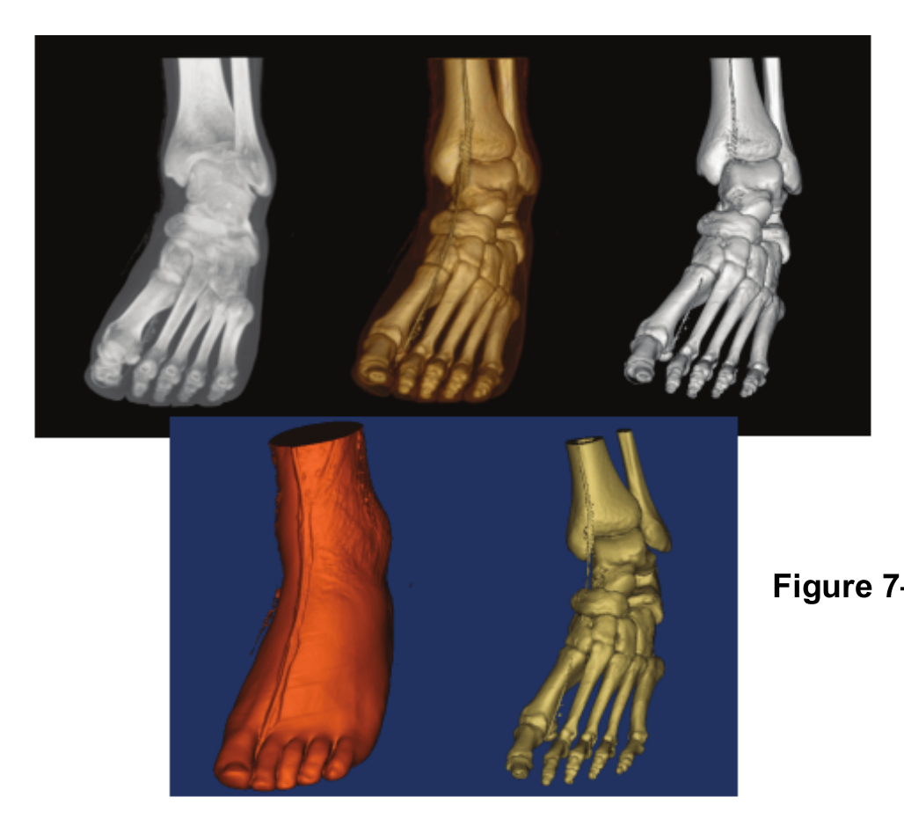

*Figure 7–7 Volume rendering via ray casting.*

The vtkFixedPointVolumeRayCastMapper class supports shading and uses gradient estimators and normal encoders internally, but these classes are not exposed at the API level and therefore encoded normals cannot be shared between mappers. The vtkGPUVolumeRayCastMapper computes gradients on the fly in the shader and does not use these encoding classes.

## 7.13 Volumetric Ray Casting for vtkImageData

The primary volume mapper for vtkImageData is the vtkGPUVolumeRayCastMapper, which performs GPU-accelerated ray casting. It is generally the fastest mapper and produces high-quality results. For situations where GPU acceleration is not available, the vtkFixedPointVolumeRayCastMapper provides a software fallback that is threaded to make use of multiple processors when available.

The vtkGPUVolumeRayCastMapper supports multiple blend modes that control how samples along each ray are combined to produce the final pixel color. The blend mode is set directly on the mapper:

- **SetBlendModeToComposite()** (default) — performs alpha compositing of samples along the ray.
- **SetBlendModeToMaximumIntensity()** — generates maximum intensity projections (MIP) of the volume.
- **SetBlendModeToMinimumIntensity()** — generates minimum intensity projections.
- **SetBlendModeToAverageIntensity()** — averages sample values along the ray.
- **SetBlendModeToIsoSurface()** — renders isosurfaces within the volumetric data (use SetIsoValue() on the mapper's vtkVolumeProperty to set the isosurface value).

An example of the images that can be generated using different blend modes is shown in Figure 7–7.

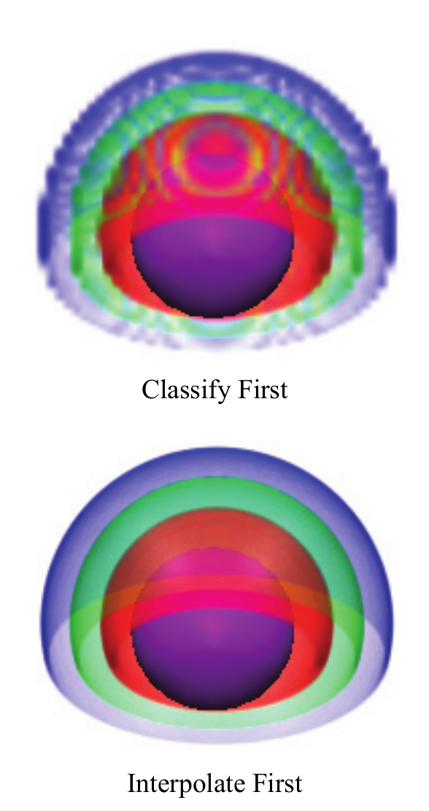

*Figure 7–8 The effect of interpolation order in composite ray casting.*

When using composite blending with trilinear interpolation, the order of interpolation and classification affects the result (Figure 7–8). Interpolating first generally produces smoother images: the scalar value at the sample point is interpolated first, then classified through the transfer functions. Classifying first applies the transfer functions at the eight vertices of the cell, then interpolates the resulting RGBA values. The interpolate-first method makes the underlying assumption that if two neighboring data points have values of 10 and 100, then a value of 50 exists somewhere between them. In the case where material is being classified by scalar value, this may not be the case. For example, consider CT data where values below 20 are air (transparent), values from 20 to 80 are soft tissue, and values above 80 are bone. If interpolation is performed first, then bone can never be adjacent to air — there must always be soft tissue between them. This is not true inside the mouth where teeth meet air.

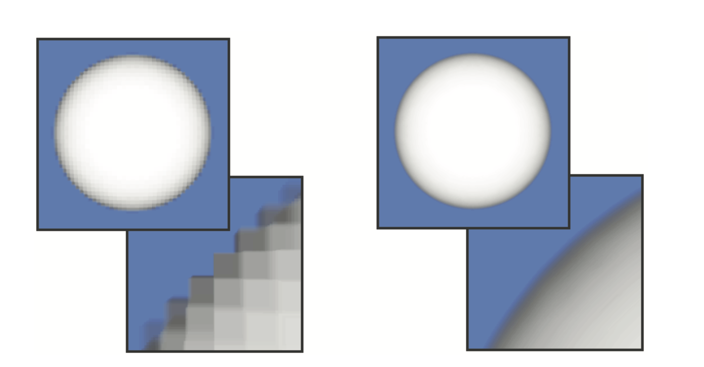

*Figure 7–9 Different methods for interpolation. On the left, nearest neighbor interpolation. On the right, trilinear interpolation.*

The value of the interpolation type instance variable in the vtkVolumeProperty is important to ray casting. There are two options: SetInterpolationTypeToNearest() (the default) which will use a nearest neighbor approximation when sampling along the ray, and SetInterpolationTypeToLinear() which will use trilinear interpolation during sampling. Using the trilinear interpolation produces smoother images with less artifacts, but generally takes a bit longer. The difference in image quality obtained with these two methods is shown in Figure 7–9. A sphere is voxelized into a 50x50x50 voxel volume, and rendered using alpha compositing with nearest neighbor interpolation on the left and trilinear interpolation on the right. In the image of the full sphere it may be difficult to distinguish between the two interpolation methods, but by zooming up on just a portion of the sphere it is easy to see the individual voxels in the left image.

Another parameter that affects the image is the SampleDistance. This is the distance in world coordinates between sample points along the ray. The accuracy of the compositing approximation increases with the number of samples taken, but unfortunately so does the rendering time.

By default samples are taken 1 unit apart in world coordinates. In practice you should adjust this spacing based on the sample spacing of the 3D data being rendered, and the rate of change of not only the scalar values but also the color and opacity assigned to the scalar values through the transfer functions. An example is shown below of a voxelized vase with a 1x1x1 spacing between samples in the dataset. The scalar values vary smoothly in the data, but a sharp change has been introduced in the transfer functions by having the color change rapidly from black to white. You can clearly see artifacts of the "undersampling" of ray casting in the image created with a step size of 2.0. Even with a step size of 1.0 there are some artifacts since the color of the vase changes significantly within a world space distance of 1.0. If the sample distance is set to 0.1 the image appears smooth. Of course, this smooth image on the left takes nearly 20 times as long to generate as the one on the right.

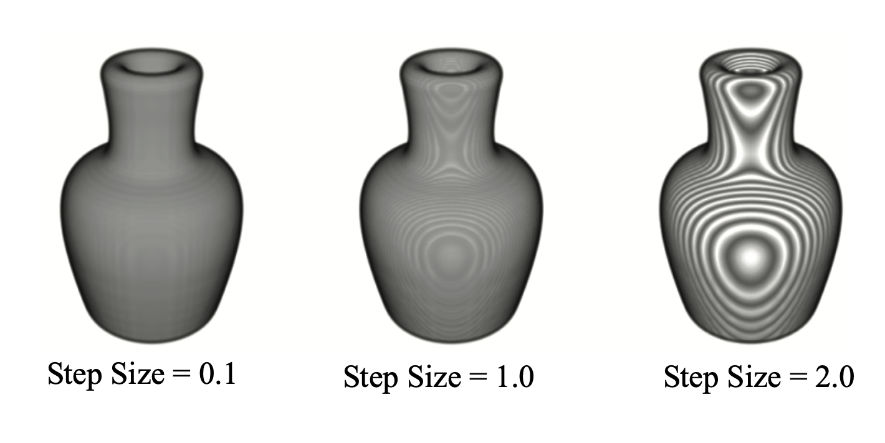

*Figure 7–10 The effects of varying sample distance along the ray. As the sample distance increases, sampling artifacts create the dramatic black and white banding. However, the cost of volume rendering increases inversely proportional to the sample size, i.e., the difference in rendering time for sample distance 0.1 is 20x faster than for 2.0.*

## 7.14 Fixed Point Ray Casting

The vtkFixedPointVolumeRayCastMapper is a volume mapper for vtkImageData that employs fixed point arithmetic in order to improve performance. The vtkFixedPointVolumeRayCastMapper supports all scalar types from unsigned char through double, and supports up to four independent components, each with their own transfer functions and shading parameters. In addition, this mapper supports two varieties of non-independent multi-component data. The first variety is two component data where the first component is used to look up a color, while the second component is used to derive a normal value and to look up opacity. This is useful when some property such as density is stored in the second component, while the first is used as perhaps an index to indicate different material types that can each have their own color, opacity, and shading style. The second variety is four component unsigned char data where the first three components directly represent RGB, with the fourth passed through the scalar opacity transfer function to obtain alpha.

The vtkFixedPointVolumeRayCastMapper employs a form of space leaping to avoid processing in "empty" (entirely transparent) regions of the volume. Early ray termination is also employed to terminate processing once full opacity is reached. Therefore, significant performance improvements can be obtained when rendering data with a sharp "surface" appearance.

## 7.15 GPU Ray Casting

The vtkGPUVolumeRayCastMapper is the recommended volume mapper for vtkImageData. It leverages the GPU to perform ray casting in real time, making it significantly faster than the software-based vtkFixedPointVolumeRayCastMapper in most cases. It supports all scalar types, multiple independent and non-independent components, and all blend modes (composite, MIP, MinIP, average intensity, and isosurface).

> **Note:** Earlier versions of VTK included `vtkVolumeTextureMapper2D` and `vtkVolumeTextureMapper3D`, which used 2D and 3D texture mapping hardware to approximate volume rendering. These classes have been removed. The `vtkGPUVolumeRayCastMapper` supersedes both texture mapping approaches with higher quality and better performance on modern hardware.

The GPU mapper automatically handles data transfer to the GPU and supports features such as gradient-based shading, cropping, and clipping planes. It can also automatically adjust the sample distance during interaction to maintain interactive frame rates.

## 7.16 Volumetric Ray Casting for vtkUnstructuredGrid

The vtkUnstructuredGridVolumeRayCastMapper is a volume mapper that employs a software ray casting technique to perform volume rendering on unstructured grids. Using the default ray cast function and integration methods, this mapper is more accurate than the vtkProjectedTetrahedra method, but is also significantly slower. This mapper is generally faster than the vtkUnstructuredGridZSweepMapper, but obtains this speed at the cost of memory consumption and is therefore best used with small unstructured grids. The ray caster is threaded to make use of multiple processors when available. As with all mappers that render vtkUnstructuredGrid data, this mapper requires that the input dataset is composed entirely of tetrahedral elements, and may employ a filter to tetrahedralize the input data if necessary.

This ray cast mapper is customizable in two ways. First, you may specify the method used to traverse the ray through the unstructured grid using the SetRayCastFunction() method. The specified function must be a subclass of vtkUnstructuredGridVolumeRayCastFunction. Currently one such subclass exists within VTK: vtkUnstructuredGridBunykRayCastFunction. This class is based on the method described in "Simple, Fast, Robust Ray Casting of Irregular Grids" by Paul Bunyk, Arie Kaufman, and Claudio Silva. This method is quite memory intensive (with extra explicit copies of the data) and therefore should not be used for very large data.

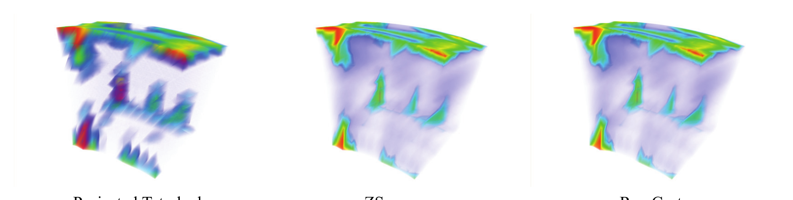

*Figure 7–11 Comparison of volume rendering techniques for vtkUnstructuredGrid datasets.*

You may also specify a method for integrating along the ray between the front entry point and back exit point for the length of ray intersecting a tetrahedra using the SetRayIntegrator() method. The specified method must be a subclass of vtkUnstructuredGridVolumeRayIntegrator. Several available subclasses exist in VTK, and when left unspecified the mapper will select an appropriate subclass for you. The vtkUnstructuredGridHomogeneousRayIntegrator class is applicable when rendering cell scalars. The vtkUnstructuredGridLinearRayIntegrator performs piecewise linear ray integration. Considering that transfer functions in VTK are piecewise linear, this class should give the "correct" integration under most circumstances. However, the computations performed are fairly hefty and should, for the most part, only be used as a benchmark for other, faster methods. The vtkUnstructuredGridPartialPreIntegration also performs piecewise linear ray integration, and will give the same results as vtkUnstructuredGridLinearRayIntegration (with potentially an error due to table lookup quantization), but should be notably faster. The algorithm used is given by Moreland and Angel, "A Fast High Accuracy Volume Renderer for Unstructured Data." The vtkUnstructuredGridPreIntegration performs ray integration by looking into a precomputed table. The result should be equivalent to that computed by vtkUnstructuredGridLinearRayIntegrator and vtkUnstructuredGridPartialPreIntegration, but faster than either one. The pre-integration algorithm was first introduced by Roettger, Kraus, and Ertl in "Hardware-Accelerated Volume And Isosurface Rendering Based On Cell-Projection."

Similar to the structured ray cast mapper, the unstructured grid ray cast mapper will automatically adjust the number of rays cast in order to achieve a desired update rate. Since this is a software-only technique, this method utilizes multiple processors when available to improve performance.

## 7.17 ZSweep

The vtkUnstructuredGridVolumeZSweepMapper rendering method is based on an algorithm described in "ZSWEEP: An Efficient and Exact Projection Algorithm for Unstructured Volume Rendering" by Ricardo Farias, Joseph S. B. Mitchell and Claudio T. Silva. This is a software projection technique that will work on any platform, but is generally the slowest of the unstructured grid volume rendering methods available in VTK. It is less memory intensive than the ray cast mapper (using the Bunyk function) and is therefore able to render larger volumes. Similar to the ray cast mapper, the specific ray integrator may be specified using the SetRayIntegrator() method. Again, leaving this as NULL will allow the mapper to select an appropriate integrator for you.

## 7.18 Projected Tetrahedra

The vtkProjectedTetrahedraMapper rendering method is an implementation of the classic Projected Tetrahedra algorithm presented by Shirley and Tuchman in "A Polygonal Approximation to Direct Scalar Volume Rendering". This method utilizes OpenGL to improve rendering performance by converting tetrahedra into triangles for a given view point, then rendering these triangles with hardware acceleration. However, the OpenGL methods utilized in this class are not necessarily supported by all driver implementations, and may produce artifacts. Typically this mapper will be used in conjunction with either the ray caster or the ZSweep mapper to form a level-of-detail approach that provides fast rendering during interactivity followed by a more accurate technique to produce the final image.

In Figure 7–11 you can see a comparison of images generated with different techniques for volume rendering unstructured grids. The projected tetrahedra technique is interactive, while the other techniques require a few seconds per image on a standard desktop system.

## 7.19 Speed vs. Accuracy Trade-offs

It is often necessary to achieve a certain frame rate in order to effectively interact with the data, and it may be necessary to trade off accuracy in order to achieve speed. Fortunately, there are ways to do this for many of the volume rendering approaches. In fact, several of them will provide this functionality for you automatically by determining an appropriate accuracy level in order to obtain the desired update rate specified in the vtkRenderWindow.

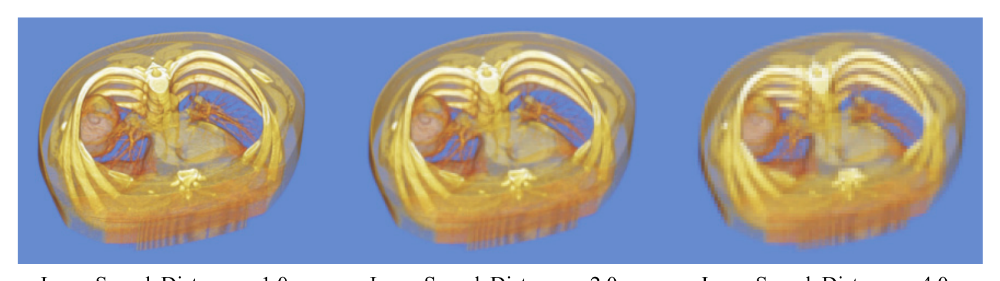

*Figure 7–12 The effect of changing image sample distance on image quality.*

The support for achieving a desired frame rate for vtkFixedPointVolumeRayCastMapper, vtkUnstructuredGridVolumeRayCastMapper, and vtkUnstructuredGridVolumeZSweepMapper is available by default in VTK. You can set the desired update rate in the vtkRenderWindow, or the StillUpdateRate and the DesiredUpdateRate in the interactor if you are using one. Due to the fact that the time required for these rendering techniques is mostly dependent on the size of the image, the mapper will automatically attempt to achieve the desired rendering rate by reducing the number of rays that are cast, or the size of the image that is generated. By default, the automatic adjustment is on. In order to maintain interactivity, an abort check procedure should be specified in the render window so that the user will be able to interrupt the higher resolution image in order to interact with the data again.

There are limits on how blocky the image will become in order to achieve the desired update rate. By default, the adjustment will allow the image to become quite blocky - for example, casting only 1 ray for every 10x10 neighborhood of pixels if necessary to achieve the desired update rate. Also by default these mappers will not generate an image larger than necessary to fill the window on the screen. These limits can be adjusted in the mapper by setting the MinimumImageSampleDistance and MaximumImageSampleDistance. In addition AutoAdjustSampleDistances can be turned off, and the specified ImageSampleDistance will be used to represent the spacing between adjacent pixels on the image plane. Results for one example are shown in Figure 7–12.

This technique of reducing the number of rays in order to achieve interactive frame rates can be quite effective. For example, consider the full resolution image shown on the left in Figure 7–12. This image may require 4 seconds to compute, which is much too slow for data interaction such as rotating or translating the data, or interactively adjusting the transfer function. If we instead subsample every other ray along each axis by setting the ImageSampleDistance to 2.0, we will get an image like the one shown in the middle in only about 1 second. Since this still may be too slow for effective interaction, we could subsample every fourth ray, and achieve rendering rates of nearly 4 frames per second with the image shown on the right. It may be blocky, but it is far easier to rotate a blocky volume at 4 frames per second than a full resolution volume at one frame every four seconds.

Another approach to trading off accuracy for speed is to create a lower resolution volume using vtkImageResample, and rendering this new volume instead. Since the speed of volume rendering is highly dependent on the size of the volume, this will achieve significant speedups. The vtkGPUVolumeRayCastMapper also supports automatic sample distance adjustment during interaction.

## 7.20 Using a vtkLODProp3D to Improve Performance

The vtkLODProp3D is a 3D prop that allows for the collection of multiple levels-of-detail and decides which to render for each frame based on the allocated rendering time of the prop. The allocated rendering time of a prop is dependent on the desired update rate for the rendering window, the number of renderers in the render window, the number of props in the renderer, and any possible adjustment that a culler may have made based on screen coverage or other importance factors.

Using a vtkLODProp3D, it is possible to collect several rendering techniques into one prop, and allow the prop to decide which technique to use. These techniques may span several different classes of rendering including geometric approaches that utilize a vtkPolyDataMapper, and volumetric methods for both structured and unstructured data.

Consider the following simple example of creating a vtkLODProp3D with three different forms of volume rendering for vtkImageData:

```python
from vtkmodules.vtkImagingCore import vtkImageResample
from vtkmodules.vtkRenderingCore import vtkLODProp3D, vtkVolumeProperty
from vtkmodules.vtkRenderingVolume import (
    vtkFixedPointVolumeRayCastMapper,
    vtkGPUVolumeRayCastMapper,
)

# Resample the data at half resolution for the low-res LOD
resampler = vtkImageResample()
resampler.SetInputConnection(reader.GetOutputPort())
resampler.SetAxisMagnificationFactor(0, 0.5)
resampler.SetAxisMagnificationFactor(1, 0.5)
resampler.SetAxisMagnificationFactor(2, 0.5)

# Low-res LOD: GPU ray casting on downsampled data
lowres_mapper = vtkGPUVolumeRayCastMapper()
lowres_mapper.SetInputConnection(resampler.GetOutputPort())
# Medium-res LOD: GPU ray casting on full data
medres_mapper = vtkGPUVolumeRayCastMapper()
medres_mapper.SetInputConnection(reader.GetOutputPort())
# High-res LOD: software ray casting on full data
hires_mapper = vtkFixedPointVolumeRayCastMapper()
hires_mapper.SetInputConnection(reader.GetOutputPort())

volume_lod = vtkLODProp3D()
volume_lod.AddLOD(lowres_mapper, volume_property, 0.0)
volume_lod.AddLOD(medres_mapper, volume_property, 0.0)
volume_lod.AddLOD(hires_mapper, volume_property, 0.0)
```

For clarity, many steps of reading the data and setting up visualization parameters have been left out of this example. At render time, one of the three levels-of-detail (LOD) for this prop will be selected based on the estimated time that it will take to render the LODs and the allocated time for this prop. In this case, all three LODs use the same property, but they could have used different properties if desired. Also, in this case all three mappers are subclasses of vtkVolumeMapper, but we could add a bounding box representation as another LOD. If we are rendering a large vtkUnstructuredGrid dataset, we could form an LOD by adding an outline representation using a vtkPolyDataMapper for the lowest resolution, we could resample the data into a vtkImageData and add a level-of-detail that renders this with GPU ray casting, and we could add the full resolution unstructured data rendered with the ZSweep mapper as the best level-of-detail.

The last parameter of the AddLOD() method is an initial time to use for the estimated time required to render this level-of-detail. Setting this value to 0.0 requires that the LOD be rendered once before an estimated render time can be determined. When a vtkLODProp3D has to decide which LOD to render, it will choose one with 0.0 estimated render time if there are any. Otherwise, it will choose the LOD with the greatest time that does not exceed the allocated render time of the prop, if it can find such an LOD. Otherwise, it will choose the LOD with the lowest estimated render time. The time required to draw an LOD for the current frame replaces the estimated render time of that LOD for future frames.
