# Chapter 8: Information Visualization

Visualization techniques may be classified into two broad categories: scientific visualization and information visualization. The two are mainly distinguished by the types of data they represent. Scientific visualization refers to the display of data having inherent spatiotemporal attributes, such as simulations, models, or images. With these types of data, the relative position of elements is known because each element has an inherent structure and placement in a three dimensional space. 

Information visualization, on the other hand, is the visualization of all other forms of data. Metadata, relational databases, and general tabular data fall into this category. In these cases, the placement of individual elements is not fixed and an embedding must be performed to place similar or related elements closer together. Consider visualizing a group of people. One simple way to organize the people is to place them in a list or table. If accompanying information is also available, alternative formats may be helpful to the viewer. People could be presented in a 2D view, grouped by similarity in age, gender, occupation, etc. If "friendship" links are known (e.g. from a social networking website), they could be grouped into natural friendship groups formed by these links. If each person's current location is known, they could be arranged on a map.

Other examples of data suitable for information visualization are databases, spreadsheets, XML, and any type of metadata such as demographic information of patients or parameters of simulation runs. For this type of visualization, algorithms such as clustering and graph layout are used to uncover salient relationships or determine a high-level picture of complex, heterogeneous data. 

The essential data structures for information visualization are tables, graphs, and trees. A table is simply a two-dimensional array of data, much like a spreadsheet. In VTK, a table consists of a vector of named arrays which serve as the columns of the table. Each column acts much like an attribute in other data objects like vtkImageData. Tables are used to store the results of database queries and contents of delimited text files.

The graph data structure consists of a collection of entities called vertices, along with links between pairs of vertices called edges. Graphs can be used to store many kinds of data. For example, in a social network, each vertex may represent a person while each edge may signify a friendship between two people. Another example is a biological pathway network where vertices may represent compounds and edges may indicate that chemical reactions can produce one compound from another.

A tree is a type of graph that does not contain any cycles (sequences of connected edges that form a full loop). VTK's tree data structure is a rooted tree, which can be thought of as a hierarchy, with the root vertex on top. Trees can organize large amounts of data by grouping entities into multiple levels.

Tables, graphs, and trees can represent complex data in several ways. The following sections provide details about how to perform some basic operations and visualizations with these data structures.

## 8.1 Exploring Relationships in Tabular Data

Tables are a very common form of data. Plain text delimited files, spreadsheets, and relational databases all use tables as the basic data structure. A row in the table normally represents a single entity (a person, an event, a sample, etc.) and columns represent attributes present on those entities. Let's take for example a table of medals from the Summer 2008 Olympics. This table will have the medal winner's name and country, along with the event information. In tabular format, it is not easy to answer questions such as: Who won the most medals? What country excelled in a certain discipline? In order to do this, we want to extract relational information from the table in the form of a graph or tree.

### Converting a Table to a Graph

The following Python example demonstrates how to take this information, and with vtkTableToGraph, convert it into a vtkGraph data structure and display it in a graph view. The following example is Python code for converting a simple table into a graph.

```python
from vtkmodules.vtkInfovisCore import (
    vtkDelimitedTextReader,
    vtkGroupLeafVertices,
    vtkStringToCategory,
    vtkTableToGraph,
    vtkTableToTreeFilter,
)
from vtkmodules.vtkViewsInfovis import vtkGraphLayoutView
from vtkmodules.vtkViewsCore import vtkViewTheme

reader = vtkDelimitedTextReader()
reader.SetFileName("medals.txt")
reader.SetFieldDelimiterCharacters("\t")
reader.SetHaveHeaders(True)

ttg = vtkTableToGraph()
ttg.SetInputConnection(reader.GetOutputPort())
ttg.AddLinkVertex("Name", "Name", False)
ttg.AddLinkVertex("Country", "Country", False)
ttg.AddLinkVertex("Discipline", "Discipline", False)
ttg.AddLinkEdge("Name", "Country")
ttg.AddLinkEdge("Name", "Discipline")

category = vtkStringToCategory()
category.SetInputConnection(ttg.GetOutputPort())
category.SetInputArrayToProcess(0, 0, 0, 4, "domain")

view = vtkGraphLayoutView()
view.AddRepresentationFromInputConnection(category.GetOutputPort())
view.SetLayoutStrategyToSimple2D()
view.SetVertexLabelArrayName("label")
view.VertexLabelVisibilityOn()
view.SetVertexColorArrayName("category")
view.ColorVerticesOn()
view.SetVertexLabelFontSize(18)

theme = vtkViewTheme.CreateMellowTheme()
view.ApplyViewTheme(theme)

view.ResetCamera()
view.Render()
view.GetInteractor().Start()
```

First we create a vtkDelimitedTextReader to read in the medals text file. This reader produces a vtkTable as its output, which is simply a list of named data arrays. The fields in this file are separated by tabs, so we set the field delimiter characters appropriately. We specify SetHaveHeaders(True) in order to assign column names from the first line in the file. Otherwise the columns would have generic names "Field 0", "Field 1", and so on, and data in the table would be assumed to start on the first line.

Now we wish to visualize some of the relationships in this table. The table has the following columns: "Name" contains the name of the athlete, "Country" has the athlete's country, and "Discipline" contains the discipline of the event the athlete participated in (such as swimming, archery, etc.). One method for viewing the relationships in the graph is to use vtkTableToGraph to produce a vtkGraph from the table. vtkTableToGraph takes a vtkTable as input (and optionally a second "vertex table" input described later) and produces a vtkGraph whose structure, vertex attributes, and edge attributes are taken from the table.

The vtkTableToGraph algorithm needs to know what columns should be used to generate vertices, and what pairs of columns should become edges, linking vertices together. So, in our example, we may wish to make a graph whose vertices represent names, countries, and disciplines. To do this we call AddLinkVertex() with the name of a column to make vertices from. All distinct values in that column will become vertices in the graph. So, AddLinkVertex('Country', ...) will make a vertex in the output graph for each distinct country name in the “Country” column of the table. The second argument to AddLinkVertex() provides the domain to be associated with those vertices. Domains are important for entity resolution. If, for example, “Country” and “Name” were given the same domain name, a country named “Chad” would be merged with a person with the name “Chad”. Giving each column a different domain will avoid these conflicts. There are situations, however, where two columns of the table should be given the same domain. For example, in a table of communications, there may columns named “From” and “To”. These should be assigned the same domain (perhaps named “Person”), so that a person's vertex would be merged into the same vertex regardless of whether that person was a sender or a recipient. The third parameter of AddLinkVertex() is described in the "Hidden Vertices" section below.

Now that the vertices are defined, we can define the set of edges in the graph with AddLinkEdge(). AddLinkEdge() takes two table column names, and produces an edge between two vertices A and B every time A and B appear together in the same row in those two columns. So the call AddLinkEdge('Name', 'Country') will add an edge in the graph between each athlete and his or her country. Similarly, AddLinkEdge('Name', 'Discipline') will add an edge between an athlete and each discipline he or she participates in. Figure 8–1 shows the result of converting the table of medals into a graph. The colors of the vertices in the graph indicate the domain to which they belong.Since you may only assign colors with a numeric array, the program uses vtkStringToCategory to convert the domain array (which contains strings), into numeric identifiers for each distinct vertex.

**Attributes.** The edges in vtkTableToGraph's output have the full set of attributes defined in the table. Namely each edge has associated with it all of the entries in the row of the table that produced the edge.

The vertices, however, have only three attributes associated with them by default. An attribute named “domain” will be a string array containing the domain name of each vertex. The “ids” and “label” attributes both contain the same quantity, but present it in different formats. The quantity that both contain is the content of the particular cell that defines the vertex. The “ids” attribute stores it in the original type, which may vary for vertices that belong to different domains. Hence the “ids” array is stored in a vtkVariantArray in which the data type of each entry is variable. The “label” attribute is a vtkStringArray containing the string equivalents of those values.

vtkTableToGraph accepts an optional second vtkTable input so that the vertices can have additional attributes assigned to them. While the first input to the filter defines connectivity of edges (and hence is called the “edge table”), the second input defines the additional properties for the graph vertices (so is called the “vertex table”).

Therefore, to add vertex attributes, you must create a vertex table that contains columns with identifiers matching those of the edge table's columns. The vertex table may have any number of additional columns containing other vertex attributes. In our example, there may be other tables that reside in separate files or in a relational database that define athlete properties (e.g. age, gender), country properties (e.g. population, land area), and discipline properties (e.g. number of events). To add these as vertex properties in the graph, you need to construct a single table containing all these columns. For example, this can be done with a properly formed SQL query or by applying the vtkMergeTables algorithm. When this expanded table is set as the second input to vtkTableToGraph, the domains defined in the second argument of AddLinkVertex() take on a special meaning. The domain name must match the vertex table column name that contains the matching identifiers. So in our example code, the vertex table would need to have arrays named “Name”, “Country”, and “Discipline” containing values matching those in the edge table.

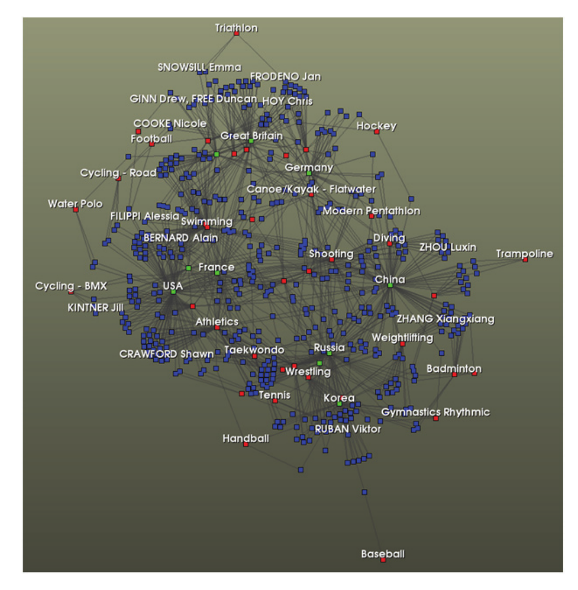

*Figure 8–1 The result of performing vtkTableToGraph to visualize a table of 2008 Olympic medals. Medal-winning athletes (blue) are linked to their country (green) and discipline (red).*

**Hidden Vertices.** The third parameter of AddLinkVertex() indicates whether the vertices should be hidden. Most frequently, it is worthwhile to show the vertices, so the default is False. However, setting it to True allows the creation of advanced link effects, for example connecting athletes to other athletes who represent the same country, but without displaying countries explicitly. To do this, you would add “Name” as a non-hidden vertex type, and “Country” as a hidden vertex type. Then you add the pairs (“Name”, “Country”) and (“Country”, “Name”) with AddLinkEdge(). Internally vtkTableToGraph creates the graph with name and country vertices, then deletes the country vertices, creating a new edge for each two-edge path that passes through a country vertex. Note that hiding vertices can be prohibitively expensive since the number of edges produced can grow quickly, and can produce large cliques (i.e. collections of vertices where every pair of vertices is connected by an edge). For this reason, this option may be deprecated in the future.

### Converting a Table to a Tree

While a graph represents an arbitrarily complex structure, a tree has a much more restricted, and hence simpler, structure. In VTK, a vtkTree contains a rooted tree in which there is a hierarchy of vertices with a single root vertex on top. Outgoing edges flow down the tree, connecting "parent" vertices to "child" vertices. One example use for vtkTrees is to examine the structure of arbitrary XML files. A tree can be generated directly from any XML file simply by using the vtkXMLTreeReader. That reader parses the nested XML elements and creates a vtkTree. You may also create a categorical tree from tabular data. The following Python code demonstrates how to use the vtkTableToTreeFilter and vtkGroupLeafVertices algorithms to do this.

```python
from vtkmodules.vtkInfovisCore import (
    vtkDelimitedTextReader,
    vtkGroupLeafVertices,
    vtkStringToCategory,
    vtkTableToTreeFilter,
)
from vtkmodules.vtkViewsInfovis import vtkTreeRingView

VERTICES = 4  # Constant for SetInputArrayToProcess

reader = vtkDelimitedTextReader()
reader.SetFileName("medals.txt")
reader.SetFieldDelimiterCharacters("\t")
reader.SetHaveHeaders(True)
reader.OutputPedigreeIdsOn()

ttt = vtkTableToTreeFilter()
ttt.SetInputConnection(reader.GetOutputPort())

group_disc = vtkGroupLeafVertices()
group_disc.SetInputConnection(ttt.GetOutputPort())
group_disc.SetInputArrayToProcess(0, 0, 0, VERTICES, "Discipline")
group_disc.SetInputArrayToProcess(1, 0, 0, VERTICES, "Name")

group_country = vtkGroupLeafVertices()
group_country.SetInputConnection(group_disc.GetOutputPort())
group_country.SetInputArrayToProcess(0, 0, 0, VERTICES, "Country")
group_country.SetInputArrayToProcess(1, 0, 0, VERTICES, "Name")

category = vtkStringToCategory()
category.SetInputArrayToProcess(0, 0, 0, VERTICES, "Name")
category.SetInputConnection(group_country.GetOutputPort())

view = vtkTreeRingView()
view.AddRepresentationFromInputConnection(category.GetOutputPort())
view.RootAtCenterOn()
view.SetInteriorRadius(1)
view.SetAreaHoverArrayName("Name")
view.SetAreaLabelArrayName("Name")
view.AreaLabelVisibilityOn()
view.SetAreaColorArrayName("category")
view.ColorAreasOn()
view.SetAreaLabelFontSize(18)
```

The code begins with reading the same tab-delimited file with Olympic medal data described in the previous sections. vtkTableToTreeFilter then performs the first basic step in converting our table into a tree. It produces a new vertex to serve as the root of the tree, then creates a child vertex for every row in the input table, associating the attributes in the table with the child vertices in the tree. This tree is not yet interesting since it only contains a single level with no meaningful structure. In our example, vtkTableToTreeFilter is followed by two instances of vtkGroupLeafVertices. Each of these filters adds a new level to the tree, grouping existing leaf vertices (i.e. vertices with no children) according to matching values in a particular array. The first instance of vtkGroupLeafVertices sets the main input array to be the “Discipline” attribute. This adds a new level below the root that contains one vertex for each unique value in the discipline array. The original leaf vertices are collected under each discipline vertex based on their value for that attribute.

Similarly, the second vtkGroupLeafVertices adds a level representing countries below the disciplines. The data is already split by discipline, so each country may appear several times, once under each discipline where that country won a medal. This is one main difference between converting a table to a graph or a tree. Graphs are a more complex structure, which allows vertices representing the same entity to appear only once. Trees, on the other hand, are simpler structures that are often simpler to comprehend, but often require duplication of data because of their connectivity constraints. The result of converting the table into a tree and visualizing it with a vtkTreeRingView is shown in Figure 8–2. The tree ring view and graph layout view are described further in the "Graph Visualization Techniques" section below. Simply reversing the two vtkGroupLeafVertices algorithms would produce a tree that was organized first by country, then by discipline.

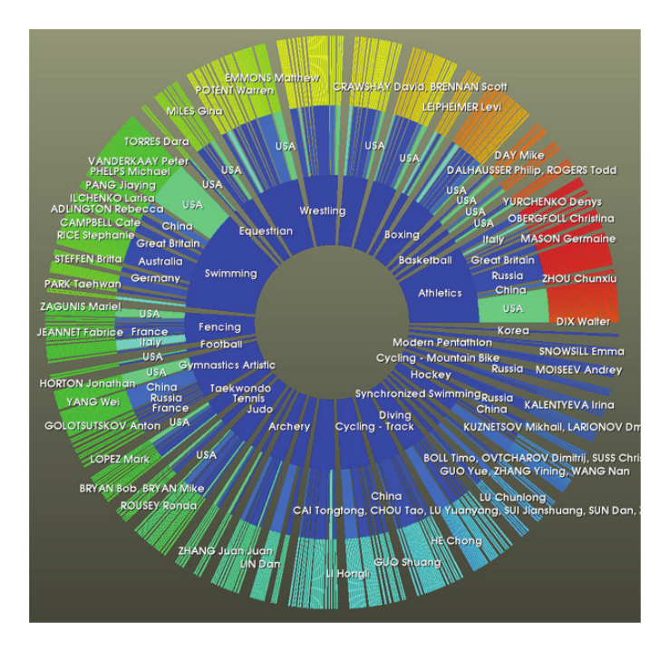
*Figure 8–2 A table of Olympic medals visualized in a tree ring view.*

These filters are available for processing vtkTables or attribute data in other data objects: 
- vtkBoostSplitTableField.cxx - Splits a string attribute into parts by a delimiter and makes duplicate rows for each part, differing only by the split attribute.

- vtkDataObjectToTable.cxx - Converts the point or cell attribute of a vtkDataSet subclass, or vertex or edge data of a vtkGraph subclass into a vtkTable. 
- vtkGenerateIndexArray.cxx - Generate a simple zero-based index array and append it to a data object. 
- vtkMergeColumns.cxx - Merge multiple columns into a single column. 
- vtkMergeTables.cxx - Merge multiple tables into a single table containing the union of all columns. 
- vtkStringToCategory.cxx - Convert a string array to an integer array by assigning an integer to each unique string in the array. 
- vtkStringToNumeric.cxx - Automatically detects and converts string arrays containing values that may be converted to integer or floating-point values. 
- vtkThresholdTable.cxx - Filter out rows from a vtkTable that have attribute values outside a given range.

Other graph transformation algorithms include: 

- vtkCollapseGraph.cxx - Combine vertices with matching attribute values into a single vertex. 
- vtkPruneTreeFilter.cxx - Remove a sub-tree from a vtkTree. 
- vtkRemoveIsolatedVertices.cxx - Delete vertices with no edge connections from a graph.

## 8.2 Graph Visualization Techniques

Graph visualization is becoming increasingly important as a method for divining relationships between entities, entity clustering, and higher level abstractions. Graphs are typically visualized in two or three dimensions, with attempts to inject additional dimensional information through vertex and edge coloring, labeling, annotations, clustering, and icons. Because of the diversity available for displaying graphs including theoretical, heuristic, empirical and manual layout methods, graph visualization has become a mixture of both art and science requiring methods that can handle both flexibility and complexity while maintaining a fair amount of generality. These methods are typically broken down into methods for vertex layout, methods for edge layout and methods which display vertices and relationships with polygonal data structures (e.g., circles, rings, blocks, etc.). In addition to the layout methods, helper functionality for displaying graph attributes is also desirable (e.g., common coloring themes, labeling mechanisms, annotations and selections, etc.). To accommodate this flexibility while maintaining a high level of functionality, the graph visualization tools in VTK utilize `strategy' methods for layout of vertices and edges, and 'view' objects for centralizing common helper functionality associated with the visualization of graphs.

To demonstrate basic capability, we present a simple example uses layouts and views to create graph displays in VTK see Figure 8–3. The remainder of this section will discuss additional flexibility available in performing graph visualization. The following code snippet creates a simple graph view of a random graph.

```python
from vtkmodules.vtkInfovisCore import vtkRandomGraphSource
from vtkmodules.vtkViewsInfovis import vtkGraphLayoutView
from vtkmodules.vtkViewsCore import vtkViewTheme

# Create a random graph
source = vtkRandomGraphSource()
source.SetNumberOfVertices(100)
source.SetNumberOfEdges(110)
source.StartWithTreeOn()

# Create a view to display the graph
view = vtkGraphLayoutView()
view.SetLayoutStrategyToSimple2D()
view.ColorVerticesOn()
view.SetVertexColorArrayName("vertex id")
view.SetRepresentationFromInputConnection(source.GetOutputPort())

# Apply a theme to the view
theme = vtkViewTheme.CreateMellowTheme()
view.ApplyViewTheme(theme)

view.ResetCamera()
view.Render()
view.GetInteractor().Start()
```

A primary step that must take place in information visualization is to embed the data into some drawable space. Recall that vertices in a vtkGraph have no relation to vtkPoints in the more traditional vtkDataSet classes. Points have X, Y and Z coordinates, but vertices to not. Depending on how these assignments are made, the resulting picture will vary greatly, and different characteristics of the underlying data will be easier to discern. A second degree of freedom in information visualization is the exact routing of the edges that connect the vertices.

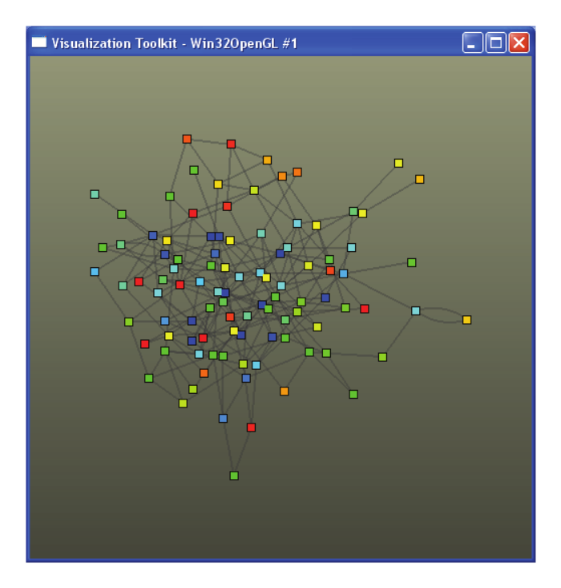

*Figure 8–3 A simple graph view*

### Vertex Layout
To determine where vertices are positioned, one places a vtkGraphLayout class into the pipeline. This class is responsible for the overall task of assigning coordinates to vertices, but it leaves the details of coordinate assignment to a swappable helper class. The helper class is an example of a strategy. This two part structure maximizes flexibility and minimizes complexity. Thus, in a typical graph visualization, a graph is piped into the vtkGraphLayout class after which each vertex has a vtkPoint assigned. The pipeline author can choose amongst a number of strategies. Strategies may vary from springbased layouts to clustering methods. Each strategy class is subclassed from vtkGraphLayoutStrategy, all of which can be plugged into vtkGraphLayout. Examples of currently available layout strategies include: 
- vtkAssignCoordinatesLayoutStrategy - strategy to allow coordinate assignment from arrays designated as the x, y, and z coordinates. 
- vtkCircularLayoutStrategy - Assigns points to the vertices around a circle with unit radius.
- vtkClustering2DLayoutStrategy - strategy utilizing a density grid based force directed layout strategy. The layout running time is O(V+E) with an extremely high constant. 
- vtkCommunity2DLayoutStrategy - similar to vtkClustering2DLayoutStrategy, but looks for a community array on its input and strengthens edges within a community and weakens edges not within the community. 
- vtkConeLayoutStrategy - strategy that positions the nodes of a tree(forest) in 3D space based on the cone-tree approach first described by Robertson, Mackinlay and Card in the proceedings of the ACM Conference on Human Factors in Computing Systems (CHI'91). This implementation also incorporates refinements to the layout developed by Carriere and Kazman, and by Auber. 
- vtkConstrained2DLayoutStrategy - similar to vtkClustering2DLayoutStrategy, but looks for a constraint array indicating a level of impedance a node has to the force calculations during the layout optimization. 
- vtkCosmicTreeLayoutStrategy - tree layout strategy reminiscent of astronomical systems 
- vtkFast2DLayoutStrategy - a simple fast 2D graph layout. 
- vtkForceDirectedLayoutStrategy - lays out a graph in 2D or 3D using a force-directed algorithm. 
- vtkPassThroughLayoutStrategy - a layout strategy that does absolutely simply passes the graph through without modifying the data. 
- vtkRandomLayoutStrategy - randomly places vertices in 2 or 3 dimensions within a bounded range. 
- vtkSimple2DLayoutStrategy - an implementation of the Fruchterman & Reingold layout strategy (see “Graph Drawing by Force-directed Placement” Software-Practice and Experience 21(11) 1991)). 
- vtkTreeLayoutStrategy - Assigns points to the nodes of a tree in either a standard or radial layout. 
- vtkTreeOrbitLayoutStrategy - Assigns points to the nodes of a tree to an orbital layout. Each parent is orbited by its children, recursively.

To simplify the task of visualizing different graphs, the vertex layout strategies can be supplied directly to a view class. This is done by calling vtkGraphLayoutView::SetLayoutStrategy(vtkGraphLayoutStrategy *s) as in the preceding example. Views are discussed in greater depth in the "Views and Representations" section below.

### Edge Layout

To determine how edges are routed, one again uses a strategy abstraction. Every edge layout strategy is subclassed from vtkEdgeLayoutStrategy, which is then plugged into the vtkEdgeLayout class. Examples of currently available edge layout strategies include: 
- vtkArcParallelEdgeStrategy - routes single edges as line segments, routes parallel edges as arcs. 
- vtkGeoEdgeStrategy - Layout graph edges on a globe as arcs. 
- vtkPassThroughEdgeStrategy - a layout strategy that simply passes the graph through without modifying the data.

The edge layout strategies can also be supplied directly to a view class using vtkGraphLayoutView::SetEdgeLayoutStrategy(vtkEdgeLayoutStrategy *s).

### Converting Layouts to Geometry

Once the layouts are complete, the graphs must still be converted to geometry: points, lines, polylines, polygons, etc., which can be mapped into actors in order to be displayed in a render window. Classes for helping to accomplish this final conversion include:

- vtkGraphToGlyphs - Converts a vtkGraph to a vtkPolyData containing a glyph (circle, diamond, crosses, etc.) for each vertex. 
- vtkGraphMapper - Map vtkGraph and derived classes to graphics primitives. 
- vtkGraphToPolyData - Converts the edges of the graph to polydata, assumes vertex data already has associated point data and passes this data along. 
- vtkEdgeCenters - generate points at center of graph edges.

The use of the preceding classes is demonstrated here in the following code example of drawing a graph. We are using a single strategy to do the initial graph layout; however, as noted earlier, the strategy classes are interchangeable, and new layout strategies can be applied by swapping out one strategy for another in this example.

```python
from vtkmodules.vtkInfovisCore import vtkRandomGraphSource
from vtkmodules.vtkInfovisLayout import (
    vtkArcParallelEdgeStrategy,
    vtkEdgeLayout,
    vtkFast2DLayoutStrategy,
    vtkGraphLayout,
)
from vtkmodules.vtkViewsInfovis import vtkGraphToGlyphs
from vtkmodules.vtkInfovisLayout import vtkGraphToPolyData
from vtkmodules.vtkRenderingCore import (
    vtkActor,
    vtkPolyDataMapper,
    vtkRenderer,
)

# Create a random graph
source = vtkRandomGraphSource()
source.SetNumberOfVertices(100)
source.SetNumberOfEdges(110)
source.StartWithTreeOn()
source.Update()

# Setup a strategy for laying out the graph
# NOTE: You can set additional options for each strategy, as desired
strategy = vtkFast2DLayoutStrategy()
# strategy = vtkSimple2DLayoutStrategy()
# strategy = vtkForceDirectedLayoutStrategy()

# Set the strategy on the layout
layout = vtkGraphLayout()
layout.SetLayoutStrategy(strategy)
layout.SetInputConnection(source.GetOutputPort())

# Create the renderer to help in sizing glyphs for the vertices
renderer = vtkRenderer()

# Pipeline for displaying vertices: glyph -> mapper -> actor -> display
# Mark each vertex with a circle glyph
vertex_glyphs = vtkGraphToGlyphs()
vertex_glyphs.SetInputConnection(layout.GetOutputPort())
vertex_glyphs.SetGlyphType(7)
vertex_glyphs.FilledOn()
vertex_glyphs.SetRenderer(renderer)

# Create a mapper for vertex display
vertex_mapper = vtkPolyDataMapper()
vertex_mapper.SetInputConnection(vertex_glyphs.GetOutputPort())
vertex_mapper.SetScalarRange(0, 100)
vertex_mapper.SetScalarModeToUsePointFieldData()
vertex_mapper.SelectColorArray("vertex id")

# Create the actor for displaying vertices
vertex_actor = vtkActor()
vertex_actor.SetMapper(vertex_mapper)

# Pipeline for displaying edges: layout -> lines -> mapper -> actor -> display
# NOTE: If no edge layout is performed, all edges will be rendered as
# line segments between vertices in the graph.
edge_strategy = vtkArcParallelEdgeStrategy()
edge_layout = vtkEdgeLayout()
edge_layout.SetLayoutStrategy(edge_strategy)
edge_layout.SetInputConnection(layout.GetOutputPort())

edge_geom = vtkGraphToPolyData()
edge_geom.SetInputConnection(edge_layout.GetOutputPort())

# Create a mapper for edge display
edge_mapper = vtkPolyDataMapper()
edge_mapper.SetInputConnection(edge_geom.GetOutputPort())

# Create the actor for displaying the edges
edge_actor = vtkActor()
edge_actor.SetMapper(edge_mapper)
edge_actor.GetProperty().SetColor(0.0, 0.0, 0.0)
edge_actor.GetProperty().SetOpacity(0.25)
```

Despite the flexibility afforded by the above classes, visual clutter is frequently a problem when the number of edges in the graph is large. Especially with straight connections between each pair of related vertices, the displayed graph quickly becomes impossible to interpret. To overcome this problem, VTK includes additional algorithms to reduce the visual clutter. They essentially bend and bundle related  edges together. Filters which achieve this include:

- vtkGraphHierarchicalBundle (and the associated vtkGraphHierarchicalBundleEdges) - layout graph edges in arced bundles, following the algorithm developed by Danny Holten in “Hierarchical Edge Bundles: Visualization of Adjacency Relations in Hierarchical Data.” IEEE Transactions on Visualization and Computer Graphics, Vol. 12, No. 5, 2006. pp. 741-748. 
- vtkSplineGraphEdges - subsample graph edges to make smooth (splined) curves.

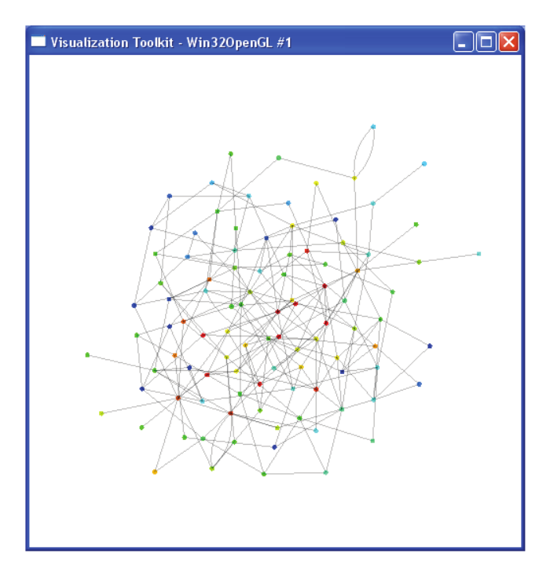
*Figure 8–4 The result of executing the code to draw a graph*

Here is an example of performing edge bundling using splines. The following code performs a tree layout, then uses vtkGraphHierarchicalBundle to display bundled edges from the graph on top of the tree (Figure 8–5).

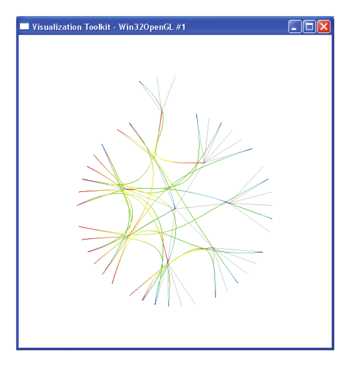

*Figure 8–5 The result of bundled edge graph edges from the code.*


```cpp
#include <vtkGraphHierarchicalBundle.h>
#include <vtkGraphLayout.h>
#include <vtkNew.h>
#include <vtkSplineFilter.h>
#include <vtkTreeLayoutStrategy.h>

// Create a standard radial tree layout strategy
vtkNew<vtkTreeLayoutStrategy> treeStrategy;
treeStrategy->SetAngle(360.0);
treeStrategy->SetRadial(true);
treeStrategy->SetLogSpacingValue(0.8);
treeStrategy->SetLeafSpacing(0.9);

// Layout the vertices of the tree using the strategy just created
vtkNew<vtkGraphLayout> treeLayout;
treeLayout->SetInputData(realTree);
treeLayout->SetLayoutStrategy(treeStrategy);

// Use the tree to control the layout of the graph edges
vtkNew<vtkGraphHierarchicalBundle> bundle;
bundle->SetInputData(0, graph);
bundle->SetInputConnection(1, treeLayout->GetOutputPort(0));
bundle->SetBundlingStrength(0.9);
bundle->SetDirectMapping(true);

// Smooth the edges with splines
vtkNew<vtkSplineFilter> spline;
spline->SetInputConnection(0, bundle->GetOutputPort(0));
```

### Area Layouts

For trees or graphs with embedded hierarchical information (i.e. a graph with an embedded spanning tree), alternative visualization methods convert the displays of the vertices into polygonal based structures (e.g. blocks, rings, circles, etc.). These methods have proven useful in divining out additional structure from the original hierarchy. Examples of these types of graph visualizations include treemaps, radial space-filling trees, and icicle representations (Figure 8–6).

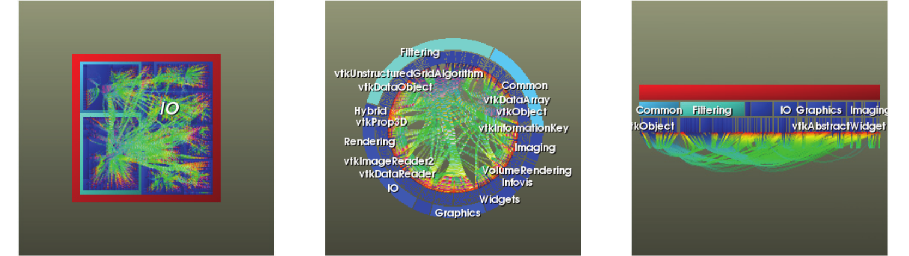

*Treemap, tree ring, and icicle views displaying the partitioning of classes into libraries, along with links connecting each class to its superclass*

For these techniques, each vertex is typically assigned a set of values in a 4-tuple array representing the placement and size of a rectangular region (or circular sector in the case of the tree ring view). These methods also utilize a layout strategy which is plugged into vtkAreaLayout. Currently available strategies include: 
- vtkBoxLayoutStrategy (treemap) - a tree map layout that puts vertices in square-ish boxes by recursive partitioning of the space for children vertices. 
- vtkSliceAndDiceLayoutStrategy (treemap) - lays out a treemap alternating between horizontal and vertical slices. 
- vtkSquarifyLayoutStrategy (treemap) - use the squarified tree map algorithm proposed in Bruls, D.M., C. Huizing, J.J. van Wijk. Squarified Treemaps. In: W. de Leeuw, R. van Liere (eds.), Data Visualization 2000, Proceedings of the joint Eurographics and IEEE TCVG Symposium on Visualization, 2000, Springer, Vienna, p. 33-42. 
- vtkStackedTreeLayoutStrategy (tree ring and icicle) - lays out tree in stacked boxes or rings.

Conversion to geometry for later display is accomplished through some additional helper classes:

- vtkTreeMapToPolyData - converts a tree with an associated data array to a polygonal data representing a tree map. 
- vtkTreeRingToPolyData - converts a tree with an associated data array to a polygonal data representing an icicle or tree ring layout. 

These classes utilize the 4-tuple array created in the layout classes and convert this data to the standard polygonal primitives for each vertex represented by the value in the array.

## 8.3 Views and Representations

Views in VTK combine rendering logic, interaction, visualization parameters, and selection into one place. Datasets are displayed in views by adding what are called “representations” to the view. A representation prepares an input dataset to be displayed in a view, and contains options for how that data should be rendered in the view, including colors, icons, layout algorithms, and labels. All views are subclasses of vtkView, and all view representations are subclasses of vtkDataRepresentation. The previous sections have already introduced views such as vtkGraphLayoutView and vtkTreeRingView.

You can add data objects to a view in two ways. One way is to create the appropriate representation, set the inputs on the representation by calling SetInputConnection() or SetInput(), then call AddRepresentation() on the view. The other way that is normally more convenient is to have the view automatically create the default representation for you through calling AddRepresentationFromInput() or AddRepresentationFromInputConnection(). These methods accept a data object or algorithm output port, create a representation appropriate for the view, add the representation to the view, and return a pointer to the new representation.

The following Python code generates a simple vtkRenderView with a sphere source displayed with a vtkRenderedSurfaceRepresentation.

```python
from vtkmodules.vtkFiltersSources import vtkSphereSource
from vtkmodules.vtkViewsInfovis import vtkRenderedSurfaceRepresentation
from vtkmodules.vtkViewsCore import vtkRenderView

rep = vtkRenderedSurfaceRepresentation()

sphere = vtkSphereSource()
sphere.SetPhiResolution(100)
sphere.SetThetaResolution(100)
rep.SetInputConnection(sphere.GetOutputPort())

view = vtkRenderView()
view.AddRepresentation(rep)

view.ResetCamera()
view.Render()
view.GetInteractor().Start()
```


*Figure 8–7 A vtkSurfaceRepresentation of a sphere rendered in a vtkRenderView. A rectangular region has been selected and highlighted.*

An example of using the vtkTreeRingView class for graph visualization is shown below. Note that this view takes two inputs, one for the graph and one for the tree. This code generates the center image in Figure 8-6. The tree ring contains the VTK classes organized by library, while the internal edges show subclass to superclass relationships.

```python
from vtkmodules.vtkIOInfovis import vtkXMLTreeReader
from vtkmodules.vtkViewsInfovis import vtkTreeRingView
from vtkmodules.vtkViewsCore import vtkViewTheme

reader1 = vtkXMLTreeReader()
reader1.SetFileName("vtkclasses.xml")
reader1.SetEdgePedigreeIdArrayName("tree edge")
reader1.GenerateVertexPedigreeIdsOff()
reader1.SetVertexPedigreeIdArrayName("id")

reader2 = vtkXMLTreeReader()
reader2.SetFileName("vtklibrary.xml")
reader2.SetEdgePedigreeIdArrayName("graph edge")
reader2.GenerateVertexPedigreeIdsOff()
reader2.SetVertexPedigreeIdArrayName("id")

# Setup the view parameters for displaying the graph
view = vtkTreeRingView()
view.SetTreeFromInputConnection(reader2.GetOutputPort())
view.SetGraphFromInputConnection(reader1.GetOutputPort())
view.SetAreaColorArrayName("VertexDegree")
view.SetEdgeColorToSplineFraction()
view.SetAreaHoverArrayName("id")
view.SetColorEdges(True)
view.SetAreaLabelArrayName("id")
view.SetAreaLabelVisibility(True)
view.SetShrinkPercentage(0.02)
view.SetBundlingStrength(0.8)

# Apply a theme to the view
theme = vtkViewTheme.CreateMellowTheme()
view.ApplyViewTheme(theme)

view.ResetCamera()
view.Render()
view.GetInteractor().Start()
```

These are the render view subclasses currently implemented in VTK: 
- vtkGraphLayoutView - view window for visualizing graphs 
- vtkHierarchicalGraphView - view window for visualizing graphs with associated, or derived, hierarchical data. 
- vtkIcicleView - view for visualizing trees, or graphs with associated or derived hierarchical data, using an icicle layout. 
- vtkTreeMapView - view for visualizing trees, or graphs with associated or derived hierarchical data, using a tree map layout.

- vtkTreeRingView - view for visualizing trees, or graphs with associated or derived hierarchical data, using a radial space filling layout.

### Selections in Views

Selections are an important component of the VTK view architecture. Most views have the ability to interactively create a selection (e.g. through mouse clicks or rubber-band selections), and also have the capacity to display the current selection through highlighting or some other mechanism.


*Figure 8–8 A simple application showing linked selection between a graph layout view and a Qt table view.*

Views automatically generate selections of the corresponding type when the user performs a selection interaction (e.g. by clicking or dragging a selection box). Selections may be shared across views simply by setting a common vtkAnnotationLink object on multiple representations. vtkAnnotationLink can share annotations on the data between views in addition to a shared selection.

The following example generates a graph view and table view with linked selection. The table view displays the vertex data of the graph in a Qt widget. Similarly vtkQtTreeView can display the contents of a vtkTree in a Qt tree widget. When rows are selected in the table view, the graph view updates to reflect this, and vice versa.

```cpp
#include <vtkDataObjectToTable.h>
#include <vtkGraphLayoutView.h>
#include <vtkNew.h>
#include <vtkQtTableView.h>
#include <vtkRandomGraphSource.h>
#include <vtkViewUpdater.h>

QApplication app(argc, argv);

// Create the graph source and table conversion
vtkNew<vtkRandomGraphSource> src;
vtkNew<vtkDataObjectToTable> o2t;
o2t->SetInputConnection(src->GetOutputPort());
o2t->SetFieldType(vtkDataObjectToTable::VERTEX_DATA);

// Create Qt table view and add a representation
vtkNew<vtkQtTableView> tv;
vtkDataRepresentation* tr =
    tv->AddRepresentationFromInputConnection(o2t->GetOutputPort());

// Create graph layout view
vtkNew<vtkGraphLayoutView> gv;
gv->SetVertexLabelArrayName("vertex id");
gv->VertexLabelVisibilityOn();
gv->SetLayoutStrategyToSimple2D();

// Add representation to graph view
vtkDataRepresentation* gr =
    gv->AddRepresentationFromInputConnection(src->GetOutputPort());
gr->SetAnnotationLink(tr->GetAnnotationLink());

// Ensure both views update when selection changes
vtkNew<vtkViewUpdater> vu;
vu->AddView(gv);
vu->AddView(tv);

// Start application
tv->GetItemView()->show();
app.exec();
```

## 8.4 Graph Algorithms

Graph data structures are an essential part of any informatics application. Many informatics problems consist of a myriad of data sources (people, phone calls, emails, publications) and the relationships between those datatypes. In general, graphs are well suited for the storage, manipulation, and analysis of different entities and the connections between those entities. In semantic graphs entities are represented by the graph vertices and the relationships between entities are represented by the graph edges. The vtkGraph data structure can store arbitrary attributes on both the vertices and edges so properties and types (“semantics”) are easily expressed (See Siek, Jeremy, Lie-Quan Lee, and Andrew Lumsdaine. 2001. “The Boost Graph Library: User Guide and Reference Manual”. Addison-Wesley Professional).

The effective processing and analysis of graphs require a large set of graph algorithms. The VTK toolkit leverages third party libraries to provide them. These libraries include, the Boost Graph Library (BGL), the Parallel Boost Graph Library (PBGL) and the Multithreaded Graph Library (MTGL).

One of these libraries is the Boost Graph Library (BGL) which provides a generic C++ template interface to many common graph algorithm implementations. VTK provides a 'data-less' adapter which implements the required BGL concepts and allows BGL algorithms to process vtkGraphs directly.

The usage of any graph algorithm follows the VTK pipeline model. The code example shown in Listing <BFS> demonstrates the usage of a graph algorithm. The code includes the header file of the algorithm, creates the VTK filter for the algorithm (in this case vtkBoostBreadthFirstSearch) and puts the algorithm in the pipeline. After the pipeline is updated, the results of that algorithm are available as attributes on the nodes and/or edges of the graph. This example simply labels each vertex with its distance from the starting vertex (labeled “0”).

```cpp
#include <vtkBoostBreadthFirstSearch.h>
#include <vtkGraphLayoutView.h>
#include <vtkNew.h>
#include <vtkRandomGraphSource.h>
#include <vtkRenderWindowInteractor.h>

int main(int argc, char* argv[])
{
    // Create a random graph
    vtkNew<vtkRandomGraphSource> source;

    // Create BGL algorithm and put it in the pipeline
    vtkNew<vtkBoostBreadthFirstSearch> bfs;
    bfs->SetInputConnection(source->GetOutputPort());

    // Create a view and add the BFS output
    vtkNew<vtkGraphLayoutView> view;
    view->AddRepresentationFromInputConnection(bfs->GetOutputPort());

    // Color vertices based on BFS search
    view->SetVertexColorArrayName("BFS");
    view->ColorVerticesOn();
    view->SetVertexLabelArrayName("BFS");
    view->VertexLabelVisibilityOn();

    view->ResetCamera();
    view->Render();
    view->GetInteractor()->Start();

    return 0;
}
```

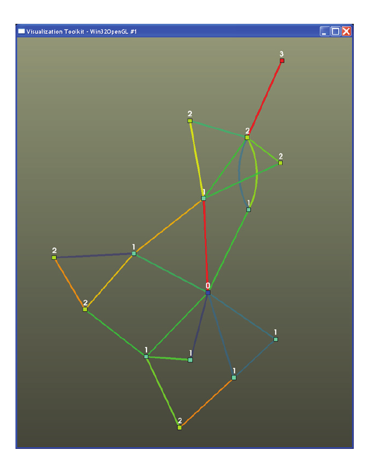

*Figure 8–9 The result of computing the breadth-first distance from a starting vertex (labeled “0”)*

As pipeline components the graph algorithms can also be combined in unique ways. For instance the following Python snippet shows two graph algorithms working together.

```python
from vtkmodules.vtkInfovisBoostGraphAlgorithms import (
    vtkBoostBrandesCentrality,
    vtkBoostKruskalMinimumSpanningTree,
)
from vtkmodules.vtkInfovisCore import vtkRandomGraphSource
from vtkmodules.vtkViewsInfovis import vtkGraphLayoutView

# Create a random graph
random_graph = vtkRandomGraphSource()

# Connect to the centrality filter
centrality = vtkBoostBrandesCentrality()
centrality.SetInputConnection(random_graph.GetOutputPort())

# Find the minimal spanning tree
mst_tree_selection = vtkBoostKruskalMinimumSpanningTree()
mst_tree_selection.SetInputConnection(centrality.GetOutputPort())
mst_tree_selection.SetEdgeWeightArrayName("centrality")
mst_tree_selection.NegateEdgeWeightsOn()

# Create a graph layout view
view = vtkGraphLayoutView()
view.AddRepresentationFromInputConnection(centrality.GetOutputPort())
```

Here both vertex and edge centrality are computed by the vtkBoostBrandesCentrality filter, the results of that algorithm are feed into the vtkBoostKruskalMinimumSpanningTree filter which computes a 'maximal' spanning tree of the highest centrality edges in the graph (given that the ‘NegateEdgeWeights’ parameter is set).

### Boost Graph Library Algorithms 
- vtkBoostBreadthFirstSearch - Performs a breadth first search (BFS) of a graph from some origin node and returns a vtkGraph with new attributes. 
- vtkBoostBreadthFirstSearchTree - Performs a BFS of a graph and returns a tree rooted at the origin node. 
- vtkBoostBiconnectedComponents - Computes the biconnected components of a vtkGraph. 
- vtkBoostBrandesCentrality - Computes graph centrality using the Brandes algorithm. 
- vtkBoostConnectedComponents - Discovers the connected components of a vtkGraph. If the graph is undirected this computes the natural connected components, if directed then strongly connected components are computed. 
- vtkBoostKruskalMinimumSpanningTree - Uses the Boost Kruskal Minimum Spanning Tree (MST) algorithm to compute the MST on a weighted graph. 
- vtkBoostPrimMinimumSpanningTree - Uses the Boost Prim MST algorithm to compute the MST on a positively-weighted vtkGraph.

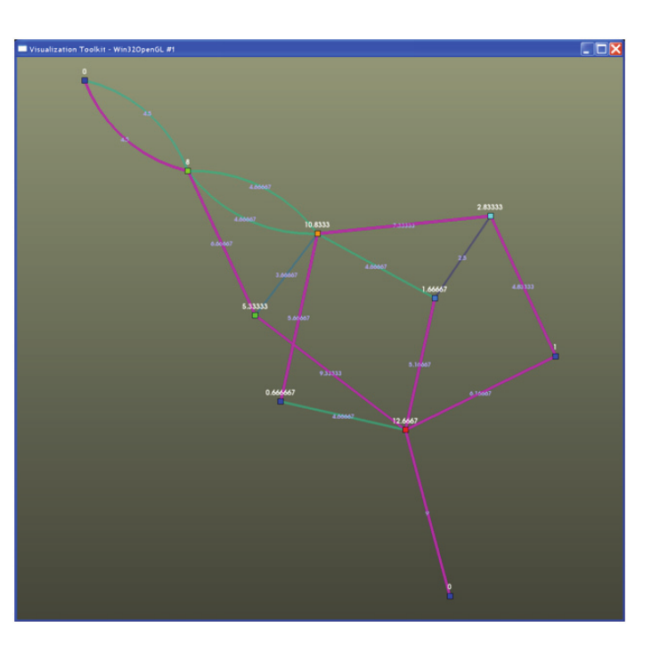

*Figure 8–10 Graph showing a minimum spanning tree (purple) based on centrality computed on the graph edges*

Many of these algorithms are demonstrated in the VTK source tree under the Infovis examples directory.

**vtkBoostBreadthFirstSearch.** This filter implements a vtkGraphAlgorithm that computes the BFS of a vtkGraph which is rooted at some starting node. The starting node can be either a selection or can be specified via its index into the graph. The time complexity of the Boost BFS implementation is O(E+V).

SetOriginSelection(vtkSelection* s)
Sets the origin node for this search through a selection containing a node in the graph.

SetOriginSelectionConnection(vtkAlgorithmOutput *)
Sets the origin node using the output from another VTK filter.

SetOriginVertex(vtkIdType index)
Set the index (into the vertex array) of the BFS 'origin' vertex.

SetOriginVertex(arrayName,value)
Set the BFS origin vertex. This method allows the application to simply specify an array name and value, instead of having to know the specific index of the vertex. 

SetOriginVertexString(arrayName,value)
Set the BFS 'origin' vertex given an array name and a string value. 

SetOutputArrayName(string)
Set the name of the vertex attribute array in the output graph. Default is "BFS".

SetOriginFromSelection(bool)
If true/on, use the vtkSelection from input port 1 as the origin vertex. The selection should be an IDs selection with field type POINTS. The first ID in the selection will be used as the 'origin' vertex. Default is OFF.

SetOutputSelection(bool)
If true/on, creates an output selection containing the ID of a vertex based on the output selection type. The default is to use the maximum distance from the starting vertex. Default is OFF. 

SetOutputSelectionType(string)
Set the output selection type. The default is to use the maximum distance from the starting vertex "MAX_DIST_FROM_ROOT". Additional options such as "ROOT", "2D_MAX", etc. may be used. 

vtkBoostBreadthFirstSearchTree
This VTK class uses the Boost BFS generic algorithm to perform a BFS of a vtkGraph from a given source vertex. The result of this filter is a vtkTree with root node corresponding to the starting node of the search.

SetOriginVertex(index)
Sets the index into the vertex array of the origin vertex. 

SetOriginVertex(arrayName,value)
Set the origin vertex given a value within a named vertex array. 

SetCreateGraphVertexIdArray(bool)
Stores the graph vertex ids for the tree vertices in an array named "GraphVertexId". Default is OFF.

**vtkBoostBiconnectedComponents.** This VTK class searches a vtkGraph for biconnected components. The biconnected components of a graph are maximal regions of the graph where the removal of any single vertex from the region will not disconnect the graph. This algorithm returns a vertex attribute array and an edge attribute array containing their biconnected component ids.

Every edge will belong to exactly one biconnected component and will be given in the edge array named “biconnected component” by default. Likewise, the biconnected component id of each vertex is also given in the vertex array named “biconnected component” by default.

Cut vertices (or articulation points) are vertices that belong to multiple biconnected components, and break the graph apart if removed. These are indicated by assigning a component value of - 1. To determine the biconnected components that a cut vertex belongs to, traverse its edge list and collect the distinct component ids for its incident edges.

The time complexity of the Boost biconnected components algorithms is O(V+E)

SetOutputArrayName(string)
Set the output array name for the vertex and edge arrays. If no output array name is specified, "biconnected component" will be used. 

**vtkBoostBrandesCentrality.** This class uses the Boost brandes_betweenness_centrality algorithm to compute betweenness centrality on a vtkGraph. This filter adds a vertex array and an edge array to the vtkGraph with the name “centrality” and are typed as vtkFloatArray.

The time complexity of Boost Brandes’ betweenness centrality is reported as O(VE) for unweighted graphs and O(VE+V(V+E) log V) for weighted graphs. The space complexity is O(VE).

**vtkBoostConnectedComponents.** Discovers the connected regions of a vtkGraph, assigning to each vertex a component ID in the vertex array “components”. If the input graph is an undirected graph the output contains the natural connected components of the graph. Conversely, if the input graph is a directed graph, this filter will discover the strongly connected components of the graph (i.e., the maximal sets of vertices where there is a directed path between any pair of vertices within each set).

For undirected graphs, the time complexity for this algorithm is O(V+E alpha(E,V)) where alpha is the inverse of Ackermann’s function. For most practical purposes, the time complexity is only slightly larger than O(V+E). The time complexity of the algorithm used for directed graphs is O(V+E).

**vtkBoostKruskalMinimumSpanningTree.** This filter finds the Minimum Spanning Tree (MST) of a vtkGraph using the Boost Kruskal MST generic algorithm given a weighting value for each of the edges in the input graph. This algorithm also allows edge weights to be negated to create a maximal spanning tree if desired. This filter produces a vtkSelection containing the edges of the graph that define the MST.

The time complexity for the Boost Kruskal MST algorithm is O(E log E). 

SetEdgeWeightArrayName(string)
Sets the name of the edge-weight input array, which must be an array that is part of the edge data of the input graph and contains numeric data. If the edge-weight array is not of type vtkDoubleArray it will be copied into a temporary vtkDoubleArray.

SetOutputSelectionType(string)
Sets the output selection type. The default is to use the set of minimum spanning tree edges “MINIMUM_SPANNING_TREE_EDGES”’. No other options are currently defined.

SetNegateEdgeWeights(bool) Toggles whether or not the filter should negate edge weights. By negating edge weights this algorithm will attempt to create the 'maximal' spanning tree. A 'maximal' spanning tree is a spanning tree with the highest-weighted edges. Default is OFF.

**vtkBoostPrimMinimumSpanningTree.** This filter uses the Boost Prim Minimum Spanning Tree generic algorithm to create a MST on an edge-weighted vtkGraph given an origin vertex. This filter differs from Kruskal MST mainly in the following ways: 
- An origin vertex must be specified.
- The negate edge weights method cannot be utilized to obtain a 'maximal' spanning tree, and will throw an exception if any negative edge weights exist. 
- The boost implementation of the Prim algorithm returns a vertex predecessor map which results in some ambiguity about which edge from the original graph should be utilized if parallel edges exist; for this reason the current VTK implementation does not copy edge data from the graph to the new tree. 
- The edge-weight array must be a vtkDataArray type or a child of vtkDataArray giving more generality over the Kruskal variant. The time complexity of the Boost Prim MST algorithm is O(E log V). 

SetEdgeWeightArrayName(string)
Sets the name of the edge-weight input array. The edge-weight array must be a vtkDataArray.

SetOriginVertex(index)
Sets the 'origin' vertex by way of its index into the graph. 

SetCreateGraphVertexIdArray(bool)
If enabled, stores the graph vertex ids for the tree vertices in an array named “GraphVertexId”. Default is OFF.

SetNegateEdgeWeights(bool)
If on, edge weights are negated. See note in description, this filter will throw an exception if negative edge weights exist. Default is OFF.

### Creating Graph Algorithms

In practice anyone can add a graph algorithm to VTK. There are several approaches a developer can take. The first and easiest for a Python programmer is to use the vtkProgrammableFilter. The Python code in Figure 8–11 demonstrates the use of the programmable filter to compute vertex degree.

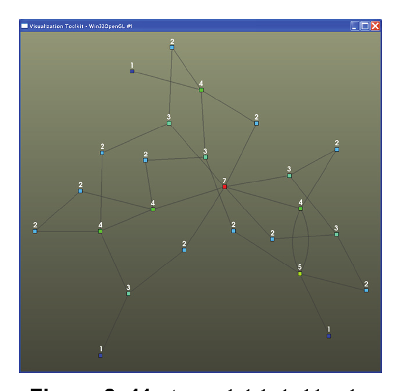

*Figure 8–11 A graph labeled by the computed degree of each vertex*

```python
from vtkmodules.vtkCommonCore import vtkIntArray
from vtkmodules.vtkFiltersProgrammable import vtkProgrammableFilter
from vtkmodules.vtkInfovisCore import vtkRandomGraphSource
from vtkmodules.vtkViewsInfovis import vtkGraphLayoutView


def compute_vertex_degree():
    input_graph = vertex_degree.GetInput()
    output_graph = vertex_degree.GetOutput()
    output_graph.ShallowCopy(input_graph)

    # Create output array
    vertex_array = vtkIntArray()
    vertex_array.SetName("VertexDegree")
    vertex_array.SetNumberOfTuples(output_graph.GetNumberOfVertices())

    # Loop through all the vertices setting the degree
    for i in range(output_graph.GetNumberOfVertices()):
        vertex_array.SetValue(i, output_graph.GetDegree(i))

    # Add the new attribute array to the output graph
    output_graph.GetVertexData().AddArray(vertex_array)


vertex_degree = vtkProgrammableFilter()
vertex_degree.SetExecuteMethod(compute_vertex_degree)

# VTK Pipeline
random_graph = vtkRandomGraphSource()
vertex_degree.AddInputConnection(random_graph.GetOutputPort())

view = vtkGraphLayoutView()
view.AddRepresentationFromInputConnection(vertex_degree.GetOutputPort())
view.SetVertexLabelArrayName("VertexDegree")
view.SetVertexLabelVisibility(True)
```

Another straightforward approach is to create a regular VTK C++ filter as a graph algorithm. The easiest filter to use as a reference would be vtkVertexDegree. The C++ code in vtkVertexDegree looks remarkably similar to the Python example above and contains the same functionality. The documentation for vtkGraph and the API for the various ways to access the data structure will also be helpful in the creation of your new filter.

Perhaps the most interesting (and advanced) way to create a new graph algorithm in VTK is to contribute an algorithm to the Boost Graph Library and then 'wrap' that algorithm into a VTK class. A good reference is the vtkBoostBreadthFirstSearch filter and the vtkBoostGraphAdapter.h file. Detailed documentation on the Boost Graph Library can be found at http://www.boost.org/doc/ as well as in the book *The Boost Graph Library: User Guide and Reference Manual*. Although significantly more work, this approach benefits both VTK users and the members of the Boost community as well.

### The Parallel Boost Graph Library

As a distributed memory toolkit, VTK currently provides a myriad of functionality around parallel scientific data processing and visualization. The Parallel Boost Graph Library (PBGL) is a generic C++ library for high-performance parallel and distributed graph algorithms. The vtkGraph data structure, along with some distributed helper classes, enables the PBGL functionality to work in the same way as the BGL classes. The integration of PBGL functionality into VTK is currently in the early stages. We would also like to note that PBGL is part of the Boost library with the Boost 1.40 release. VTK has begun including some PBGL based filters which can be found in the Parallel subdirectory.

### Multithreaded Graph Library

The MultiThreaded Graph Library (MTGL) targets shared memory platforms such as the massively multi-threaded Cray MTA/XMT and when used in tandem with the Qthreads library chip multiprocessors such as the Sun Niagara and multi-core workstations. MTGL is based on the serial Boost Graph Library, as data distribution is not an issue on the platforms in question. Shared memory programming is a challenge, and algorithm objects in the MTGL can encapsulate much, but not all, of this challenge. As in the BGL, the visitor pattern enables users to apply methods at key points of algorithm execution. MTGL users write adapters over their graph data structures as BGL users do, but there is no assumption that Boost and STL are available. MTGL codes for connected components on unstructured graphs, a difficult problem for distributed memory architectures, have scaled almost perfectly on the Cray MTA-2.

## 8.5 Databases

As part of its information visualization capability, VTK provides classes for access to SQL databases. Infovis datasets are often a good match for a relational database model. These often contain several smaller datasets linked by common attributes that fit well into tables. Also, a database allows an application to offload the task of managing large data by issuing queries for precisely the subset of interest.

Low-level database access is separated into two abstract classes. The first, vtkSQLDatabase, is responsible for opening and closing databases, reporting whether features such as transactions, prepared statements and triggers are supported, and creating tables using schema objects. The second, vtkSQLQuery, is responsible for sending an SQL statement to the database for execution, checking for errors, and providing access to the results.

The details of connecting to a particular database (MySQL, SQLite, Oracle, etc.) are implemented in concrete subclasses of vtkSQLDatabase. Similarly, the details of executing a query and retrieving results for a particular database are implemented in concrete subclasses of vtkSQLQuery. These concrete subclasses are respectively called “database drivers” and “query drivers”. VTK includes drivers for the following databases: 
- SQLite 3.4.1 
- MySQL 5.0 (and higher) 
- PostgreSQL 7.1 (and higher) 
- ODBC

A copy of SQLite is included with the VTK source code. In order to interact with other database implementations you must build VTK from source and link against vendor-provided client libraries. If you compiled the database yourself, these libraries were probably built automatically. If you installed a pre-compiled package you may need to download them separately (typically in a “development” package). 

### Connecting to a Database

In order to connect to a database you must first obtain an instance of an appropriate database driver. There are two ways to do this.

1. Create the driver automatically from a URL:
2. vtkSQLDatabase *db = vtkSQLDatabase::CreateFromURL(“sqlite://mydata.db”);
3. Instantiate the driver directly:
4. vtkSQLiteDatabase *db = vtkSQLiteDatabase::New();

The CreateFromURL() method will attempt to set all of the supplied parameters (username, server address, server port, database name) on the driver object. If you instantiate the driver directly you must set all of these parameters yourself. If the database requires a password you must supply it in the call to Open(). You may close a connection by calling Close() or by deleting the database driver. If the database connection could not be opened then Open() will return false. You may retrieve information about the reason for the failure using the GetLastErrorText() method. The C++ code for opening a database will generally look like the following:

```cpp
vtkSQLDatabase* db = vtkSQLDatabase::CreateFromURL("sqlite://mydata.db");
bool status = db->Open("");
if (!status)
{
    std::cout << "Couldn't open database. Error message: "
              << db->GetLastErrorText() << std::endl;
}
```

Once a connection has been established you may call GetTables() to obtain a list of the tables in the database. The GetRecord() function, called with the name of one of those tables, will return a list of the columns in that table. These functions are useful for applications that connect to databases without any foreknowledge of their schemata. 

### Executing Queries

To actually execute a query you must use an instance of one of the query drivers. Query drivers are never instantiated directly. To obtain one, call GetQueryInstance() on the database driver once the connection has been opened successfully. Set up your query by calling SetQuery() with a string containing the entire SQL statement. It is not necessary to terminate the statement with a semicolon. You must embed all of the query parameters within the string. The query will be sent to the database and executed when you call the Execute() method. Execute() will return true or false depending on whether the query ran successfully or whether it encountered an error. As with the database driver, you may retrieve any error message by calling GetLastErrorText() on the query driver.

```cpp
vtkSQLQuery* query = db->GetQueryInstance();

const char* queryText = "SELECT name, age, weight "
                        "FROM people WHERE age <= 20";
query->SetQuery(queryText);
if (!query->Execute())
{
    std::cout << "Query failed. Error message: "
              << query->GetLastErrorText() << std::endl;
}
```

You may re-use a single query driver for multiple queries. There is no notion of “closing” a currently active query: you may simply set the new query string with SetQuery() and call Execute(). If the driver was in the middle of reading a set of query results they will be cleaned up automatically.

### Queries and Threads

Neither vtkSQLQuery nor vtkSQLDatabase are thread-safe. This is more a limitation of the underlying native database APIs, which are themselves rarely thread-safe, than of VTK itself. If your application needs to access a database concurrently from multiple threads you must create a new database connection (via vtkSQLDatabase) for each thread. Each thread may maintain as many vtkSQLQuery objects as necessary. In some installations the database administrator may impose limits on how many concurrent sessions and queries may be open simultaneously. Check with your system administrator to see if this is a concern.

### Reading Results

Once a query has been executed successfully, indicated by Execute() returning a value of true, your program may read the query results. There are two kinds of data that may be retrieved here. The query metadata comprises the number of columns, their names, and their data types. These can be retrieved with GetNumberOfColumns(), GetColumnName(int) and GetColumnType(int). VTK will do its best to convert from the database back-end's native data type to standard data types supported in C++, Python and Java.

The result data is read one row at a time. You must call vtkSQLQuery::NextRow() to advance to the next available row. This method will return true if there is another row available to read and false when no more data can be retrieved. Data values within a row may be retrieved either one at a time or all at once. To retrieve the value for a single column, call vtkSQLQuery::DataValue(int) with the index of the column you want to retrieve. The entire process looks like the following.

```cpp
while (query->NextRow())
{
    for (int field = 0; field < query->GetNumberOfFields(); field++)
    {
        vtkVariant v = query->DataValue(field);
        // Process it
    }
}
```

To retrieve an entire row at once, call vtkSQLQuery::NextRow(vtkVariantArray *) instead of NextRow(). The values for that row will be stored in the array you supply.

```cpp
vtkNew<vtkVariantArray> va;
while (query->NextRow(va))
{
    // Process it
}
```

When processing query results we often wish to store the entire result set in a vtkTable to be passed through the pipeline. The vtkRowQueryToTable filter does exactly this. Use it by obtaining and setting up a query driver, then passing the query to the filter as the argument to SetQuery(). The query will be executed when the filter is updated either manually (by calling Update()) or through a request from further down the pipeline.

```cpp
vtkNew<vtkRowQueryToTable> reader;
reader->SetQuery(query);
reader->Update();
vtkTable* table = reader->GetOutput();
```

### Writing Data

Since vtkSQLQuery requires only that the query string be valid SQL it can be used for more operations than just reading from tables. For example, CREATE, UPDATE, INSERT, DROP and TRUNCATE (and others) are all available for use. The only requirement is that if the query returns any output aside from a status code it must be in row format. This excludes commands such as EXPLAIN that return unformatted text. 

You may use the SQL INSERT command to write data back to the database. Since each row must be inserted with a separate INSERT statement this is likely to be slow for large amounts of data. If you need to write large datasets back to the database, consider using the database's native interface or bulk loader instead of the VTK access classes. The following example creates a table called PEOPLE and populates it. Error checking is omitted for brevity.

```cpp
vtkStdString createQuery("CREATE TABLE IF NOT EXISTS people "
"(name TEXT, age INTEGER, weight FLOAT)");
query->SetQuery( createQuery.c_str() );
query->Execute();

for (int i = 0; i < 20; i++)
{
char insertQuery[200];
sprintf( insertQuery, "INSERT INTO people (name, age, weight) " "VALUES('John Doe %d', %d, %f)",
i, i, 10.1*i );
query->SetQuery(insertQuery);
query->Execute()
}
```

### Table Schemata

VTK provides a class, vtkSQLDatabaseSchema, for representing a relational database schema. This is useful if your program needs to create databases rather than simply accessing existing databases. This class is capable of representing tables, their columns, and their indices in a cross-platform setting. The goal of this class is to make working with multiple database backends simple, not to represent every schema possible with any given database type. For instance, a limited set of column types is supported; extended types such as those available in PostgreSQL are not supported. However, it can store triggers (for databases that support triggers) and preamble statements with an indication of what database backend each trigger or preamble statement was written for, to accommodate backend-specific SQL statements.

Programmatic access to the schema is present so that tables, columns, or indices may be dynamically generated based on some options present in your application. A schema object can contain multiple tables. Each table has a unique integer handle returned by the AddTable method. To add columns, indices, or triggers to a table, you must pass this integer as the first argument to AddColumnToTable(), AddIndexToTable(), or AddTriggerToTable(), respectively.

The AddColumnToTable() function takes a column type (using the enums provided by vtkSQLDatabaseSchema), a column name, an integer field width, and a text string specifying column options such as default values. The field width specifies the storage size for VARCHAR or other variable-size column types and specifies the default column width of printouts for numeric types in MySQL.

The AddIndexToTable() function creates a primary key, unique-value index, or a plain index for a table. Because an index may have multiple columns, you must call AddIndexToTable and then pass the integer index to AddColumnToIndex for each column you would like in the index.

Finally, AddTriggerToTable() allows you to add SQL statements that get executed each time a table's records are modified. Because the syntax for triggers varies from backend to backend, the AddTriggerToTable() method's final argument lets you specify which database backend a trigger is for. The trigger will only be added to databases of the same backend. Because multiple triggers may be added to the schema for each table, you can create different versions of the same trigger for each backend you wish your application to support. Also, some backends such as PostgreSQL require you to specify a trigger as named function. In order to allow you to define functions before triggers are added, the schema class provides AddPreamble(). Statements passed to AddPreamble() are executed before any tables are created. As with AddTriggerToTable(), the final argument of AddPreamble() allows you to specify which backend the statement applies to.

Once you have created a vtkSQLDatabaseSchema object and populated it using the functions above, you may call vtkSQLDatabase::EffectSchema() to translate the schema into a set of tables. The following is an example of how to use the vtkSQLDatabaseSchema class from Python.

```python
from vtkmodules.vtkIOSQL import vtkSQLDatabaseSchema, vtkSQLiteDatabase

schema = vtkSQLDatabaseSchema()
schema.SetName("TestSchema")
url = "psql://vtk@localhost/vtk_test"

# Values of enums
VTK_SQL_SCHEMA_SERIAL = 0
VTK_SQL_SCHEMA_BIGINT = 3
VTK_SQL_SCHEMA_PRIMARY_KEY = 2

btab = schema.AddTable("btable")
col0 = schema.AddColumnToTable(btab, VTK_SQL_SCHEMA_SERIAL, "tablekey", 0, "")
col1 = schema.AddColumnToTable(btab, VTK_SQL_SCHEMA_BIGINT, "somevalue", 12, "DEFAULT 0")
idx0 = schema.AddIndexToTable(btab, VTK_SQL_SCHEMA_PRIMARY_KEY, "")
i0c0 = schema.AddColumnToIndex(btab, idx0, col0)

# Create the database from a URL
db = vtkSQLiteDatabase()
db = db.CreateFromURL(url)

# Try opening the database without a password
if not db.Open(""):
    # Ask the user for a password and try it
    from getpass import getpass
    db.Open(getpass(f"Password for {url}"))

if db.IsOpen():
    # If we were able to open the database, effect the schema
    db.EffectSchema(schema, True)
```

A convenience routine, named AddTableMultipleArguments, is available in C++ (but not wrapped languages) to aid in the declaration of a static schema. It uses the cstdarg package so that you may pass an arbitrary number of arguments specifying many table columns, indices, and triggers. The first argument to the function is the name of a table to create. It is followed by any number of tokens, each of which may require additional arguments after it and before the next token. The last argument must be the special vtkSQLDatabaseSchema::END_TABLE_TOKEN. Tokens exist for adding columns, indices, and triggers. Use of AddTableMultipleArguments is shown in Listing 2, which is the example from Listing 1 converted into C++ to illustrate AddTableMultipleArguments.

```cpp
vtkNew<vtkSQLDatabaseSchema> schema;
schema->SetName("TestSchema");

int tblHandle = schema->AddTableMultipleArguments("btable",
    vtkSQLDatabaseSchema::COLUMN_TOKEN,
    vtkSQLDatabaseSchema::SERIAL, "tablekey", 0, "",
    vtkSQLDatabaseSchema::COLUMN_TOKEN,
    vtkSQLDatabaseSchema::BIGINT, "somevalue", 12, "DEFAULT 0",
    vtkSQLDatabaseSchema::INDEX_TOKEN,
    vtkSQLDatabaseSchema::PRIMARY_KEY, "",
    vtkSQLDatabaseSchema::INDEX_COLUMN_TOKEN, "tablekey",
    vtkSQLDatabaseSchema::END_INDEX_TOKEN,
    vtkSQLDatabaseSchema::END_TABLE_TOKEN);

vtkSQLDatabase* db = vtkSQLDatabase::CreateFromURL(url);
db->EffectSchema(schema);
```

## 8.6 Statistics

Statistical characterizations are useful because they can provide not only information on trends in data but also information on the significance of these trends. Also, because datasets continue to increase in both size and complexity, it is important to have tools for characterizing high-dimensional data so that lower-dimensional features can be discovered and visualized with traditional techniques. A number of statistical tools have been implemented in VTK for examining the behavior of individual fields, relationships between pairs of fields, and relationships among any arbitrary number of fields. Each tool acts upon data stored in one or more vtkTable objects; the first table serves as observations and further tables serves as model data. Each row of the first table is an observation, while the form of further tables depends on the type of statistical analysis. Each column of the first table is a variable.

### Specifying columns of interest

A univariate statistics algorithm only uses information from a single column and, similarly, a bivariate algorithm from 2 columns. Because an input table may have many more columns than an algorithm can make use of, VTK must provide a way for users to denote columns of interest. Because it may be more efficient to perform multiple analyses of the same type on different sets of columns at once as opposed to one after another, VTK provides a way for users to make multiple analysis requests in a single filter.

As an example, consider Figure 8–12. It has 6 observations of 5 variables. If the linear correlations between A, B, and C, and also between B, C and D are desired, two requests, R1 and R2 must be made: The first request R1 would have columns of interest {A,B,C} while R2 would have columns of interest {B,C,D}. Calculating linear correlations for R1 and R2 in one pass is more efficient than computing each separately since the covariances cov(B,B), cov(C,C), and cov(B,C) are required for both requests but need only be computed once.

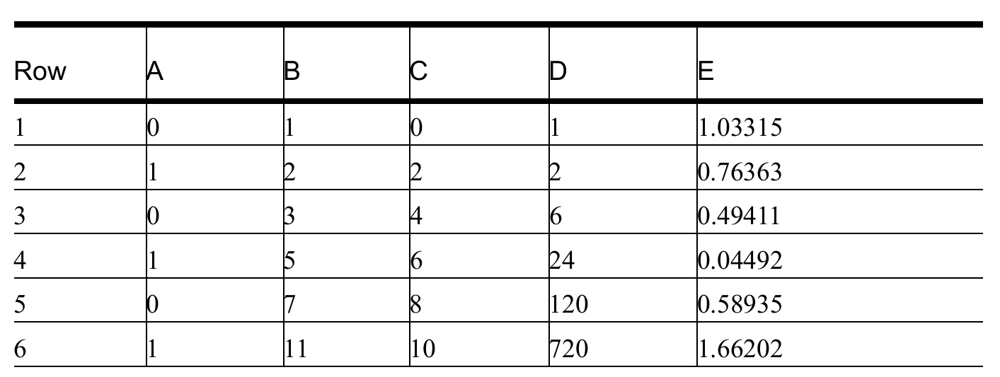

*Figure 8–12 A table of observations that might serve as input to a statistics algorithm*

### Phases

Each statistics algorithm performs its computations in a sequence of common phases, regardless of the particular analysis being performed. The VTK statistics algorithms may be configured to perform various subsets of these three operations as desired. These phases can be described as:

- **Learn:** Calculate a “raw” statistical model from an input data set. By “raw”, we mean the minimal representation of the desired model, that contains only primary statistics. For example, in the case of descriptive statistics: sample size, minimum, maximum, mean, and centered M2, M3 and M4 aggregates (cf. P. Pébay, Formulas for Robust, One-Pass Parallel Computation of Covariances and Arbitrary-Order Statistical Moments, Sandia Report SAND2008-6212, September 2008, http://infoserve.sandia.gov/sand_doc/2008/086212.pdf). For Table 1 with a request R1={B}, these values are 6, 1, 11, 4.83..., 68.83..., 159.4..., and 1759.8194..., respectively. 
- **Derive:** Calculate a “full” statistical model from a raw model. By “full”, we mean the complete representation of the desired model, that contains both primary and derived statistics. For example, in the case of descriptive statistics, the following derived statistics are calculated from the raw model: unbiased variance estimator, standard deviation, and two estimators (g and G) for both skewness and kurtosis. For Table 1 with a request R1={B}, these additional values are 13.76..., 3.7103, 0.520253, 0.936456, -1.4524, and -1.73616 respectively. 
- **Assess:** Given a statistical model -- from the same or another data set -- mark each datum of a given data set. For example, in the case of descriptive statistics, each datum is marked with its relative deviation with respect to the model mean and standard deviation (this amounts to the one-dimensional Mahalanobis distance). Table 1 shows this distance for R1 = {B} in column E.

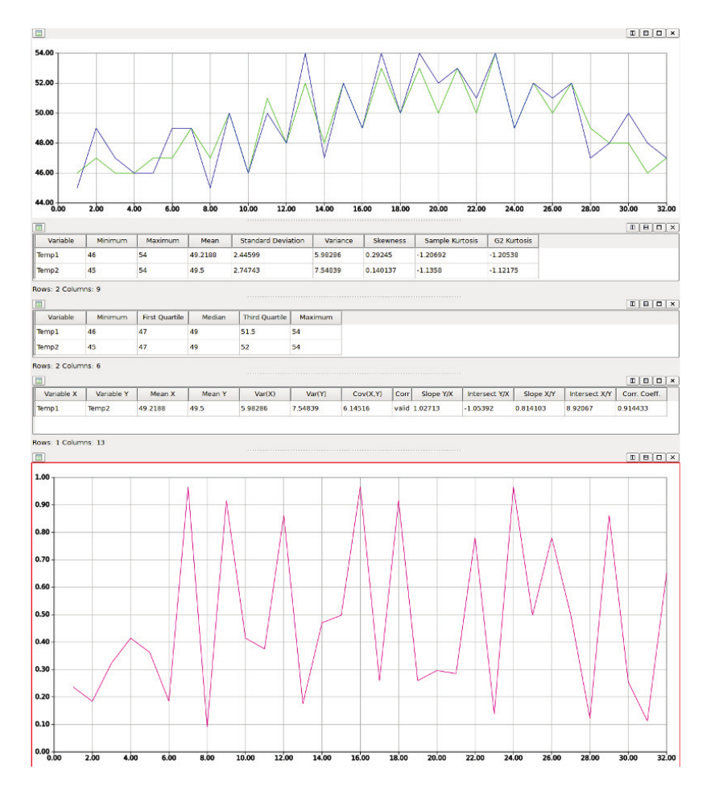

*Figure 8–13 An example utilization of VTK's statistics algorithms with the OverView client*

An example of the utilization of VTK's statistical tools with the Qt application client is illustrated in Figure 8–13; specifically, the descriptive, correlative, and order statistics classes are used in conjunction with various table views and plots. With the exception of contingency statistics which can be performed on any type (nominal, cardinal, or ordinal) of variables, all currently implemented algorithms require cardinal or ordinal variables as inputs. The following statistics algorithms are currently available in VTK. 

### Univariate Algorithms

These algorithms accept a single column (or a set of single columns) and perform an analysis of the distribution of data in that column. 

**Descriptive statistics.**

- Learn: calculate minimum, maximum, mean, and centered M2, M3 and M4 aggregates;
- Derive: calculate unbiased variance estimator, standard deviation, skewness (g1 and G1 estimators), kurtosis (g2 and G2 estimators);
- Assess: mark with relative deviations (one-dimensional Mahlanobis distance).

**Order statistics.**

- Learn: calculate histogram;
- Derive: calculate arbitrary quantiles, such as 5-point statistics (quartiles) for box plots, deciles, percentiles, etc.;
- Assess: mark with the quantile index.

### Bivariate statistics:

These algorithms accept a pair(s) of columns to operate on, and perform a comparative analysis.

**Correlative statistics.**

- Learn: calculate minima, maxima, means, and centered M2 aggregates;
- Derive: calculate unbiased variance and covariance estimators, Pearson correlation coefficient, and linear regressions (both ways);
- Assess: mark with squared two-dimensional Mahlanobis distance. 

**Contingency statistics.**

- Learn: calculate contingency table;
- Derive: calculate joint, conditional, and marginal probabilities, as well as information entropies;
- Assess: mark with joint and conditional PDF values, as well as pointwise mutual informations.

### Multivariate statistics:

These filters all accept multiple requests Ri, each of which is a set of ni variables upon which simultaneous statistics should be computed. 

**Multi-correlative statistics.**

- Learn: calculate means and pairwise centered M2 aggregates;
- Derive: calculate the upper triangular portion of the symmetric ni x ni covariance matrix and its (lower) Cholesky decomposition;
- Assess: mark with squared multi-dimensional Mahlanobis distance. 

**Principal component analysis (PCA) statistics.**

- Learn: identical to the multi-correlative filter;
- Derive: everything the multi-correlative filter provides, plus the ni eigenvalues and eigenvectors of the covariance matrix; 
- Assess: perform a change of basis to the principal components (eigenvectors), optionally projecting to the first mi components, where mi <= ni is either some user-specified value or is determined by the fraction of maximal eigenvalues whose sum is above a user-specified threshold. This results in mi additional columns of data for each request Ri.

**k-Means statistics.**

- Learn: calculate new cluster centers for data using initial cluster centers. When initial cluster centers are provided by the user using an additional input table, multiple sets of new cluster centers are computed. The output metadata is a multiblock dataset containing at a minimum one vtkTable with columns specifying the following for each run: the run ID, number of clusters, number of iterations required for convergence, RMS error associated with the cluster, the number of elements in the cluster, and the new cluster coordinates; 
- Derive: calculates the global and local rankings amongst the sets of clusters computed in the learn phase. The global ranking is the determined by the error amongst all new cluster centers, while the local rankings are computed amongst clusters sets with the same number of clusters.
The total error is also reported;
- Assess: mark with closest cluster id and associated distance for each set of cluster centers.

**Using statistics algorithms**

It is fairly easy to use the statistics classes of VTK. For example, the following code demonstrates how to calculate contingency statistics on two pairs of columns of an input set inData of type vtkTable, with no subsequent data assessment. It is assumed here the input data table has at least 3 columns.

```cpp
// Assume the input dataset is passed to us
// Also assume that it has at least 3 columns
vtkTable* inData = static_cast<vtkTable*>(arg);

// Create contingency statistics class
vtkNew<vtkContingencyStatistics> cs;
// Set input data port
cs->SetInputData(0, inData);
// Select pairs of columns (0,1) and (0,2) in inData
cs->AddColumnPair(inData->GetColumnName(0), inData->GetColumnName(1));
cs->AddColumnPair(inData->GetColumnName(0), inData->GetColumnName(2));
// Calculate statistics with Learn and Derive phases only
cs->SetLearnOption(true);
cs->SetDeriveOption(true);
cs->SetAssessOption(false);
cs->Update();
```

The previous code section’s requests for each pair of columns of interest are specified by calling AddColumnPair(), as is done for all bivariate algorithms. Univariate algorithms instead call AddColumn() a number of times to unambiguously specify a set of requests. However, multivariate filters have a slightly different usage pattern. In order to queue a request for multivariate statistics algorithms, SetColumnStatus() should be called to turn on columns of interest (and to turn off any previously selected columns that are no longer of interest). Once the desired set of columns has been specified, a call to RequestSelectedColumns() should be made. Consider the example from Table 1 where 2 requests are mentioned: {A,B,C} and {B,C,D}. The code snippet in Listing 2 shows how to queue these requests for a vtkPCAStatistics object.

```cpp
vtkNew<vtkPCAStatistics> ps;
// Turn on columns of interest
ps->SetColumnStatus("A", 1);
ps->SetColumnStatus("B", 1);
ps->SetColumnStatus("C", 1);
ps->RequestSelectedColumns();

// Columns A, B, and C are still selected, so first we turn off
// column A so it will not appear in the next request.
ps->SetColumnStatus("A", 0);
ps->SetColumnStatus("D", 1);
ps->RequestSelectedColumns();
```

### Parallel Statistics Algorithms

One of the purposes of building a full statistical model in three phases is parallel computational efficiency. In our approach, inter-processor communication and updates are performed only for primary statistics. The calculations to obtain derived statistics from primary statistics are typically fast and simple and need only be calculated once, without communication, upon completion of all parallel updates of primary variables. Data to be assessed is assumed to be distributed in parallel across all processes participating in the computation, thus no communication is required as each process assesses its own resident data.

Therefore, in the parallel versions of the statistical engines, inter-processor communication is required only for the Learn phase, while both Derive and Assess are executed in an embarrassingly parallel fashion due to data parallelism. This design is consistent with the data parallelism methodology used to enable parallelism within VTK, most notably in ParaView. The following 5 parallel statistics classes are currently available in VTK: 
- vtkPDescriptiveStatistics 
- vtkPCorrelativeStatistics 
- vtkPContingencyStatistics 
- vtkPMultiCorrelativeStatistics 
- vtkPPCAStatistics

Each of these parallel algorithms is implemented as a subclass of the respective serial version of the algorithm and contains a vtkMultiProcessController to handle inter-processor communication. Within each of the parallel statistics classes, the Learn phase is the only phase whose behavior is changed (by reimplementing its virtual method) due to the data parallelism inherent in the Derive and Assess phases. The Learn phase of the parallel algorithms performs two primary tasks:
1. Calculate correlative statistics on local data by executing the Learn code of the superclass.
2. If parallel updates are needed (i.e. the number of processes is greater than 1), perform necessary data gathering and aggregation of local statistics into global statistics.

Note that the parallel versions of the statistics algorithms can be used with the same syntax as that which is used for their serial superclasses. All that is required is a parallel build of VTK and a version of MPI installed on your system.

## 8.7 Processing Multi-Dimensional Data

Many information visualization, scientific, engineering, and economic problems involve data that is either implicitly or explicitly multi-dimensional. In the field of text analysis, a corpus of documents is often represented as a matrix (2D array) that stores the number of times each term (word) in the corpus appears in each document.. This type of term-frequency data can be extended into higher dimensions, as in an analysis of public Wiki edits that encodes the number of times a term is used by a particular author on a specific date as a 3D tensor.


*Figure 8–14 Mapping two-dimensional term-document frequency data to a matrix for test analysis*

In physical experiments, a series of measurements often form a tensor of three or more dimensions, i.e. weather measurements taken at multiple stations across multiple times. In economics, a dataset containing changes in stock value for differing combinations of stock symbol, date, and time horizon could also be represented as a 3D tensor. Although these examples originate in widely varying domains, representing their data using multi-dimensional arrays makes it possible to bring a common set of methods from multi-linear algebra to bear on their analysis.

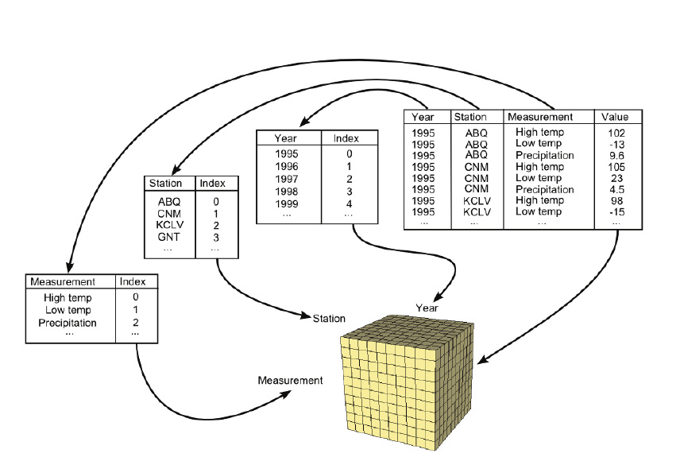

*Figure 8–15 Mapping three-dimensional time-author-term data to a tensor for text analysis*

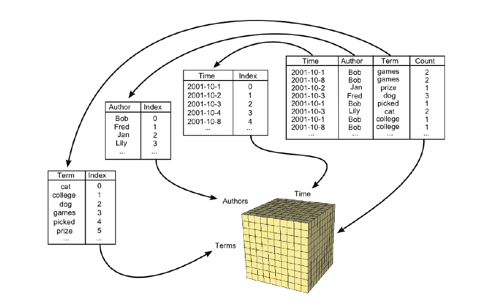

*Figure 8–16 Mapping three-dimensional year-station-measurement meteorological data to a tensor for analysis.*

Powerful algorithms such as Singular Value Decomposition, PARAFAC, DEDICOM, and TUCKER can be used to seek out correlations in data that would otherwise be hidden from users.

Note, in each of these examples the data is likely to be more-or-less “sparse”. In the text analysis usecases, not every term in a corpus will be used in every document; and in scientific experiments, instrument malfunctions may cause data to be undefined or ‘null’ over varying time ranges. Similarly, stocks enter-and-exit markets on a regular basis, leading to undefined points within the data. Any system that represents multi-dimensional data must be able to explicitly represent these undefined points for efficiency in memory and computation, and to ensure the correctness of calculations. A system that ignores undefined or 'null' values will not produce correct results.

### Design

To meet the preceding challenges, the vtkArray class and its derivatives provide the functionality to store and manipulate sparse and dense arrays of arbitrary dimension (Figure 8–17).

Note first that vtkArray and its subclasses are entirely separate from the traditional VTK array types such as vtkDataArray, vtkIntArray, vtkFloatArray, and other array types derived from vtkAbstractArray.

At the top of the N-Dimensional array hierarchy, vtkArray provides methods and functionality that are common to all arrays, regardless of the type of values stored or the type of storage used. Using vtkArray, you can: 
- Create heterogeneous containers of arrays.
- Implement algorithms that convert between arrays of different types. 
- Implement algorithms that modify the structure of an array without needing to know what type of value it contains, such as an algorithm to transpose a matrix.

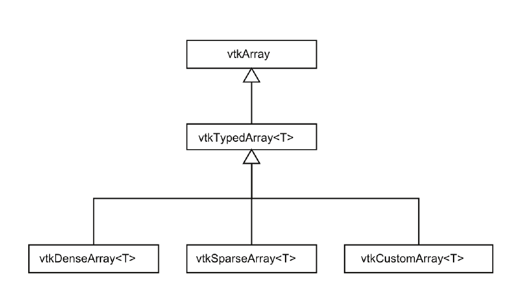
*Figure 8–17 VTK N-dimensional array classes*

The vtkTypedArray<T> template class derives from vtkArray, and is used to provide strongly-typed access to the values stored in the array while ignoring the type of storage used. Using vtkTypedArray<T>, you can efficiently manipulate arrays that contain a specific type (int, double, string, etc) while ignoring how the array data is stored (dense, sparse, etc).

Finally, VTK currently provides two concrete derivatives of vtkTypedArray<T>, vtkDenseArray<T> and vtkSparseArray<T>, that implement specific storage strategies:

vtkDenseArray<T> stores values using a single contiguous block of memory, with Fortran ordering for compatibility with the many linear algebra libraries (such as BLAS and LAPACK) that are designed to work with Fortran-ordered memory. vtkDenseArray<T> provides efficient O(1) retrieval of values and is most appropriate when working with dense data that is well-defined for every location in the array. The memory used by vtkDenseArray<T> is proportional to the product of the array extents along each dimension.

vtkSparseArray<T> uses sparse coordinate storage to store data efficiently when it isn't defined for every location within the array. Each non-null value is stored in an unordered list of values and its coordinates. A single 'null' value is used to represent the remaining contents of the array. As long as it’s sufficiently sparse, a high-dimension dataset, that would be impossible to store in memory using vtkDenseArray<T>, can be easily manipulated using vtkSparseArray<T>. This is because the memory used is proportional to the number of non-null values in the array, rather than the size of the array.

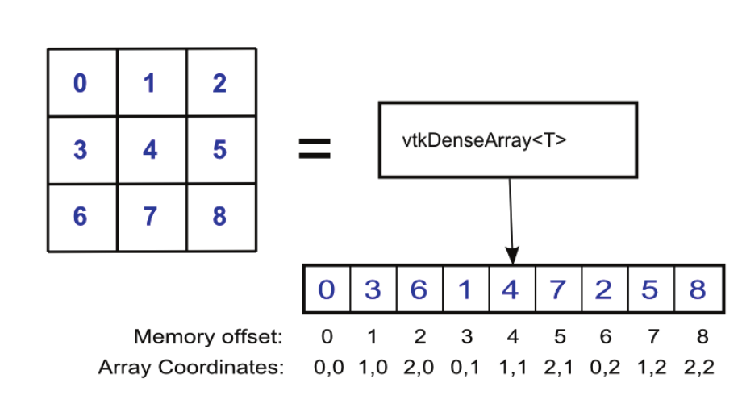

*Figure 8–18 How vtkDenseArray<T> stores a 3x3 matrix using Fortran ordering.*

The vtkDenseArray<T> and vtkSparseArray<T> storage classes included with VTK are designed to provide good all-around performance in a wide-variety of use-cases, and for arbitrary numbers of dimensions. In practice there may be situations where custom storage classes can provide better performance at the expense of generality, and the vtkArray interfaces are designed with this in mind. Users can create their own array storage classes by deriving from vtkTypedArray<T> and implementing a few pure-virtual methods. A hypothetical use-case for customized array storage might involve creating compressed-row or compressed-column storage for integration with a library that manipulates matrices in one of those formats. Another use-case for custom arrays would be the creation of a read-only 'procedural' array that encapsulates a computed sequence such as the Fibonacci sequence - such an array wouldn't actually store any information, but could be used as an input for other calculations.

### Using multi-dimensional arrays

You create multi-dimensional arrays in VTK by instantiating the desired concrete array class (vtkDenseArray<T>, vtkSparseArray<T>, or similar) templated on the type of value you wish to store (int, double, string, etc), then specify the extents (number of dimensions and size along each dimension) of the resulting array:

```cpp
// Creating a dense vector (1D array) of strings:
vtkDenseArray<vtkStdString>* vector = vtkDenseArray<vtkStdString>::New();
vector->Resize(10);

// Creating a dense 10 x 20 matrix (2D array) of integers:
vtkDenseArray<int>* matrix = vtkDenseArray<int>::New();
matrix->Resize(10, 20);

// Creating a sparse 10 x 20 x 30 x 40 tensor
// (4D array) of floating-point values:
vtkArrayExtents extents;
extents.SetDimensions(4);
extents[0] = 10;
extents[1] = 20;
extents[2] = 30;
extents[3] = 40;
vtkSparseArray<double>* tensor = vtkSparseArray<double>::New();
tensor->Resize(extents);
```

Note that the vtkArray::Resize() method has been overloaded so that you can easily create one, two, or three-dimensional arrays by simply specifying the size along each dimension. For four-or-more dimensions, you must use an instance of the vtkArrayExtents helper class to encode the number of dimensions and extents.

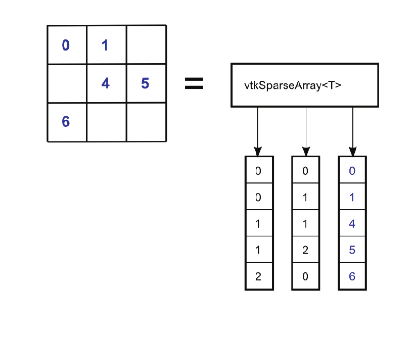

*Figure 8–19 How vtkSparseArray<T> stores a sparse 3x3 matrix using coordinate storage.*

After resizing, the new arrays must be properly initialized. This process will vary depending on the array storage type - for example, the contents of vtkDenseArray<T> will be undefined after resizing, so vtkDenseArray<T> provides a Fill() method that can be used to overwrite the entire array with a single value:

```cpp
matrix->Fill(0);
```

Sparse arrays will be completely empty (all values will be undefined or ‘null’ values) after resizing, and it is always a good idea to explicitly specify what the 'null' value (the value that is returned whenever a caller accesses an undefined set of coordinates) should be:

```cpp
tensor->SetNullValue(0.0);
```

Having initialized an array, the next step is to populate it using SetValue():

```cpp
// Overwrite vector[5] with "Hello World!":
vector->SetValue(5, "Hello, World!");
// Overwrite matrix[4, 3] with "22":
matrix->SetValue(4, 3, 22);
// Overwrite tensor[3, 7, 1, 2] with "1.5":

vtkArrayCoordinates coordinates;
coordinates.SetDimensions(4);
coordinates[0] = 3;
coordinates[1] = 7;
coordinates[2] = 1;
coordinates[3] = 2;
tensor->SetValue(coordinates, 1.5);
```

Note that, as with Resize(), there are overloaded versions of SetValue() that work with one-, two-, or three-dimensional data, and that a helper class - vtkArrayCoordinates - is used to supply coordinates for operations on higher dimension arrays. Not surprisingly, GetValue() is used to retrieve data from an array:

```cpp
// Access array value [5]:
vtkStdString vector_value = vector->GetValue(5);
// Access matrix value [4, 3]:
int matrix_value = matrix->GetValue(4, 3);
// Access tensor value [3, 7, 1, 2]:
double tensor_value = tensor->GetValue(coordinates);
```

SetValue() and GetValue() are strongly-typed methods provided by vtkTypedArray<T>, and assume that you know the type of data stored in the array in advance, either because you created the array yourself, or you used SafeDownCast() to cast from vtkArray to vtkTypedArray<T> for some specific T. For situations where you are working with an array of unknown type, there are SetVariantValue() / GetVariantValue() methods provided by vtkArray that allow you to conveniently set and get values from any array, regardless of type, albeit with the overhead of conversion to-and-from variant values:

```cpp
// Print value [8] from any one-dimensional array
// to the console, regardless of type:
vtkArray* generic_array = /* Defined elsewhere */;
std::cout << generic_array->GetVariantValue(8).ToString() << std::endl;
```

In this example, GetVariantValue() returns a vtkVariant object, and the vtkVariant::ToString() method converts the underlying value to a string, regardless of the original type. Similarly, you could use variants to shuffle data within an array without having to know the type of data it contains:

```cpp
// Swap values [3] and [7] within an array, regardless of array type:
vtkVariant temp = generic_array->GetVariantValue(3);
generic_array->SetVariantValue(3, generic_array->GetVariantValue(7));
generic_array->SetVariantValue(7, temp);
```

### Performance

Although SetValue() and GetValue() provide an easily-understood, uniform interface to all arrays regardless of their storage type, the convenience of this approach carries an abstraction penalty. In the material that follows, we will cover some important techniques for improving the performance of array-related code.

### Populating Dense Arrays

You will often need to manipulate the contents of vtkDenseArray<T> as a simple block of memory, either for I/O operations or for interoperability with other libraries. For these situations, vtkDenseArray<T> provides the GetStorage() method, which returns a pointer to the memory block that stores the array contents. You could use this pointer to write the (binary) contents of an array to a file as a single contiguous block:

```cpp
// Write the contents of a dense int array as binary data to a stream
void WriteDenseArray(vtkDenseArray<int>* array, ostream& stream)
{
    stream.write(
        reinterpret_cast<char*>(array->GetStorage()),
        array->GetSize() * sizeof(int));
}
```

Alternately, you could pass the memory block to a library that performs dense array calculations, so long as the ordering of the values in the memory block (Fortran) match what the library expects. You should try to use this approach whenever practical, since it avoids making deep-copies of your data as you pass it to a library and retrieve the results.

### Populating Sparse Arrays

Recall that vtkSparseArray<T> stores values internally using a list of non-null values with their corresponding coordinates. This means that whenever SetValue() is called, vtkSparseArray<T> must first determine whether an existing value at those coordinates already exists. If it does, the old value is replaced with the new value; otherwise, the new value and its coordinates are appended to the end of the list. This linear search for existing values makes SetValue() an expensive operation for sparse arrays, compared to a constant-time operation on dense arrays. Used naively, SetValue() makes the creation of sparse arrays unacceptably slow.

Fortunately, vtkSparseArray<T> provides the AddValue() method, which appends values to the internal list without performing a search for existing values, and executes in amortized constant time. This provides excellent performance, but means that the caller is responsible to avoid calling AddValue() more than once with the same set of coordinates. In practice, this means that AddValue() should only be used on an array when you are populating it from scratch (as you would do if you were implementing a pipeline source that creates new sparse arrays). Never call AddValue() on an array with unknown contents (such as the input to a filter), since you run the risk of adding values with duplicate coordinates to the array's internal list (which is not allowed). The following code demonstrates using AddValue() to efficiently create a 10000 x 10000 diagonal matrix:

```cpp
vtkSparseArray<double>* array = vtkSparseArray<double>::New();
array->Resize(10000, 10000);
array->SetNullValue(0.0);

for (vtkIdType i = 0; i != 10000; ++i)
{
    array->AddValue(i, i, 1.0);
}
```

### Iteration

The preceding examples demonstrate how to populate arrays efficiently by avoiding the pitfalls of the SetValue() method. However, similar issues arise when accessing arrays using GetValue() - because vtkSparseArray stores non-null values in an unordered list, GetValue() must perform a linear search every time it is called, leading to unacceptably slow performance. To address this, VTK provides another technique - iteration - that makes it possible to read and write values to dense and sparse arrays in constant time, so long as certain conditions are met. Using iteration, we can: 
- Eliminate the cost of linear lookups when getting / setting sparse array values. 
- Visit only non-null values in sparse arrays. 
- Implement filters using a consistent interface across dense and sparse arrays.
- Implement filters that operate on arbitrary-dimension data.

The iteration interface provided for VTK multi-dimensional arrays works by exposing the values stored in an array as a single unordered list. Each value in the array is assigned an index in the half-open range [0, N), where N is the number of non-null values stored in the array, and the vtkArray and vtkTypedArray<T> classes provide methods for accessing values 'by index': SetValueN(), GetValueN(), and GetCoordinatesN(). Using these methods, you can "visit" every value in an array, regardless of the type of array storage, and regardless of the number of dimensions in the array, using a single loop. For example, the following code efficiently increments every value in an array of integers by one, without any knowledge of its dimensions or whether the array is sparse or dense:

```cpp
vtkTypedArray<int>* array = /* Defined elsewhere */;
for (vtkIdType n = 0; n != array->GetNonNullSize(); ++n)
{
    array->SetValueN(n, array->GetValueN(n) + 1);
}
```

Note that the order in which we “visit” the values in the array using GetValueN() / SetValueN() is purposefully undefined, and that the above code works because the order is unimportant - regardless of the type of underlying array, whether dense or sparse, one-dimensional or 11-dimensional, it does not matter whether value[3] is incremented before or after value[300], so long as both are eventually modified in a consistent manner.

Although you cannot control the order in which values are visited, you can use GetCoordinatesN() to discover “where you are at” as you iterate over the contents of any array, and this is usually sufficient for most algorithm implementations. For example, the following code computes the sum of the values in each row in a matrix, storing the results in a dense vector. Although we visit the matrix values in arbitrary order, we can use each value's coordinates as a constant time lookup to accumulate values in our result vector: 

```cpp
vtkTypedArray<double>* matrix = /* Defined elsewhere */;
vtkIdType row_count = matrix->GetExtents()[0];
vtkTypedArray<double>* vector = vtkDenseArray<double>::New();
vector->Resize(row_count);
vector->Fill(0.0);
for (vtkIdType n = 0; n != matrix->GetNonNullSize(); ++n)
{
    vtkArrayCoordinates coordinates;
    matrix->GetCoordinatesN(n, coordinates);
    vtkIdType row = coordinates[0];
    vector->SetValue(row, vector->GetValue(row) + matrix->GetValueN(n));
}
```

The lack of a specific order of iteration may seem limiting at first, but a surprisingly large number of algorithms can be written to work within this constraint, benefiting from constant-time lookups, dimension, and storage-type independence.

### Array Data

Now that we can create and manipulate multi-dimension arrays, it's time to move them through the VTK pipeline. Like vtkAbstractArray, vtkArray isn't a vtkDataObject, so it cannot be used directly by the pipeline. Instead, VTK provides vtkArrayData which acts as a container for arrays, and vtkArrayDataAlgorithm which can be used to implement vtkArrayData sources and filters:

**Array Sources**

- vtkDiagonalMatrixSource - Produces sparse or dense matrices of arbitrary size, with user-assigned values for the diagonal, superdiagonal, and subdiagonal.

- vtkBoostRandomSparseArraySource - Produces sparse matrices with arbitrary size and number of dimensions. Provides separate parameters to control generation of random values and random sparse patterns. 
- vtkTableToSparseArray - Converts a vtkTable containing coordinates and values into a sparse array of arbitrary dimensions.

**Array Algorithms**

- vtkAdjacencyMatrixToEdgeTable - Converts a dense matrix into a vtkTable suitable for use with vtkTableToGraph. Dimension labels in the input matrix are mapped to column names in the output table. 
- vtkArrayVectorNorm - Computes an L-norm for each column-vector in a sparse double matrix. 
- vtkDotProductSimilarity - Treats each row or column in a matrix as a vector, and computes the dot-product similarity between each pair of vectors, producing a vtkTable suitable for use with vtkTableToGraph.
- vtkBoostLogWeighting - Replaces each value p in an array with the natural logarithm of p+1. Good example of a filter that works with any array, containing any number of dimensions. 
- vtkMatricizeArray - Converts sparse double arrays of arbitrary dimension to sparse matrices. For example, an i x j x k tensor can be converted into an i x jk, j x ik, or ij x k matrix. 
- vtkNormalizeMatrixVectors - Normalizes either row vectors or column vectors in a matrix. Good example of a filter that works efficiently with both sparse and dense input matrices. Good example of a filter that works with either row or column vectors. 
- vtkTransposeMatrix - Computes the transpose of a matrix.
