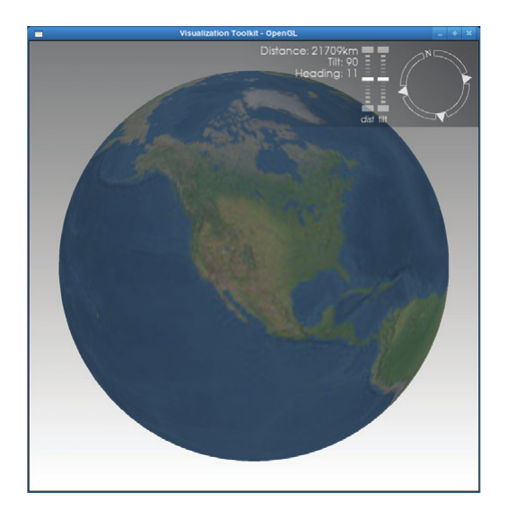
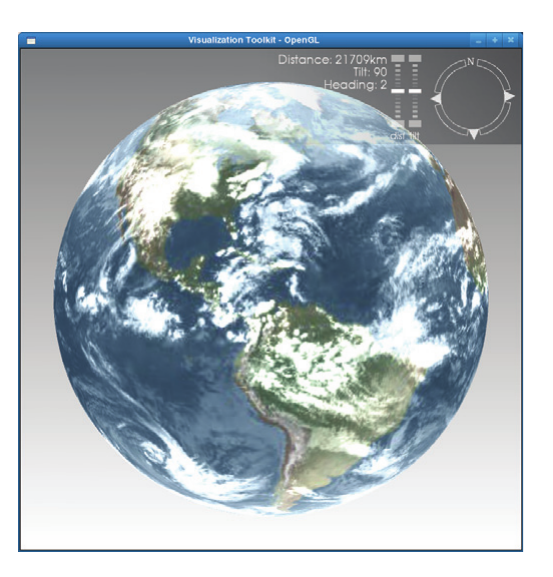
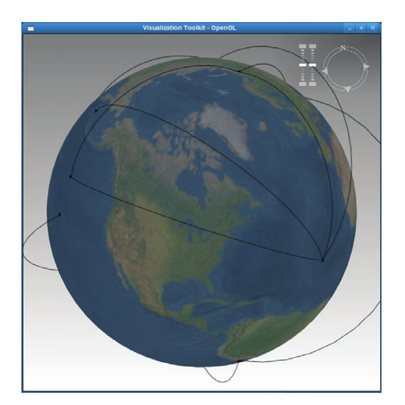
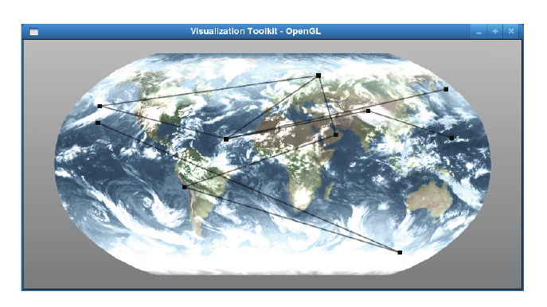
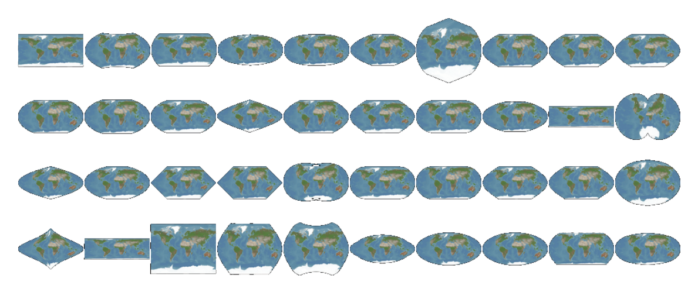
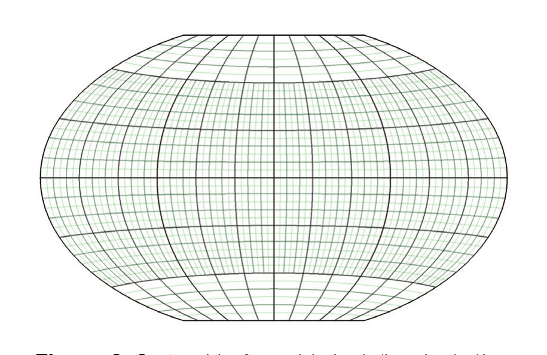

# Chapter 9: Geospatial Visualization

Geospatial visualization is a discipline that combines techniques from traditional scientific visualization and information visualization in order to display geographically organized data. VTK's geospatial visualization facilities are currently under development and while VTK 5.4 provides some facilities for rendering high resolution maps, the API is subject to change in the next revision of VTK and may even break backwards compatibility.

## 9.1 Geographic Views and Representations

The main geospatial visualization functionality provided by VTK is the ability to render extremely large texture images onto geometric representations of the Earth. Both the image data and the geometry it is textured upon must be hierarchical representations that are loaded on demand from disk or a network server because they would otherwise consume too much memory and take too long to load. The following Python snippet shows the easiest way to display a map in VTK, along with a picture of the result. For information on the contents of versionUtil, which resolves some differences between VTK 5.4 and later versions, see “Information Visualization” on page163. Also note that specifying “- D <path>” will allow the script to find the image data from the VTK data repository.



*Figure 9–1 3D geospatial view.*

```python
from vtk import *
import vtk.util.misc
import versionUtil
# Read in a small map image from VTKData.
rd = vtkJPEGReader()
datapath = vtk.util.misc.vtkGetDataRoot()
rd.SetFileName(datapath + '/Data/NE2_ps_bath_small.jpg')
rd.Update()
# Create a GeoView
gv = vtkGeoView()
rw = versionUtil.SetupView(gv)
# Add both image and geometry representations to the view
mi = gv.AddDefaultImageRepresentation(rd.GetOutput())
# Start threads that fetch data as required
gv.GetTerrain().GetSource().Initialize(1)
mi.GetSource().Initialize(1)
# Render and interact with the view.
gv.GetRenderer().SetBackground(1, 1, 1)
gv.GetRenderer().SetBackground2(.5, .5, .5)
gv.GetRenderer().GradientBackgroundOn()
versionUtil.ShowView(gv)
```

The Geovis toolkit provides a specialization of vtkView that creates and manages a set of actors to render a virtual globe textured with the image you provide of the Earth's surface. The vtkGeoView class also includes a compass widget which allows you to rotate the globe about an axis perpendicular to the viewport by clicking and dragging on the compass rose. The compass widget also allows you to zoom in and out using the distance slider and to change the angle between the Earth's surface normal and the camera view vector using the camera tilt slider.

GeoView's AddDefaultImageRepresentation method creates two representations: one—vtkGeoAlignedImageRepresentation—that takes a high resolution input map image and generates a tile hierarchy; and one—vtkGeoTerraindata that is well defined—that generates a geometry hierarchy representing a 3- dimensional globe. You are of course free to use different representations. The next two paragraphs show how to manually create and add representations.

The vtkGeoView will accept one geometry representation and multiple aligned image representations. For instance, by adding the following lines to the script above—just before the call to ShowView()—you can display a cloud layer on top of the base map. 

```python
# Read in a cloud cover image from VTKData.
rd2 = vtkJPEGReader()
datapath = vtk.util.misc.vtkGetDataRoot()
rd2.SetFileName(datapath + '/Data/clouds.jpeg')
rd2.Update()

# Create the texture image hierarchy from the cloud image
mi = vtkGeoAlignedImageRepresentation()
ms = vtkGeoAlignedImageSource()
ms.SetImage(rd2.GetOutput())
ms.Initialize(1) # Start a thread to respond to requests
mi.SetSource(ms)
gv.AddRepresentation(mi) # A GeoView may have multiple textures
```

To add geographically located information to the visualization, vtkGeoView will accept graph representations whose coordinates are specified as latitude and longitude. In VTK 5.4, the representation must be a vtkGeoGraphRepresentation instance but in later versions any vtkRenderedGraphRepresentation whose layout strategy results in latitude and longitude coordinates is acceptable. 



*Figure 9–2 Using multi-texturing in VTK's geospatial view*

```python
# Create a graph with lat-long coordinates
gs = vtkGeoRandomGraphSource()
if versionUtil.VersionGreaterThan(5, 4):
gr = vtkRenderedGraphRepresentation
gr.SetLayoutStrategyToAssignCoordinates('latitude', 'longitude') 
gr.SetEdgeLayoutStrategyToGeo(0.1)
else:
gr = vtkGeoGraphRepresentation()
gr.SetInputConnection( gs.GetOutputPort() )
gv.AddRepresentation( gr )
```

While the 3-D virtual globe in vtkGeoView is entertaining, in some situations geographic visualizations can be more informative using a cartographic map projection that shows the entire Earth on a flat surface. The vtkGeoView2D subclass of vtkView, the vtkGeoTerrain2D 2-dimensional map geometry representation, and the vtkGeoGraphRepresentation2D graph representation provide a way to produce maps using cartographic projections. The vtkGeoView2D accepts the same image representations as the vtkGeoView, as the following code snippet illustrates.



*Figure 9–3 A graph drawn on a  3-D globe.*

```python
gv = vtkGeoView2D()

# Create the terrain geometry
ps = vtkGeoProjectionSource()
ps.Initialize(1)
ps.SetProjection(138) # The "robin" projection
tr = vtkGeoTerrain2D()
tr.SetSource(ps)
gv.SetSurface(tr) # A GeoView can only have one terrain

# Create image representations and graph source
# the same way as previous 3D examples.
# Omitted for brevity ...

# Render and interact with the view.
versionUtil.Show( gv )
```

## 9.2 Generating Hierarchies



*Figure 9–4 Showing the same graph from Figure 9–3 on VTK's 2D geospatial view.*


You may have noticed from the examples above that the vtkGeoAlignedImageSource takes the name of a single image file as an input. As the size of the image file increases, generating a set of tiles that can be downloaded to the video card becomes costly. Similarly, sampling cartographic projections—which frequently involves evaluating transcendental functions at each point—in order to generate polygonal tiles can also be burdensome. To avoid performing this work each time a program is started, 
- the vtkGeoAlignedImageRepresentation and vtkGeoTerrain classes provide a SaveDatabase() method to save the resulting hierarchy of tiles into a directory, and 
- alternative sources named vtkFileImageSource and vtkFileTerrainSource can be used which read these tiles from disk instead of generating them on the fly from the source image or cartographic projection.

Now that we have covered how to use the vtkGeoView and vtkGeoView2D along with their matching representations, the next sections discuss how the representations work with the sources providing the underlying data.

## 9.3 Hierarchical Data Sources

In the examples above, you might have noticed that the image and terrain representations each manage a source object. These source objects are instances of hierarchical image or geometry data and they all inherit from vtkGeoSource. The vtkGeoSource class is an abstract base class that provides a consistent way to perform on-demand loading that allows interactive rendering. Because loading geometry and image data from a disk or network can introduce undesirable latency in rendering, the vtkGeoSource class uses threads to load requested data asynchronously. Each time a render occurs, content that has already been loaded into a vtkGeoSource subclass instance is used for drawing. Whenever this content is not deep enough in the hierarchy to result in a rendering with a sufficient accuracy, new hierarchy nodes are added to a list of requests. The auxiliary thread in the vtkGeoSource subclass is responsible for loading the requested nodes and signaling to the main thread that the new image or geometry node is ready for insertion into the hierarchy.

The vtkGeoAlignedImageSource subclass of vtkGeoSource represents a hierarchy of image tiles. Each tile provides a regularly-sampled image over a rectangular patch in latitude-longitude coordinate-space (lat-long space). These tiles are textured onto geometry (polydata) obtained from another hierarchy. VTK provides 2 sources of geometric hierarchies: 
- 3-dimensional coordinates projected into screen space by the rendering pipeline (such as OpenGL®), or 
- 2-dimensional coordinates projected into a cartographic space by a traditional map projection.

The 3-dimensional screen-space polydata hierarchy is represented by the class named vtkGeoGlobeSource; the 2-dimensional cartographic space polydata hierarchy is represented by vtkGeoProjectionSource. These classes generate or read the geometry and present a hierarchy, but they do not determine which nodes in the hierarchy should be used for rendering. That task is reserved for the terrain classes.

## 9.4 Terrain

A terrain class exists for each case and references a subclass of vtkGeoSource from which it obtains a representation of the Earth's geometry. The terrain classes are representations responsible for requesting geometry from the vtkGeoSource and configuring a list of actors used to render a cut of the hierarchy that has been loaded. The actors created by the terrain classes are reused as different tiles are made available by the vtkGeoSource. In addition to assigning polydata from a tile to an actor, the terrain classes assign image data used to texture the geometry. On hardware that supports multitexturing, multiple lat-long-aligned images may be assigned to each tile.

In the 3-dimensional case, the Earth is represented using the vtkGeoTerrain class that provides rectangular patches that approximate a sphere and are tessellated at varying resolutions depending on a camera's position and orientation. Coordinates are specified in meters.

In the 2-dimensional case, the Earth is represented using the vtkGeoTerrain2D class that provides rectangular patches whose coordinates are in some cartographic space. The units of the cartographic space coordinates vary depending on the map projection used. Because the vtkPoints class requires all points to have 3 coordinates but only 2 are significant, all z coordinate values are 0. The patches are polygonal data which may contain triangles and quadrilaterals. The subset of patches in the hierarchy that are presented for rendering are selected based on the error with which they represent the map projection compared to the viewport pixel size.



*Figure 9–5 Some interesting cartographic projections provided by libproj4*

## 9.5 Cartographic Projections

The cartographic projections applied in the 2-dimensional case are provided by the vtkGeoProjection class. To transform to or from cartographic coordinates, the vtkGeoTransform class takes a source and destination vtkGeoProjection instance and uses the libproj4 library in VTK/Utilities to transform points. Because vtkGeoTransform inherits from the vtkAbstractTransform class, the vtkTransformFilter may be used to transform any data you wish to or from cartographic space. By default, new vtkGeoProjection instances are set to the natural cartographic transform named “latlong”. Over 180 projections are provided, a few of which are shown in Figure 9–5. Note that many projections are not intended for use over the entire globe, but rather over a small lat-long region. If you attempt to use these projections on a domain that is too large, the results will often be confusing and incoherent.



*Figure 9–6 A grid of equal latitude/longitude lines sent through a 2D projection.*

The example below illustrates how a cartographic projection can be used to transform vector data from lat-long space into cartographic space. The vector data in the example is provided by the vtkGeoGraticule class, which generates a grid covering the globe with lines of constant latitude and longitude. The graticule is sampled at a lower rate near the poles to avoid clutter. # The default is latlong # (no projection at all)

```python
ps = vtkGeoProjection()

# Interesting destination # projections to try: # wintri, rouss, robin, eck1
pd.SetName('wintri') # Use the Robinson projection
pd.SetCentralMeridian(0)
# The vtkGeoTransform class moves points from one projection to # another by applying the inverse of the source projection and # the forward projection of the destination to each point.
gt = vtkGeoTransform()
gt.SetSourceProjection(ps)
gt.SetDestinationProjection(pd)
# We will obtain points in lat-long coordinates from the # vtkGeoGraticule. It creates a grid that covers the globe in # lat-long coordinates.
gg = vtkGeoGraticule()
gg.SetLongitudeBounds(-180, 180)
gg.SetLatitudeBounds(-90, 90)
# How many grid points should there be along the latitude?
gg.SetLatitudeLevel(3)
# How many grid points should there be along the longitude?
gg.SetLongitudeLevel(3)
# The vtkTransformFilter is a vtkAlgorithm that uses a transform # to map points from one coordinate system to another.
tr = vtkTransformFilter()
tr.SetTransform(gt)
tr.SetInputConnection(gg.GetOutputPort())

# Create a mapper, actor, renderer, to display the results.
```

