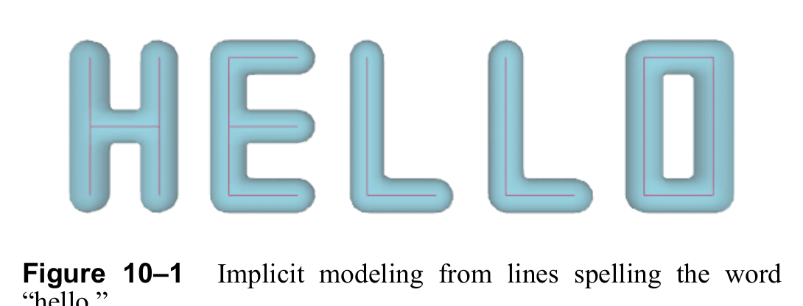
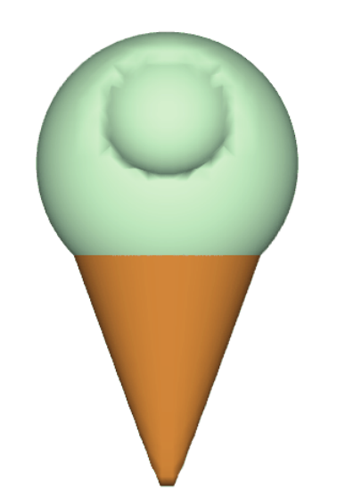
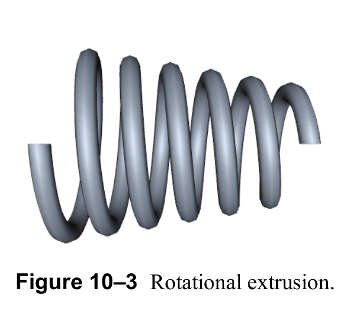
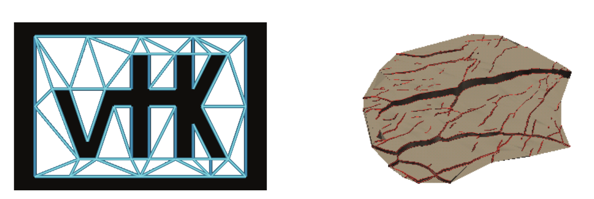
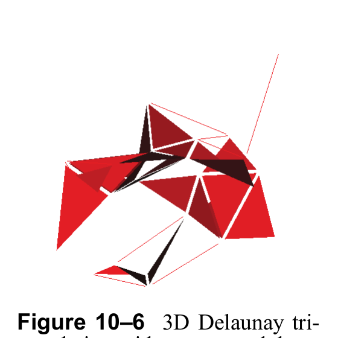
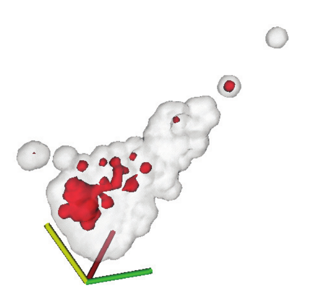
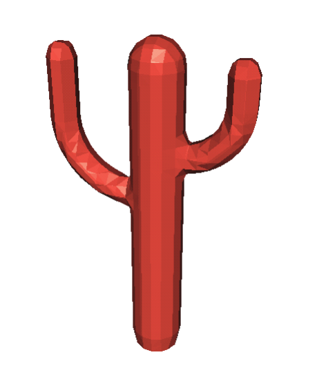

# Chapter 10: Building Models

We have seen how to use source objects (both readers and procedural objects) to create geometry. (See “Creating Simple Models” on page42.) VTK provides several other techniques to generate more complex models. Three techniques covered in this chapter are implicit modeling, extrusion, and surface reconstruction from unorganized points.

If you are working with data in a form that lacks topological or geometric structure, VTK can represent this information as field data (using class vtkDataObject, see “Working With Field Data” on page249), which can be further processed to produce datasets for visualization with the techniques in this chapter. For example, an n-dimensional financial record can be reduced to three dimensions by choosing three variables as independent variables. Then the techniques described here—Delaunay triangulation, Gaussian splatting, and surface reconstruction—can be used to create structure suitable for visualization by standard methods.

## 10.1 Implicit Modeling

Implicit modeling is a powerful technique employing 3D contouring (isosurface generation) to create polygonal surface meshes. The contouring operation is applied to a vtkImageData dataset (a regular volume) whose scalar values have been synthetically generated. The key to implicit modeling is that the scalar field can be generated using a wide variety of techniques. These techniques include producing a distance field from generating primitives (e.g., a field representing the distance from a set of lines and/or polygons) as well as using boolean set operations to combine the scalar fields.

### Creating An Implicit Model

Here’s an example that uses some lines to generate a complex, polygonal surface. The lines are arranged to spell the word “HELLO” and serve as the generating seed geometry (Figure 10–1). (The Tcl script is taken from VTK/Examples/Modelling/Tcl/hello.tcl.)



*Figure 10–1 Implicit modeling from lines spelling the word “hello.” *

```tcl
# create lines
vtkPolyDataReader reader
reader SetFileName "$VTK_DATA_ROOT/Data/hello.vtk"
vtkPolyDataMapper lineMapper
lineMapper SetInputConnection [reader GetOutputPort]
vtkActor lineActor
lineActor SetMapper lineMapper
eval [lineActor GetProperty] SetColor $red

# create implicit model
vtkImplicitModeller imp
imp SetInputConnection [reader GetOutputPort]
imp SetSampleDimensions 110 40 20
imp SetMaximumDistance 0.25
imp SetModelBounds -1.0 10.0 -1.0 3.0 -1.0 1.0
vtkContourFilter contour
contour SetInputConnection [imp GetOutputPort]
contour SetValue 0 0.25
vtkPolyDataMapper impMapper
impMapper SetInputConnection [contour GetOutputPort]
impMapper ScalarVisibilityOff
vtkActor impActor
impActor SetMapper impMapper
eval [impActor GetProperty] SetColor $peacock
[impActor GetProperty] SetOpacity 0.5
```

What’s happening in this script is that the lines that stroke out the word “hello” serve as the generating primitives. The vtkImplicitModeller class computes the distance from the lines (taking the closest distance to any line) to the points in the output vtkImageData and assigns this distance as the scalar value at each point in the dataset. The output is then passed to the vtkContourFilter which generates a polygonal isosurface. (The isosurface value is the distance from the generating primitives.)

There are a couple of important parameters in vtkImplicitModeller. The MaximumDistance instance variable controls how far from the generating primitives to continue the distance calculation. This instance variable, expressed as a fraction of the grid length, has a great effect on the speed of calculation: smaller values result in faster computation, but the isosurface may become choppy or break up if the values are too small. The SampleDimensions instance variable controls the resolution of the output vtkImageData, and ModelBounds controls the position and size of the dataset in space.

### Sampling Implicit Functions

Another powerful modeling technique is the use of implicit functions. Implicit functions have the form

$F(x,y,z) = constant$

Spheres, cones, ellipsoids, planes, and many other useful geometric entities can be described with implicit functions. For example, a sphere S of radius R centered at the origin can be described by the equation $F(x,y,z) = R^2 - x^2 - y^2 - z^2$. When $F(x,y,z)=0$, the equation describes S exactly. When $F(x,y,z) < 0$, we describe a sphere that lies inside the sphere S, and when $F(x,y,z) > 0$, we describe a sphere that lies outside the sphere S. As its name implies, an implicit function defines a surface implicitly; producing an explicit representation of the surface (e.g., polygons) requires sampling the function over a volume and then performing an isocontouring operation as demonstrated in the next example. 



*Figure 10–2 Implicit modeling using boolean combinations.*

Besides modeling, implicit functions can also be combined using the set operations union, intersection, and difference. These operations allow you to create complex geometry using combinations of implicit functions. Here’s an example script that models an ice cream cone by using a sphere (ice cream), a cone intersected by two planes (to create a cone of finite extent), and another sphere to simulate the “bite” out of the ice cream. The script is taken from VTK/Examples/Modelling/Tcl/ iceCream.tcl.

```tcl
# create implicit function primitives
vtkCone cone
cone SetAngle 20
vtkPlane vertPlane
vertPlane SetOrigin .1 0 0
vertPlane SetNormal -1 0 0
vtkPlane basePlane
basePlane SetOrigin 1.2 0 0
basePlane SetNormal 1 0 0
vtkSphere iceCream
iceCream SetCenter 1.333 0 0
iceCream SetRadius 0.5
vtkSphere bite
bite SetCenter 1.5 0 0.5
bite SetRadius 0.25

# combine primitives to build ice-cream cone
vtkImplicitBoolean theCone
theCone SetOperationTypeToIntersection
theCone AddFunction cone
theCone AddFunction vertPlane
theCone AddFunction basePlane

# take a bite out of the ice cream
vtkImplicitBoolean theCream
theCream SetOperationTypeToDifference
theCream AddFunction iceCream
theCream AddFunction bite

# iso-surface to create geometry of the cone
vtkSampleFunction theConeSample
theConeSample SetImplicitFunction theCone
theConeSample SetModelBounds -1 1.5 -1.25 1.25 -1.25 1.25
theConeSample SetSampleDimensions 60 60 60
theConeSample ComputeNormalsOff

vtkContourFilter theConeSurface
theConeSurface SetInputConnection [theConeSample GetOutputPort]
theConeSurface SetValue 0 0.0
vtkPolyDataMapper coneMapper
coneMapper SetInputConnection [theConeSurface GetOutputPort]
coneMapper ScalarVisibilityOff

vtkActor coneActor
coneActor SetMapper coneMapper
eval [coneActor GetProperty] SetColor $chocolate

# iso-surface to create geometry of the ice cream
vtkSampleFunction theCreamSample
theCreamSample SetImplicitFunction theCream
theCreamSample SetModelBound 0 2.5 -1.25 1.25 -1.25 1.25
theCreamSample SetSampleDimensions 60 60 60
theCreamSample ComputeNormalsOff

vtkContourFilter theCreamSurface
theCreamSurface SetInputConnection [theCreamSample GetOutputPort]
theCreamSurface SetValue 0 0.0
vtkPolyDataMapper creamMapper
creamMapper SetInputConnection [theCreamSurface GetOutputPort]
creamMapper ScalarVisibilityOff

vtkActor creamActor
creamActor SetMapper creamMapper
eval [creamActor GetProperty] SetColor $mint
```

The classes vtkSampleFunction and vtkContourFilter are the keys to building the polygonal geometry. vtkSampleFunction evaluates the implicit function (actually the boolean combination of implicit functions) to generate scalars across a volume (vtkImageData) dataset. vtkContourFilter is then used to generate an isosurface which approximates the implicit function. The accuracy of the approximation depends on the nature of the implicit function, as well as the resolution of the volume generated by vtkSampleFunction (specified using the SetSampleDimensions() method).

A couple of usage notes: Boolean combinations can be nested to arbitrary depth. Just make sure the hierarchy does not contain self-referencing loops. Also, you may wish to use vtkDecimatePro to reduce the number of primitives output by the contour filter since the number of triangles can be quite large. See “Decimation” on page107 for more information.

## 10.2 Extrusion



*Figure 10–3 Rotational extrusion.*
Extrusion is a modeling technique that sweeps a generating object along a path to create a surface. For example, we can sweep a line in a direction perpendicular to it to create a plane.

The Visualization Toolkit offers two methods of extrusion: linear extrusion and rotational extrusion. In VTK, the generating object is a vtkPolyData dataset. Lines, vertices, and “free edges” (edges used by only one polygon) are used to generate the extruded surface. The vtkLinearExtrusionFilter sweeps the generating primitives along a straight line path; the vtkRotationalExtrusionFilter sweeps them along a rotational path. (Translation during rotation is also possible.)

In this example we will use an octagonal polygon (i.e., an approximation to a disk) to sweep out a combined rotational/translational path to model a “spring” (Figure 10–3). The filter extrudes its input (generating primitives) around the z axis while also translating (during rotation) along the z axis and adjusting the sweep radius. By default, the instance variable Capping is on, so the extruded surface (a hollow tube) is capped by the generating primitive. Also, we must set the Resolution instance variable to generate a reasonable approximation. (The vtkPolyDataNormals filter used in the following example is described in “Generate Surface Normals” on page107.) 

```tcl
# create spring profile (a disk)
vtkPoints points
points InsertPoint 0 1.0 0.0 0.0
points InsertPoint 1 1.0732 0.0 -0.1768
points InsertPoint 2 1.25 0.0 -0.25
points InsertPoint 3 1.4268 0.0 -0.1768
points InsertPoint 4 1.5 0.0 0.00
points InsertPoint 5 1.4268 0.0 0.1768
points InsertPoint 6 1.25 0.0 0.25
points InsertPoint 7 1.0732 0.0 0.1768
vtkCellArray poly
poly InsertNextCell 8;#number of points
poly InsertCellPoint 0
poly InsertCellPoint 1
poly InsertCellPoint 2
poly InsertCellPoint 3
poly InsertCellPoint 4
poly InsertCellPoint 5
poly InsertCellPoint 6
poly InsertCellPoint 7
vtkPolyData profile
profile SetPoints points
profile SetPolys poly

# extrude profile to make spring
vtkRotationalExtrusionFilter extrude
extrude SetInput profile
extrude SetResolution 360
extrude SetTranslation 6
extrude SetDeltaRadius 1.0
extrude SetAngle 2160.0;#six revolutions
vtkPolyDataNormals normals
normals SetInputConnection [extrude GetOutputPort]
normals SetFeatureAngle 60
vtkPolyDataMapper map
map SetInputConnection [normals GetOutputPort]
vtkActor spring
spring SetMapper map
[spring GetProperty] SetColor 0.6902 0.7686 0.8706
[spring GetProperty] SetDiffuse 0.7
[spring GetProperty] SetSpecular 0.4
[spring GetProperty] SetSpecularPower 20
[spring GetProperty] BackfaceCullingOn
```

The vtkLinearExtrusionFilter is similar, but it is simpler to use than vtkRotationalExtrusionFilter. Linear extrusion can be performed along a user-specified vector (SetExtrusionTypeToVectorExtrusion()) or towards a user-specified point (SetExtrusionTypeToPointExtrusion()); or the extrusion can be performed in the direction of the surface normals of the generating surface (SetExtrusionTypeToNormalExtrusion()).

## 10.3 Constructing Surfaces

Often we wish to construct a surface from a set of unstructured points or other data. The points may come from a laser digitizing system or may be assembled from multi-variate data. In this section we examine techniques to build new surfaces from data of this form. You may also wish to refer to “Building Models” on page213 for other methods to create surfaces from generating primitives (i.e., implicit modeling).

### Delaunay Triangulation

The Delaunay triangulation is widely used in computational geometry. The basic application of the Delaunay triangulation is to create a simplicial mesh (i.e., triangles in 2D, tetrahedra in 3D) from a set of points. The resulting mesh can then be used in a variety of ways, including processing with standard visualization techniques. In VTK, there are two objects for creating Delaunay triangulations: vtkDelaunay2D and vtkDelaunay3D.

Note: Delaunay triangulation is numerically sensitive. The current version of vtkDelaunay3D may not be robust enough to reliably handle large numbers of points. This will be improved in the near future.

**vtkDelaunay2D.** The vtkDelaunay2D object takes vtkPointSet (or any of its subclasses) as input and generates a vtkPolyData on output. Typically the output is a triangle mesh, but if you use a non-zero Alpha value it is possible to generate meshes consisting of triangles, lines, and vertices. (This parameter controls the “size” of output primitives. The size of the primitive is measured by an n-dimensional circumsphere; only those pieces of the mesh whose circumsphere has a circumradius less than or equal to the alpha value are sent to the output. For example, if an edge of length L is less than 2*Alpha, the edge would be output).

In the following Tcl example we generate points using a random distribution in the (0,1) x-y plane. (vtkDelaunay2D ignores the z-component during execution, although it does output the z value.) To create a nicer picture we use vtkTubeFilter and vtkGlyph3D to create tubes around mesh edges and spheres around the mesh points. The script comes from VTK/Examples/Modelling/Tcl/ DelMesh.tcl. 


*Figure 10–4 2D Delaunay triangulation.*

```tcl
# create some points
vtkMath math

vtkPoints points
for {set i 0} {$i<50} {incr i 1} {
eval points InsertPoint $i [math Random 0 1] \
[math Random 0 1] 0.0
}

vtkPolyData profile
profile SetPoints points

# triangulate them
vtkDelaunay2D del
del SetInput profile
del SetTolerance 0.001
vtkPolyDataMapper mapMesh
mapMesh SetInputConnection [del GetOutputPort]
vtkActor meshActor
meshActor SetMapper mapMesh
[meshActor GetProperty] SetColor .1 .2 .4

vtkExtractEdges extract
extract SetInputConnection [del GetOutputPort]
vtkTubeFilter tubes
tubes SetInputConnection [extract GetOutputPort]
tubes SetRadius 0.01
tubes SetNumberOfSides 6
vtkPolyDataMapper mapEdges
mapEdges SetInputConnection [tubes GetOutputPort]
vtkActor edgeActor
edgeActor SetMapper mapEdges
eval [edgeActor GetProperty] SetColor $peacock
[edgeActor GetProperty] SetSpecularColor 1 1 1
[edgeActor GetProperty] SetSpecular 0.3
[edgeActor GetProperty] SetSpecularPower 20
[edgeActor GetProperty] SetAmbient 0.2
[edgeActor GetProperty] SetDiffuse 0.8

vtkSphereSource ball
ball SetRadius 0.025
ball SetThetaResolution 12
ball SetPhiResolution 12
vtkGlyph3D balls
balls SetInputConnection [del GetOutputPort]
balls SetSourceConnection [ball GetOutputPort]
vtkPolyDataMapper mapBalls
mapBalls SetInputConnection [balls GetOutputPort]
vtkActor ballActor
ballActor SetMapper mapBalls
eval [ballActor GetProperty] SetColor $hot_pink
[ballActor GetProperty] SetSpecularColor 1 1 1
[ballActor GetProperty] SetSpecular 0.3
[ballActor GetProperty] SetSpecularPower 20
[ballActor GetProperty] SetAmbient 0.2
[ballActor GetProperty] SetDiffuse 0.8
```

The Tolerance instance variable is used to determine whether points are coincident. Points located a distance Tolerance apart (or less) are considered coincident, and one of the points may be discarded. Tolerance is expressed as a fraction of the length of the diagonal of the bounding box of the input points.

Another useful feature of vtkDelaunay2D is the ability to define constraint edges and polygons. Normally, vtkDelaunay2D will generate a Delaunay triangulation of an input set of points satisfying the circumsphere criterion. However, in many cases additional information specifying edges in the triangulation (constraint edges) or “holes” in the data (constraint polygons) may be available. By specifying constraint edges and polygons, vtkDelaunay2D can be used to generate sophisticated triangulations of points. The following example (taken from VTK/Examples/Modelling/Tcl/constrainedDelaunay.tcl) demonstrates this.

```tcl
vtkPoints points
points InsertPoint 0 1 4 0
points InsertPoint 1 3 4 0
points InsertPoint 2 7 4 0
...(more points defined)...
vtkCellArray polys
polys InsertNextCell 12
polys InsertCellPoint 0
polys InsertCellPoint 1
polys InsertCellPoint 2
...(a total of two polygons defined)...
vtkPolyData polyData
polyData SetPoints points
polyData SetPolys polys

# generate constrained triangulation
vtkDelaunay2D del
del SetInput polyData
del SetSource polyData
vtkPolyDataMapper mapMesh
mapMesh SetInputConnection [del GetOutputPort]
vtkActor meshActor
meshActor SetMapper mapMesh
```



*Figure 10–5 Constrained Delaunay triangulation. On the left, a constraint polygon defines a hole in the triangulation. On the right, constraint edges define fault lines in a geological horizon.* 

```tcl
# tubes around mesh
vtkExtractEdges extract
extract SetInputConnection [del GetOutputPort]
vtkTubeFilter tubes
tubes SetInputConnection [extract GetOutputPort]
tubes SetRadius 0.1
tubes SetNumberOfSides 6
vtkPolyDataMapper mapEdges
mapEdges SetInputConnection [tubes GetOutputPort]
vtkActor edgeActor
edgeActor SetMapper mapEdges
eval [edgeActor GetProperty] SetColor $peacock
[edgeActor GetProperty] SetSpecularColor 1 1 1
[edgeActor GetProperty] SetSpecular 0.3
[edgeActor GetProperty] SetSpecularPower 20
[edgeActor GetProperty] SetAmbient 0.2
[edgeActor GetProperty] SetDiffuse 0.8
```

In this example (resulting image shown on the left of Figure 10–5), a second input to vtkDelaunay2D has been defined (with the SetSource() method). This input defines two polygons, one ordered counter-clockwise and defining the outer rectangular boundary, and the second clockwise-ordered polygon defining the “vtk” hole in the triangulation.

Using constraint edges is much simpler since the ordering of the edges is not important. Referring to the example VTK/Examples/Modelling/Tcl/faultLines.tcl, constraint edges (lines and polylines provided to the second input Source) are used to constrain the triangulation along a set of edges. (See the right side of Figure 10–5.)

**vtkDelaunay3D.** vtkDelaunay3D is similar to vtkDelaunay2D. The major difference is that the output of vtkDelaunay3D is an unstructured grid dataset (i.e., a tetrahedral mesh).



*Figure 10–6 3D Delaunay triangulation with non-zero alpha.*

```tcl
vtkMath math
vtkPoints points
for {set i 0} {$i<25} {incr i 1} {
points InsertPoint $i [math Random 0 1]\
[math Random 0 1] [math Random 0 1]}

vtkPolyData profile
profile SetPoints points

# triangulate them
vtkDelaunay3D del
del SetInput profile
del BoundingTriangulationOn
del SetTolerance 0.01
del SetAlpha 0.2

 # shrink the result to help see it better 

vtkShrinkFilter shrink
shrink SetInputConnection [del GetOutputPort]
shrink SetShrinkFactor 0.9
vtkDataSetMapper map
map SetInputConnection [shrink GetOutputPort]
vtkActor triangulation
triangulation SetMapper map
[triangulation GetProperty] SetColor 1 0 0
```
In this example (taken from VTK/Examples/Modelling/Tcl/Delaunay3D.tcl) we triangulate a random set of points in 3D space ranging between (0,1) along each of the coordinate axes. A non-zero Alpha is used, so the mesh consists of a collection of tetrahedra, triangles, lines, and points. The resulting tetrahedral mesh is shrunk with vtkShrinkFilter and mapped with vtkDataSetMapper. 

### Gaussian Splatting

Many times data has no inherent structure, or the dimension of the data is high relative to what 2D, 3D, or 4D (3D with animation) visualization techniques can represent. An example of one such data set is scalar values (i.e., temperature) located at random points in space from a thermocouple measuring system. Multidimensional financial data (i.e., many records each record having several variables), is another example. One of the simplest and most robust procedures that can used to treat such data is to resample the data on a volume (i.e., vtkImageData dataset) and then visualize the resampled dataset. In the following C++ example (VTK/Examples/Modelling/Cxx/finance.cxx) we show how to do this with multivariate financial data. You may wish to refer to “Working With Field Data” on page249 for an alternative way to work with this data.

The data consists of an ASCII text file with 3188 financial records. Each record contains the following information: the time late in paying the loan (TIME_LATE); the monthly payment of the loan (MONTHLY_PAYMENT); the principal left on the loan (UNPAID_PRINCIPAL); the original amount of the loan (LOAN_AMOUNT); the interest rate on the loan (INTEREST_RATE); and the monthly income of the loanee (MONTHLY_INCOME).

The purpose of the visualization is to understand the relationship of these variables to the variable of major concern: TIME_LATE. Building a mathematical model or understanding of this data helps financial institutions make less risky loans. What we will do in the example is to show the late paying loans in context with the total loan population. We begin by choosing MONTHLY_PAYMENT as the x-axis, INTEREST_RATE as the y-axis, and LOAN_AMOUNT as the z-axis, and then choose TIME_LATE as the dependent variable (i.e., we reduce the dimensionality of the data by selecting three variables and ignoring the others). The class vtkGaussianSplatter is used to take the reduced financial data and “splat” them into a vtkImageData dataset using Gaussian ellipsoids. Then vtkContourFilter is used to generate an isosurface. Note that the first instance of vtkGaussianSplatter splats the entire dataset without scaling the splats, while the second instance of vtkGaussianSplatter scales the splats according to the scalar value (i.e., TIME_LATE). The late loans are rendered in red while the total population is rendered in a translucent white color. (See Figure 10–7.)



*Figure 10–7 Splatting data.*

Following is the C++ code demonstrating Gaussian splatting.

```cpp
main ()
{
double bounds[6];
vtkDataSet *dataSet;

...read data...

if ( ! dataSet ) exit(0);
// construct pipeline for original population

vtkGaussianSplatter *popSplatter =
vtkGaussianSplatter::New();
popSplatter->SetInput(dataSet); Figure 10–7 Splatting data.
popSplatter->SetSampleDimensions(50,50,50);
popSplatter->SetRadius(0.05);
popSplatter->ScalarWarpingOff();
vtkContourFilter *popSurface = vtkContourFilter::New();
popSurface->SetInputConnection(popSplatter->GetOutputPort());
popSurface->SetValue(0,0.01);
vtkPolyDataMapper *popMapper = vtkPolyDataMapper::New();
popMapper->SetInputConnection(popSurface->GetOutputPort());
popMapper->ScalarVisibilityOff();
vtkActor *popActor = vtkActor::New();
popActor->SetMapper(popMapper);
popActor->GetProperty()->SetOpacity(0.3);
popActor->GetProperty()->SetColor(.9,.9,.9);
// construct pipeline for delinquent population
vtkGaussianSplatter *lateSplatter = vtkGaussianSplatter::New();
lateSplatter->SetInput(dataSet);
lateSplatter->SetSampleDimensions(50,50,50);
lateSplatter->SetRadius(0.05);
lateSplatter->SetScaleFactor(0.005);
vtkContourFilter *lateSurface = vtkContourFilter::New();
lateSurface->SetInputConnection(lateSplatter->GetOutputPort());
lateSurface->SetValue(0,0.01);
vtkPolyDataMapper *lateMapper = vtkPolyDataMapper::New();
lateMapper->SetInputConnection(lateSurface->GetOutputPort());
lateMapper->ScalarVisibilityOff();
vtkActor *lateActor = vtkActor::New();
lateActor->SetMapper(lateMapper);
lateActor->GetProperty()->SetColor(1.0,0.0,0.0);
// create axes
popSplatter->Update();
popSplatter->GetOutput()->GetBounds(bounds);
vtkAxes *axes = vtkAxes::New();
axes->SetOrigin(bounds[0], bounds[2], bounds[4]);
axes->SetScaleFactor(
popSplatter->GetOutput()->GetLength()/5);
vtkTubeFilter *axesTubes = vtkTubeFilter::New();
axesTubes->SetInputConnection(axes->GetOutputPort());
axesTubes->SetRadius(axes->GetScaleFactor()/25.0);
axesTubes->SetNumberOfSides(6);
vtkPolyDataMapper *axesMapper = vtkPolyDataMapper::New();
axesMapper->SetInputConnection(axesTubes->GetOutputPort());
vtkActor *axesActor = vtkActor::New();
axesActor->SetMapper(axesMapper);
// graphics stuff
vtkRenderer *renderer = vtkRenderer::New();
vtkRenderWindow *renWin = vtkRenderWindow::New();
renWin->AddRenderer(renderer);
vtkRenderWindowInteractor *iren =
vtkRenderWindowInteractor::New();
iren->SetRenderWindow(renWin);
// read data, set up renderer
renderer->AddActor(lateActor);
renderer->AddActor(axesActor);
renderer->AddActor(popActor);
renderer->SetBackground(1,1,1);
renWin->SetSize(300,300);
// interact with data
iren->Initialize();
iren->Start();
...clean up...
}
```

What's interesting about this example is that the majority of late payments occur in a region of a high interest rate (expected) and lower monthly payment amount. Therefore, it’s the smaller loans with higher interest rates which are the problem in this data. 

Another filter for resampling data into a volume is vtkShepardMethod. You may wish to modify the previous C++ example to use this class.

### Surfaces from Unorganized Points

In computer graphics applications, surfaces are often represented as three-dimensional unorganized points. Laser and other digitizers are often the source of these point sets. Reconstructing surfaces from point clouds is both computationally and algorithmically challenging. While the methods described previously (Delaunay triangulation and Gaussian splatting) may be used with varying levels of success to reconstruct surfaces from point clouds, VTK has a class designed specifically for this purpose. 

vtkSurfaceReconstructionFilter can be used to reconstruct surfaces from point clouds. This filter takes as input a vtkDataSet defining points assumed to lie on the surface of a 3D object. The following script (VTK/Examples/Modelling/Tcl/reconstructSurface.tcl) shows how to use the filter. Figure 10–8 shows the results.



*Figure 10–8 Surface reconstruction.*

```tcl
vtkProgrammableSource pointSource
pointSource SetExecuteMethod readPoints
proc readPoints {} {
    set output [pointSource GetPolyDataOutput]
    vtkPoints points
    $output SetPoints points
    set file [open "$VTK_DATA_ROOT/Data/cactus.3337.pts" r]
    while { [gets $file line] != -1 } {
        scan $line "%s" firstToken
        if { $firstToken == "p" } {
            scan $line "%s %f %f %f" firstToken x y z
            points InsertNextPoint $x $y $z
        }
    }
    points Delete; #okay, reference counting
}

# Construct the surface and create isosurface
vtkSurfaceReconstructionFilter surf
surf SetInputConnection [pointSource GetOutputPort]
vtkContourFilter cf
cf SetInputConnection [surf GetOutputPort]
cf SetValue 0 0.0
vtkReverseSense reverse
reverse SetInputConnection [cf GetOutputPort]
reverse ReverseCellsOn reverse ReverseNormalsOn

vtkPolyDataMapper map
map SetInputConnection [reverse GetOutputPort]
map ScalarVisibilityOff

vtkActor surfaceActor
surfaceActor SetMapper map
```

The example begins by reading points from a file using vtkProgrammableSource filter. (See “Programmable Filters” on page419 for more information.) vtkSurfaceReconstructionFilter takes the points and generates a volumetric representation (similar to what vtkGaussianSplatter did in the previous section). The volume is contoured (with an isosurface value=0.0) to generate a surface and vertex normals. Because of the nature of the data, the vertex normals point inward so vtkReverseSense is used to reverse the normals and polygon ordering. (On some systems inward pointing normals will result in black surfaces during rendering.)

The algorithm works reasonably well as long as the points are close enough together. The instance variable SampleSpacing can be set to control the dimensions of the output volume. If SampleSpacing is given a negative value, the algorithm makes a guess at the voxel size. The output volume bounds the input point cloud