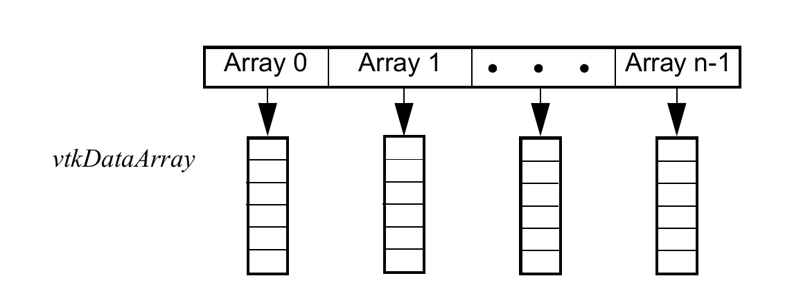

# Chapter 12: Reading and Writing Data

In this chapter we briefly describe various ways to read, write, import, and export data. Readers ingest a single dataset, while importers create an entire scene, which may include one or more datasets, actors, lights, cameras, and so on. Writers output a single dataset to disk (or stream), and exporters output an entire scene. In some cases, you may want to interface to data that is not in standard VTK format, or in any other common format that VTK supports. In such circumstances, you may wish to treat data as field data, and convert it in the visualization pipeline into datasets that the standard visualization techniques can properly handle.

## 12.1 Readers

We saw in Section 4.1 how to use a reader to bring data into the visualization pipeline. Using a similar approach, we can read many other types of data. Using a reader involves instantiating the reader, supplying a filename, and calling `Update()` somewhere down the pipeline.

There are many different readers in the VTK library, all of which exist to read files and produce data structures that can be processed and visualized by the rest of the visualization pipeline. A reader then, is any vtkAlgorithm which does not require input connections and which knows how to read files to produce vtkDataObjects.

There are many different readers in VTK because there are many important file formats for scientific data. The different file formats exist to make permanent different varieties of data such as structured, unstructured, polygonal, tabular, or graph. As a user of VTK, an important task is to determine what VTK data structure corresponds to the data of interest to you and then to find a reader that reads in the files you work with to produce that structure. This section introduces some of the available readers.

There are some points to make note of before diving into the list of readers. For all VTK data structure types there exists one or two VTK native reader classes. These classes were written in concert with developing or extending the corresponding data type. The older native reader class reads files with the ".vtk" extension, and the newer reads XML based files with the ".vt?" extension (where ? describes the type). Both old and new formats support writing data in text or binary formats. The newer format is more involved, but it fully supports the most recent VTK features including named arrays, 32 bit / 64 bit encoding, streamed processing and all of the latest data structures. Both formats have parallel processing extensions, which are implemented with meta files that refer to external serial files that are meant to be read independently. See the VTK File Formats documentation for details of the native file formats.

This chapter lists the VTK native readers for each data type as well as a selection of the readers that interface with the more well known third party file formats and produce that type.

Finally note that if a suitable reader does not exist, one can write one in C++ or Python, or use the techniques described in Section 12.7 to coerce the output of the most generic reader, vtkProgrammableDataObjectSource, into the proper data type.

### Data Object Readers

- vtkProgrammableDataObjectSource — an algorithm that executes a user specified function to produce a vtkDataObject. The user specified function can be written to read in any particular file format, or procedurally generate data without reading any file.
- vtkGenericDataObjectReader — read a ".vtk" file, the legacy file format for all of VTK's data structures and populate a vtkDataObject or the most specific subclass thereof with the structure defined in the file. This reader will produce vtkTable for example, if the .vtk file contains Tabular Data, and vtkUnstructuredGrid if the chosen .vtk file contains an Unstructured Grid. This class reads the header information to find out what type of data is in the file and then delegates the rest of the processing to one of the more specific classes described below.
- vtkDataObjectReader — read a ".vtk" file and populate a DataObject with Field associated arrays. This differs from vtkGenericDataObjectReader in that it will not produce the specific data structure best suited to the contents of the file and instead always produces the most general one, vtkDataObject.

### Dataset Readers

These readers produce generic vtkDataSet as output. Typically, the reader requires an `Update()` invocation to determine what kind of concrete vtkDataSet subclass is created.
- vtkDataSetReader — like vtkDataObjectReader, but this class is limited to the more common vtkDataSet subclasses.
- vtkPDataSetReader — like vtkDataSetReader, but reads parallel vtk (.pvtk) format files, which are meta files that reference several legacy .vtk files which are meant to be processed by different processors simultaneously.
- vtkGenericEnSightReader (and subclasses) — read EnSight files.

### Image and Volume Readers

- vtkStructuredPointsReader — reads ".vtk" legacy format files containing image data.
- vtkXMLImageDataReader — reads ".vti" files, one of the newer XML based VTK file formats.
- vtkXMLPImageDataReader — reads ".pvti" XML based parallel partitioned files that reference individual ".vti" files.
- vtkImageReader — reads raw image data. Since the file format is a raw dump, you must specify the image extent, byte ordering, scalar type etc. in order to get the correct result from the file.
- vtkDICOMImageReader — reads DICOM (Digital Imaging and Communications in Medicine) images.
- vtkGESignaReader — reads GE Signa Imaging files.
- vtkMINCImageReader — a netCDF based reader for MINC (Montreal Neurological Institute Center) files.
- vtkJPEGReader — reads JPEG files.
- vtkPNMReader — reads PNM files.
- vtkTIFFReader — reads TIFF files.

### Rectilinear Grid Readers

- vtkRectilinearGridReader — reads ".vtk" legacy format files containing rectilinear grid data.
- vtkXMLRectilinearGridReader — reads ".vtr" XML based VTK files.
- vtkXMLPRectilinearGridReader — reads ".pvtr" XML based parallel partitioned files that reference individual ".vtr" files.

### Structured Grid Readers

- vtkStructuredGridReader — reads ".vtk" legacy format files containing structured grid data.
- vtkXMLStructuredGridReader — reads ".vts" XML based VTK files.
- vtkXMLPStructuredGridReader — reads ".pvts" XML based parallel partitioned files that reference individual ".vts" files.
- vtkPLOT3DReader — reads NASA PLOT3D structured CFD computation datasets.

### Polygonal Data Readers

- vtkPolyDataReader — reads ".vtk" legacy format files containing polygonal data.
- vtkXMLPolyDataReader — reads ".vtp" XML based VTK files.
- vtkXMLPPolyDataReader — reads ".pvtp" XML based parallel partitioned files that reference individual ".vtp" files.
- vtkOBJReader — reads Wavefront .obj files.
- vtkPLYReader — reads Stanford University .ply files.
- vtkParticleReader — reads particle data with scalar values (x, y, z, value) in ASCII or binary format.
- vtkSTLReader — reads stereo-lithography files.
- vtkSimplePointsReader — reads points written as X Y Z floating point form and produces edges and vtk_vertex cells in vtkPolyData.
- vtkSLACParticleReader — reads netCDF files written with conventions for Stanford Linear Accelerator Center processing tools. Output corresponds to particles in space.

### Unstructured Grid Readers

- vtkUnstructuredGridReader — reads ".vtk" legacy format files containing unstructured grid data.
- vtkXMLUnstructuredGridReader — reads ".vtu" XML based VTK files.
- vtkXMLPUnstructuredGridReader — reads ".pvtu" XML based parallel partitioned files that reference individual ".vtu" files.
- vtkChacoReader — reads Sandia Chaco graph package format files and produces UnstructuredGrid data.
- vtkPChacoReader — reads Sandia Chaco graph format packages on one processor and internally distributes portions of the data to other parallel processors.

### Graph Readers

- vtkGraphReader — read ".vtk" legacy format files containing general Graph data.
- vtkTreeReader — read ".vtk" legacy format files to produce more specialized Trees.
- vtkXMLTreeReader — reads XML based VTK files.
- vtkChacoGraphReader — reads a file written in the Sandia Chaco graph package format. This differs from vtkChacoReader in that it produces a vtkUndirectedGraph instead of the more spatially oriented vtkUnstructuredGrid.
- vtkSQLGraphReader — read vertex and edge tables from an SQL database.
- vtkRISReader — read a RIS format bibliographic citation file and produce a vtkTable.

### Table Readers

- vtkTableReader — read ".vtk" legacy format files containing general tabular data.
- vtkDelimitedTextReader — read text files in which newlines separate each row and a single user specified delimiter character (for example, comma, tab or space) separates columns.
- vtkFixedWidthTextReader — read text files in which newlines separate each row and where each column has a fixed width.
- vtkISIReader — read bibliographic citation records in ISI format.

### Composite Data Readers

vtkCompositeDataSet's concrete subclasses vtkMultiPieceDataSet, vtkHierarchicalBoxDataSet, and vtkMultiBlockDataSet are VTK's way of representing compound data objects, or data objects which contain other data objects. These structures are useful in parallel processing, for adaptively refined simulations and to represent hierarchical relationships between related parts. Several readers import complex data and produce composite data outputs. The contents of the composite data may be any or all of the above atomic types, and/or additional composite data objects.
- vtkXMLCompositeDataReader — and its subclasses read XML based VTK files. The standard extensions for these files include ".vtm", ".vth" and ".vtb".
- vtkExodusIIReader — read Sandia Exodus II format files and directly produce MultiBlock datasets. The blocks are not converted to a single vtkUnstructuredGrid, which can conserve memory when the data is regular.
- vtkPExodusIIReader — parallel processing specialization of the preceding, where each processor independently and simultaneously reads its own subset of the blocks.
- vtkOpenFOAMReader — read files written in OpenFOAM (computational fluid dynamics) format.

## 12.2 Writers

Writers output vtkDataObjects to the file system. A writer is any vtkAlgorithm which takes in a vtkDataObject, usually one produced by the vtkAlgorithm connected to the writer's input, and writes it to the file system in some standard format. There are many different writers in VTK because there are many important file formats.

Typically, using a writer involves setting an input and specifying an output file name (or sometimes names) as shown in the following.

```python
from vtkmodules.vtkIOLegacy import vtkPolyDataWriter

writer = vtkPolyDataWriter()
writer.SetInputConnection(a_filter.GetOutputPort())
writer.SetFileName("outFile.vtk")
writer.SetFileTypeToBinary()
writer.Write()
```

The legacy VTK writers offer you the option of writing binary (`SetFileTypeToBinary()`) or ASCII (`SetFileTypeToASCII()`) files. (Note: binary files may not be transportable across computers. VTK takes care of swapping bytes, but does not handle transport between 64-bit and 32-bit computers.)

The VTK XML writers also allow you to write in binary (`SetDataModeToBinary()`) or ASCII (`SetDataModeToAscii()`); and appended binary mode is also available (`SetDataModeToAppended()`). The VTK XML readers and writers do handle transporting data between 32-bit and 64-bit computers in addition to taking care of byte swapping.

The following is a list of available writers.

### Data Object Writers

- vtkGenericDataObjectWriter — writes any type of vtkDataObject to file in the legacy ".vtk" file format.
- vtkDataObjectWriter — write only the vtkDataObject's field data in legacy ".vtk" file format.

### Data Set Writers

- vtkDataSetWriter — writes any type of vtkDataSet to file in legacy ".vtk" file format.
- vtkPDataSetWriter — writes any type of vtkDataSet to file in legacy ".pvtk" parallel partitioned file format.
- vtkXMLDataSetWriter — writes any type of vtkDataSet to file in the newer XML based ".vt?" format.

### Image and Volume Writers

- vtkStructuredPointsWriter — write image data in legacy ".vtk" format.
- vtkPImageWriter — a parallel processing specialization of the preceding.
- vtkXMLImageDataWriter — write image data in XML based ".vti" format.
- vtkMINCImageWriter — a netCDF based writer for MINC (Montreal Neurological Institute Center) files.
- vtkPostScriptWriter — write image into PostScript format.
- vtkJPEGWriter — write into JPEG format.
- vtkPNMWriter — write into PNM format.
- vtkTIFFWriter — write into TIFF format.

### Rectilinear Grid Writers

- vtkRectilinearGridWriter — write rectilinear grid in legacy ".vtk" format.
- vtkXMLRectilinearGridWriter — write rectilinear grid in XML based ".vtr" format.
- vtkXMLPRectilinearGridWriter — a parallel processing specialization of the preceding.

### Structured Grid Writers

- vtkStructuredGridWriter — write structured grid in legacy ".vtk" format.
- vtkXMLStructuredGridWriter — write structured grid in XML based ".vts" format.
- vtkXMLPStructuredGridWriter — a parallel processing specialization of the preceding.

### Polygonal Data Writers

- vtkPolyDataWriter — write polygonal data in legacy ".vtk" format.
- vtkXMLPolyDataWriter — write polygonal data in XML based ".vtp" format.
- vtkXMLPPolyDataWriter — a parallel processing specialization of the preceding.
- vtkSTLWriter — write stereo-lithography files.
- vtkIVWriter — write into OpenInventor 2.0 format.
- vtkPLYWriter — write Stanford University ".ply" files.

### Unstructured Grid Writers

- vtkUnstructuredGridWriter — write unstructured data in legacy ".vtk" format.
- vtkXMLUnstructuredGridWriter — write unstructured data in XML based ".vtu" format.
- vtkXMLPUnstructuredGridWriter — a parallel processing specialization of the preceding.
- vtkEnSightWriter — write vtk unstructured grid data as an EnSight file.

### Graph Writers

- vtkGraphWriter — write vtkGraph data to a file in legacy ".vtk" format.
- vtkTreeWriter — write vtkTree data to a file in legacy ".vtk" format.

### Table Writers

- vtkTableWriter — write vtkTable data to file in legacy ".vtk" format.

### Composite Data Writers

- vtkXMLCompositeDataWriter (and its subclasses) — writers for composite data structures including hierarchical box (multires image data) and multi-block (related datasets) data types.
- vtkExodusIIWriter — write composite data in Exodus II format.

## 12.3 Importers

Importers accept data files that contain multiple datasets and/or the objects that compose a scene (i.e., lights, cameras, actors, properties, transformation matrices, etc.). Importers will either generate an instance of vtkRenderWindow and/or vtkRenderer, or you can specify them. If specified, the importer will create lights, cameras, actors, and so on, and place them into the specified instance(s). Otherwise, it will create instances of vtkRenderer and vtkRenderWindow, as necessary. The following example shows how to use an instance of vtkImporter (in this case a vtk3DSImporter — imports 3D Studio files). See Figure 12–1.


*Figure 12–1 Importing a file.*

```python
from vtkmodules.vtkIOImport import vtk3DSImporter
from vtkmodules.vtkRenderingCore import vtkRenderWindowInteractor
import vtkmodules.vtkRenderingOpenGL2  # noqa: F401

importer = vtk3DSImporter()
importer.ComputeNormalsOn()
importer.SetFileName("iflamigm.3ds")
importer.Read()

render_window = importer.GetRenderWindow()
interactor = vtkRenderWindowInteractor()
interactor.SetRenderWindow(render_window)
render_window.Render()
interactor.Start()
```

The Visualization Toolkit supports the following importers. (Note that the superclass vtkImporter is available for developing new subclasses.)
- vtk3DSImporter — import 3D Studio files.
- vtkVRMLImporter — import VRML version 2.0 files.

## 12.4 Exporters

Exporters output scenes in various formats. Instances of vtkExporter accept an instance of vtkRenderWindow, and write out the graphics objects supported by the exported format.

```python
from vtkmodules.vtkIOExport import vtkRIBExporter

exporter = vtkRIBExporter()
exporter.SetRenderWindow(render_window)
exporter.SetFilePrefix("anExportedFile")
exporter.Write()
```

The vtkRIBExporter shown above writes out multiple files in RenderMan format. The FilePrefix instance variable is used to write one or more files (geometry and texture map(s), if any). The Visualization Toolkit supports the following exporters.
- vtkGL2PSExporter — export a scene as a PostScript file using GL2PS.
- vtkIVExporter — export an Inventor scene graph.
- vtkOBJExporter — export Wavefront .obj files.
- vtkOOGLExporter — export a scene into GeomView OOGL format.
- vtkRIBExporter — export RenderMan files.
- vtkVRMLExporter — export VRML version 2.0 files.
- vtkPOVExporter — export into file format for the Persistence of Vision Raytracer.
- vtkX3DExporter — export into X3D format (an XML based 3D scene format similar to VRML).

## 12.5 Creating Hardcopy

Creating informative images is a primary objective of VTK, and to document what you've done, saving images and series of images (i.e., animations) is important. This section describes various ways to create graphical output.

### Saving Images

The simplest way to save images is to use the vtkWindowToImageFilter which grabs the output buffer of the render window and converts it into vtkImageData. This image can then be saved using one of the image writers (see Section 12.2 for more information). Here is an example.

```python
from vtkmodules.vtkRenderingCore import vtkWindowToImageFilter
from vtkmodules.vtkIOImage import vtkJPEGWriter

w2i = vtkWindowToImageFilter()
w2i.SetInput(render_window)

writer = vtkJPEGWriter()
writer.SetInputConnection(w2i.GetOutputPort())
writer.SetFileName("output.jpg")
writer.Write()
```

Note that it is possible to use the off-screen mode of the render window when saving an image. The off-screen mode can be turned on by setting `OffScreenRenderingOn()` for the render window.

### Saving Large (High-Resolution) Images

The images saved via screen capture or by saving the render window vary greatly in quality depending on the graphics hardware and screen resolution supported on your computer. To improve the quality of your images, you can use the imaging pipeline to render pieces of your image and then combine them into a very high-resolution final image.

Often we want to save an image of resolution greater than the resolution of the computer hardware. For example, generating an image of 4000 x 4000 pixels is not easy on a 1280x1024 computer display. The Visualization Toolkit makes this straightforward with the class vtkRenderLargeImage. This class breaks up the rendering process into separate pieces, each piece containing just a portion of the final image. The pieces are assembled into a final image, which can be saved to file using one of the VTK image writers.

```python
from vtkmodules.vtkFiltersHybrid import vtkRenderLargeImage
from vtkmodules.vtkIOImage import vtkTIFFWriter

render_large = vtkRenderLargeImage()
render_large.SetInput(renderer)
render_large.SetMagnification(4)

writer = vtkTIFFWriter()
writer.SetInputConnection(render_large.GetOutputPort())
writer.SetFileName("largeImage.tif")
writer.Write()
```

The Magnification instance variable (an integer value) controls how much to magnify the input renderer's current image. If the renderer's image size is (400,400) and the magnification factor is 5, the final image will be of resolution (2000,2000). In this example, the resulting image is written to a file with an instance of vtkTIFFWriter. Of course, other writer types could be used.

## 12.6 Creating Movie Files

VTK provides classes that allow you to write movie files directly. vtkFFMPEGWriter uses the FFmpeg library to encode video. On Windows, vtkAVIWriter uses Microsoft's multimedia API to create AVI movie files. Both are subclasses of vtkGenericMovieWriter and take a 2D vtkImageData as input — often the output of the vtkWindowToImageFilter. The important methods in these classes are as follows.
- `Start()` — call this method once to start writing a movie file.
- `Write()` — call this method once per frame added to the movie file.
- `End()` — call this method once to end the writing process.

Similar to the other writers, the movie writers also have `SetInputConnection()` and `SetFileName()` methods. Example code for writing a movie file with 100 frames follows.

```python
from vtkmodules.vtkRenderingCore import vtkWindowToImageFilter

w2i = vtkWindowToImageFilter()
w2i.SetInput(render_window)

# vtkFFMPEGWriter requires VTK to be built with FFmpeg support
from vtkmodules.vtkIOFFMPEG import vtkFFMPEGWriter

writer = vtkFFMPEGWriter()
writer.SetInputConnection(w2i.GetOutputPort())
writer.SetFileName("movie.avi")
writer.Start()

for i in range(100):
    # Modify the scene to create the next frame...
    render_window.Render()
    w2i.Modified()
    writer.Write()

writer.End()
```



*Figure 12–2 Structure of field data — an array of arrays. Each array may be of a different native data type and may have one or more components.*

## 12.7 Working With Field Data

Many times data is organized in a form different from that found in VTK. For example, your data may be tabular, or possibly even higher-dimensional. And sometimes you'd like to be able to rearrange your data, assigning some data as scalars, some as point coordinates, and some as other attribute data. In such situations VTK's field data, and the filters that allow you to manipulate field data, are essential.

To introduce this topic a concrete example is useful. In the previous chapter (Section 10.3) we saw an example that required writing custom code to read a tabular data file, then extracting specified data to form points and scalars. While this works fine, it does require a lot of work and is not very flexible. In the following example we'll do the same thing using field data.

The data is in the following tabular format.

```
NUMBER_POINTS 3188
TIME_LATE
29.14 0.00 0.00 11.71 0.00 0.00 0.00 0.00
0.00 29.14 0.00 0.00 0.00 0.00 0.00 0.00
....
MONTHLY_PAYMENT
7.26 5.27 8.01 16.84 8.21 15.75 10.62 15.47
5.63 9.50 15.29 15.65 11.51 11.21 10.33 10.78
....
```

This format repeats for each of the following fields: time late in paying the loan (TIME_LATE); the monthly payment of the loan (MONTHLY_PAYMENT); the principal left on the loan (UNPAID_PRINCIPAL); the original amount of the loan (LOAN_AMOUNT); the interest rate on the loan (INTEREST_RATE); and the monthly income of the borrower (MONTHLY_INCOME). These six fields form a matrix of 3188 rows and 6 columns.

We start by parsing the data file. The class vtkProgrammableDataObjectSource is useful for defining special input methods without having to modify VTK. All we need to do is to define a function that parses the file and puts the results into a VTK data object. (Recall that vtkDataObject is the most general form of data representation.) In Python, reading the data is straightforward.

```python
from vtkmodules.vtkCommonCore import vtkFloatArray, vtkIntArray
from vtkmodules.vtkFiltersSources import vtkProgrammableDataObjectSource

x_axis = "INTEREST_RATE"
y_axis = "MONTHLY_PAYMENT"
z_axis = "MONTHLY_INCOME"
scalar = "TIME_LATE"

dos = vtkProgrammableDataObjectSource()

def parse_file():
    with open("financial.txt") as f:
        lines = f.read().split("\n")

    # First line: NUMBER_POINTS <n>
    num_pts = int(lines[0].split()[1])
    num_lines = ((num_pts - 1) // 8) + 1

    field_data = dos.GetOutput().GetFieldData()
    field_data.AllocateArrays(4)

    line_idx = 1  # skip NUMBER_POINTS line

    def read_float_array(name):
        nonlocal line_idx
        # Skip blank lines and read the tag line
        while line_idx < len(lines) and not lines[line_idx].strip():
            line_idx += 1
        line_idx += 1  # skip the tag line
        arr = vtkFloatArray()
        arr.SetName(name)
        for i in range(num_lines):
            values = lines[line_idx].split()
            for v in values:
                arr.InsertNextValue(float(v))
            line_idx += 1
        return arr

    def skip_array():
        nonlocal line_idx
        while line_idx < len(lines) and not lines[line_idx].strip():
            line_idx += 1
        line_idx += 1  # skip the tag line
        for i in range(num_lines):
            line_idx += 1

    # Read TIME_LATE
    field_data.AddArray(read_float_array("TIME_LATE"))
    # Read MONTHLY_PAYMENT
    field_data.AddArray(read_float_array("MONTHLY_PAYMENT"))
    # Skip UNPAID_PRINCIPAL
    skip_array()
    # Skip LOAN_AMOUNT
    skip_array()
    # Read INTEREST_RATE
    field_data.AddArray(read_float_array("INTEREST_RATE"))
    # Read MONTHLY_INCOME (as int array)
    while line_idx < len(lines) and not lines[line_idx].strip():
        line_idx += 1
    line_idx += 1
    monthly_income = vtkIntArray()
    monthly_income.SetName("MONTHLY_INCOME")
    for i in range(num_lines):
        values = lines[line_idx].split()
        for v in values:
            monthly_income.InsertNextValue(int(v))
        line_idx += 1
    field_data.AddArray(monthly_income)

dos.SetExecuteMethod(parse_file)
```

Now that we've read the data, we have to rearrange the field data contained by the output vtkDataObject into a form suitable for processing by the visualization pipeline (i.e., the vtkGaussianSplatter). This means creating a subclass of vtkDataSet, since vtkGaussianSplatter takes an instance of vtkDataSet as input. There are two steps required. First, the filter vtkDataObjectToDataSetFilter is used to convert the vtkDataObject to type vtkDataSet. Then, vtkRearrangeFields and vtkAssignAttribute are used to move a field from the vtkDataObject to the vtkPointData of the newly created vtkDataSet and label it as the active scalar field.

```python
from vtkmodules.vtkFiltersCore import (
    vtkAssignAttribute, vtkDataObjectToDataSetFilter,
    vtkRearrangeFields,
)

do2ds = vtkDataObjectToDataSetFilter()
do2ds.SetInputConnection(dos.GetOutputPort())
do2ds.SetDataSetTypeToPolyData()
do2ds.DefaultNormalizeOn()
do2ds.SetPointComponent(0, x_axis, 0)
do2ds.SetPointComponent(1, y_axis, 0)
do2ds.SetPointComponent(2, z_axis, 0)

rf = vtkRearrangeFields()
rf.SetInputConnection(do2ds.GetOutputPort())
rf.AddOperation("MOVE", scalar, "DATA_OBJECT", "POINT_DATA")

aa = vtkAssignAttribute()
aa.SetInputConnection(rf.GetOutputPort())
aa.Assign(scalar, "SCALARS", "POINT_DATA")
aa.Update()
```

There are several important techniques in use here.

1. All filters pass their input vtkDataObject through to their output unless instructed otherwise (or unless they modify vtkDataObject). We will take advantage of this in the downstream filters.
2. We set up vtkDataObjectToDataSetFilter to create an instance of vtkPolyData as its output, with the three named arrays of the field data serving as x, y, and z coordinates. In this case we use vtkPolyData because the data is unstructured and consists only of points.
3. We normalize the field values to range between (0,1) because the axes' ranges are different enough that we create a better visualization by filling the entire space with data.
4. The filter vtkRearrangeFields copies/moves fields between vtkDataObject, vtkPointData and vtkCellData. In this example, an operation to move the field called `scalar` from the data object of the input to the point data of the output is added.
5. The filter vtkAssignAttribute labels fields as attributes. In this example, the field called `scalar` (in the point data) is labeled as the active scalar field.

The `SetPointComponent()` methods are the key methods of vtkDataObjectToDataSetFilter. These methods refer to the data arrays in the field data by name and by component number. (Recall that a data array may have more than one component.) It is also possible to indicate a (min,max) tuple range from the data array, and to perform normalization. However, make sure that the number of tuples extracted matches the number of items in the dataset structure (e.g., the number of points or cells).

There are several related classes that do similar operations. These classes can be used to rearrange data arbitrarily to and from field data, into datasets, and into attribute data. These filters include:
- vtkDataObjectToDataSetFilter — create a vtkDataSet, building the dataset's geometry, topology and attribute data from the chosen arrays within the vtkDataObject's field data.
- vtkDataSetToDataObjectFilter — transform vtkDataSet into vtkFieldData contained in a vtkDataObject.
- vtkRearrangeFields — move/copy fields between field data, point data, and cell data.
- vtkAssignAttribute — label a field as an attribute.
- vtkMergeFields — merge multiple fields into one.
- vtkSplitField — split a field into multiple single component fields.
- vtkDataObjectReader — read a VTK formatted field data file.
- vtkDataObjectWriter — write a VTK formatted field data file.
- vtkProgrammableDataObjectSource — define a method to read data of arbitrary form and represent it as field data (i.e., place it in a vtkDataObject).
