# Chapter 13: Interaction, Widgets and Selections

The greatest power in a visualization system is not in its ability to process data or create an image, but rather in its mechanism for allowing the user to interact with the scene in order to guide the visualization in new directions. In VTK this interaction comes in a variety of forms from basic mouse and keyboard interaction allowing you rotate, translate and zoom, to the interactive widget elements in the scene that can be manipulated to control various parameters of the visualization, to the selection mechanism for identifying portions of the data. This chapter will cover the basics of interaction and introduce you to the tools you can use to develop your own customized interaction model for your application.

## 13.1 Interactors

Once you've visualized your data, you typically want to interact with it. The Visualization Toolkit offers several approaches to do this. The first approach is to use the built in class vtkRenderWindowInteractor. The second approach is to create your own interactor by specifying event bindings. And don't forget that if you are using an interpreted language you can type commands at run-time. You may also wish to refer to Section 4.3 to see how to select data from the screen.

### vtkRenderWindowInteractor

vtkRenderWindowInteractor provides a platform-independent interaction mechanism for mouse/key/ time events. Platform specific subclasses intercept messages from the windowing system that occur within the render window and convert them to platform independent events. Specific classes may observe the interactor for these user events and respond to them. One such class is vtkInteractorObserver. (Remember that multiple renderers can draw into a rendering window and that the renderer draws into a viewport within the render window. Interactors support multiple renderers in a render window). We've seen how to use vtkRenderWindowInteractor previously, here's a recapitulation.

```python
from vtkmodules.vtkRenderingUI import vtkRenderWindowInteractor

interactor = vtkRenderWindowInteractor()
interactor.SetRenderWindow(render_window)
interactor.AddObserver("UserEvent", my_callback)
```

Apart from providing a platform independent interaction, vtkRenderWindowInteractor also provides functionality for frame rate control. The class maintains a notion of two kinds of requested frame rates: “DesiredUpdateRate” and “StillUpdateRate”. The rationale for this is that during interaction, one is willing to sacrifice some amount of rendering quality for better interactivity. Hence, the interactor (to be more exact the interactor styles as you will see in the next section), sets the target frame rate to the DesiredUpdateRate during interaction. After interaction, the target frame rate is set back to the StillUpdateRate. Typically the DesiredUpdateRate is much larger than the StillUpdateRate. If a vtkLODActor is present in the scene (see Section 4.4), it will then switch to a level of detail low enough to meet the target rate. A volume mapper (see Chapter 7) can cast fewer rays, or skip texture planes to meet the desired frame rate. Users may set these rates using the methods SetDesiredUpdateRate() and SetStillUpdateRate() on the interactor.

### Interactor Styles

Everyone has a favorite way of interacting with data. There are two distinctly different ways to control interaction style in VTK. The first (and the recommended method) is to use a subclass of vtkInteractorStyle, either one supplied with the system or one that you write. The second method is to add observers that watch for events on the vtkRenderWindowInteractor and define your own set of callbacks (or commands) to implement the style. (Note: 3D widgets are another, more complex way to interact with data in the scene.) 

### vtkInteractorStyle

The class vtkRenderWindowInteractor can support different interaction styles. When you type “t” or “j” in the interactor (see the previous section) you are changing between trackball and joystick interaction styles. The way this works is that vtkRenderWindowInteractor translates window-system specific events it receives (e.g., mouse button press, mouse motion, keyboard events) to VTK events such as MouseMoveEvent, StartEvent, and so on. (See Section 3.8.) Different styles then observe particular events and perform the action(s) appropriate to the event, typically some form of camera manipulation. To set the style, use the vtkRenderWindowInteractor's SetInteractorStyle() method. For example:

```python
from vtkmodules.vtkInteractionStyle import vtkInteractorStyleFlight
from vtkmodules.vtkRenderingUI import vtkRenderWindowInteractor

flight_style = vtkInteractorStyleFlight()
interactor = vtkRenderWindowInteractor()
interactor.SetInteractorStyle(flight_style)
```

A variety of interactor styles are provided with the toolkit. Below, we list some of the interactor styles found in the toolkit: 
- vtkInteractorStyleTrackballActor - Allows the user to interact with (rotate, pan, etc.) actors in the scene independent of each other in a trackball based style. The trackball style is motion sensitive, ie. the magnitude of the mouse motion is proportional to the camera motion associated with a particular mouse binding. 
- vtkInteractorStyleTrackballCamera - Allows the user to interactively manipulate (rotate, pan, etc.) the camera, the viewpoint of the scene in a trackball based style. 
- vtkInteractorStyleJoystickActor - allows the user to interact with actors in a joystick style. The joystick style is position sensitive; ie. the position of the mouse relative to the center of the object, rather than the velocity of the mouse motion, determines the speed of the object's motion. 
- vtkInteractorStyleJoystickCamera - Manipulate the camera in a joystick style. 
- vtkInteractorStyleFlight - Provides flight motion routines. It is suitable for a fly through interaction (for instance through the colon in virtual colonoscopy), or a fly over (for instance over a terrain, or height field). 
- vtkInteractorStyleImage - The style is specially designed to work with images that are being rendered with vtkImageActor. Its interactions support window/level etc. 
- vtkInteractorStyleRubberbandZoom - This interactor style allows the user to draw a rectangle (rubberband) in the render window and zooms the camera appropriately into the selected region.
- vtkInteractorStyleTreeMapHover - works with a tree map (see Chapter 8). Interactions allow 2D pan/zoom and balloon annotations for nodes on the tree map, node selection capabilities etc.
- vtkInteractorStyleAreaSelectHover - Similar to vtkInteractorStyleTreeMapHover except that it works with an area layout (see Chapter 8). 
- vtkInteractorStyleUnicam - Single mouse button, context sensitive interaction.

### Adding vtkRenderWindowInteractor

Observers While a variety of interactor styles are available in VTK, you may prefer to create your own custom style to meet the needs of a particular application. In C++ the natural approach is to subclass vtkInteractorStyle. However, in an interpreted language (e.g., Python or Java), this is difficult to do. For interpreted languages the simplest approach is to use observers to define particular interaction bindings. (See Section 3.8.) The bindings can be managed in any language that VTK supports, including C++, Python, and Java. Here is an example of defining custom interaction bindings in Python.

```python
from vtkmodules.vtkRenderingUI import vtkRenderWindowInteractor

interactor = vtkRenderWindowInteractor()
interactor.SetInteractorStyle(None)
interactor.SetRenderWindow(render_window)

# Add observers to watch for particular events
rotating = False
panning = False
zooming = False

def left_press(obj, event):
    global rotating
    rotating = True

def left_release(obj, event):
    global rotating
    rotating = False

def middle_press(obj, event):
    global panning
    panning = True

def middle_release(obj, event):
    global panning
    panning = False

def right_press(obj, event):
    global zooming
    zooming = True

def right_release(obj, event):
    global zooming
    zooming = False

def mouse_move(obj, event):
    x, y = obj.GetEventPosition()
    # Handle rotation, panning, or zooming based on state
    ...

def keypress(obj, event):
    key = obj.GetKeySym()
    if key == "e":
        obj.GetRenderWindow().Finalize()
        exit()

interactor.AddObserver("LeftButtonPressEvent", left_press)
interactor.AddObserver("LeftButtonReleaseEvent", left_release)
interactor.AddObserver("MiddleButtonPressEvent", middle_press)
interactor.AddObserver("MiddleButtonReleaseEvent", middle_release)
interactor.AddObserver("RightButtonPressEvent", right_press)
interactor.AddObserver("RightButtonReleaseEvent", right_release)
interactor.AddObserver("MouseMoveEvent", mouse_move)
interactor.AddObserver("KeyPressEvent", keypress)
```

Note that a key step in this example is disabling the default interaction style by invoking SetInteractorStyle(None). Observers are then added to watch for particular events which are tied to the appropriate callback functions.

## 13.2 Widgets

Interactor styles are generally used to control the camera and provide simple keypress and mouse-oriented interaction techniques. Interactor styles have no representation in the scene; that is, they cannot be “seen” or interacted with, the user must know what the mouse and key bindings are in order to use them. Certain operations, however, are greatly facilitated by the ability to operate directly on objects in the scene. For example, starting a rake of streamlines along a line is easily performed if the endpoints of the line can be interactively positioned.

VTK's 3D widgets have been designed to provide this functionality. Like the class vtkInteractorStyle, VTK's widgets are subclasses of vtkInteractorObserver. That is, they listen to mouse and keyboard events invoked by vtkRenderWindowInteractor. Unlike vtkInteractorStyle, however, these widgets have some geometrical representation in the scene, with which the user typically interacts. VTK provides numerous widgets tailored to perform tasks that range from measurements and annotations to segmentations, scene parameter manipulation, probing etc.

Since their inception into VTK, the widget architecture has undergone a redesign. The older widgets derive from vtk3DWidget. Below, we will discuss the architecture of the newer widgets. These derive from vtkAbstractWidget, which derives from vtkInteractorObserver. This class defines the behavior of the widget (its interaction, etc). The widget’s geometry (how it appears in the scene) is encapsulated in the form of a prop. This is a class that derives from vtkWidgetRepresentation, which derives from vtkProp. This decoupling of the behavior (interaction) from the representation (geometry) allows one to create multiple representations for the same widget. This allows users to override existing representations with their own representations without having to reimplement event processing. They are useful in a parallel, distributed computing world where the capabilities for event processing may not exist. A vtkHandleWidget that is used to represent a seed has four geometric representations namely: vtkPointHandleRepresentation2D, vtkPointHandleRepresentation3D, vtkSphereHandleRepresentation and vtkPolygonalHandleRepresentation. These render a handle as a 2D crosshair, 3D crosshair, a sphere or a user supplied polygonal shape respectively. The following snippet found in Widgets/Testing/Cxx/TestHandleWidget.cxx shows how to create a widget and tie it to its representation. Here, we’ll create a handle widget that can be moved around in a 3D world. The handle is represented via a 3D crosshair, as dictated by its representation.

```cpp
// Create a render window interactor
vtkRenderWindowInteractor *iren = vtkRenderWindowInteractor::New();
iren->SetRenderWindow(renderWindow);
// Create a 3D cross hair representation for a handle
double worldPos[3] = {-0.0417953, 0.202206, -0.0538641};
vtkPointHandleRepresentation3D *handleRep = vtkPointHandleRepresentation3D::New();
handleRep->SetHandleSize(10);
handleRep->SetWorldPosition(worldPos);
// Create the handle widget.
vtkHandleWidget *handleWidget = vtkHandleWidget::New();
handleWidget->SetInteractor(iren);
handleWidget->SetRepresentation(handleRep);
handleWidget->EnabledOn();
```

While each widget provides different functionality and offers a different API, the 3D widgets are similar in how they are set up and used. The general procedure is as follows.
1. Instantiate the widget
2. Specify the render window interactor that the widget will observe for user events
3. Create callbacks (i.e., commands) as necessary using the Command/Observer mechanism.See Section 3.8. The widgets typically invoke the generic events indicating that they are being interacted with and also widget specific events during interaction, such as StartInteractionEvent, InteractionEvent, and EndInteractionEvent. The user typically observes these events to update data, visualization parameters or the application's user interface.
4. Create the appropriate representation and provide it to the widget using SetRepresentation, or use the default representation provided by the widget. 
5. Finally the widget must be enabled, so that it is visible on the scene. By default, a keypress “i” will enable the widget and it will appear in the scene.

While SetEnabled toggles the visibility of a widget, in some cases, it may be necessary to disable a widget's interaction, while keeping it visible in the scene. Event processing for the newer widgets can be disabled via:

```cpp
widget->ProcessEventsOff();
```

This will cause the widget to stop responding to interactions, which will end up being processed by the underlying interactor style.

### Reconfigurable Bindings

Users may also like to customize mouse / keyboard bindings for a widget, due to personal preference or when a different interaction device is used. The newly architected widgets allow you to reconfigure bindings. All user events are associated with specific widget actions. The widgets use an intermediate class called an “event translator” to translate user events to widget specific events. In turn, the widget event is mapped into a method invocation on the widget. The event translator can be used to change the default bindings as shown in the following code excerpt from Widgets/Testing/Cxx/TestSliderWidget.cxx

```cpp
vtkWidgetEventTranslator *translator =
sliderWidget->GetEventTranslator();
translator->SetTranslation(
vtkCommand::RightButtonPressEvent, vtkWidgetEvent::Select);
translator->SetTranslation(
vtkCommand::RightButtonReleaseEvent, vtkWidgetEvent::EndSelect);
```

As a result, the user can manipulate the slider’s notch using the right mouse button in addition to the default left button. The user may also remove existing bindings using the RemoveTranslation method.

```cpp
translator->RemoveTranslation( vtkCommand::LeftButtonPressEvent );
translator->RemoveTranslation( vtkCommand::LeftButtonReleaseEvent );
```

A list of translations associated with a widget can be obtained by exercising its Print statement:

```cpp
translator->Print( std::cout );
```

### Cursor Management and Highlighting

Most widgets also manage the cursor, changing its shape appropriately when hovering over a portion of the widget to indicate an action. Highlighting is another common feature, for instance the handle of a box widget will change color when hovered upon / selected to indicate its ability to be manipulated. 

### Widget Hierarchies

Widgets also support hierarchies. A widget may be “parented” by another widget to enable creation of composite widgets, using one or more existing widgets. For instance a vtkDistanceWidget internally comprises two vtkHandleWidgets, as its children, representing the end points. The children listen to their parent for events, instead of the render window interactor, thereby allowing the parent to modify their behavior if necessary. Within VTK, the handle widget is used as a child in several other widgets such as the Angle, BiDimensional, Box, Parallelopiped, Line and Seed widgets.

### Timers
Apart from responding to events, from the user, VTK's widgets can also respond to other events, such as timer events. For instance a vtkBalloonWidget is used to popup text / image annotations when the mouse hovers over an actor for a user specified time. To do this, the widget observes the interactor for the MouseMoveEvent and the TimerEvent, so that the widget may take action when the mouse stagnates over an actor for a time exceeding a user specified “TimerDuration”.

The following excerpt from Rendering/Testing/Cxx/TestInteractorTimers.cxx illustrates how to request and observe the render window interactor for timers.

```cpp
// Observe the interactor for timers with a callback
iren->AddObserver(vtkCommand::TimerEvent, myCallback);
// Create a timer that repeats every 3 milliseconds
tid = iren->CreateRepeatingTimer(3);
// Create a timer that fires once after 1 second.
tid = iren->CreateOneShotTimer(10000);
```

### Priorities

Several classes may observe the render window interactor simultaneously for user events. These include all subclasses of vtkInteractorObserver, such as the interactor style and one or more widgets in the scene. Mousing in the scene, not on any particular widget will engage the vtkInteractorStyle, but mousing on a particular widget will engage just that widget-typically no other widget or interactor style will see the events. (One notable exception is the class vtkInteractorEventRecorder that records events and then passes them along. This class can also playback events, thereby making it useful for recording sessions. The class is used in VTK to exercise regression tests for the widgets.). Such a scenario may result in event competition. Competition for user events is handled through “priorities”. All subclasses of vtkInteractorObserver can be assigned a priority using the SetPriority method. Objects with a higher priority are given the opportunity to process events before those with a lower priority. They may also choose to abort event processing for a given event, and in effect grab “focus”.

In fact, the reason the widgets handle event processing before the interactor style is due to their having a higher priority than the interactor styles.

### Point Placers

Note that interactions happen in a 2D window. 3D widgets may need to translate 2D coordinates to coordinates in a 3D world. For instance, consider the use of a vtkHandleWidget to drop a seed point on a render window. At what depth in the 3D scene should the seed be placed? VTK provides a few standard ways define this mapping and a framework to create your own mapping. This is accomplished via a class called vtkPointPlacer. The contour widget and the handle widget have representations that accept a point placer to which they delegate the responsibility of translating from 2D to 3D co-ordinates. One may use these to specify constraints on where a node may be moved. For instance, the following excerpt found in Widgets/Testing/Cxx/TestSurfaceConstrainedHandleWidget.cxx restricts the placement and interaction of seeds to a polygonal surface:

```cpp
vtkHandleWidget *widget = vtkHandleWidget::New();
vtkPointHandleRepresentation3D *rep =
vtkPointHandleRepresentation3D::SafeDownCast(
widget->GetRepresentation());

// Restrict the placement of seeds to the polygonal surface defined by
// "polydata" and rendered as "actor"
vtkPolygonalSurfacePointPlacer * pointPlacer
= vtkPolygonalSurfacePointPlacer::New();
pointPlacer->AddProp(actor);
pointPlacer->GetPolys()->AddItem( polydata );
rep->SetPointPlacer(pointPlacer);
```

Similarly, one may use the class vtkImageActorPointPlacer to restrict the placement of control points of a contour widget to a slice of an image as shown in the following excerpt from Widgets/Testing/ Cxx/TestImageActorContourWidget.cxx.

```cpp
vtkOrientedGlyphContourRepresentation *rep =
vtkOrientedGlyphContourRepresentation::New();
vtkImageActorPointPlacer * imageActorPointPlacer =
vtkImageActorPointPlacer::New();
imageActorPointPlacer->SetImageActor(ImageViewer->GetImageActor());
rep->SetPointPlacer(imageActorPointPlacer);
```

## 13.3 A tour of the widgets

The following is a selected list of widgets currently found in VTK and a brief description of their features. Note that some of the concepts mentioned here have not yet been covered in this text. Please refer to the appropriate cross-reference to learn more about a particular concept.

### Measurement Widgets

**vtkDistanceWidget.** The vtkDistanceWidget is used to measure the distance between two points in 2D, for instance to measure the diameter of a tumor in a medical image. The two end points can be positioned independently, and when they are released, a PlacePointEvent is invoked so that you can perform custom operations to reposition the point (snap to grid, snap to an edge, etc.) The widget has two different modes of interaction: the first mode is used when you initially define the measurement (i.e., placing the two points) and then a manipulate mode is used to allow you to adjust the position of the two points.

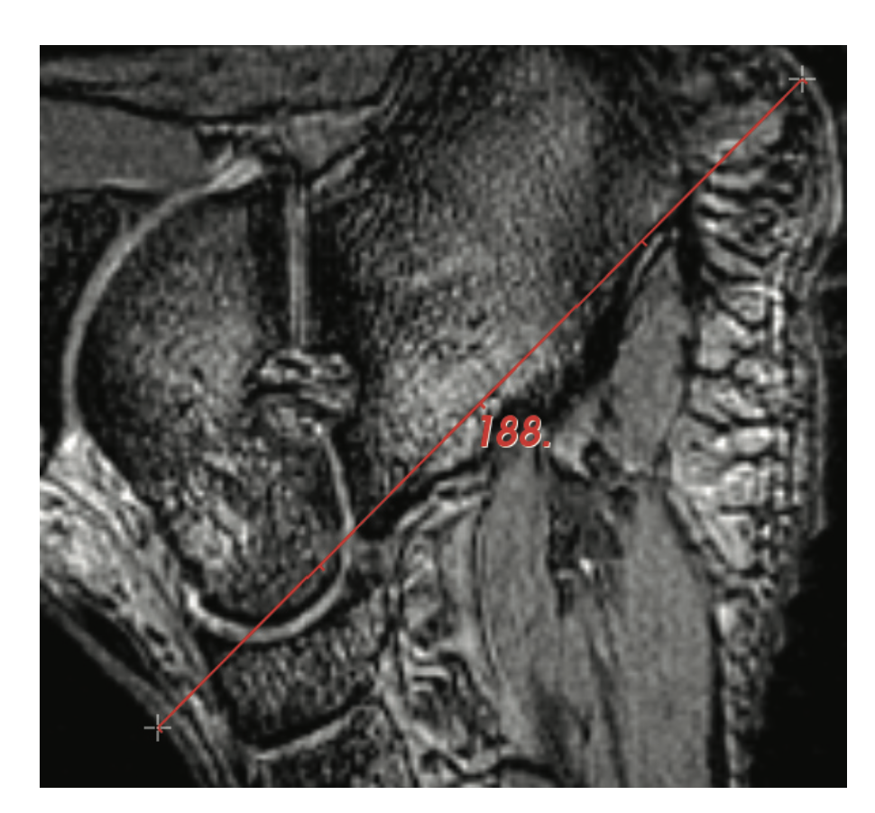

*Measurement Widget*

To use this widget, specify an instance of vtkDistanceWidget and a representation (a subclass of vtkDistanceRepresentation). The widget is implemented using two instances of vtkHandleWidget which are used to position the end points of the line. The representations for these two handle widgets are provided by the vtkDistanceRepresentation. The following is an example of vtkDistanceWidget taken from VTK/Widgets/ Testing/Cxx/TestDistanceWidget.cxx.

```cpp
vtkPointHandleRepresentation2D *handle =
vtkPointHandleRepresentation2D::New();
vtkDistanceRepresentation2D *rep =
vtkDistanceRepresentation2D::New(); vtkDistanceWidget
rep->SetHandleRepresentation(handle);
vtkDistanceWidget *widget = vtkDistanceWidget::New();
widget->SetInteractor(iren);
widget->SetRepresentation(rep);
```

**vtkAngleWidget.** The vtkAngleWidget is used to measure the angle between two rays (defined by three points). The three points (two end points and a center) can be positioned independently in either 2D or 3D. Similar to vtkDistanceWidget, a PlacePointEvent is invoked when one of the handle positions is altered so that you can adjust the position of the point to snap to a grid or to perform other specialized placement options. Also similar to the vtkDistanceWidget, the vtkAngleWidget has two modes of operation. The first is in effect as the angle widget is being defined and the three points are initially placed. After that the widget switches to the manipulation interaction mode, allowing you to adjust the vtkAngleWidget placement of each of the three points defining the angle. To use this widget, specify an instance of vtkAngleWidget and a representation (a subclass of vtkAngleRepresentation). The widget is implemented using three instances of vtkHandleWidget which are used to position the three points. The representations for these handle widgets are provided by the vtkAngleRepresentation.

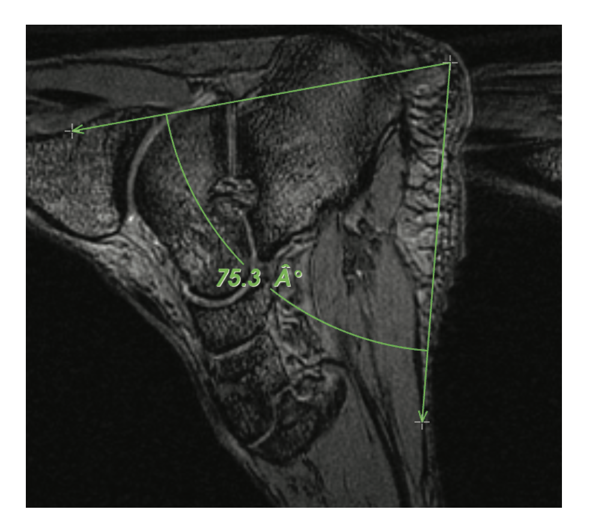

*Angle Widget*

The following is an example of the vtkAngleWidget taken from VTK/Widgets/Testing/Cxx/TestAngleWidget3D.cxx.

```cpp
vtkPointHandleRepresentation3D *handle =
vtkPointHandleRepresentation3D::New();
vtkAngleRepresentation3D *rep = vtkAngleRepresentation3D::New();
rep->SetHandleRepresentation(handle);
vtkAngleWidget *widget = vtkAngleWidget::New();
widget->SetInteractor(iren);
widget->SetRepresentation(rep);
```

Similarly one may instantiate the representation vtkAngleRepresentation2D to measure angles in 2D

```cpp
vtkPointHandleRepresentation2D *handle =
vtkPointHandleRepresentation2D::New();
vtkAngleRepresentation2D *rep = vtkAngleRepresentation2D::New();
rep->SetHandleRepresentation(handle);
widget->SetRepresentation(rep);
```

**vtkBiDimensionalWidget.** The vtkBiDimensionalWidget is used to measure the bidimensional length of an object. The bidimensional measure is defined by two finite, orthogonal lines that intersect within the finite extent of both lines. The lengths of these two lines gives the bidimensional measure. Each line is defined by two handle widgets at the end points of each line.

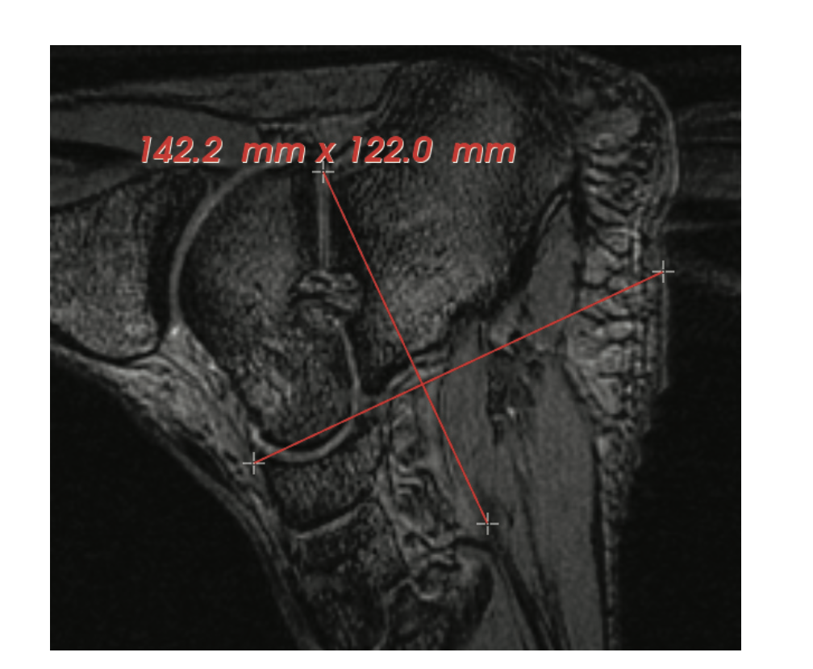

*Bi-dimensional Widget*

The orthogonal constraint on the two lines limits how the four end points can be positioned. The first two points can be placed arbitrarily to define the first line (similar to vtkDistanceWidget). The placement of the third point is limited by the finite extent of the first line. As the third point is placed, the fourth point is placed on the opposite side of the first line. Once the third point is placed, the second line is defined since the fourth point is defined at the same time, but the fourth point can be moved along the second line (i.e., maintaining the orthogonal relationship between the two lines). Once defined, any of the four points can be moved along their constraint line. Also, each line can be translated along the other line (in an orthogonal direction), and the whole bi-dimensional widget can be rotated about its center point. Finally, by selecting the point where the two orthogonal axes intersect the entire widget can be translated in any direction.

Placement of any point results in a special PlacePointEvent invocation so that special operations may be performed to reposition the point. Motion of any point, moving the lines, or rotating the widget cause InteractionEvents to be invoked. Note that the widget has two fundamental modes: a define mode (when initially placing the points) and a manipulate mode (after the points are placed). Line translation and rotation are only possible in manipulate mode.

To use this widget, specify an instance of vtkBiDimensionalWidget and a representation (e.g., vtkBiDimensionalRepresentation2D). The widget is implemented using four instances of vtkHandleWidget which are used to position the end points of the two intersecting lines. The representations for these handle widgets are provided by the vtkBiDimensionalRepresentation2D class. An example taken from VTK/Widgets/TestBiDimensionalWidget.cxx is shown below:

```cpp
vtkBiDimensionalRepresentation2D *rep =
vtkBiDimensionalRepresentation2D::New();
vtkBiDimensionalWidget *widget = vtkBiDimensionalWidget::New();
widget->SetInteractor(iren);
widget->SetRepresentation(rep);
```

### Widgets for probing or manipulating underlying data

**vtkHandleWidget.** The vtkHandleWidget provides a handle that can be interactively positioned in 2D or 3D space. They may also be used as fiducials. Several geometrical representations are provided that enable creation of various shapes in 2D and 3D. The handle can be translated in 2D/3D space with the left mouse button. Dragging it with the shift key depressed constrains its translation along one of the coordinate axes; the axes being determined as the one most aligned with the mouse motion vector. The handle may be resized using the right mouse button. The widget invokes an InteractionEvent during manipulation of the handles and an EndInteractionEvent after vtkHandleWidget interaction, allowing users to respond if necessary.

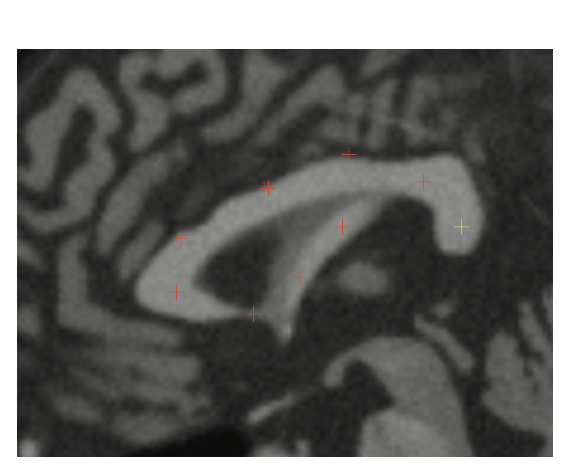

*Handle Widget*

vtkHandleRepresentation is the abstract superclass for the handle's many representations. vtkPointHandleRepresentation3D represents the handle via a 3D cross hair. vtkPointHandleRepresentation2D represents it via a 2D cross hair on the overlay plane. vtkSphereHandleRepresentation represents it via a 3D sphere. vtkPolygonalHandleRepresentation3D allows the users to plug in an instance of vtkPolyData so to render the handle in a user defined shape. The myriad representations allow one to represent the end points of the distance, angle and bidimensional widgets in various shapes. An example:

```cpp
vtkHandleWidget *widget = vtkHandleWidget::New();
vtkPointHandleRepresentation3D *rep =
vtkPointHandleRepresentation3D::New()
widget->SetRepresentation(rep);
```

Constraints on handle placement and movement may be optionally placed via a subclass of vtkPointPlacer. A vtkPolygonalSurfacePointPlacer will restrict the handles to the surfaces of a vtkPolyData. 

```cpp
// Restrict the placement of seeds to the polygonal surface defined by
// “polydata” and rendered as “actor”
vtkPolygonalSurfacePointPlacer * pointPlacer =
vtkPolygonalSurfacePointPlacer::New();
pointPlacer->AddProp(actor);
pointPlacer->GetPolys()->AddItem( polydata );
rep->SetPointPlacer(pointPlacer);
```

Similarly, a vtkTerrainDataPointPlacer may be used to restrict the handles to a height field (a Digital Elevation Map).

```cpp
vtkTerrainDataPointPlacer * placer = vtkTerrainDataPointPlacer::New();
placer->SetHeightOffset( 5.0 );
// height over the terrain to constrain the points to
placer->AddProp( demActor ); // prop representing the DEM.
rep->SetPointPlacer( placer );
```

A vtkImageActorPointPlacer will restrict the handles to an image, represented by an instance of vtkImageActor. Bounds may in addition be placed on this placer to further restrict the points within the image actor via SetBounds.

```cpp
vtkImageActorPointPlacer *placer = vtkImageActorPointPlacer::New();
placer->SetImageActor( imageActor );
```

**vtkLineWidget2.** The class vtkLineWidget2 allows the define and manipulate a finite straight line in 3D space. The line can be picked at its endpoints, (represented by instances of vtkHandleWidget) to orient and stretch the line. It can also be picked anywhere along the line so as to translate it in the scene. Much like vtkHandleWidget, the movement of the endpoints or the center can be constrained to one of the axes by dragging with the shift key depressed. The line can be scaled about its center using the right mouse button. By moving the mouse “up” the render window the line will be made bigger; by moving “down” the render window the line gets smaller. A common use of the line widget is to probe (see Section 5.6) and plot data (see Section 4.8) or produce streamlines (see Section 5.5) or stream surfaces (see Section 5.5). vtkLineRepresentation provides the geometry for the line widget. One may also enable annotation of the length of the line. The widget invokes an InteractionEvent during the manipulation of the line and an EndInteractionEvent after interaction, allowing users to respond if necessary.

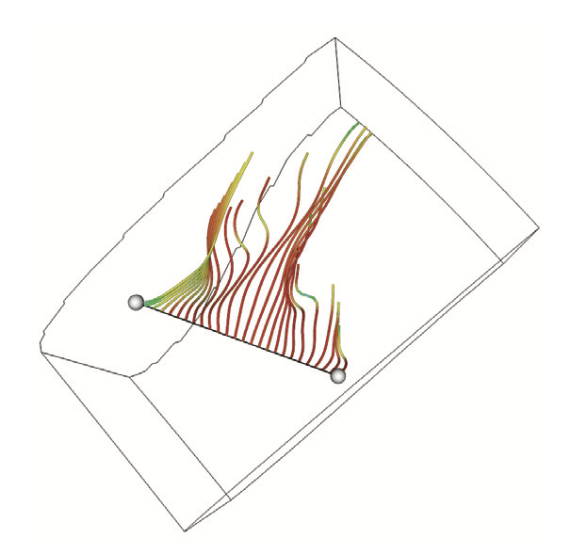

*Line Widget*

Here’s an excerpt from Widgets/Testing/Cxx/TestLineWidget2.cxx.

```cpp
vtkLineRepresentation *rep = vtkLineRepresentation::New();
p[0] = 0.0; p[1] = -1.0; p[2] = 0.0;
rep->SetPoint1WorldPosition(p);
p[0] = 0.0; p[1] = 1.0; p[2] = 0.0;
rep->SetPoint2WorldPosition(p);
rep->PlaceWidget(pl3d->GetOutput()->GetBounds());
rep->GetPolyData(seeds); // used to seed a streamline later
rep->DistanceAnnotationVisibilityOn();
vtkLineWidget2 *lineWidget = vtkLineWidget2::New();
lineWidget->SetInteractor(iren);
lineWidget->SetRepresentation(rep);
lineWidget->AddObserver(vtkCommand::InteractionEvent,myCallback);
```

**vtkPlaneWidget.** This widget can be used to orient and position a finite plane. The plane resolution is variable. The widget produces an implicit function, which may be queried via the GetPlane method and a polygonal output, which may be queried via the GetPolyData methods The plane widget may be used for probing and seeding streamlines. The plane has four handles (at its corner vertices), a normal vector, and the plane itself. By grabbing one of the four handles (use the left mouse button), the plane can be resized. By grabbing the plane itself, the entire plane can be arbitrarily translated. Pressing Control while grabbing the plane will spin the plane around the normal. If you select the normal vector, the plane can be arbitrarily rotated. Selecting any part of the widget with the middle mouse button enables translation of the plane along its normal.


*Plane Widget*

Once selected using middle mouse, moving the mouse in the direction of the normal translates the plane in the direction of the normal; moving in the direction opposite the normal translates the plane in the direction opposite the normal. Scaling (about the center of the plane) is achieved by using the right mouse button, dragging “up” the render window to make the plane bigger; and “down” to make it smaller. The public API of the widget also allows the user to change the property of the plane and the handle. One can also constrain the plane normal to one of the coordinate axes, as is shown in the code snippet below. The widget invokes an InteractionEvent during manipulation and an EndInteractionEvent after interaction. The following excerpt from Widgets/Testing/Cxx/TestPlaneWidget.cxx illustrates the usage of this widget.

```cpp
vtkPlaneWidget *planeWidget = vtkPlaneWidget::New();
planeWidget->SetInteractor(iren);
planeWidget->SetInputData(pl3d->GetOutput());
planeWidget->NormalToXAxisOn();
planeWidget->SetResolution(20);
planeWidget->SetRepresentationToOutline();
planeWidget->PlaceWidget();
planeWidget->AddObserver(vtkCommand::InteractionEvent,myCallback);
```

**vtkImplicitPlaneWidget2.** This widget can be used to orient and position an unbounded plane. An implicit function as well as a polygonal output can be queried from this widget. The widget consists of four parts: 1) a plane contained in a 2) bounding box, with a 3) plane normal, which is rooted at a 4) point on the plane. The widget may be scaled using the right mouse button. The normal can be picked and dragged to orient the plane. The root of the normal can also be translated to change the origin of the normal. The entire widget may be translated using the middle mouse button. The polygonal output is created by clipping the plane with a bounding box. The vtkImplicitPlaneWidget2 widget is often used for cutting and clipping (see Section 5.6). One can change various properties on the plane. The SetTubing can be used to display a tubed outline of the plane. This excerpt from Widgets/Testing/Cxx/ TestImplicitPlaneWidget2.cxx illustrates the use of vtkImplicitPlaneWidget2 along with an instance of vtkImplicitPlaneRepresentation

```cpp
vtkImplicitPlaneRepresentation *rep =
vtkImplicitPlaneRepresentation::New();
rep->SetPlaceFactor(1.25);
rep->PlaceWidget(glyph->GetOutput()->GetBounds());
vtkImplicitPlaneWidget2 *planeWidget = vtkImplicitPlaneWidget2::New();
planeWidget->SetInteractor(iren);
planeWidget->SetRepresentation(rep);
planeWidget->AddObserver(vtkCommand::InteractionEvent,myCallback);
```

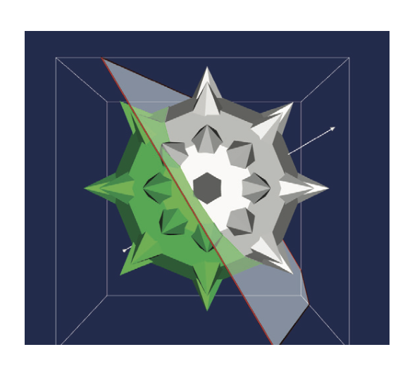

*Plane Widget*

**vtkBoxWidget2.** This widget orients and positions a bounding box. The widget produces an implicit function and a transformation matrix. The widget is used along with an instance of a vtkBoxRepresentation. The representation represents box with seven handles: one on each of the six faces, plus a center handle. The hexahedron has interior face angles of 90 degrees, ie the faces are orthogonal. Each of the 7 handles that can be moused on and manipulated. A bounding box outline is shown, the “faces” of which can be selected for object scaling. During interaction, the corresponding face or the handle becomes highlighted, providing enhanced visual cues. One can use the PlaceWidget() method to initially position the widget. By grabbing the six face handles (using the left mouse button), faces can be moved. By grabbing the center handle (with the left mouse button), the entire hexahedron can be translated. (Translation can also be employed by using the “shift-left-mouse-button” combination inside of the widget.) Scaling is achieved by using the right mouse button; “up” the render window (makes the widget bigger) or “down” the render window (makes the widget smaller). The vtkBoxWidget2 may be used to select, cut, clip, or perform any other operation that depends on an implicit function (use the GetPlanes() method on the representation); or it can be used to transform objects using a linear transformation (use the GetTransform() method on the representation). The widget is also typically used to define a region of interest, which may be used for annotation or for cropping a dataset. The widget invokes a StartInteractionEvent, InteractionEvent, and EndInteractionEvent events before, during and after interaction. One can turn on/off the display of the outline between the handles using the SetOutlineCursorWires in vtkBoxRepresentation. The box widget is used to transform vtkProp3D's and sub-classes (see Section 4.5) or to cut (see Section 5.6) or clip data (see Section 5.6).

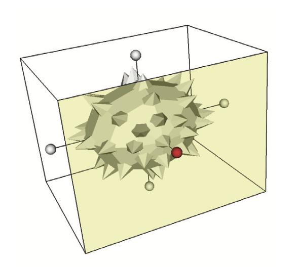

*Box Widget*

This excerpt from VTK/Widgets/Testing/Cxx/BoxWidget2.cxx shows how this widget may be used to transform other props in the scene.

```cpp
// Callback for the interaction
class vtkBWCallback2 : public vtkCommand
{
virtual void Execute(vtkObject *caller, unsigned long, void*)
{
vtkBoxWidget2 *boxWidget = reinterpret_cast<vtkBoxWidget2*>(caller);
vtkBoxRepresentation *boxRep =
reinterpret_cast<vtkBoxRepresentation*>(boxWidget->GetRepresentation());
boxRep->GetTransform(this->Transform);
this->Actor->SetUserTransform(this->Transform);
}
vtkTransform *Transform;
vtkActor *Actor;
};

...

vtkBoxRepresentation *boxRep = vtkBoxRepresentation::New();
boxRep->SetPlaceFactor( 1.25 );
boxRep->PlaceWidget(glyph->GetOutput()->GetBounds());
vtkBoxWidget2 *boxWidget = vtkBoxWidget2::New();
boxWidget->SetRepresentation( boxRep );
boxWidget->AddObserver(vtkCommand::InteractionEvent,myCallback);
vtkTransform *t = vtkTransform::New();
vtkBWCallback2 *myCallback = vtkBWCallback2::New();
myCallback->Transform = t;
myCallback->Actor = maceActor;
```

**vtkAffineWidget.** This widget provides support for interactively defining affine transformations (shear / rotation / scaling / translation). The widget used along with an instance of vtkAffineRepresentation. vtkAffineRepresentation2D is a concrete subclass of vtkAffineRepresentation to represent affine transformations in 2D. This representation's geometry consists of three parts: a box, a circle, and a cross. The box is used for scaling and shearing. The left mouse button can be used to stretch the box along one of the axes by clicking on the edges, or to stretch along both axes by picking the corner. The circle is used for rotation. The central cross may be picked to achieve translation. During manipulation of the box, circle and cross respectively, the scale, angle or translation component of the affine transform can optionally displayed as accompanying annotation. All the geometry is drawn on the overlay plane by vtkAffineRepresentation maintaining a constant size (width and height) specified in terms of normalized viewport coordinates. The representation maintains a transformation matrix, which may be queried by users using the GetTransform() method, so as to apply transformations to underlying props or datasets. The transformations generated by this widget assume that the representation lies in the x-y plane. If this is not the case, the user is responsible for transforming this representation's matrix into the correct coordinate space (by judicious matrix multiplication). Note that the transformation matrix returned by GetTransform() is relative to the last PlaceWidget() invocation. (The PlaceWidget() method sets the origin around which rotation and scaling occurs the origin is the center point of the bounding box provided.). VTK/Widgets/Testing/Cxx/TestAffineWidget.cxx shows how the affine widget may be used to apply a transform to the underlying image. The widget invokes an InteractionEvent during interaction and an EndInteractionEvent after interaction.

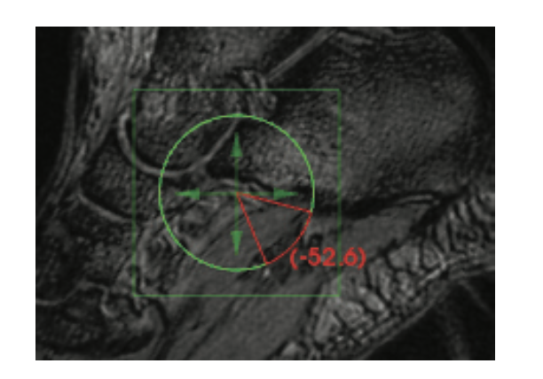

*Affine Widget*


```cpp
class vtkAffineCallback : public vtkCommand
{
virtual void Execute(vtkObject *caller, unsigned long, void*)
{
this->AffineRep->GetTransform(this->Transform);
this->ImageActor->SetUserTransform(this->Transform);
}
vtkImageActor *ImageActor;
vtkAffineRepresentation2D *AffineRep;
vtkTransform *Transform;
};
vtkAffineRepresentation2D *rep = vtkAffineRepresentation2D::New();
rep->SetBoxWidth(100);
rep->SetCircleWidth(75);
rep->SetAxesWidth(60);
rep->DisplayTextOn();
rep->PlaceWidget(bounds);
vtkAffineWidget *widget = vtkAffineWidget::New();
widget->SetInteractor(iren);
widget->SetRepresentation(rep);
vtkAffineCallback *acbk = vtkAffineCallback::New();
acbk->AffineRep = rep;
acbk->ImageActor = imageActor;
widget->AddObserver(vtkCommand::InteractionEvent,acbk);
widget->AddObserver(vtkCommand::EndInteractionEvent,acbk);
```

**vtkParallelopipedWidget** A vtkParallelopipedWidget can be used interactively manipulate a parallelopiped in 3D. It is meant to be used along with an instance of vtkParallelopipedRepresentation. The parallelopiped is represented by 8 handles and 6 faces. The handles can be picked and dragged so as to manipulate the parallelopiped. The handles are instances of vtkHandleWidget, represented as spheres (vtkSphereHandleRepresentation). Left clicking on a handle and dragging it moves the handle in space, the handles along faces shared by this handle may also move so as to maintain topology as a parallelopiped. Dragging a handle with the shift button pressed resizes the parallelopiped along an axis.The parallelopiped widget also has a special mode, designed for probing the underlying data and displaying a cut through it. By ctrl-left-click on a handle, it buckles inwards to carve a “chair” out of the parallelopiped. In this mode, the parallelopiped has 14 handles and 9 faces. These handles can again be picked to manipulate the parallelopiped or the depression of the chair. The following excerpt from VTK/Widgets/Testing/Cxx/TestParallelopipedWidget.cxx illustrates the use of the vtkParallelopipedWidget.

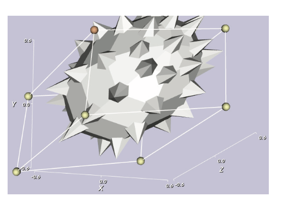

*Parallelopiped Widget*


```cpp
vtkParallelopipedWidget *widget = vtkParallelopipedWidget::New();
vtkParallelopipedRepresentation *rep =
vtkParallelopipedRepresentation::New();
widget->SetRepresentation(rep);
widget->SetInteractor( iren );
rep->SetPlaceFactor( 0.5 );
rep->PlaceWidget(parallelopipedPts);
```

**vtkImagePlaneWidget.** This widget defines a plane in a 3D scene to reslice image volumes interactively. The plane orientation may be interactively defined. Additional functionality includes the ability to window-level the resliced data and defining the degree of interpolation while reslicing. Internally, the widget contains an instance of vtkImageReslice. This slices through the underlying volumetric image data based on the defined plane. The output of this class is texture mapped onto the plane, creating an “image plane widget”. Selecting the widget with the middle mouse button with and without holding the shift or control keys enables complex reslicing capabilities. A set of ‘margins’ (left, right, top, bottom) are shown as a set of plane-axes aligned lines. Without keyboard modifiers: selecting towards the middle of the plane margins enables translation of the plane along its normal. Selecting one of the corners within the margins enables spinning around the plane’s normal at its center. Selecting within a margin allows rotating about the center of the plane around an axis aligned with the margin (i.e., selecting the left margin enables rotation around the plane’s local y-prime axis). With the control key modifier: margin selection enables edge translation (i.e., a constrained form of scaling). Selecting within the margins enables translation of the entire plane. With shift key modifier: uniform plane scaling is enabled. Moving the mouse up enlarges the plane while downward movement shrinks it. When selected the plane outline is highlighted to provide visual cues.

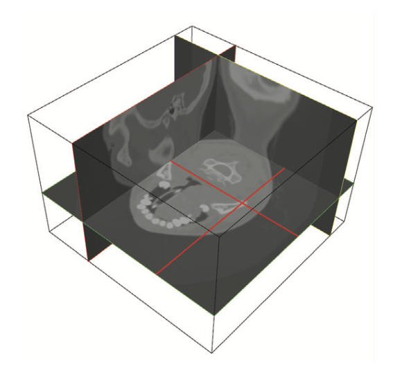

*Image Plane Widget*

Window-level is achieved by using the right mouse button. Window-level values can be reset by shift + 'r' or control + 'r'. One can reset the camera by pressing 'r' or 'R'. The left mouse button can be used to query the underlying image data with a snap-to cross-hair cursor. The nearest point in the input image data to the mouse cursor generates the cross-hairs. With oblique slicing, this behavior may appear unsatisfactory. Text annotations display the window-level and image coordinates/data values. The text annotation may be toggled on and off with SetDisplayText. The widget invokes a StartInteractionEvent, InteractionEvent and EndInteractionEvent at the beginning, during and end of an interaction. The events StartWindowLevelEvent, WindowLevelEvent, EndWindowLevelEvent and ResetWindowLevelEvent are invoked during their corresponding actions. The 

The vtkImagePlaneWidget has several methods that can be used in conjunction with other VTK objects. The GetPolyData() method can be used to get the polygonal representation of the plane and can be used as input for other VTK objects. Some additional features of this class include the ability to control the properties of the widget. You can set the properties of: the selected and unselected representations of the plane's outline; the text actor via its vtkTextProperty; the cross-hair cursor. In addition there are methods to constrain the plane so that it is aligned along the x-y-z axes. Finally, one can specify the degree of interpolation used for reslicing the data: nearest neighbor, linear, and cubic. One can also choose between voxel centered or continuous cursor probing. With voxel centered probing, the cursor snaps to the nearest voxel and the reported cursor coordinates are extent based. With continuous probing, voxel data is interpolated using vtkDataSetAttributes' InterpolatePoint method and the reported coordinates are 3D spatial continuous. VTK/Widgets/Testing/Cxx/ImagePlaneWidget.cxx uses vtkImagePlaneWidget to interactively display axial, coronal and sagittal slices in a 3D volume. The following excerpt illustrates the usage of this widget.

```cpp
vtkImagePlaneWidget* planeWidgetX = vtkImagePlaneWidget::New();
planeWidgetX->SetInteractor( iren);
planeWidgetX->SetKeyPressActivationValue('x');
planeWidgetX->SetPicker(picker);
planeWidgetX->RestrictPlaneToVolumeOn();
planeWidgetX->GetPlaneProperty()->SetColor(1,0,0);
planeWidgetX->SetTexturePlaneProperty(ipwProp);
planeWidgetX->TextureInterpolateOff();
planeWidgetX->SetResliceInterpolateToNearestNeighbour();
planeWidgetX->SetInputData(v16->GetOutput());
planeWidgetX->SetPlaneOrientationToXAxes();
planeWidgetX->SetSliceIndex(32);
planeWidgetX->DisplayTextOn();
planeWidgetX->On();
```

**vtkTensorProbeWidget.** This widget can be used to probe tensors along a trajectory. The trajectory is represented via a polyline (vtkPolyLine). The class is intended to be used with an instance of vtkTensorProbeRepresentation. The representation class is also responsible for rendering the tensors. vtkEllipsoidTensorProbeRepresentation renders the tensors as ellipsoids. The orientation and radii of the ellipsoids illustrate the major, medium, and minor eigenvalues/eigenvectors of the tensors.

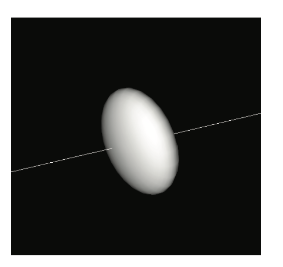

*Tensor Probe Widget*

The interactions of the widget are controlled by the left mouse button. A left click on the tensor selects it. It can dragged around the trajectory to probe the tensors on it. The following is an example taken from Widgets/Testing/ vtkTensorProbeWidget Cxx/TestTensorProbeWidget.cxx.

```cpp
vtkTensorProbeWidget *w = vtkTensorProbeWidget::New();
w->SetInteractor(iren);
vtkTensorProbeRepresentation * rep =
vtkTensorProbeRepresentation::SafeDownCast(w->GetRepresentation());
rep->SetTrajectory(pd);
```

### Annotation widgets

**vtkScalarBarWidget.** This class provides support for interactively manipulating the position, size, and orientation of a scalar bar. This widget is typically used to display a color legend in the scene. The legend is displayed in the overlay plane. vtkScalarBarWidget is meant to be used in conjunction with an instance of vtkScalarBarRepresentation. The widget allows the scalar bar to be resized, repositioned or reoriented. If the cursor is over an edge or a corner of the scalar bar it will change the cursor shape to a resize edge / corner shape. A drag with the left button then resizes the scalar bar. Similarly, if the cursor is within the scalar bar, it changes shape to indicate that it can be translated. The scalar bar can also be repositioned by pressing the middle mouse button. If the position of a scalar bar is moved to be close to the center of one of the four edges of the viewport, then the scalar bar will change its orientation to align with that edge. This orientation is sticky in that it will stay that orientation until the position is moved close to another edge. The orientation may also be programmatically specified. The scalar bar itself text annotations can be queried or specified by retrieving or setting the scalar bar from the widget or the representation. One can then set the lookuptable or properties such as text annotations. One can also disable resizing by setting the SetResizable() method in the widget. Similarly one can disable repositioning using the SetSelectable() flag in the widget. This excerpt from VTK/Widgets/Testing/ Cxx/TestScalarBarWidget.cxx illustrates its usage.

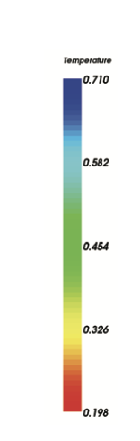

*Scalar Bar Widget*

```cpp
vtkScalarBarWidget *scalarWidget = vtkScalarBarWidget::New();
scalarWidget->SetInteractor(iren);
scalarWidget->GetScalarBarActor()->SetTitle("Temperature");
scalarWidget->GetScalarBarActor()->
SetLookupTable(outlineMapper->GetLookupTable());
```

**vtkCaptionWidget.** This widget provides support for interactively placing a textual caption on the 2D overlay plane, along with a leader (e.g., arrow) that points from the text to the point in the scene to be annotated. The caption is represented by a vtkCaptionRepresentation. One can interactively anchor the placement of the leader. The widget-representation internally contains an instance of vtkCaptionActor2D to display the caption. One can set the caption actor directly on the widget. The caption box automatically adjusts itself to fit the text based on its font size, justification and other text properties. The widget invokes a StartInteractionEvent, InteractionEvent and EndInteractionEvent at the beginning, during and end of an interaction. When the caption text is selected, the widget emits a ActivateEvent that observers can watch for. This is useful for opening GUI dialogs to adjust font characteristics, etc. The following excerpt from VTK/Widgets/ Testing/Cxx/TestCaptionWidget.cxx shows how this widget is used to annotate a scene.

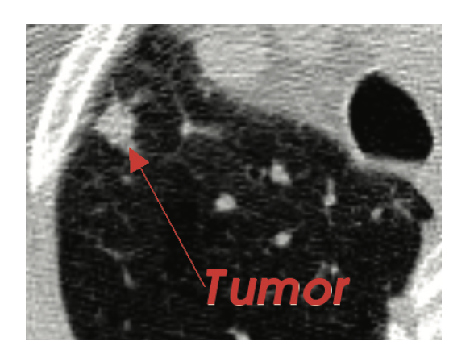

*Caption Widget*

```cpp
// Create the widget
vtkCaptionActor2D *rep = vtkCaptionActor2D::New();
rep->SetCaption("This is a test\nAnd it has two lines");
rep->GetTextActor()->GetTextProperty()->
SetJustificationToCentered();
rep->GetTextActor()->GetTextProperty()->
SetVerticalJustificationToCentered();
vtkCaptionWidget *widget = vtkCaptionWidget::New();
widget->SetInteractor(iren);
widget->SetCaptionActor2D(rep);
```

**vtkOrientationMarkerWidget.** The vtkOrientationMarkerWidget provides support for interactively manipulating the position, size, and orientation of a prop representing an orientation marker. The input orientation marker is rendered as an overlay on the parent renderer, thus it appears superposed over all provided props in the parent’s scene. The camera view of the orientation marker is made to match that of the parent, so that it matches the scene’s orientation. This class maintains its own renderer which is added to the parent render window on a different layer. The camera view of the orientation marker is made to match that of the parent by means of a command-observer mechanism. This gives the illusion that the marker’s orientation reflects that of the prop(s) in the parent’s scene.

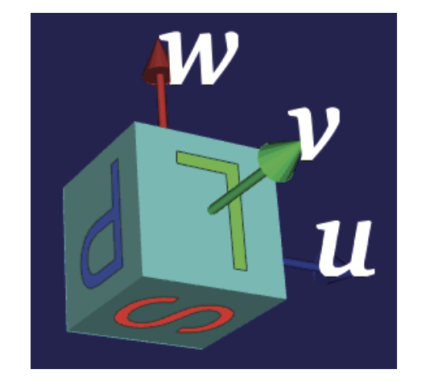

*Orientation Marker Widget*

The widget listens to left mouse button and mouse movement events. It will change the cursor shape based on its location. If the cursor is over the overlay renderer, it will change the cursor shape to a SIZEALL shape. With a click followed by a drag, the orientation marker can be translated, (along with the overlay viewport). If the mouse cursor is near a corner, the cursor changes to a resize corner shape (e.g., SIZENW). With a click and a drag, the viewport, along with the orientation marker it contains is resized. The aspect ratio is maintained after releasing the left mouse button, to enforce the overlay renderer to be square, by making both sides equal to the minimum edge size. The widget also highlights itself when the mouse cursor is over it, by displaying an outline of the orientation marker. The widget requires an instance of an orientation marker prop to be set. The marker prop itself can be any subclass of vtkProp. Specifically, vtkAxesActor and vtkAnnotatedCubeActor are two classes that are designed to serve as orientation props. The former provides annotation in the form of annotated XYZ axes. The latter appears as a cube, with the 6 faces annotated with textures created from user specified text. A composite orientation marker can also be generated by adding instances of vtkAxesActor and vtkAnnotatedCubeActor to a vtkPropAssembly, which can then be set as the input orientation marker. The widget can be also be set up programmatically, in a non-interactive fashion by setting Interactive to Off and sizing/placing the overlay renderer in its parent viewport by calling the widget's SetViewport method. The following illustrates a typical usage; for a more complex use case see VTK/Widgets/Testing/Cxx/TestOrientationMarkerWidget.cxx.

```cpp
vtkAnnotatedCubeActor* cube = vtkAnnotatedCubeActor::New();
cube->SetXPlusFaceText ( "A" );
cube->SetXMinusFaceText( "P" );
cube->SetYPlusFaceText ( "L" );
cube->SetYMinusFaceText( "R" );
cube->SetZPlusFaceText ( "S" );
cube->SetZMinusFaceText( "I" );
cube->SetFaceTextScale( 0.666667 );
cube->SetFaceTextScale( 0.65 );
property = cube->GetCubeProperty();
property->SetColor( 0.5, 1, 1 );
property = cube->GetTextEdgesProperty();
property->SetLineWidth( 1 );
property->SetDiffuse( 0 );
property->SetAmbient( 1 );
property->SetColor( 0.1800, 0.2800, 0.2300 );

// this static function improves the appearance of the text edges
// since they are overlaid on a surface rendering of the cube's faces
vtkMapper::SetResolveCoincidentTopologyToPolygonOffset();

vtkOrientationMarkerWidget* widget = vtkOrientationMarkerWidget::New();
widget->SetOutlineColor( 0.9300, 0.5700, 0.1300 );
widget->SetOrientationMarker( cube );
widget->SetInteractor( iren );
widget->SetViewport( 0.0, 0.0, 0.4, 0.4 );
widget->SetEnabled( 1 );
```

**vtkBalloonWidget.** This widget is used to popup annotations when the mouse hovers over an actor for a specified time. The annotation may be text and/or an images annotation when the mouse hovers over an actor for a specified time. The widget keeps track of user chosen props by associating an instance of a vtkProp with an instance of a “balloon”. The balloon encapsulates annotations (text and/or images). The balloon is brought up with user specified properties near the vtkProp when the mouse cursor hovers over it for a specified delay. An instance of vtkBalloonRepresentation is used to draw the balloon. To use this widget, first specify an instance of vtkBalloonWidget and the representation. Then list all instances of vtkProp, a text string, and/or an instance of vtkImageData to be associated with each vtkProp. (Note that you can specify both text and an image, or just one or the other.) You may also wish to specify the hover delay. The widget invokes a WidgetActivateEvent before a balloon pops up, that observers can watch for. VTK/Widgets/Testing/Cxx/TestBalloonWidget.cxx illustrates a typical usage.

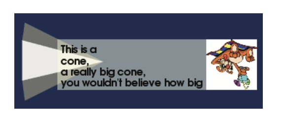

*Balloon Widget*

```cpp
class vtkBalloonCallback : public vtkCommand
{
virtual void Execute(vtkObject *caller, unsigned long, void*)
{
vtkBalloonWidget *balloonWidget =
reinterpret_cast<vtkBalloonWidget*>(caller);
if ( balloonWidget->GetCurrentProp() != nullptr )
{
std::cout << "Prop selected\n";
}
}
};

...

vtkBalloonRepresentation *rep = vtkBalloonRepresentation::New();
rep->SetBalloonLayoutToImageRight();
vtkBalloonWidget *widget = vtkBalloonWidget::New();
widget->SetInteractor(iren);
widget->SetRepresentation(rep);
widget->SetTimerDuration( 3000 ); // hover delay in ms.
widget->AddBalloon(sph,"This is a sphere",nullptr);
widget->AddBalloon(cyl,"This is a\ncylinder",image1->GetOutput());
widget->AddBalloon(cone,"This is a\ncone,\na really big cone,\nyou
wouldn't believe how big",image1->GetOutput());
vtkBalloonCallback *cbk = vtkBalloonCallback::New();
widget->AddObserver(vtkCommand::WidgetActivateEvent,cbk);
```

**vtkTextWidget.** This class provides support for interactively placing text on the 2D overlay plane. The text is defined by an instance of vtkTextActor. It derives from vtkBorderWidget and inherits its border selection and resizing capabilities. The text border may be selected with the left mouse button. A click and a drag resizes the border along a particular direction, determined by the corner or face along which the text boundary is selected. The text along with its boundary may also be translated using the selecting the text box near the center. One can disable resizing and moving by turning the Selectable flag on the widget. In addition, when the text is selected, the widget emits a WidgetActivateEvent that observers can watch for. This is useful for opening GUI dialogues to adjust font characteristics, etc. The widget also invokes a StartInteractionEvent, an InteractionEvent and an EndInteractionEvent prior to, during and after user interaction with the widget

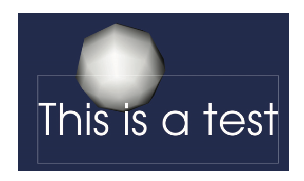

*Text Widget*

One can retrieve the text property (vtkTextProperty) from the text actor managed by the widget to change the properties of the text (font, font size, justification etc.). The following excerpt from VTK/Widgets/Testing/Cxx/TestTextWidget.cxx illustrates this widget’s usage.

```cpp
vtkTextActor *ta = vtkTextActor::New();
ta->SetInput("This is a test");
vtkTextWidget *widget = vtkTextWidget::New();
widget->SetInteractor(iren);
widget->SetTextActor(ta);
widget->SelectableOff();
```

### Segmentation / Registration widgets

**vtkContourWidget.** The contour widget is a very flexible class which may be used to draw closed or open contours by interactively defining a set of control points. The widget has two modes. When enabled, one enters a “define” mode through which the user can place control points in succession by clicking the left mouse button. A contour is drawn passing through the nodes and interpolated between the nodes according to some interpolation kernel. After the user has placed the points, he presses the right mouse button. This takes the widget into a “manipulate” mode. The widget may also enter the “manipulate” mode if the user closes the contour by clicking near the first control point. In this mode, the user can interactively manipulate the contour. Mousing over a control point will highlight the control point; users can click on a control point and move it around. This moves the node and its associated lines, satisfying the constraint imposed by the interpolator. Clicking on the contour (but not on the node), adds a node at that point. That node may be further manipulated. Mousing over a node and hitting the “Delete” or “Backspace” key removes the node and re-interpolates the lines with the remaining nodes. 

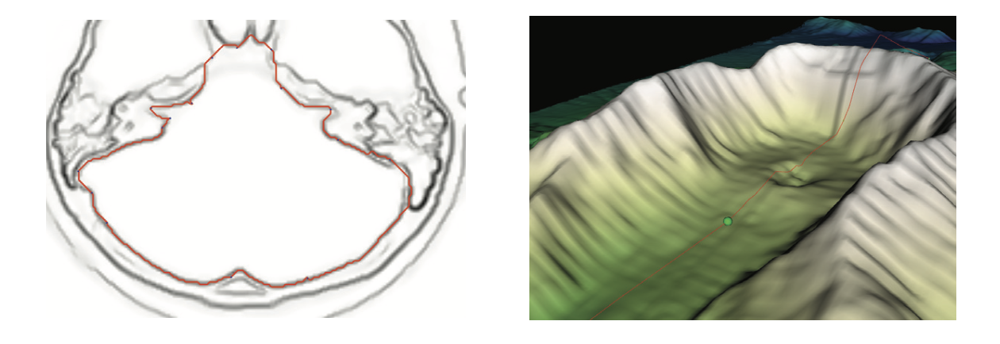

*Contour Widget*

The contour widget is designed to work with a subclass of vtkContourRepresentation. Several representations are provided. Two important ancillary classes used by the contour widget are the “vtkContourLineInterpolator” and “vtkPointPlacer”. The class vtkContourLineInterpolator is an abstract class that enables the user to specify the interpolation used to define curves between nodes. The class vtkPointPlacer allows the user to impose constraints on the placement of the control points. Several point placers and interpolators are provided. For instance, the class vtkBezierContourLineInterpolator, constrains the interpolation between nodes to be a bezier curve.

```cpp
vtkOrientedGlyphContourRepresentation *contourRep =
vtkOrientedGlyphContourRepresentation::New();
vtkContourWidget *contourWidget = vtkContourWidget::New();
contourWidget->SetInteractor(iren);
contourWidget->SetRepresentation(contourRep);
vtkBezierContourLineInterpolator * interpolator =
vtkBezierContourLineInterpolator::New();
contourRep->SetLineInterpolator(interpolator);
contourWidget->SetEnabled(1);
```

A user can draw contours on polygonal surfaces using vtkPolygonalSurfaceContourLineInterpolator. This interpolator places its lines on the surface of a specified vtkPolyData. It is meant to be used in conjunction with a vtkPolygonalSurfacePointPlacer. This placer constrains the placement of control point nodes on the surface of the polydata. The interpolator internally uses a Dijkstra single source shortest path algorithm to compute the shortest path from one control point to the next. The costs for the paths are determined by the edge lengths in the mesh. The resulting path traverses along the edges of the mesh from one node to the next. This example from VTK/Widgets/Testing/Cxx/TestDijkstraGraphGeodesicPath.cxx illustrates its usage.

```cpp
vtkContourWidget *contourWidget = vtkContourWidget::New();
contourWidget->SetInteractor(iren);
vtkOrientedGlyphContourRepresentation *rep =
vtkOrientedGlyphContourRepresentation::SafeDownCast(
contourWidget->GetRepresentation());
vtkPolygonalSurfacePointPlacer * pointPlacer
= vtkPolygonalSurfacePointPlacer::New();
pointPlacer->AddProp(demActor);
pointPlacer->GetPolys()->AddItem( pd );
rep->SetPointPlacer(pointPlacer);
vtkPolygonalSurfaceContourLineInterpolator * interpolator =
vtkPolygonalSurfaceContourLineInterpolator::New();
interpolator->GetPolys()->AddItem( pd );
rep->SetLineInterpolator(interpolator);
```

Using vtkTerrainContourLineInterpolator, one can draw contours on height fields, such as Digital Elevation Maps vtkTerrainContourLineInterpolator. This interpolator constrains the lines between control points to lie on the surface of the height field. One can also specify an offset for the lines, by using the SetHeightOffset method on the interpolator. The class internally uses a vtkProjectedTerrainPath to project a polyline on the surface. Various projection modes may be specified on the projector. This interpolator is meant to be used in conjunction with a vtkTerrainDataPointPlacer, which constrains the control point nodes to lie on the surface of the terrain. The following code snippet, from VTK/Widgets/Testing/Cxx/TerrainPolylineEditor.cxx illustrates how one may use this interpolator and point placer.

```cpp
vtkContourWidget *contourWidget = vtkContourWidget::New();
vtkOrientedGlyphContourRepresentation *rep =
vtkOrientedGlyphContourRepresentation::SafeDownCast(
contourWidget->GetRepresentation());
vtkTerrainDataPointPlacer * pointPlacer =
vtkTerrainDataPointPlacer::New();
pointPlacer->AddProp(demActor); // the actor(s) containing the terrain
rep->SetPointPlacer(pointPlacer);
// Set a terrain interpolator. Interpolates points as they are placed,
// so that they lie on the terrain.
vtkTerrainContourLineInterpolator *interpolator =
vtkTerrainContourLineInterpolator::New();
rep->SetLineInterpolator(interpolator);
interpolator->SetImageData(demReader->GetOutput());
// Set the default projection mode to hug the terrain, unless user
// overrides it.
interpolator->GetProjector()->SetProjectionModeToHug();
interpolator->GetProjector()->SetHeightOffset(20.0);
pointPlacer->SetHeightOffset(20.0);
```

Of particular interest is the “live wire” interpolator (vtkDijkstraImageContourLineInterpolator) where the lines between the control points are interpolated based on the shortest path through the gradient cost function computed on the image, resulting in the contours being attracted to the edges of the image. As the control points are moved around, a new shortest path is computed. This is ideal for interactive segmentation of organs, etc. This interpolator internally uses a vtkDijkstraImageGeodesicPath, which generates a single source shortest path through a cost function image by treating it as a graph with VTK_PIXEL cells. The user is free to plug in the cost function. A typical cost function for a gray scale image might be generated by the following pipeline:
```
Image --> vtkImageGradientMagnitude --> vtkImageShiftScale
```
The gradient magnitude image is inverted, so that strong edges have low cost value. Costs in moving from one vertex to another are calculated using a weighted additive scheme. One can set the edge length weight, the curvature weight and the weight associated with the normalized image cost. These affect the computed cost function used to determine the shortest path. The contours are meant to be placed on an image actor, hence the class vtkImageActorPointPlacer is used. This restricts the placement of control point nodes to the plane containing the image. The following code snippet from VTK/ Widgets/Testing/Cxx/TestDijkstraImageGeodesicPath.cxx illustrates its usage.

```cpp
vtkOrientedGlyphContourRepresentation *rep =
vtkOrientedGlyphContourRepresentation::New();
vtkImageActorPointPlacer *placer = vtkImageActorPointPlacer::New();
placer->SetImageActor( actor );
rep->SetPointPlacer( placer );
vtkDijkstraImageContourLineInterpolator *interpolator =
vtkDijkstraImageContourLineInterpolator::New();
interpolator->SetCostImage( gradInvert->GetOutput() );
rep->SetLineInterpolator( interpolator );
vtkDijkstraImageGeodesicPath* path =
interpolator->GetDijkstraImageGeodesicPath();
path->StopWhenEndReachedOn();
// prevent contour segments from overlapping
path->RepelPathFromVerticesOn();
// weights are scaled from 0 to 1 as are associated cost components
path->SetCurvatureWeight( 0.15 );
path->SetEdgeLengthWeight( 0.8 );
path->SetImageWeight( 1.0 );
```

**vtkImageTracerWidget.** This widget provides support to trace free form contours through a planar surface (i.e., manually tracing over image data). The user can click the left button over the image, hold and drag to draw a freehand line. Clicking the left button and releasing erases the widget line, if it exists, and repositions the first handle. A middle button click starts a snap drawn line. The line can be terminated by clicking the middle button while depressing the ctrl key. The contour loop being traced will be automatically closed when the user clicks the last cursor position within a specified tolerance to the first handle. The user can drag a handle (and its associated line segments) by clicking the right button on any handle that is part of a snap drawn line. If the path is open and the flag AutoClose is set to On, the path can be closed by repositioning the first and last points over one another. A handle can be erased by pressing the ctrl key along with the right button on the handle. Again, the snap drawn line segments are updated. If the line was formed by continuous tracing, the line is deleted leaving one handle. A handle can be inserted by pressing the shift key and the right button on any snap drawn line segment. This will insert a handle at the cursor position. The line segment is split accordingly on either side of the cursor. One can disable interaction on the widget by using the SetInteraction method.

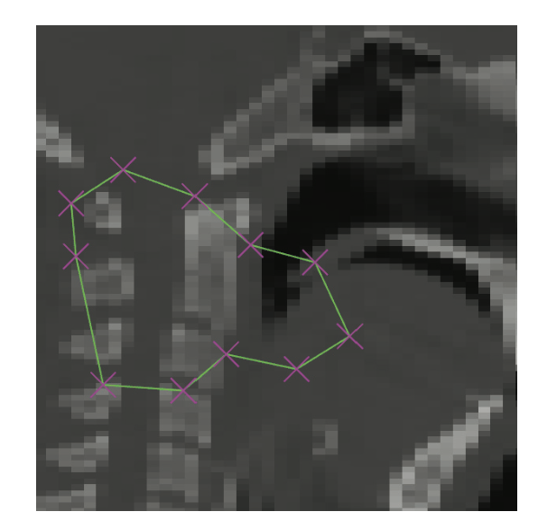

*Image Tracer Widget*

Since the widget exists on a plane, (the handles, etc. are 2D glyphs), one must specify the plane on which the widget lies. This is done by specifying the projection normal vector, via SetProjectionNormal and the plane's position via SetProjectionPosition. In the excerpt below, the projection normal is set to the X axis. The user can force snapping to the image data while tracing by using the flag SnapToImage. The user can change the handle and line properties, using the methods SetHandleProperty and SetLineProperty, or the SetSelectedHandleProperty and SetSelectedLineProperty. The widget invokes InteractionEvent and EndInteractionEvents. At this point, the current path may be retrieved as a polydata via the GetPath method, so that segmentation etc may be performed on the underlying image. The widget can also be initialized from a user specified set of control points, by using the method InitializeHandles. This takes a pointer to a vtkPoints instance, containing the list of points. VTK/Widgets/Testing/Cxx/TestImageTracerWidget.cxx illustrates how one may use the vtkImageTracerWidget and a vtkSplineWidget to segment images. The following is an excerpt.

```cpp
vtkImageTracerWidget* imageTracerWidget = vtkImageTracerWidget::New();
imageTracerWidget->SetDefaultRenderer(ren1);
imageTracerWidget->SetCaptureRadius(1.5);
imageTracerWidget->GetGlyphSource()->SetColor(1, 0, 0);
imageTracerWidget->GetGlyphSource()->SetScale(3.0);
imageTracerWidget->GetGlyphSource()->SetRotationAngle(45.0);
imageTracerWidget->GetGlyphSource()->Modified();
imageTracerWidget->ProjectToPlaneOn();
imageTracerWidget->SetProjectionNormalToXAxes();
imageTracerWidget->SetProjectionPosition(imageActor1->
GetBounds()[0]);
imageTracerWidget->SetViewProp(imageActor1);
imageTracerWidget->SetInputData(shifter->GetOutput());
imageTracerWidget->SetInteractor(iren);
imageTracerWidget->PlaceWidget();
imageTracerWidget->SnapToImageOff();
imageTracerWidget->AutoCloseOn();
```

**vtkSplineWidget.** This is another widget that can be used to trace contours using a spline kernel. The widget predates the rearchitecturing efforts that culminated in vtkContourWidget. It derives from vtk3DWidget. The spline has handles, the number of which can be changed, plus it can be picked on the spline itself to translate or rotate it in the scene. The widget responds to the following keyboard and mouse modifiers. 1) left button down on and drag one of the spherical handles to change the shape of the spline: the handles act as “control points”. 2) left button or middle button down on a line segment forming the spline allows uniform translation of the widget. 3) ctrl + middle button down on the widget enables spinning of the widget about its center. 4) right button down on the widget enables scaling of the widget. By moving the mouse “up” the render window the spline will be made bigger; by moving “down” the render window the widget will be made smaller. 5) ctrl key + right button down on any handle will erase it providing there will be two or more points remaining to form a spline. 6) shift key + right button down on any line segment will insert a handle onto the spline at the cursor position.

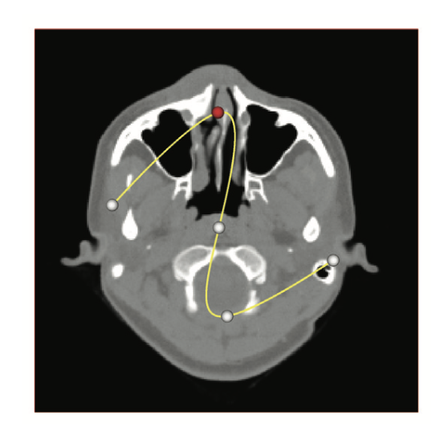

*Spline Widget*

The vtkSplineWidget has several methods that can be used in conjunction with other VTK objects. The Set/GetResolution() methods control the number of subdivisions of the spline. The GetPolyData() method can be used to get the polygonal representation and for things like seeding streamlines or probing other datasets. Typically the widget is used to make use of the StartInteractionEvent, InteractionEvent, and EndInteractionEvent events. The InteractionEvent is called on mouse motion, the other two events are called on button down and button up (either left or right button). Some additional features of this class include the ability to control the properties of the widget. You can set the properties of the selected and unselected representations of the spline. For example, you can set the property for the handles and spline. In addition there are methods to constrain the spline so that it is aligned with a plane. As with vtkImageTracerWidget, one can specify the plane on which the widget lies. This is done by specifying the projection normal vector, via SetProjectionNormal and the plane's position via SetProjectionPosition. The GetSummedLength returns the approximate arc length of the spline by summing the line segments making up the spline. The SetClosed method can be used to close the spline loop. Using the SetParametricSpline method, one can also set the parametric spline object. Through vtkParametricSpline's API, the user can supply and configure one of currently two types of spline: vtkCardinalSpline or vtkKochanekSpline. The widget controls the open or closed configuration of the spline. The following excerpt from VTK/Widgets/Testing/Cxx/TestSplineWidget.cxx illustrates the usage of this widget.

```cpp
vtkSplineWidget* spline = vtkSplineWidget::New();
spline->SetInputData(v16->GetOutput());
spline->SetPriority(1.0);
spline->KeyPressActivationOff();
spline->PlaceWidget();
spline->ProjectToPlaneOn();
spline->SetProjectionNormal(0);
spline->SetProjectionPosition(102.4); //initial plane position
spline->SetProjectionNormal(3); //allow oblique orientations
spline->SetPlaneSource(
static_cast<vtkPlaneSource*>(ipw->GetPolyDataAlgorithm()));

// Specify the type of spline (change from default vtkCardinalSpline)
vtkKochanekSpline* xspline = vtkKochanekSpline::New();
vtkKochanekSpline* yspline = vtkKochanekSpline::New();
vtkKochanekSpline* zspline = vtkKochanekSpline::New();

vtkParametricSpline* para = spline->GetParametricSpline();
para->SetXSpline(xspline);
para->SetYSpline(yspline);
para->SetZSpline(zspline);

vtkPolyData* poly = vtkPolyData::New();
spline->GetPolyData(poly);
```

**vtkCheckerboardWidget.** The checkerboard widget is used to interactively control a checkerboard through an image actor displaying two images. This is useful in evaluating the quality of an image registration. The user can adjust the number of checkerboard divisions in each of the i-j directions in a 2D image. The widget is meant to be used in conjunction with a vtkCheckerboardRepresentation. When enabled, a frame appears around the vtkImageActor with sliders along each side of the frame. A total of 4 sliders are provided for the two checkerboards, along both the i and j directions. (This internally uses a vtkSliderRepresentation3D). The user can interactively adjust the sliders (see vtkSliderWidget) to the desired number of checkerboard subdivisions. The user can override the default slider representations by setting their own slider representations on the widget. The widget needs an instance of a vtkImageCheckerBoard which, in turn, takes two images as input to generate the checkerboard. The following example from VTK/Widgets/Testing/Cxx/TestCheckerboardWidget.cxx illustrates a typical usage.

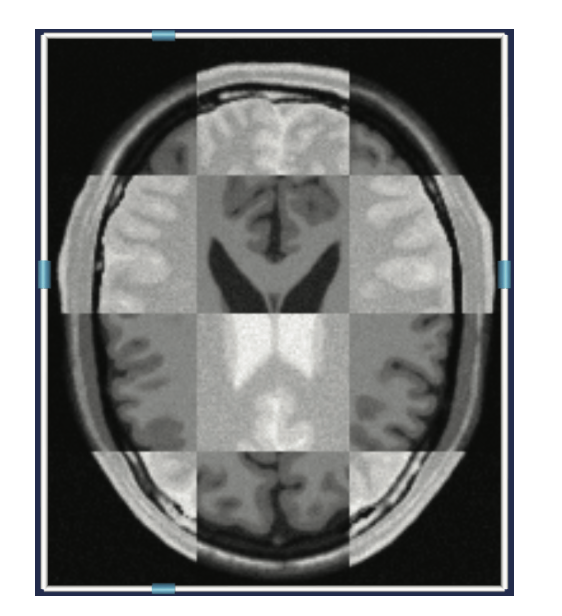

*Checkerboard Widget*

```cpp
vtkImageCheckerboard *checkers = vtkImageCheckerboard::New();
checkers->SetInputData(0,image1);
checkers->SetInputData(1,image2);
checkers->SetNumberOfDivisions(10,6,1);
vtkImageActor *checkerboardActor = vtkImageActor::New();
checkerboardActor->SetInputData(checkers->GetOutput());
vtkCheckerboardRepresentation *rep =
vtkCheckerboardRepresentation::New();
rep->SetImageActor(checkerboardActor);
rep->SetCheckerboard(checkers);
vtkCheckerboardWidget *checkerboardWidget =
vtkCheckerboardWidget::New();
checkerboardWidget->SetInteractor(iren);
checkerboardWidget->SetRepresentation(rep);
```

**vtkRectilinearWipeWidget.** The vtkRectilinearWipeWidget displays a split view (2x2 checkerboard) of a pair of images allowing one to control the location of the split. This is useful in comparing two images, typically the registered image from the source image in an image registration pipeline. A rectilinear wipe is a 2x2 checkerboard pattern created by combining two separate images, where various combinations of the checker squares are possible. It must be noted that although the this widget appears similar in functionality to the checkerboard widget, there are important differences. Using this widget, the user can adjust the layout of the checker pattern, such as moving the center point, moving the horizontal separator, or moving the vertical separator. The location of the wipe (interface between the two images) can be changed to any point in the image, unlike the checkerboard widget, where one can interactively only change the resolution the checkerboard. One can select the horizontal separator and the vertical separator by selecting the separator using the left mouse button. Dragging with the button depressed moves the separators. Selecting the center point allows you to move the horizontal and vertical separators simultaneously. To use this widget, specify its representation (by default the representation is an instance of vtkRectilinearWipeProp).

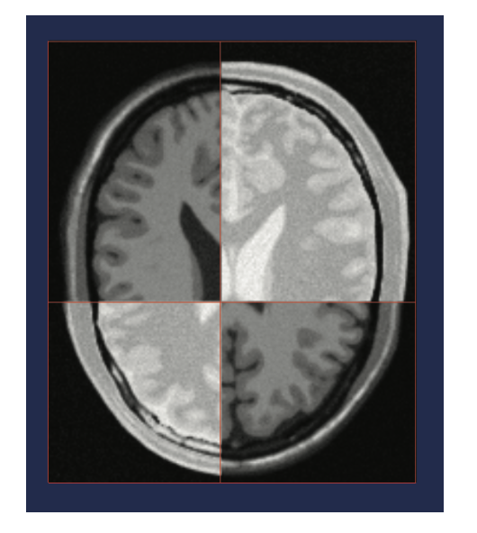

*Rectilinear Wipe Widget*

The representation requires that you specify an instance of vtkImageRectilinearWipe and an instance of vtkImageActor. One can specify various “wipe” modes on the vtkImageRectilinearWipe instance. These modes determine how the two input images are combined together. The first is a quad mode, using the method SetWipeToQuad. In this mode, the inputs alternate horizontally and vertically. One can get a purely horizontal or a vertical wipe using SetWipeToHorizontal or SetWipeToVertical. In this mode, one half of the image comes from one input, and the other half from the other input. One can also get a corner wipe, with 3 inputs coming from one input image and one coming from the other input image, by using the methods SetWIpeToLowerLeft, SetWipeToLowerRight, SetWipeToUpperLeft and SetWipeToUpperRight. The following excerpt from VTK/Widgets/Testing/Cxx/TestRectilinearWipeWidget.cxx illustrates its usage.

```cpp
vtkImageRectilinearWipe *wipe = vtkImageRectilinearWipe::New();
wipe->SetInputData(0,pad1->GetOutput());
wipe->SetInputData(1,pad2->GetOutput());
wipe->SetPosition(100,256);
wipe->SetWipeToQuad();
vtkImageActor *wipeActor = vtkImageActor::New();
wipeActor->SetInputData(wipe->GetOutput());
vtkRectilinearWipeWidget *wipeWidget = vtkRectilinearWipeWidget::New();
vtkRectilinearWipeRepresentation *wipeWidgetRep=
    static_cast<vtkRectilinearWipeRepresentation *>(
        wipeWidget->GetRepresentation());
wipeWidgetRep->SetImageActor(wipeActor);
wipeWidgetRep->SetRectilinearWipe(wipe);
wipeWidgetRep->GetProperty()->SetLineWidth(2.0);
wipeWidgetRep->GetProperty()->SetOpacity(0.75);
```

**vtkSeedWidget.** The vtkSeedWidget can be used to place multiple seed points. These are typically used for operations such as connectivity, segmentation, region growing, fiducials for image registration. This widget works in conjunction with an instance of a vtkSeedRepresentation (a subclass of vtkSeedRepresentation). The widget internally contains instances of vtkHandleWidget, to represent each seed. The handle widgets can, in turn, be represented by any subclass of vtkHandleRepresentation. vtkPointHandleRepresentation2D can be used to define seeds on a 2D overlay plane. vtkPointHandleRepresentation3D can be used to represent seeds in a 3D scene. One can set the appropriate handle representation using the SetHandleRepresentation method in vtkSeedRepresentation.

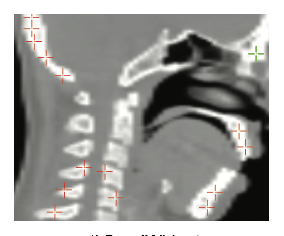

*Seed Widget*

Once a vtkSeedWidget is enabled, the user can drop seed points by pressing the left mouse button. After the user has finished dropping seeds, a click of the right button terminates placing and sends the widget into a “manipulate” mode. In this mode, the user can select a seed by clicking on it with the left mouse button and drag it around with the button depressed, to translate it. Much like the handle widget, the seeds responds to translation along an axis, by dragging it with the shift key depressed; the axes being determined as the one most aligned with the mouse motion vector. One can delete the currently selected handle by pressing the “Delete” key. If no seed was selected, pressing the delete key, removes the last added seed. When a seed is placed, the widget invokes an PlacePointEvent, that observers can watch for. Much like the other widgets, the vtkSeedWidget also invokes StartInteractionEvent, InteractionEvent and EndInteractionEvent before, during and after user interaction. The following excerpt from VTK/ Widgets/Testing/Cxx/TestSeedWidget2.cxx illustrates a typical usage.

```cpp
vtkPointHandleRepresentation2D *handle =
vtkPointHandleRepresentation2D::New();
handle->GetProperty()->SetColor(1,0,0);
vtkSeedRepresentation *rep = vtkSeedRepresentation::New();
rep->SetHandleRepresentation(handle);
vtkSeedWidget *widget = vtkSeedWidget::New();
widget->SetInteractor(iren);
widget->SetRepresentation(rep);
```

### Miscellaneous

**vtkXYPlotWidget.** The vtkXYPlotWidget provides support for interactively manipulating the position, size, and orientation of a XY Plot. The widget is typically used to generate XY plots from one or more input data sets or field data. It internally contains an instance of a vtkXYPlotActor to perform to plotting functionality. One can retrieve this instance via GetXYPlotActor(). The x-axis values in vtkXYPlotActor are generated by taking the point ids, computing a cumulative arc length, or a normalized arc length. More than one input data set can be specified to generate multiple plots. Alternatively, if field data is supplied as input, the class plots one component against another. The user must specify which component to use as the x-axis and which for the y-axis.


*XY Plot Widget*

To use this class to plot dataset(s), the user specifies one or more input datasets containing scalar and point data. To use this class to plot field data, the user specifies one or more input data objects with its associated field data. When plotting field data, the x and y values are used directly (i.e., there are no options to normalize the components). Users have the ability to specify axes labels, label format and plot title, using the methods SetTitle, SetXTitle and SetYTitle. One can also manually specify the x and y plot ranges (by default they are computed automatically) using the methods SetXRange and SetYRange. Data outside the specified range is clipped. One can also specify the number of specify the number of annotation labels along the axes using SetNumberOfXLabels and SetNumberOfYLabels methods. Similarly the number of X and Y minor ticks can be controlled using the methods SetNumberOfXMinorTicks and SetNumberOfYMinorTicks. The Border instance variable is used to create space between the boundary of the plot window, the region that can be resized interactively. The font property of the plot title can be modified using SetTitleTextProperty. The font property of the axes titles and labels can also be modified using SetAxisTitleTextProperty and SetAxisLabelTextProperty.

Users can also use the GetXAxisActor2D or GetYAxisActor2D methods to access each individual axis actor to modify their font properties. This returns instances of vtkAxisActor2D. In the same way, the GetLegendBoxActor method can be used to access the legend box actor to modify its font properties. Users can also assign per curve properties (such as color and a plot symbol). Users may choose to is to add a plot legend that graphically indicates the correspondence between the curve, curve symbols, and the data source. The legend can be turned on/off using LegendOn/Off().

Users can also exchange the x and y axes to re-orient the plot by using the method ExchangeAxis. Users can also reverse the X and Y axis by using the method ReverseXAxis and ReverseYAxis. Users can plot on a log scale with LogXOn().

The widget allows the actor to be interactively resized and repositioned. It listens to Left mouse events and mouse movement. It will change the cursor shape based on its location. If the cursor is over an edge of the plot it will change the cursor shape to the appropriate resize edge shape. Users can then left click and drag to resize. If the cursor hovers near the center, the cursor will change to a four way translate shape. Users can then left click and drag to reposition the plot. If the position of a XY plot is moved to be close to the center of one of the four edges of the viewport, then the XY plot will change its orientation to align with that edge. This orientation is sticky in that it will stay that orientation until the position is moved close to another edge. The following code excerpt shows how one may use this widget.

```cpp
vtkXYPlotWidget * widget = vtkXYPlotWidget::New();
widget->SetInteractor(iren);
// Get the plot actor so we can adjust properties on the actor.
vtkXYPlotActor *plotActor = widget->GetXYPlotActor();
xyplot->AddInput(probe->GetOutput());
xyplot->AddInput(probe2->GetOutput());
xyplot->AddInput(probe3->GetOutput());
xyplot->GetPositionCoordinate()->SetValue(0.0, 0.67, 0);
xyplot->GetPosition2Coordinate()->SetValue(1.0, 0.33, 0);
// relative to Position
xyplot->SetXValuesToArcLength();
xyplot->SetNumberOfXLabels(6);
xyplot->SetTitle("Pressure vs. Arc Length - Zoomed View");
xyplot->SetXTitle(""); // no X title
xyplot->SetYTitle("P");
xyplot->SetXRange(.1, .35);
xyplot->SetYRange(.2, .4);
xyplot->GetProperty()->SetColor(0, 0, 0);
xyplot->GetProperty()->SetLineWidth(2);
vtkTextProperty *tprop = xyplot->GetTitleTextProperty();
tprop->SetColor(xyplot->GetProperty()->GetColor());
xyplot->SetAxisTitleTextProperty(tprop);
xyplot->SetAxisLabelTextProperty(tprop);
xyplot->SetLabelFormat("%-#6.2f");
widget->SetEnabled(1);
```

**vtkCompassWidget.** The compass widget provides support for interactively annotating and manipulating orientation. The class also features zoom and tilt controls. You may drag the heading wheel to change the widget's heading, and may pull the sliders to animate the zoom level or tilt of the widget. The widget retains parameters for heading, tilt, and zoom that can be linked to camera controls in the event handler of the widget's InteractionEvent.

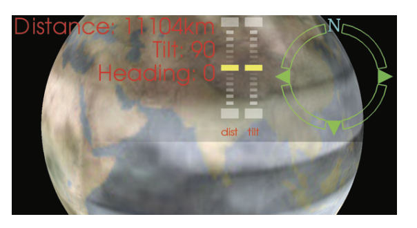

*Compass Widget*

```cpp
vtkNew<vtkCompassWidget> widget;
widget->SetInteractor(iren);
widget->CreateDefaultRepresentation();
// In callback for InteractionEvent:
double heading = widget->GetHeading() * 360.0;
double tilt = widget->GetTilt();
double distance = widget->GetDistance();
```

**vtkSliderWidget.** This widget provides functionality to manipulate a slider along a 1D range. The widget is meant to be used in conjunction with an instance of vtkSliderRepresentation. Two concrete representations are provided with the toolkit: vtkSliderRepresentation2D and vtkSliderRepresentation3D. vtkSliderRepresentation2D, renders the slider on the overlay plane, while vtkSliderRepresentation3D renders the slider in 3D space. The range is represented by a tube, with a bead for the slider, and two caps at the ends delineating the lower and upper bounds. These properties may be changed by using the methods SetSliderWidth(), SetSliderLength(), SetTubeWidth(), SetEndCapLength() and SetEndCapWidth() on vtkSliderRepresentation. The properties of the caps / tubes, etc. can also be retrieved and modified. Similarly, the slider properties can also be modified both when its selected and when its not.

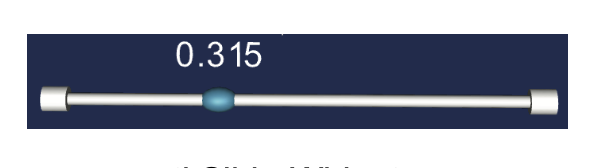

*Slider Widget*

One optionally can display a title next to the slider using the methods SetTitleText(). One can also display the current slider value next to it using the method ShowSliderLabelOn().

Lower and upper bounds on the slider value may be set using SetMinimumValue() and SetMaximumValue(). The SetValue() method itself can be used to programmatically set the current value of the slider.

The slider is selected using the left button. A drag with the left button depressed moves the slider along the tube. If the tube or one of the two endcaps is selected, the slider jumps or animates to the selected location. The user may choose the desired behavior by using the methods, SetAnimationModeToJump() or SetAnimationModeToAnimate(). The number of steps used for animation (if the mode is animate) may be controlled using SetNumberOfAnimationSteps(). Alternatively, one may disable this behavior altogether by using SetAnimationModeToOff().

The widget invokes StartInteractionEvent, InteractionEvent and EndInteractionEvent before, during and after user interaction. The following excerpt from VTK/Widgets/Testing/Cxx/TestSliderWidget.cxx illustrates the usage of the vtkSliderWidget in conjunction with a vtkSliderRepresentation3D.

```cpp
vtkSliderRepresentation3D *sliderRep =
vtkSliderRepresentation3D::New();
sliderRep->SetValue(0.25);
sliderRep->SetTitleText("Spike Size");
sliderRep->GetPoint1Coordinate()->SetCoordinateSystemToWorld();
sliderRep->GetPoint1Coordinate()->SetValue(0,0,0);
sliderRep->GetPoint2Coordinate()->SetCoordinateSystemToWorld();
sliderRep->GetPoint2Coordinate()->SetValue(2,0,0);
sliderRep->SetSliderLength(0.075);
sliderRep->SetSliderWidth(0.05);
sliderRep->SetEndCapLength(0.05);
vtkSliderWidget *sliderWidget = vtkSliderWidget::New();
sliderWidget->SetInteractor(iren);
sliderWidget->SetRepresentation(sliderRep);
sliderWidget->SetAnimationModeToAnimate();
sliderWidget->EnabledOn();
```

The following excerpt from VTK/Widgets/Testing/Cxx/TestSliderWidget2D illustrates the usage of vtkSliderWidget in conjunction with vtkSliderRepresentation2D to render the slider on the overlay plane.

```cpp
vtkSliderRepresentation2D *sliderRep =
vtkSliderRepresentation2D::New();
sliderRep->SetValue(0.25);
sliderRep->SetTitleText("Spike Size");
sliderRep->GetPoint1Coordinate()->
SetCoordinateSystemToNormalizedDisplay();
sliderRep->GetPoint1Coordinate()->SetValue(0.2,0.1);
sliderRep->GetPoint2Coordinate()->
SetCoordinateSystemToNormalizedDisplay();
sliderRep->GetPoint2Coordinate()->SetValue(0.8,0.1);
sliderRep->SetSliderLength(0.02);
sliderRep->SetSliderWidth(0.03);
sliderRep->SetEndCapLength(0.01);
sliderRep->SetEndCapWidth(0.03);
sliderRep->SetTubeWidth(0.005);
vtkSliderWidget *sliderWidget = vtkSliderWidget::New();
sliderWidget->SetInteractor(iren);
sliderWidget->SetRepresentation(sliderRep);
sliderWidget->SetAnimationModeToAnimate();
```

**vtkCenteredSliderWidget.** The vtkCenteredSliderWidget is similar to the vtkSliderWidget. Its interactions however provide joystick based control on the slider. The widget is meant to be used in conjunction with an instance of vtkCenteredSliderRepresentation. When unselected, the slider always stays at the center. The user can select the slider by pressing the left button. The user can then drag and move the slider upwards or downwards with the button depressed, thereby increasing or decreasing the value the slider represents. The increase (or decrease) is proportional to both the time the the slider is depressed and held away from the center and to the magnitude of deviation of the slider from its center. Upon releasing, the slider returns to the midpoint. The representation is used internally in vtkCompassRepresentation to represent the tilt and the distance values of the compass. Thus one can move the slider gently upwards to watch the camera tilt slowly forward. Alternatively one can yank the slider upwards to tilt the camera rapidly forward. Like other widgets, the vtkCenteredSliderWidget invokes StartInteractionEvent, InteractionEvent and EndInteractionEvent before, during and after user interaction. Usage of the centered slider widget is very similar to vtkSliderWidget. The GetValue() method on the widget can be used to query the value at any instant.

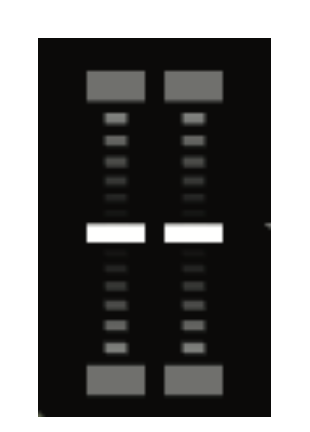

*Centered Slider Widget*

**vtkCameraWidget.** The vtkCameraWidget provides support for interactively saving and playing a series of camera views into an interpolated path. The interpolation itself is done using an instance of vtkCameraInterpolator. The user can use the vtkCameraWidget widget to record a series of views and then play back interpolated camera views using the vtkCameraInterpolator. To use this widget, the user specifies a camera to interpolate, and then starts recording by hitting the "record" button. Then one manipulates the camera (by using an interactor, direct scripting, or any other means). After completion of interaction, one then saves the camera view. One can repeat this process to record a series of views.


*Camera Widget*

The widget is meant to be used in conjunction with an instance of vtkCameraRepresentation. The representation’s geometry consists of a camera icon, a play-stop icon and a delete icon. These are rendered on the overlay plane. Pressing the camera icon adds the view defined by the current camera parameters to the interpolated camera path. Pressing the play button interpolates frames along the current path. The camera interpolator can be retrieved by using the method GetCameraInterpolator on the representation. One can use the interpolator to set the interpolation type (linear or spline). The SetNumberOfFrames method on the representation can be used to control the number of frames used for interpolation between two camera nodes while animating the camera path. The following excerpt from VTK/Widgets/Testing/Cxx/TestCameraWidget.cxx illustrates a typical usage.

```cpp
vtkCameraRepresentation *rep = vtkCameraRepresentation::New();
rep->SetNumberOfFrames(2400);
vtkCameraWidget *widget = vtkCameraWidget::New();
widget->SetInteractor(iren);
widget->SetRepresentation(rep);
```

**vtkPlaybackWidget.** The vtkPlaybackWidget provides support for interactively controlling the playback of a serial stream of information (e.g., animation sequence, video). Controls for play, stop, advance one step forward, advance one step backward, jump to beginning, and jump to end are available. The widget works in conjunction with an instance of vtkPlaybackRepresentation. The representation exists on the overlay plane and derives from vtkBorderWidget. It can be interactively resized or repositioned using the corners/edges or near the center. Six controls, in the form of icons, are provided by the playback widget. These controls allow for (a) Jumping to the beginning of the frame (b) Reverting one frame (c) Stop playback (d) Play (e) Jump forward one frame (f) Jump to the end. The implementation is left to the subclass. ie. Users are expected to subclass vtkPlaybackRepresentation to provide their own implementations for the 6 controls above. The following excerpt from VTK/Widgets/Testing/Cxx/TestPlaybackWidget.cxx illustrates a typical usage.


*Playback Widget*

```cpp
class vtkSubclassPlaybackRepresentation : public
vtkPlaybackRepresentation
{
public:
static vtkSubclassPlaybackRepresentation *New()
    {return new vtkSubclassPlaybackRepresentation;}

void Play() override {std::cout << "play\n";}
void Stop() override {std::cout << "stop\n";}
void ForwardOneFrame() override {std::cout << "forward one frame\n";}
void BackwardOneFrame() override {std::cout << "backward one frame\n";}
void JumpToBeginning() override {std::cout << "jump to beginning\n";}
void JumpToEnd() override {std::cout << "jump to end\n";}
};

...

vtkSubclassPlaybackRepresentation *rep =
vtkSubclassPlaybackRepresentation::New();
vtkPlaybackWidget *widget = vtkPlaybackWidget::New();
widget->SetInteractor(iren);
widget->SetRepresentation(rep);
```

### An Example

The following example from Widgets/Testing/Cxx/TestAffineWidget.cxx uses a vtkAffineWidget to transform (shear / rotate / translate / scale) a 2D image interactively. We will observe the widget for interactions with the class vtkAffineCallback in order to update the transform on the image actor.

```cpp
class vtkAffineCallback : public vtkCommand
{
public:
static vtkAffineCallback *New()
{ return new vtkAffineCallback; }

virtual void Execute(vtkObject *caller, unsigned long, void*);

vtkAffineCallback():ImageActor(0),AffineRep(0)
{this->Transform = vtkTransform::New();}
~vtkAffineCallback()
{this->Transform->Delete();}
vtkImageActor *ImageActor;
vtkAffineRepresentation2D *AffineRep;
vtkTransform *Transform;
};
void vtkAffineCallback::Execute(vtkObject*, unsigned long, void*)
{
this->AffineRep->GetTransform(this->Transform);
this->ImageActor->SetUserTransform(this->Transform);
}

int TestAffineWidget( int argc, char *argv[] )
{
// Create the pipeline
char* fname = vtkTestUtilities::ExpandDataFileName(
argc, argv, "Data/headsq/quarter");
vtkVolume16Reader* v16 = vtkVolume16Reader::New();
v16->SetDataDimensions(64, 64);
v16->SetDataByteOrderToLittleEndian();
v16->SetImageRange(1, 93);
v16->SetDataSpacing(3.2, 3.2, 1.5);
v16->SetFilePrefix(fname);
v16->ReleaseDataFlagOn();
v16->SetDataMask(0x7fff);
v16->Update();
delete[] fname;
double range[2];
v16->GetOutput()->GetScalarRange(range);
vtkImageShiftScale* shifter = vtkImageShiftScale::New();
shifter->SetShift(-1.0*range[0]);
shifter->SetScale(255.0/(range[1]-range[0]));
shifter->SetOutputScalarTypeToUnsignedChar();
shifter->SetInputConnection(v16->GetOutputPort());
shifter->ReleaseDataFlagOff();
shifter->Update();
vtkImageActor* imageActor = vtkImageActor::New();
imageActor->SetInputData(shifter->GetOutput());
imageActor->VisibilityOn();
imageActor->SetDisplayExtent(0, 63, 0, 63, 46, 46);
imageActor->InterpolateOn();
double bounds[6];
imageActor->GetBounds(bounds);
// Create the RenderWindow, Renderer and both Actors
vtkRenderer *ren1 = vtkRenderer::New();
vtkRenderWindow *renWin = vtkRenderWindow::New();
renWin->AddRenderer(ren1);
vtkRenderWindowInteractor *iren = vtkRenderWindowInteractor::New();
iren->SetRenderWindow(renWin);
vtkInteractorStyleImage *style = vtkInteractorStyleImage::New();
iren->SetInteractorStyle(style);
// VTK widgets consist of two parts: event processing and the
// representation that defines how the widget appears in the scene
vtkAffineRepresentation2D *rep = vtkAffineRepresentation2D::New();
rep->SetBoxWidth(100);
rep->SetCircleWidth(75);
rep->SetAxesWidth(60);
rep->DisplayTextOn();
rep->PlaceWidget(bounds);
vtkAffineWidget *widget = vtkAffineWidget::New();
widget->SetInteractor(iren);
widget->SetRepresentation(rep);
vtkAffineCallback *acbk = vtkAffineCallback::New();
acbk->AffineRep = rep;
acbk->ImageActor = imageActor;
widget->AddObserver(vtkCommand::InteractionEvent,acbk);
widget->AddObserver(vtkCommand::EndInteractionEvent,acbk);
// Add the actors to the renderer, set the background and size
ren1->AddActor(imageActor);
ren1->SetBackground(0.1, 0.2, 0.4);
renWin->SetSize(300, 300);
iren->Initialize();
renWin->Render();
iren->Start();
}
```

## 13.4 Selections

In its most general sense, a selection is a data structure that specifies a subset of something else. This subset may be highlighted to show a feature in the data, or may be extracted to analyze a portion of the data in more detail. VTK provides a framework for generating, processing, and sharing selections in applications using the vtkSelection class, along with related selection sources, filters, and views.

vtkSelection is a container class holding one or more vtkSelectionNode objects. Each node contains information indicating what part of the data is selected. A compound selection is interpreted as the union of the individual node selections. We allow selections to consist of multiple nodes so that in one place we can represent selections on multiple parts of the data. For example, a selection on geometry may contain a vtkSelectionNode for both points and cells. Another use case is to collect selections from multiple datasets in the same renderer into one place.

## 13.5 Types of selections

Each vtkSelectionNode has a selection type which indicates how the selection is to be interpreted. The selection types are constants defined in vtkSelectionNode.h. Values associated with a selection are stored in an array retrieved by GetSelectionList(). For convenience, we will use the term “element” to refer to the basic building-blocks of datasets to which attributes may be assigned. For vtkDataSet subclasses, the elements are points and cells. The elements of vtkGraph subclasses are vertices and edges. For vtkTable, the elements are the rows of the table.

### Index selections

This is the most basic type of selection. An index selection's selection list is a vtkIdTypeArray containing the raw zero-based indices of the selected elements in a dataset, using the dataset's internal ordering. Since these indices may change as a dataset is processed or filtered, an index selection is generally only applicable to a single data set. You should not share an index selection between datasets with different topologies.

### Pedigree ID selections

A pedigree ID is an identifier assigned to each element in a dataset at its source, and is propagated down the pipeline. You specify pedigree IDs on a dataset in the same way that other special attributes like scalars and vectors are specified, by calling SetPedigreeIds() on a dataset's attributes. Pedigree ID arrays may be of any type, including vtkStringArray and vtkVariantArray. A pedigree ID selection contains a list of values from a dataset's pedigree ID array. Both pedigree ID and global ID selections refer to elements by name, instead of by a dataset-specific offset used in index selections, which makes them more robust across different datasets which originate from the same source.

### Global ID selections

Global ID selections are much like pedigree ID selections, except that they refer to the global ID attribute (set with SetGlobalIds()). Global IDs are used in a way similar to pedigree IDs, except that they must be numeric, and some filters re-assign global IDs to ensure that IDs are never repeated. 

### Frustum selections

Frustum selections simply store the geometry of a frustum in the selection. All elements within the frustum are considered selected. This is most useful in the case that the user drag-selects a region in a 3D scene. The rectangular region on the screen translates into a frustum in the 3D scene. The selection list for this type of selection must be a vtkDoubleArray with eight four-component tuples. The points, in the form (x,y,z,1), should be in the following order:

1. near lower left
2. far lower left
3. near upper left
4. far upper left
5. near lower right
6. far lower right
7. near upper right
8. far upper right

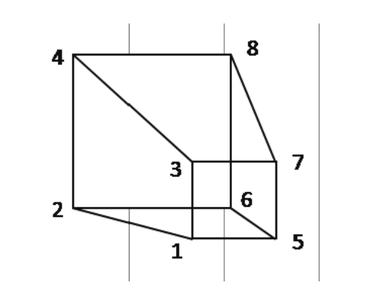

*Figure 13–1 The expected order of the points in a view frustum selection.*

### Value selections

A value selection is a selection that refers to elements in an arbitrary array. In a value selection you must set the name of the selection list to the name of the array that you want to select. For example, if you have a dataset where the points contain an integer attribute “type” which varies from 0 to 10. To select only points with values 1, 3, and 7, create a vtkIntArray, add the desired values to it, then set the name of the array to “type”. Finally, call node->SetSelectionList(arr) with the array you created. 

### Threshold selections

Threshold selections work just like value selections, except you indicate value ranges with each pair of elements in the array. While value selections may be of any type, threshold selections only work on numeric arrays, and the selection list must be a vtkDoubleArray. To select points with type in the range 0-5, create a vtkDoubleArray and add the elements 0 and 5. You may add additional ranges to the threshold selection by adding more pairs of numbers. 

### Location selections

As the name suggests, you provide this type of selection with the 3D locations that you want selected. A location selection must be a vtkDoubleArray with 3 components per tuple. A location selection is often used to select cells that contain a point. For location selections referring to the points of a dataset, there is a way to specify the maximum distance a selected dataset point can be to a point in the selection list:

```cpp
n->GetProperties()->Set(vtkSelectionNode::EPSILON(), distance);
```

### Block selections

The VTK data object, vtkMultiBlockDataset, can store a collection of datasets. A block selection allows you to specify which blocks to select. The selection list must be a vtkUnsignedIntArray.

**Using the hardware selector.** VTK provides the class vtkHardwareSelector to assist you in generating selections from a rectangular region of the screen. This process is similar to area picking (see Section 4.3), but is able to return finer grained details about what is picked.

```cpp
vtkHardwareSelector* hs = vtkHardwareSelector::New();
hs->SetRenderer(ren);
hs->SetArea(xmin, ymin, xmax, ymax);
vtkSelection* s = hs->Select();
```

The hardware selector performs special rendering passes in order to determine which datasets in the renderer are selected, and which cells within those datasets are selected. Any cell that is rendered to at least one pixel within the selection area is inserted into the output selection. The output selection contains one vtkSelectionNode for each selected actor. These nodes are cell index selections by default, although the hardware selector can also be configured to select points. You can retrieve the pointer to the associated actor in the scene by accessing the PROP property of the selection node.

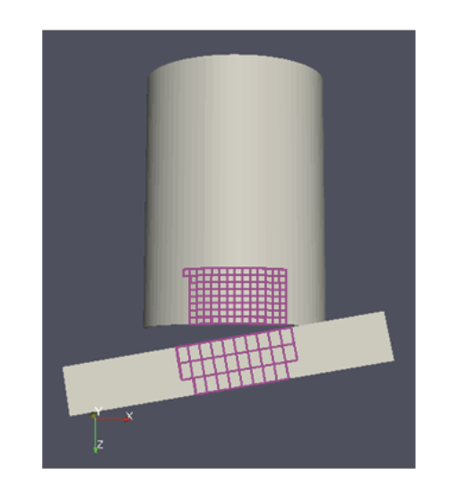

*Figure 13–2 The result of a hardware cell selection on two actors.* 

**Extracting selections.** Now that we know how to define a selection, we must use it in some way. One of the most common tasks is to extract the selection from a dataset. To do this, use the vtkExtractSelection filter for vtkDataSets or vtkMultiBlockDataSets, or use vtkExtractSelectedGraph for vtkGraphs. Both filters work in similar ways, and accept a selection of any type. To extract a selection from a vtkPolyData, we can do the following:

```cpp
vtkPolyData* pd = vtkPolyData::New();
// Populate the poly data here
vtkSelection* s = vtkSelection::New();
// Populate the selection here
vtkExtractSelection* ex = vtkExtractSelection::New();
ex->SetInputData(0, pd);
ex->SetInputData(1, s);
ex->Update();
vtkUnstructuredGrid* extracted = ex->GetOutput();
```

Note that because vtkExtractSelection accepts any vtkDataSet subclass, the output is the most general dataset, vtkUnstructuredGrid. The output type cannot match the input type because, for example, a selection, which denotes an arbitrary subset, on a structured type like vtkImageData might no longer be structured. If you desire to simply mark selected elements of a dataset, call ex->PreserveTopologyOn() before updating the filter.
This will pass the data structurally unchanged to the output, with the same data type. Instead of culling away rejected elements, the filter adds a boolean flag to each

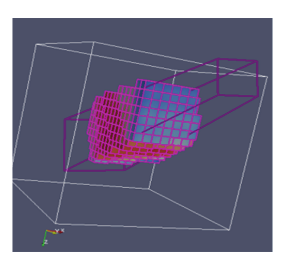

*Figure 13–3 A portion of a vtkImageData extracted by a frustum selection, with a boolean flag on each element indicating whether it is selected or not.*

